# 🎭 AI Roleplay Coach Hub

[](https://www.python.org/)
[](https://fastapi.tiangolo.com/)
[](https://docs.pydantic.dev/)
[](https://docs.pytest.org/)
[](https://pytest-cov.readthedocs.io/)
[](https://docs.astral.sh/ruff/)
[](LICENSE)
[](.)
[](docker-compose.prod.yml)
[](https://react.dev/)
[](https://www.typescriptlang.org/)
[](https://vite.dev/)
[](https://tailwindcss.com/)
[](https://github.com/pmndrs/zustand)
[](https://www.postgresql.org/)
[](https://qdrant.tech/)

**Мультиагентная система тренировки операторов контакт-центра через симуляцию диалогов с AI-клиентом.**
Система принимает оператора, создаёт виртуального клиента с заданным психотипом, ведёт пошаговый диалог с адаптивной сложностью (DDA), оценивает диалог по 5 измерениям и начисляет XP / бейджи — без участия живого наставника.

---

## 📖 О проекте

**AI Roleplay Coach Hub** — это production-grade мультиагентная система, которая позволяет операторам контакт-центра тренироваться на виртуальных клиентах с разными психотипами, получать объективную AI-оценку и прогрессировать через геймификацию. При масштабах крупного КЦ (200 операторов, 100+ новичков в месяц) система сокращает Time-to-Proficiency с 4 недель до 2 и снижает нагрузку на наставников на 70%.

**Описание работы:**
Оператор через REST API или WebSocket создаёт сессию симуляции, выбирая сценарий (например, «Возврат товара»). Система запускает **SimulatorAgent** — AI-клиента с одним из 4 психотипов (нейтральный, агрессивный, растерянный, технически неграмотный). Оператор ведёт пошаговый диалог: клиент генерирует реплики по шаблонам (rule-based) или через LLM (Ollama/OpenAI). После завершения диалога **CoachAgent** оценивает его по 5-мерной шкале (Script Adherence, Tone, Empathy, Completeness, Professionalism) с весами, формирует фидбек по принципу «сэндвич» с цитатами из скриптов. **CuratorAgent** обновляет учебный план оператора, подбирая сценарии под слабые места. **GamificationEngine** начисляет XP, выдаёт бейджи («Укротитель гнева», «Мастер эмпатии»), обновляет лидерборды. **AnalystService** строит дашборды и проводит Fairness-аудит по 4 метрикам для выявления алгоритмической предвзятости.

**Ключевые возможности:**
- 🎭 **Симуляция клиента** — 4 психотипа (NEUTRAL, AGGRESSIVE, CONFUSED, TECHNICALLY_INEPT) с DDA (Dynamic Difficulty Adjustment) — сложность растёт при успехах оператора, снижается при ошибках
- 📊 **AI-коучинг** — 5-мерная взвешенная оценка диалога с RAG-валидацией по скриптам, фидбек «сэндвич» (похвала → зона роста → похвала), анти-gaming детекция шаблонных ответов
- 🏆 **Геймификация** — XP и уровни 1–100, 6+ бейджей, лидерборды по подразделениям, ежедневные streak-серии с множителем XP, челленджи
- 🔍 **Fairness-аудит** — 4 метрики (demographic parity, equalized odds, calibration, disparate impact) по полу, возрасту, акценту и родному языку, настраиваемые алерты
- 🧩 **In-memory first** — zero внешних зависимостей в dev-режиме (никаких БД, Redis, Qdrant), опциональный full-stack через Docker Compose
- 🔐 **RBAC** — 3 роли с каскадным расширением прав: Operator → Trainer → Admin
- 🐳 **Production-ready** — Docker Compose, Prometheus-метрики, structlog-логирование, rate limiting, RFC 9457 Problem Details, security headers, graceful shutdown
- 🎤 **Голосовой пайплайн (план)** — LiveKit Agents, Whisper-Large-V3 для ASR, Silero TTS v5 (Фаза 9)

**Бизнес-задача:**
1. **Сокращение Time-to-Proficiency:** Снижение времени выхода оператора на плановые показатели с 4 недель до 2 за счёт интенсивных AI-тренировок без участия живого наставника.
2. **Снижение нагрузки на наставников:** Уменьшение времени наставника на одного новичка со 160 до 48 часов (экономия 70%) — наставник фокусируется только на сложных случаях.
3. **Повышение качества обслуживания:** Увеличение QA Score на 25% через объективную 5-мерную оценку с RAG-валидацией и прицельными рекомендациями.
4. **Объективность и прозрачность:** Автоматическая оценка без человеческого фактора, Fairness-аудит для предотвращения дискриминации, полный audit log.

---

## 🏗️ Архитектура системы

### 1. Контекстная диаграмма (C4 — Level 1)

**Назначение:** Эта диаграмма показывает, как AI Roleplay Coach Hub взаимодействует с внешним миром. Мы видим всех пользователей системы (операторы, тренеры, администраторы) и все внешние системы, с которыми система интегрируется: LMS (iSpring, Moodle, Битрикс24) для синхронизации прогресса обучения и LLM-провайдеры (Ollama / OpenAI) для опциональной генерации реплик AI-клиента. Это даёт целостное представление о месте системы в экосистеме обучения контакт-центра.

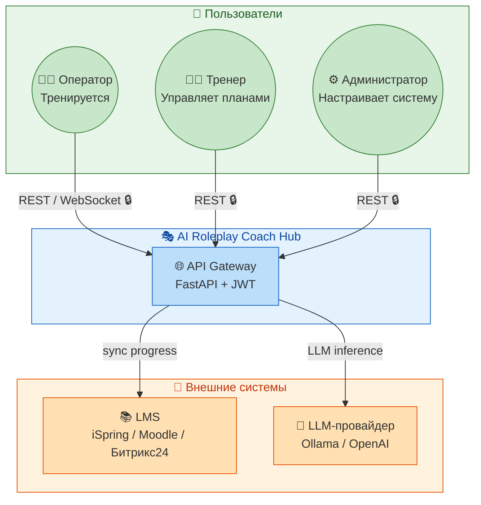

### 2. Контейнерная диаграмма (C4 — Level 2)

**Назначение:** Эта диаграмма раскрывает внутреннее устройство AI Roleplay Coach Hub, показывая ключевые контейнеры (исполняемые модули) и их взаимодействие. Мы видим фронтенд (React-приложение), бэкенд (API Gateway и пять AI-агентов: Simulator, Coach, Curator, GamificationEngine, AnalystService), хранилища (PostgreSQL, Redis, Qdrant), мониторинг (Prometheus) и интеграции с внешними сервисами (LMS, LLM-провайдеры). Это даёт представление о том, как компоненты обмениваются данными и как система построена для масштабирования.

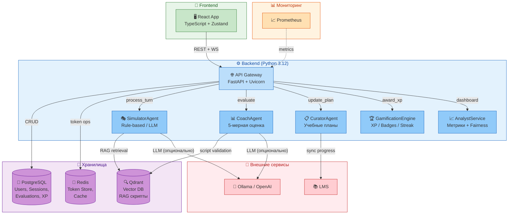

### 3. Поток обработки сессии симуляции

**Назначение:** Эта sequence-диаграмма детально показывает сквозной процесс тренировки оператора — от создания сессии симуляции до получения оценки и наград. Процесс разделён на три фазы: (1) создание сессии с выбором сценария и инициализацией AI-клиента заданного психотипа, (2) пошаговый диалог с адаптивной сложностью (DDA) и RAG-валидацией по скриптам, (3) завершение сессии с 5-мерной оценкой CoachAgent, начислением XP через GamificationEngine и обновлением учебного плана через CuratorAgent. Это основной сценарий использования системы, на который приходится >90% всех запросов.

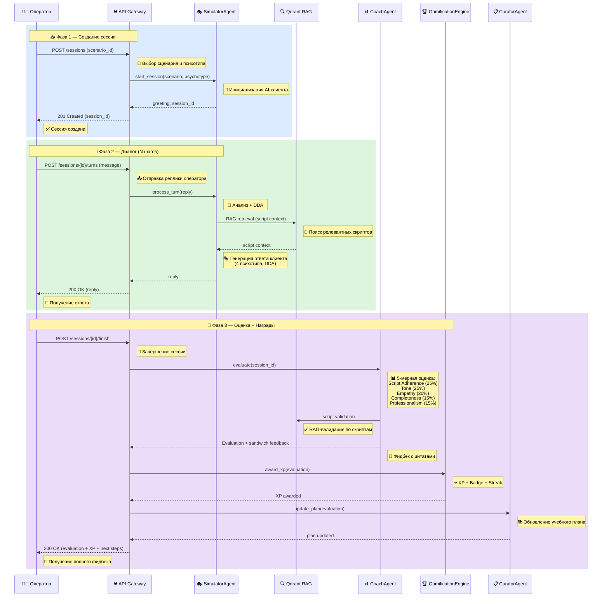

---

## 📚 Карта документации

Проект обладает исчерпывающей, поэтапной документацией (17 документов). Используйте ссылки ниже для перехода к нужному уровню детализации.

### 📋 Ключевые документы

| Документ | Описание |
| :--- | :--- |
| 📄 **[SPECIFICATION.md](docs/SPECIFICATION.md)** | Полное Техническое Задание: бизнес-контекст, 7 FR, 17 NFR, C4 L1–L3, ERD, API-контракты, 5 AI-агентов |
| 🌊 **[DATA_FLOWS.md](docs/DATA_FLOWS.md)** | 12 сценариев использования с Mermaid sequence-диаграммами, UC→FR matrix, RBAC matrix, 12 edge cases |
| 🗺️ **[IMPLEMENTATION_PLAN.md](docs/IMPLEMENTATION_PLAN.md)** | План реализации: 9 фаз, 60+ задач, 8 milestones, 5 рисков |
| 🏗️ **[API.md](docs/API.md)** | REST + WebSocket справочник: 34 эндпоинта, request/response, RBAC, rate limiting, коды ошибок |
| 📐 **[PROJECT_STRUCTURE.md](docs/PROJECT_STRUCTURE.md)** | Навигационная карта репозитория: дерево backend/frontend/tests/docs, naming conventions |
| 🧪 **[TESTING.md](docs/TESTING.md)** | Стратегия тестирования: пирамида, 6 тест-кейсов, FR→TC matrix, pre-release чеклист |

### ⚙️ Инфраструктура и DevOps

| Документ | Описание |
| :--- | :--- |
| 🚀 **[DEPLOYMENT_PLAN.md](docs/DEPLOYMENT_PLAN.md)** | Полный план развёртывания: 4 конфигурации hardware, 3 окружения, PostgreSQL/Redis/Qdrant hardening, Nginx, Security Hardening, DRP, 5 Runbook-сценариев |
| 🔄 **[CICD.md](docs/CICD.md)** | CI/CD Pipeline: GitHub Actions, 5 стадий (lint→test→security→build→deploy), переменные, отладка |
| 🛠️ **[TROUBLESHOOTING_GUIDE.md](docs/TROUBLESHOOTING_GUIDE.md)** | Руководство по устранению неисправностей: 5 разделов, decision trees, escalation matrix |
| 🔐 **[ADMIN_GUIDE.md](docs/ADMIN_GUIDE.md)** | Руководство администратора: установка, конфигурация, мониторинг, безопасность, LLM-провайдеры |
| 📘 **[SOURCE_CODE_REFERENCE.md](docs/SOURCE_CODE_REFERENCE.md)** | Пофайловый навигатор: main.py, 15 API-файлов, 20+ entities, 7 сервисов, 8 AI-агентов, 50+ тестов |

### 🏛️ Архитектурные решения

| Документ | Описание |
| :--- | :--- |
| 📐 **[adr/ARCHITECTURE_DECISIONS.md](docs/ARCHITECTURE_DECISIONS.md)** | 7 ADR: In-Memory-First, AI Agent Architecture, 5-мерная оценка, Gamification Engine, RBAC, Circuit Breaker, Repository Pattern |
| 📖 **[GLOSSARY.md](docs/GLOSSARY.md)** | Словарь: 40+ аббревиатур, 7 AI-агентов, архитектурные/бизнес/геймификационные термины |
| 🧪 **[INTEGRATION_TEST_SPEC.md](docs/INTEGRATION_TEST_SPEC.md)** | Спецификация интеграционных тестов: 8 групп, mock/real режимы |

### 👤 Пользовательская документация

| Документ | Описание |
| :--- | :--- |
| 📖 **[USER_GUIDE.md](docs/USER_GUIDE.md)** | Руководство оператора/тренера/администратора: быстрый старт, запуск симуляции, XP и бейджи, FAQ |
| 🎨 **[UI_REFERENCE.md](docs/UI_REFERENCE.md)** | Справочник по пользовательскому интерфейсу: подробное описание экранов, элементов управления, навигации и визуальных компонентов |

### 🖥️ Пользовательский интерфейс

Система имеет веб-интерфейс с разделением по ролям — оператор, тренер и администратор работают в едином React-приложении, но видят разные dashboard и функциональные возможности. Ниже представлены ключевые экраны в логической последовательности использования — от входа в систему до администрирования. Все скриншоты сгенерированы из реального фронтенда.

#### 🔐 Авторизация

**Экран входа и регистрации.** Через этот интерфейс пользователь попадает в систему, выбирая свою роль (оператор, тренер или администратор). Форма входа поддерживает валидацию полей, отображение ошибок и перенаправление на соответствующий роль dashboard после успешной аутентификации. Регистрация новых пользователей доступна только через администратора.

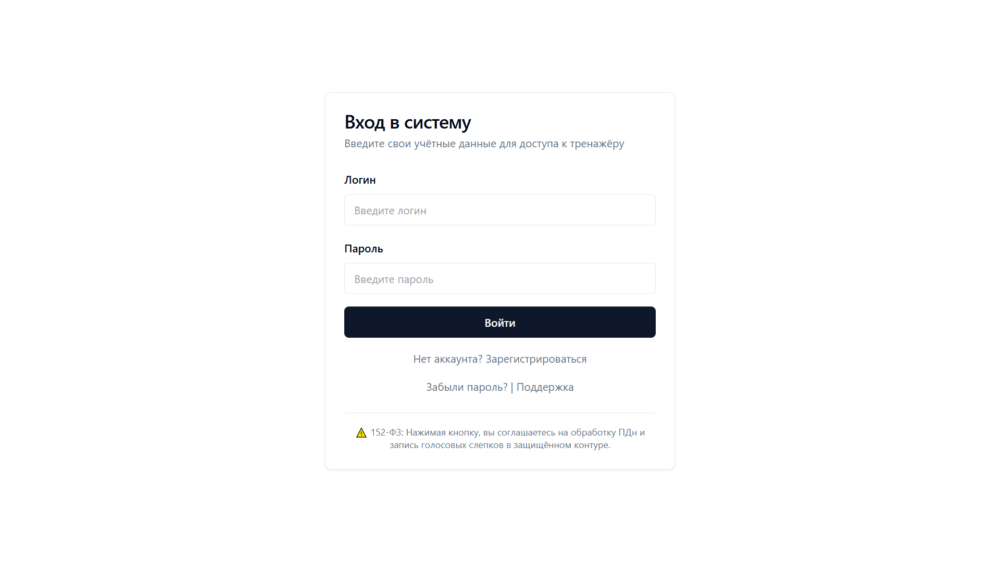

#### 🏠 Дашборд оператора

**Главный экран оператора после входа в систему.** На дашборде отображаются доступные сценарии для тренировки, текущий уровень и прогресс XP, а также назначенные учебные задания от CuratorAgent. Каждая карточка сценария показывает психотип клиента и ожидаемую длительность диалога. Отсюда оператор запускает новую симуляцию или переходит к просмотру своих результатов.

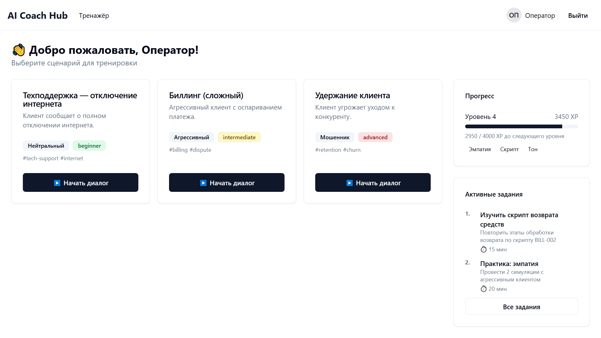

#### 💬 Симуляция диалога

**Основной тренажёрный экран — сердце системы.** Слева расположен чат-диалог с AI-клиентом, справа — панель с RAG-подсказками из скриптов и live-метриками CoachAgent (эмпатия, тон, следование скрипту). В верхней части отображается информация о сессии: сценарий, психотип клиента, текущий уровень DDA. Оператор вводит текст в поле ввода или использует быстрые фразы для ответа.

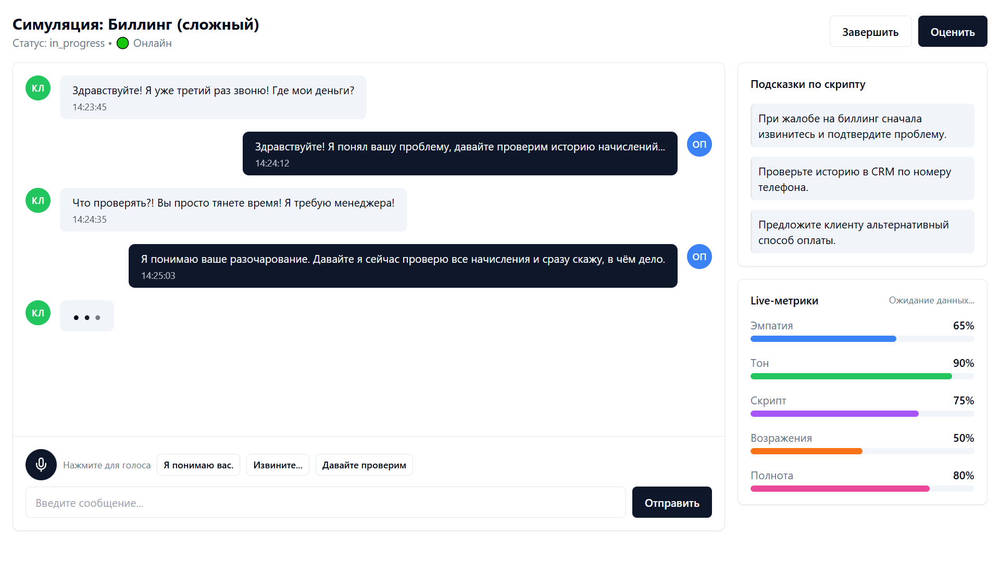

#### 📊 Результаты оценки

**Экран разбора завершённой сессии с фидбеком CoachAgent.** Фидбек построен по принципу «сэндвич»: сначала похвала за сильные стороны, затем зона роста с цитатами из скриптов (RAG-валидация) и мотивирующее заключение. Справа отображается радар-диаграмма 5 измерений оценки и награды геймификации — начисленные XP, полученные бейджи, обновление уровня.

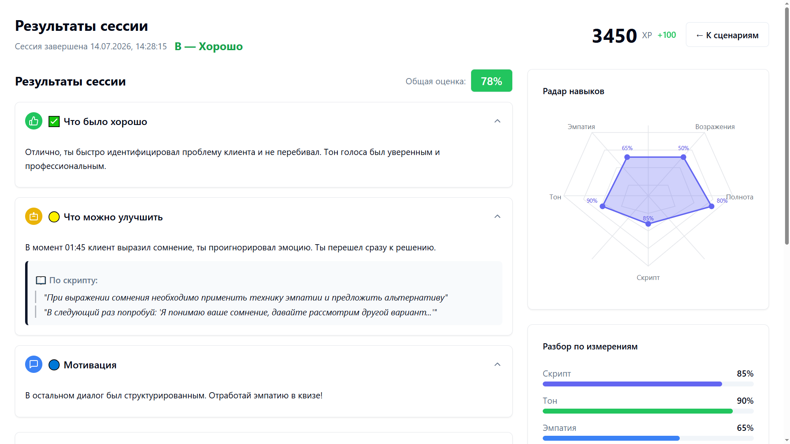

#### 📝 Квиз

**Экран прохождения теста для проверки знаний.** Квизы генерируются CuratorAgent на основе скриптов и слабых мест оператора, выявленных CoachAgent. Каждый вопрос имеет 4 варианта ответа, один правильный, с подсветкой верного/неверного выбора. После завершения квиза результат синхронизируется с учебным планом и LMS.

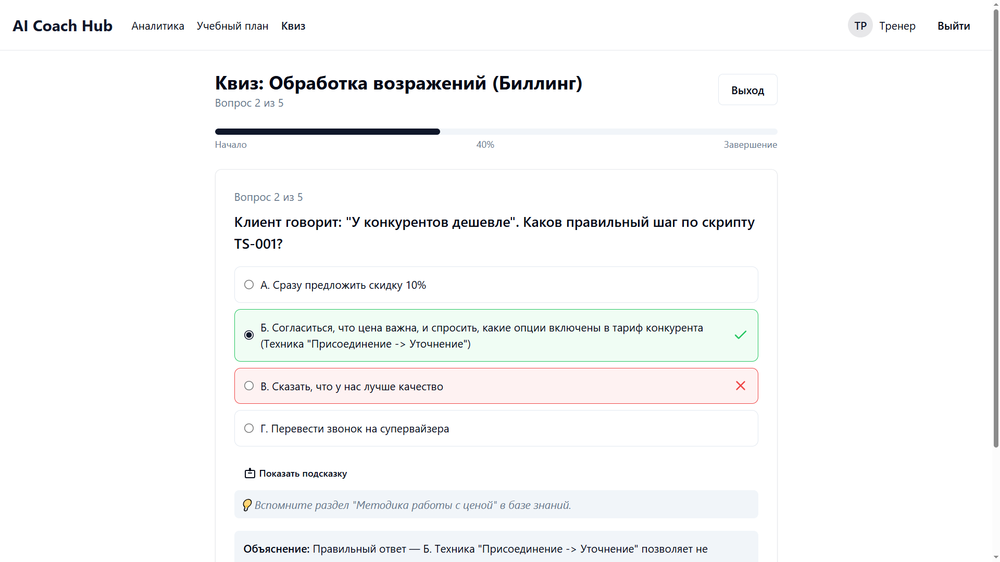

#### 📚 Учебный план

**Индивидуальный план обучения оператора.** CuratorAgent автоматически подбирает сценарии и квизы под слабые места оператора на основе его предыдущих оценок. План разбит на этапы с прогресс-барами, сроками и статусами выполнения. Тренер может корректировать план вручную, добавлять целевые сценарии или переназначать квизы.

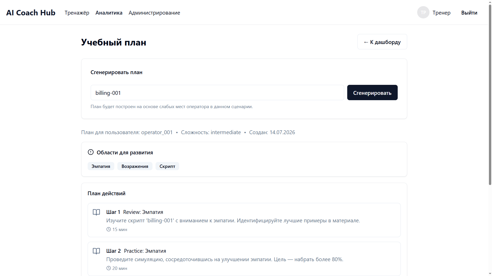

#### 📈 Дашборд тренера

**Аналитическая панель для руководителя группы.** На дашборде отображаются сводные метрики по группе: средний балл, прогресс операторов, распределение оценок, отстающие сотрудники, тренды по дням и неделям. Тренер может фильтровать данные по группам, периодам и сценариям, а также назначать планы обучения напрямую из интерфейса.

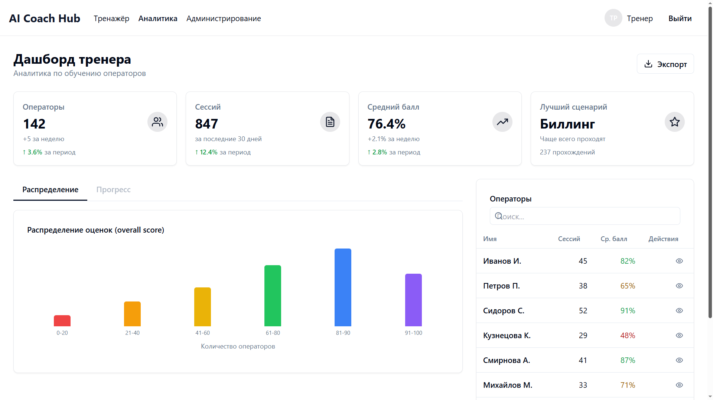

#### ⚙️ Админ-панель

**Панель управления системой для администратора.** Доступны разделы управления пользователями (CRUD, блокировка, смена роли), управления сценариями, синхронизации с LMS и мониторинга здоровья сервисов — статус LLM-провайдеров, состояние Circuit Breaker, метрики Prometheus. Администратор также может запускать Fairness-аудит и просматривать audit log.

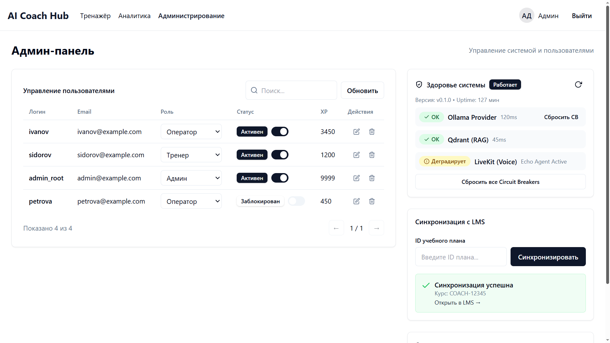

---

## 🛠️ Технологический стек

### Backend
- **Python 3.12** — базовый язык с нативной async/await поддержкой и `from __future__ import annotations`
- **FastAPI 0.115+** — асинхронный веб-фреймворк для REST API и WebSocket с автоматической OpenAPI-документацией
- **SQLAlchemy 2.0 (async)** — ORM с AsyncPG драйвером для асинхронной работы с PostgreSQL
- **Pydantic v2** — строгая валидация всех схем: entities, settings (BaseSettings через `.env`), DTO
- **python-jose + passlib** — JWT-аутентификация (HS256, access 30 мин + refresh 7 дней) с bcrypt-хэшированием паролей
- **structlog** — структурированное логирование с JSON-выводом, контекстом запроса и уровнями
- **prometheus_client** — метрики: latency (histogram), throughput (counter), error rate, активные сессии
- **Qdrant 1.13+** — векторная БД для RAG-валидации скриптов (AsyncQdrantClient)
- **Redis 7+** — хранение refresh-токенов с TTL, кэш
- **Circuit Breaker** — собственный протокол на каждый LLM-провайдер (3-состояния: CLOSED/OPEN/HALF_OPEN)

### AI-агенты
- **SimulatorAgent** — по умолчанию rule-based генерация реплик из шаблонов по 4 психотипам; опционально LLM через `LLMSimulatorAdapter` (Ollama/OpenAI)
- **CoachAgent** — rule-based 5-мерная оценка с весами; опционально LLM через `LLMCoachAdapter` для глубокого фидбека
- **CuratorAgent** — rule-based учебные планы: автоматический подбор сценариев по слабым местам оператора
- **GamificationEngine** — единый класс: XP (экспоненциальная шкала 1–100), 6+ бейджей, лидерборды, streak, челленджи
- **AnalystService + FairnessService** — метрики компании, 4 метрики Fairness-аудита, периодический аудит в lifespan

### Frontend
- **React 18** — UI для оператора, тренера и администратора
- **TypeScript 5** — строгая типизация всего кода
- **Vite** — сборка и HMR (Hot Module Replacement)
- **Tailwind CSS** — утилитарная стилизация
- **Zustand** — лёгкое управление состоянием (authStore, sessionStore)
- **React Router v6** — клиентская маршрутизация с AuthGuard (role-based guard)

### Инфраструктура
- **PostgreSQL 15** — основное хранилище (users, sessions, evaluations, xp_transactions, badges, fairness_reports)
- **Redis 7** — token store, кэш
- **Qdrant 1.13+** — векторное хранение скриптов для RAG
- **Docker Compose** — dev-стек (PostgreSQL + Redis + Qdrant) и production-стек (4 контейнера + мониторинг)
- **Nginx 1.25** — reverse proxy, TLS termination (в production)

### External Services
- **Ollama** — локальный LLM-инференс (Llama 3, Mistral)
- **OpenAI-compatible API** — облачный LLM-провайдер через единый Provider Layer
- **LMS (iSpring / Moodle / Битрикс24)** — синхронизация прогресса операторов

### Качество кода
- **Ruff** — ALL rules (включая ANN, S, BLE, PL), 0 ошибок
- **mypy strict** — статическая типизация всего backend-кода
- **pytest 8.3+** — ~462 теста (unit + API + integration + E2E + security), pytest-asyncio, pytest-cov
- **Pre-commit (план)** — ruff → mypy → pytest перед каждым коммитом

---

## ⚡ Быстрый старт (Local Development)

### 1. Клонирование и настройка

```bash
git clone <repository-url>
cd ai-roleplay-coach-agent-local
cp .env.example .env
# .env уже содержит разумные dev-значения по умолчанию
```

### 2. In-memory mode (ничего не нужно, кроме Python)

Самый быстрый способ — без БД, Redis, Qdrant. Все данные в оперативной памяти, seed-данные (3 пользователя, 3 сценария) загружаются автоматически.

```bash
pip install -e ".[dev]"
uvicorn src.main:app --reload --port 8000

# Проверка
curl http://localhost:8000/health
```

### 3. С Docker (полный стек)

```bash
# Запуск PostgreSQL, Redis, Qdrant + API
docker compose -f docker-compose.dev.yml up -d

# Проверка статуса
docker compose ps

# Просмотр логов
docker compose -f docker-compose.dev.yml logs -f api
```

### 4. Основные Makefile команды

```bash
make install      # pip install -e ".[dev]"
make lint         # ruff check src/ tests/
make format       # ruff format src/ tests/
make typecheck    # mypy src/
make test         # pytest tests/ -q --tb=short
make test-cov     # pytest tests/ --cov=src --cov-report=term-missing
make docker-up    # docker compose -f docker-compose.dev.yml up -d
make docker-down  # docker compose -f docker-compose.dev.yml down
```

### 5. Проверка доступности сервисов

- **API (health):** http://localhost:8000/health
- **API Docs (Swagger):** http://localhost:8000/docs
- **Prometheus:** http://localhost:9090 (при полном стеке)
- **Grafana:** http://localhost:3000 (admin/admin, при полном стеке)

---

## 🔒 Безопасность и Комплаенс

Проект спроектирован с учётом требований к безопасности корпоративных контакт-центров:

1. **JWT Authentication:** Все API-запросы защищены JWT-токенами (HS256, access 30 мин, refresh 7 дней) с возможностью принудительного отзыва всех refresh-токенов пользователя. Пароли хэшируются через bcrypt (passlib).
2. **Role-Based Access Control (RBAC):** Иерархическая модель с 3 ролями — Operator (только свои сессии), Trainer (управление сценариями и планами), Admin (полный доступ, управление пользователями, Fairness-аудит).
3. **Defense in Depth:**
   - **Rate Limiting:** 100 запросов/мин на API (default), 10 запросов/мин на auth endpoints (отдельный middleware), sliding window per IP
   - **CORS:** Настраиваемый whitelist origins (в production — строгий список)
   - **Security Headers:** `X-Content-Type-Options: nosniff`, `X-Frame-Options: DENY`, `Content-Security-Policy`, `Strict-Transport-Security`
   - **Pydantic strict mode:** Валидация всех входных данных на каждом endpoint
4. **Problem Details (RFC 9457):** Все ошибки возвращаются в стандартизированном формате с `type`, `title`, `status`, `detail` и `instance`.
5. **Fairness-аудит:** Система проводит автоматический аудит по 4 метрикам (demographic parity, equalized odds, calibration, disparate impact) для выявления алгоритмической предвзятости по полу, возрасту, акценту и родному языку. При обнаружении дискриминации — алерт через `StubNotificationService`.
6. **Config Validation:** Все настройки приложения валидируются при старте через `settings.validate()` — ошибки конфигурации обнаруживаются до запуска.
7. **Graceful Shutdown:** При остановке приложения корректно закрываются все соединения (PostgreSQL, Redis, Qdrant), завершаются фоновые задачи.
8. **Неизменяемый Audit Log:** Все действия AI-агентов и пользователей логируются с контекстом (request_id, user_id, action_type, timestamp).

---

## 📊 Бизнес-метрики (KPI)

| Метрика | Текущее значение | Целевое значение | Метод измерения |
| :--- | :--- | :--- | :--- |
| **Time-to-Proficiency** | 4 недели | **< 2 недель** | Сравнение с контрольной группой |
| **Нагрузка на наставников** | 100% времени | **30%** | Замер времени на 1 новичка |
| **Ошибки новичков** (после 10 симуляций) | 100% | **< 60%** | QA-оценка после симуляций |
| **Качество обслуживания (QA Score)** | Базовый уровень | **+25%** | QA Score до и после |
| **Время ответа Coach (p95)** | — | **< 2 сек** | Prometheus (histogram) |
| **Параллельные сессии** | — | **≥ 50** | Нагрузочное тестирование |
| **Покрытие тестами** | 84% | **> 85%** | pytest-cov |

### ROI

| Статья экономии | Расчёт | Эффект |
| :--- | :--- | :--- |
| Экономия времени наставников | 112 ч/новичок (160→48) | **−70% времени** |
| Ускорение выхода на план | 4 нед → 2 нед | **−50% Time-to-Proficiency** |
| Снижение ошибок | 100% → 60% после 10 симуляций | **−40% ошибок** |
| Снижение текучести на испытательном сроке | Высокая → умеренная | **15–20% улучшение** |
| **Окупаемость** | ~2–3 млн ₽ (разработка) vs экономия на КЦ от 100 оп. | **6–9 месяцев** |

---

## 🚦 Статус проекта

✅ **Архитектура и дизайн (C4 Level 1–3):** Завершены  
✅ **Детальная спецификация (FR-1..FR-7):** Завершена  
✅ **Кодовая база (backend + frontend):** Реализована, 462 теста (84% покрытие)  
✅ **In-memory first:** Zero-config разработка, seed-данные автозагрузка  
✅ **5 AI-агентов:** Simulator + Coach + Curator + Gamification + Analyst/Fairness  
✅ **REST API + WebSocket:** 34 эндпоинта, пагинация, rate limiting, RFC 9457  
✅ **JWT + RBAC:** 3 роли (Operator / Trainer / Admin)  
✅ **Геймификация:** XP, 6+ бейджей, лидерборды, streak, челленджи  
✅ **Fairness-аудит:** 4 метрики, периодический аудит, алертинг  
✅ **Docker Compose:** dev + prod стеки  
✅ **Full Observability:** Prometheus + structlog  
✅ **CI/CD:** GitHub Actions (ruff → mypy → pytest)  
✅ **Документация:** 17 документов, 7 ADR
