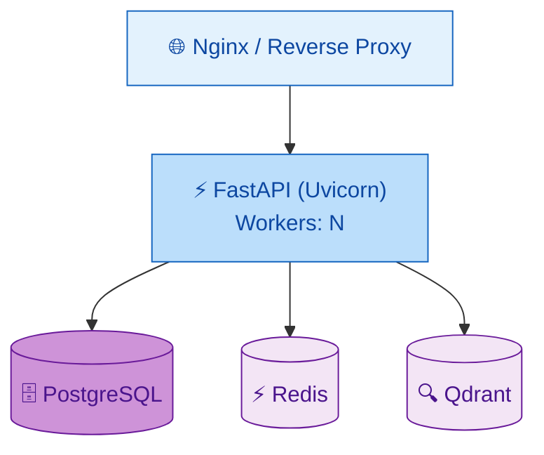

# Руководство администратора — AI Roleplay Coach Hub

> Для администраторов и DevOps. Установка, конфигурация, мониторинг, бэкапы, безопасность, масштабирование.

---

## 1. Введение

### 1.1 Архитектура (взгляд администратора)



**Ключевые компоненты:**

| Компонент | Роль | Порты | Зависимости |
|-----------|------|-------|-------------|
| Nginx Reverse Proxy | Терминация TLS, статика, балансировка | 80/443 → 8000 | FastAPI |
| FastAPI (Uvicorn) | REST API + WebSocket | 8000 | Postgres, Redis, Qdrant |
| PostgreSQL 16 | Основная БД (пользователи, сессии, оценки, XP) | 5432 | — |
| Redis 7 | Token store, rate limiting, кэш | 6379 | — |
| Qdrant 1.12 | Векторное хранилище (RAG для LLM) | 6333 (HTTP), 6334 (gRPC) | — |
| Frontend (Vite) | React SPA (отдельный контейнер) | 5173 → 80 | FastAPI |

### 1.2 Целевая аудитория и предварительные требования

- **Linux/Windows + Docker** — для развёртывания через Docker Compose
- **Python 3.12+** — для ручной установки без Docker
- **PostgreSQL 15+** — основная база данных
- **Redis 7+** — кэширование и rate limiting
- **Qdrant 1.x** — векторное хранилище (опционально, для LLM-коучинга)
- **Docker Compose v2** — оркестрация контейнеров
- **curl / httpie** — для проверки health-эндпоинтов
- **Доступ к реестру контейнеров** (Docker Hub или私有 registry)

---

## 2. Установка

### 2.1 Системные требования

| Компонент | Минимум | Рекомендуется |
|-----------|---------|---------------|
| CPU | 2 ядра | 4+ ядер |
| RAM | 4 GB | 8+ GB (16 GB с Ollama) |
| Диск | 10 GB | 50 GB SSD |
| Docker | 24+ | 24+ |
| PostgreSQL | 15+ | 16+ |
| Redis | 7+ | 7+ |
| Qdrant | 1.10+ | 1.12+ |

**Сетевые порты:**

| Порт | Сервис | Назначение |
|------|--------|------------|
| 8000 | FastAPI | HTTP API |
| 5432 | PostgreSQL | Основная БД |
| 6379 | Redis | Кэш / token store |
| 6333 | Qdrant HTTP | REST API векторов |
| 6334 | Qdrant gRPC | gRPC (опционально) |
| 80/443 | Nginx | Reverse proxy (prod) |
| 11434 | Ollama | LLM-инференс (опционально) |

### 2.2 Установка через Docker Compose (Dev)

```bash
# Запуск всех сервисов (PostgreSQL + Redis + Qdrant + приложение)
docker compose -f docker-compose.dev.yml up -d

# Проверка логов
docker compose -f docker-compose.dev.yml logs -f

# Остановка
docker compose -f docker-compose.dev.yml down
```

**docker-compose.dev.yml** запускает:
- PostgreSQL 16 (порт 5432)
- Redis 7 (порт 6379)
- Qdrant 1.12 (порт 6333 HTTP)
- Приложение FastAPI (порт 8000, hot-reload)
- Frontend (порт 5173)

**Проверка после установки:**
```bash
# Healthcheck
curl http://localhost:8000/api/v1/health
# → {"status": "ok"}

# OpenAPI specs
curl http://localhost:8000/openapi.json | jq .info.version

# Frontend
curl -I http://localhost:5173
# → 200 OK
```

### 2.3 Установка через Docker Compose (Production)

```bash
docker compose -f docker-compose.prod.yml up -d
```

**Отличия от dev-сборки:**
- Multi-stage `[Dockerfile.prod](Dockerfile.prod)` — итоговый образ ~150 MB
- Нет проброса томов для исходного кода
- Gunicorn вместо `uvicorn --reload` (production server)
- Healthchecks включены
- `restart: always`
- Nginx reverse proxy с TLS termination
- Prometheus + Grafana (опционально)

**Проверка production-сборки:**
```bash
# Проверка состояния контейнеров
docker compose -f docker-compose.prod.yml ps
# Все контейнеры должны быть в статусе Up

# Проверка логов на ошибки
docker compose -f docker-compose.prod.yml logs --tail=50 app | grep -i error

# Smoke-тест
curl -f http://localhost:8000/api/v1/health && echo "OK"
```

### 2.4 Ручная установка (без Docker)

```bash
# 1. Создание виртуального окружения
python -m venv .venv
.venv\Scripts\activate       # Windows
source .venv/bin/activate    # Linux / macOS

# 2. Установка зависимостей
pip install -e ".[dev]"

# 3. Запуск внешних сервисов (PostgreSQL, Redis, Qdrant) вручную
#    или через отдельный docker-compose для инфраструктуры

# 4. Запуск приложения
uvicorn src.main:app --host 0.0.0.0 --port 8000 --reload

# 5. Запуск фронтенда
cd frontend
npm install
npm run dev
```

**Проверка окружения:**
```bash
# Версия Python
python --version                    # → 3.12.x

# Версия pip
pip --version                       # → 24.x

# Проверка зависимостей
pip list --format=columns | grep -E "fastapi|uvicorn|sqlalchemy"

# Доступность PostgreSQL
psql -h localhost -U coach -d coach_hub -c "SELECT version();"

# Доступность Redis
redis-cli ping                      # → PONG

# Доступность Qdrant
curl http://localhost:6333/health   # → {"ok":true}
```

### 2.5 Seed Data (начальные данные)

Приложение загружает начальные данные при старте в любом режиме:

| Сущность | Кол-во | Детали |
|----------|--------|--------|
| Пользователи | 3 | Роли: admin, trainer, operator |
| Сценарии | 3 | Агрессивный, растерянный, требовательный |
| Бейджи | 8 | Определения достижений (уровни, оценки, streaks) |

**Скриптовое наполнение (для тестовых данных):**
```bash
# Наполнение PostgreSQL тестовыми данными
python scripts/seed_postgres.py     # bulk users + scenarios

# Наполнение Qdrant векторными эмбеддингами
python scripts/seed_qdrant.py       # vector embeddings для RAG

# Генерация отчёта Fairness (проверка)
python scripts/generate_fairness_report.py --output fairness_report.json
```

**Проверка seed data:**
```bash
# Через API (требуется ADMIN роль)
curl -X GET http://localhost:8000/api/v1/auth/users | jq '. | length'
# → минимум 3 пользователя

# Chерез healthcheck компонентов
curl http://localhost:8000/api/v1/health | jq '.components'
```

---

## 3. Конфигурация

### 3.1 Справочник переменных окружения

Полная модель конфигурации: [src/core/config.py](../src/core/config.py) (Pydantic Settings).

| Переменная | По умолчанию | Описание |
|------------|-------------|----------|
| **База данных** | | |
| POSTGRES_USER | coach | Пользователь PostgreSQL |
| POSTGRES_PASSWORD | changeme | Пароль PostgreSQL (СМЕНИТЬ В PROD) |
| POSTGRES_DB | coach_hub | Имя базы данных |
| POSTGRES_HOST | localhost | Хост PostgreSQL |
| POSTGRES_PORT | 5432 | Порт PostgreSQL |
| DB_POOL_SIZE | 10 | Размер пула соединений |
| DB_MAX_OVERFLOW | 20 | Максимум переполнения пула |
| DB_ECHO | false | Логировать все SQL-запросы (dev) |
| **MinIO (S3)** | | |
| MINIO_ROOT_USER | minio_admin | Пользователь MinIO admin |
| MINIO_ROOT_PASSWORD | changeme | Пароль MinIO (СМЕНИТЬ В PROD) |
| MINIO_ENDPOINT | localhost:9000 | Endpoint MinIO |
| MINIO_USE_SSL | false | Использовать SSL для MinIO |
| **Redis** | | |
| REDIS_HOST | localhost | Хост Redis |
| REDIS_PORT | 6379 | Порт Redis |
| REDIS_DB | 0 | Номер БД Redis |
| REDIS_PASSWORD | (empty) | Пароль Redis (опционально) |
| REDIS_POOL_SIZE | 10 | Размер пула соединений Redis |
| **Qdrant** | | |
| QDRANT_HOST | localhost | Хост Qdrant |
| QDRANT_HTTP_PORT | 6333 | HTTP-порт Qdrant |
| QDRANT_GRPC_PORT | 6334 | gRPC-порт Qdrant (опционально) |
| QDRANT_API_KEY | (empty) | API-ключ Qdrant (если включена аутентификация) |
| QDRANT_HTTPS | false | Использовать HTTPS для Qdrant |
| VECTOR_SIZE | 1024 | Размерность эмбеддингов |
| COLLECTION_NAME | sessions | Имя коллекции Qdrant |
| **JWT** | | |
| JWT_SECRET | change-me-... | Секретный ключ подписи (ОБЯЗАТЕЛЬНО СМЕНИТЬ В PROD) |
| JWT_ALGORITHM | HS256 | Алгоритм подписи |
| ACCESS_TOKEN_EXPIRE_MINUTES | 60 | Время жизни access token (минут) |
| **LLM** | | |
| LLM_PROVIDER | mock | Провайдер LLM: mock / ollama / openai_compat / gigachat |
| LLM_MODEL | mistral:7b-instruct | Имя модели |
| LLM_BASE_URL | http://localhost:11434/v1 | Базовый URL API |
| LLM_API_KEY | (empty) | Bearer token для API |
| LLM_TIMEOUT | 60 | Таймаут генерации (секунд) |
| LLM_MAX_RETRIES | 3 | Количество повторов при ошибке |
| LLM_TEMPERATURE | 0.7 | Температура генерации |
| LLM_MAX_TOKENS | 2048 | Максимум токенов в ответе |
| **Rate Limiting** | | |
| RATE_LIMIT_DEFAULT | 100 | Лимит запросов в минуту (по умолчанию) |
| RATE_LIMIT_AUTH | 5 | Лимит на /auth/register за 10 минут |
| RATE_LIMIT_WINDOW | 60 | Окно rate limiting (секунд) |
| **CORS** | | |
| CORS_ORIGINS | ["*"] | Разрешённые источники CORS (разделённые запятыми) |
| **Fairness** | | |
| FAIRNESS_ENABLED | true | Включить Fairness Audit |
| FAIRNESS_CONFIG_PATH | fairness_config.yaml | Путь к конфигурации Fairness |
| **Мониторинг** | | |
| LOG_LEVEL | info | Уровень логирования (debug / info / warning / error) |
| LOG_FORMAT | json | Формат логов (json / console) |
| METRICS_ENABLED | true | Включить /metrics endpoint |
| APP_HOST | 0.0.0.0 | Адрес привязки |
| APP_PORT | 8000 | HTTP-порт |

### 3.2 Выбор LLM-провайдера

| Провайдер | LLM_PROVIDER | Когда использовать |
|-----------|-------------|-------------------|
| Mock (по умолчанию) | mock | Разработка, тестирование, CI/CD — не требует GPU |
| Ollama (локальный) | ollama | Локальная LLM с GPU или CPU (через llama.cpp) |
| OpenAI Compatible | openai_compat | vLLM, Together AI, OpenAI API, любые совместимые |
| GigaChat | gigachat | Sber GigaChat (требуется плагин) |

**Рекомендации по выбору:**
- **CI/CD / тесты** → mock (самый быстрый, детерминированный)
- **Разработка без GPU** → mock или Ollama (CPU, quantized 4-bit)
- **Staging** → Ollama (mistral:7b) или OpenAI Compat
- **Production (онпремиз)** → Ollama с GPU или vLLM
- **Production (облако)** → OpenAI API или Together AI

### 3.3 Валидация конфигурации

Приложение валидирует конфигурацию при старте:

```python
# src/core/config.py — автоматическая валидация через Pydantic
class Settings(BaseSettings):
    @field_validator("JWT_SECRET")
    def validate_jwt_min_length(cls, v):
        if len(v) < 32:
            raise ValueError("JWT_SECRET must be at least 32 characters")
        return v

    @field_validator("CORS_ORIGINS")
    def parse_cors_origins(cls, v):
        if isinstance(v, str):
            return [origin.strip() for origin in v.split(",")]
        return v
```

**Проверка конфигурации без запуска приложения:**
```bash
python -c "from src.core.config import settings; print(settings.model_dump_json(indent=2))"
```

---

## 4. Управление пользователями

### 4.1 Создание и управление пользователями

**Требуется роль ADMIN** для всех операций управления пользователями.

```bash
# Список всех пользователей
curl -X GET http://localhost:8000/api/v1/auth/users

# Поиск по имени пользователя
curl -X GET "http://localhost:8000/api/v1/auth/users?search=operator"

# Удаление пользователя
curl -X DELETE http://localhost:8000/api/v1/auth/users/{user_id}

# Создание пользователя (через регистрацию, требуется ADMIN не нужен)
curl -X POST http://localhost:8000/api/v1/auth/register \
  -H "Content-Type: application/json" \
  -d '{"username": "new_operator", "password": "SecurePass123", "role": "operator"}'
```

### 4.2 Роли и разрешения (RBAC)

Реализовано через декоратор `require_role()` в [src/api/auth.py](../src/api/auth.py).

| Ресурс | operator | trainer | admin |
|--------|----------|---------|-------|
| POST /auth/register | ✅ | ✅ | ✅ |
| GET /auth/me | ✅ | ✅ | ✅ |
| GET /auth/users | ❌ | ❌ | ✅ |
| POST /sessions | ✅ | ✅ | ✅ |
| POST /sessions/{id}/step | ✅ | ✅ | ✅ |
| POST /sessions/{id}/evaluate | ❌ | ✅ | ✅ |
| POST /curator/quiz | ❌ | ✅ | ✅ |
| POST /curator/sync-lms | ❌ | ❌ | ✅ |
| GET /analyst/stats | ❌ | ✅ | ✅ |
| GET /analyst/fairness/report | ❌ | ❌ | ✅ |
| GET /analyst/fairness/groups | ❌ | ❌ | ✅ |
| GET /analyst/fairness/history | ❌ | ❌ | ✅ |
| POST /gamification/xp | ❌ | ❌ | ✅ |
| GET /gamification/xp/{id}/history | ✅ | ✅ | ✅ |
| GET /gamification/leaderboard | ✅ | ✅ | ✅ |
| PUT /sessions/{id} | ✅ (свои) | ✅ (свои) | ✅ (все) |
| DELETE /sessions/{id} | ✅ (свои) | ✅ (свои) | ✅ (все) |

**Принципы RBAC:**
- **operator** — только свои сессии, базовый доступ
- **trainer** — свои сессии + оценка + статистика + управление сценариями
- **admin** — полный доступ: пользователи, fairness, управление бейджами, LMS sync

### 4.3 Жизненный цикл JWT

| Параметр | Значение |
|----------|----------|
| Access token TTL | 60 мин (настраивается через ACCESS_TOKEN_EXPIRE_MINUTES) |
| Refresh token TTL | 7 дней (hardcoded) |
| Алгоритм | HS256 |
| Секрет | Переменная окружения JWT_SECRET |
| Хранилище токенов | In-memory или Redis (post-logout) |
| Механизм отзыва | Черный список (blacklist) при logout |

**Поток JWT:**

```
Register / Login
    ↓
Получить { access_token, refresh_token }
    ↓
Access token → Bearer-заголовок для API-запросов
    ↓ (через 60 мин)
Refresh token → POST /auth/refresh → новый access_token
    ↓ (при logout)
Оба токена → в черный список (до истечения TTL)
```

**Важно:** Смените `JWT_SECRET` в production — значение по умолчанию из `[.env.example](.env.example)` находится в открытом доступе.

### 4.4 API-ключи (для автоматизации)

Для CI/CD скриптов и автоматизации используйте долгоживущие access token-ы:

```bash
# Получение токена для скрипта
TOKEN=$(curl -s -X POST http://localhost:8000/api/v1/auth/login \
  -H "Content-Type: application/json" \
  -d '{"username": "admin", "password": "admin123"}' \
  | jq -r '.access_token')

# Использование в скриптах
curl -H "Authorization: Bearer $TOKEN" http://localhost:8000/api/v1/analyst/stats
```

---

## 5. Мониторинг и observability

### 5.1 Health Checks

```
GET /api/v1/health
```

**Ответ:** `{"status": "ok"}` — возвращает 200, когда приложение работает.
Включает также `version`, `uptime` и статусы компонентов.

### 5.2 Prometheus метрики

Эндпоинт метрик: `GET /metrics` (смонтирован на `/metrics`)

**Доступные метрики:**

| Метрика | Тип | Метки | Описание |
|---------|-----|-------|----------|
| `http_requests_total` | Counter | method, path, status | Количество запросов |
| `http_request_duration_seconds` | Histogram | method, path, le | Латенция запросов |
| `db_connections_active` | Gauge | pool | Активные соединения PostgreSQL |
| `actor_messages_total` | Counter | actor_type | Сообщения actor system |

### 5.3 Prometheus конфигурация

**Пример полного config:**
```yaml
# prometheus.yml
global:
  scrape_interval: 15s
  evaluation_interval: 15s

rule_files:
  - "alerts.yml"

scrape_configs:
  - job_name: 'coach-hub'
    scrape_interval: 15s
    metrics_path: '/metrics'
    static_configs:
      - targets: ['localhost:8000']
        labels:
          service: 'coach-hub'
          env: 'production'
```

**Пример правил алертинга:**
```yaml
# alerts.yml
groups:
  - name: coach-hub
    rules:
      - alert: HighErrorRate
        expr: rate(http_requests_total{status=~"5.."}[5m]) > 0.1
        for: 5m
        labels:
          severity: critical
        annotations:
          summary: "High HTTP error rate"

      - alert: HighLatency
        expr: histogram_quantile(0.99, rate(http_request_duration_seconds_bucket[5m])) > 5
        for: 2m
        labels:
          severity: warning
        annotations:
          summary: "p99 latency exceeds 5s"
```

### 5.4 Grafana Dashboard

**Базовая панель мониторинга:**

| Панель | Метрика | Виджет |
|--------|---------|--------|
| RPS | rate(http_requests_total[5m]) | Time series |
| Latency p50/p95/p99 | http_request_duration_seconds | Heatmap / Quantile |
| Error rate | rate(http_requests_total{status=~"5.."}[5m]) | Stat / Time series |
| DB connections | db_connections_active | Gauge |
| Active sessions | http_requests_total{path=~".*sessions.*"} | Time series |
| Top endpoints | topk(10, http_requests_total) | Table |

**Быстрый старт Grafana (Docker):**
```bash
# Grafana включена в docker-compose.prod.yml
# Доступ: http://localhost:3000 (admin / admin)
# Data source: Prometheus (http://prometheus:9090)
```

### 5.5 Логирование

- **Формат:** структурированный JSON (или console в dev)
- **Уровень:** настраивается через LOG_LEVEL
- **Библиотека:** structlog
- **Вывод:** stdout/stderr (сбор через Docker/journald)
- **Контекст:** request_id, user_id, correlation_id

**Поиск ошибок в логах:**
```bash
docker logs coach-hub-app 2>&1 | grep error
journalctl -u coach-hub --since "1 hour ago" | grep error
```

### 5.6 Алертинг (рекомендации)

| Условие | Действие | Важность |
|---------|----------|----------|
| HTTP 5xx > 10 за 5 мин | Email / Slack | critical |
| DB connections > 80% пула | Предупреждение | warning |
| p99 latency > 5s | Инцидент | critical |
| LLM timeout > 50% за 5 мин | Проверить LLM | warning |

### 5.7 Агрегация логов (рекомендации)

Для production рекомендуется настроить централизованный сбор логов:

**Вариант ELK (Elasticsearch + Logstash + Kibana):**
```bash
# Filebeat config для сбора Docker логов
filebeat.inputs:
  - type: container
    paths:
      - /var/lib/docker/containers/*/*.log
    json.keys_under_root: true
    json.overwrite_keys: true
output.elasticsearch:
  hosts: ["http://elasticsearch:9200"]
```

**Вариант Loki + Grafana (более лёгкий):**
```yaml
# docker-compose лог стека
services:
  promtail:
    image: grafana/promtail
    volumes:
      - /var/log:/var/log
      - /var/lib/docker/containers:/var/lib/docker/containers
    configs:
      - sources:
          - job_name: docker
            docker_sd_configs:
              - host: unix:///var/run/docker.sock
```

---

## 6. Резервное копирование и восстановление

### 6.1 PostgreSQL Backup

```bash
# Полный дамп БД
pg_dump -h localhost -U coach -d coach_hub > backup_$(date +%Y%m%d_%H%M%S).sql

# Сжатый дамп
pg_dump -h localhost -U coach -d coach_hub | gzip > backup_$(date +%Y%m%d).sql.gz

# Восстановление
psql -h localhost -U coach -d coach_hub < backup_20260712.sql

# Восстановление из сжатого
gunzip -c backup_20260712.sql.gz | psql -h localhost -U coach -d coach_hub
```

### 6.2 Redis Backup

Redis RDB-снапшоты (Docker volume): `/data/dump.rdb`

**Настройка persistence (для production):**
```conf
save 900 1
save 300 10
save 60 10000
appendonly yes
appendfsync everysec
```

**Бэкап Redis:**
```bash
redis-cli SAVE
cp /data/dump.rdb /backup/redis/dump_$(date +%Y%m%d).rdb
```

### 6.3 Qdrant Backup

```bash
# Создание снапшота
curl -X POST http://localhost:6333/collections/sessions/snapshots

# Список снапшотов
curl -X GET http://localhost:6333/collections/sessions/snapshots

# Восстановление
curl -X POST http://localhost:6333/collections/sessions/snapshots/recover \
  -H "Content-Type: application/json" \
  -d '{"location": "/snapshots/sessions-20260712.snapshot"}'
```

### 6.4 Скрипты автоматизации

Доступны в [scripts/](../scripts/):

| Скрипт | Назначение | Частота |
|--------|------------|---------|
| seed_postgres.py | Наполнение / перезаливка БД | При необходимости |
| seed_qdrant.py | Наполнение векторного хранилища | При смене модели |
| generate_fairness_report.py | On-demand fairness audit | Ежедневно (cron) |

**Пример cron-задания:**
```bash
# /etc/cron.d/coach-hub-backup
0 3 * * * coach pg_dump -h localhost -U coach -d coach_hub | gzip > /backup/pg/coach_hub_$(date +\%Y\%m\%d).sql.gz
0 4 * * 0 coach redis-cli SAVE && cp /data/dump.rdb /backup/redis/dump_$(date +\%Y\%m\%d).rdb
0 5 * * * coach find /backup -type f -mtime +30 -delete
```

### 6.5 PostgreSQL Performance Tuning

**Рекомендуемые индексы (для production):**

```sql
CREATE INDEX idx_sessions_user_id ON sessions(user_id);
CREATE INDEX idx_sessions_created_at ON sessions(created_at);
CREATE INDEX idx_evaluations_session_id ON evaluations(session_id);
CREATE INDEX idx_xp_user_id ON xp_entries(user_id);
CREATE UNIQUE INDEX idx_users_username ON users(username);
```

**Рекомендации по настройке postgresql.conf:**

```conf
shared_buffers = 2GB          # 25% от RAM
effective_cache_size = 6GB    # 75% от RAM
work_mem = 64MB               # для сортировок
maintenance_work_mem = 512MB   # для VACUUM
random_page_cost = 1.1        # для SSD
effective_io_concurrency = 200 # для SSD
wal_buffers = 64MB
max_connections = 100
```

**Политика хранения:**

| Тип | Retention | Хранилище |
|-----|-----------|-----------|
| PostgreSQL daily | 30 дней | Локальный диск |
| PostgreSQL weekly | 6 месяцев | S3 / MinIO |
| Redis RDB | 7 дней | Локальный диск |
| Qdrant snapshot | 14 дней | Локальный диск |

---

## 7. Безопасность

### 7.1 CORS

Настраивается в [src/main.py](../src/main.py). В dev — разрешены все источники (`["*"]`). В production — ограничьте доменом фронтенда.

**Проверка CORS:**
```bash
curl -I -X OPTIONS http://localhost:8000/api/v1/sessions \
  -H "Origin: https://frontend.example.com" \
  -H "Access-Control-Request-Method: POST"
# Должен содержать Access-Control-Allow-Origin
```

### 7.2 Rate Limiting

| Лимитёр | Область | Лимит | Ответ |
|---------|---------|-------|-------|
| Default | По IP | 100/мин | 429 + retry-after: 60s |
| Auth | /auth/register | 5/10мин | 429 + retry-after: 1800s |

Реализация: [src/api/rate_limit.py](../src/api/rate_limit.py), [src/api/auth_rate_limit_middleware.py](../src/api/auth_rate_limit_middleware.py)

### 7.3 Input Validation

- Все API-входы валидируются через Pydantic-схемы
- Длинные сообщения (>10KB) отклоняются с 422
- SQL-инъекции предотвращены через параметризованные запросы (asyncpg)
- SAST-сканирование в CI (см. [CICD.md](CICD.md))

### 7.4 SAST и сканирование секретов

CI/CD пайплайн включает:
- **ruff** — линтинг и проверка типов
- **secretscan** — поиск секретов в коде
- **pip-audit** — проверка зависимостей на CVE

Подробнее: [CICD.md](CICD.md), [security.yml](../.github/workflows/security.yml)

### 7.5 Сетевая безопасность

**Рекомендуемая конфигурация firewall:**

| Направление | Источник | Назначение | Порт | Протокол |
|------------|----------|------------|------|----------|
| Inbound | Интернет | Nginx | 80, 443 | TCP |
| Inbound | Nginx | FastAPI | 8000 | TCP |
| Inbound | Только админы | SSH | 22 | TCP |
| Inbound | Prometheus | FastAPI /metrics | 8000 | TCP |
| Internal | FastAPI | PostgreSQL | 5432 | TCP |
| Internal | FastAPI | Redis | 6379 | TCP |
| Internal | FastAPI | Qdrant | 6333 | TCP |
| Internal | FastAPI | Ollama | 11434 | TCP |

**Все остальные порты должны быть закрыты.**

### 7.6 Чеклист безопасности для production

- [ ] Сменить JWT_SECRET (не использовать значение из [.env.example](.env.example))
- [ ] Сменить POSTGRES_PASSWORD
- [ ] Включить CORS restriction (не `["*"]`)
- [ ] Настроить rate limit под ожидаемую нагрузку
- [ ] Включить HTTPS (терминировать на reverse proxy)
- [ ] Установить LOG_LEVEL=warning или error
- [ ] Ограничить порты MinIO и Qdrant от публичного доступа
- [ ] Настроить firewall (разрешить только 80/443 и 22)
- [ ] Проверить, что HSTS включён (SecurityHeadersMiddleware)
- [ ] Регулярно обновлять зависимости (pip-audit)
- [ ] Использовать отдельного пользователя БД для приложения (не postgres)
- [ ] Включить AOF для Redis (persistence)
- [ ] Настроить алерты на 5xx ошибки

---

## 8. Управление LLM-провайдерами

### 8.1 Mock Mode (по умолчанию)

- Не требует GPU
- Rule-based ответы с DDA (динамическая регулировка сложности)
- Лучший выбор для CI/CD, тестирования и онбординга
- Детерминированные ответы — предсказуемое тестирование

### 8.2 Ollama (локальный)

```bash
# Установка модели
ollama pull mistral:7b-instruct

# Запуск сервера
ollama serve
```

**Настройка:** `LLM_PROVIDER=ollama`, `LLM_BASE_URL=http://localhost:11434/v1`

**Использование ресурсов:**

| Модель | RAM (FP16) | RAM (Quantized 4-bit) |
|--------|------------|----------------------|
| mistral:7b | ~14 GB | ~4 GB |
| llama3:8b | ~16 GB | ~5 GB |
| qwen2:7b | ~14 GB | ~4 GB |
| phi3:3.8b | ~8 GB | ~2 GB |

**Совет:** Для production с ограниченными ресурсами используйте quantized модели (`ollama pull mistral:7b-instruct-q4_K_M`).

### 8.3 OpenAI Compatible

Работает с: vLLM, Together AI, OpenAI API, любыми OpenAI-совместимыми эндпоинтами.

```bash
LLM_PROVIDER=openai_compat
LLM_BASE_URL=https://api.openai.com/v1
LLM_MODEL=gpt-4o-mini
```

**Провайдеры:**

| Провайдер | Base URL | Модели |
|-----------|----------|--------|
| OpenAI | https://api.openai.com/v1 | gpt-4o, gpt-4o-mini |
| Together AI | https://api.together.xyz/v1 | mixtral, llama3 |
| vLLM (self-hosted) | http://localhost:8000/v1 | Любая поддерживаемая |

### 8.4 GigaChat (Sber)

Требует плагин `opencode-gigachat-plugin` и credentials из портала разработчика Sber.

```bash
LLM_PROVIDER=gigachat
GIGACHAT_SCOPE=GIGACHAT_API_PERS
```

### 8.5 Troubleshooting LLM

| Симптом | Причина | Решение |
|---------|---------|---------|
| Timeout при генерации | LLM_TIMEOUT слишком мал | Увеличьте до 120s |
| Пустой ответ | Модель не загружена | Проверьте ollama ps |
| 401 Unauthorized | Неверный API key | Проверьте LLM_API_KEY |
| Медленные ответы (>10s) | Нет GPU / малый VRAM | Используйте quantized модель |
| Ошибка "model not found" | Неверное имя модели | Проверьте ollama list |
| Circuit breaker разомкнут | Слишком много ошибок | Подождите 60s, проверьте LLM |

---

## 9. Масштабирование

### 9.1 Горизонтальное масштабирование

**Workers:** Gunicorn с несколькими Uvicorn workers.

```bash
gunicorn src.main:app --worker-class uvicorn.workers.UvicornWorker --workers 4 --bind 0.0.0.0:8000
```

**Формула:** workers = (2 * CPU cores) + 1

**Рекомендации по количеству workers:**

| CPU | Workers | RAM (без LLM) | RAM (с LLM sidecar) |
|-----|---------|---------------|---------------------|
| 2 | 5 | ~500 MB | ~500 MB + LLM |
| 4 | 9 | ~1 GB | ~1 GB + LLM |
| 8 | 17 | ~2 GB | ~2 GB + LLM |
| 16 | 33 | ~4 GB | ~4 GB + LLM |

### 9.2 Connection Pooling

| Сервис | Pool Size | Max Overflow |
|--------|-----------|-------------|
| PostgreSQL | DB_POOL_SIZE (default 10) | DB_MAX_OVERFLOW (default 20) |
| Redis | Client-managed (default 10) | N/A |
| Qdrant | Async client (переиспользование) | N/A |

**Формула для pool size:** pool = workers * (connections_per_worker), где connections_per_worker ≈ 2-3

### 9.3 Кэширование

| Слой | Технология | Что кэшируется | TTL |
|------|-----------|----------------|-----|
| Application | Redis | Rate limit counters, token blacklist | 60s / 7d |
| Application | In-memory | Сценарии, состояние сессий | Время сессии |
| HTTP | Nginx (proxy) | Статика, API responses | Настраивается |
| HTTP | CDN | Фронтенд (Vite build) | Долгий |

### 9.4 GIL Considerations

Приложение использует FastAPI с `async def` эндпоинтами, asyncpg и aiohttp. CPU-bound задачи (оценка Coach, генерация сценариев) выполняются в thread pools.

**Рекомендации для production с LLM:**

- Увеличьте `--workers` для I/O-bound workloads
- Для CPU-bound LLM инференса: выгрузите в отдельный сервис (Ollama/vLLM как sidecar)
- Используйте `asyncio.to_thread()` для блокирующих операций
- Рассмотрите multiprocessing для параллельной оценки (опционально)

### 9.5 Kubernetes (reference)

Для крупных развёртываний рекомендуется Kubernetes:

```yaml
# HPA (Horizontal Pod Autoscaler)
apiVersion: autoscaling/v2
kind: HorizontalPodAutoscaler
metadata:
  name: coach-hub
spec:
  scaleTargetRef:
    apiVersion: apps/v1
    kind: Deployment
    name: coach-hub
  minReplicas: 2
  maxReplicas: 10
  metrics:
  - type: Resource
    resource:
      name: cpu
      target:
        type: Utilization
        averageUtilization: 70
```

---

## 10. Обновления и миграции

### 10.1 Миграции базы данных

В настоящее время приложение использует синхронное создание таблиц через `metadata.create_all()` при первом запуске. Alembic миграции пока не настроены.

**Планируемый workflow с Alembic:**
```bash
# Инициализация Alembic
alembic init alembic/

# Создание миграции
alembic revision --autogenerate -m "add_fairness_fields"

# Применение миграции
alembic upgrade head

# Откат миграции
alembic downgrade -1
```

### 10.2 Обновление приложения

**Docker:**
```bash
git pull
docker compose -f docker-compose.prod.yml down
docker compose -f docker-compose.prod.yml build
docker compose -f docker-compose.prod.yml up -d
```

**Ручная установка:**
```bash
git pull
pip install -e ".[dev]"
# Перезапуск приложения
```

---

## 11. Устранение неполадок (для администраторов)

| Симптом | Вероятная причина | Проверка / Решение |
|---------|-------------------|--------------------|
| Приложение не стартует | PostgreSQL не запущен | `docker ps \| grep postgres` |
| Auth всегда выдаёт ошибку | Неверный JWT_SECRET | Сравните .env с деплоем |
| 429 на auth | Достигнут rate limit | Проверьте auth_rate_limit config |
| Coach возвращает устаревшие результаты | In-memory режим | Проверьте DB_MODE |
| Медленные ответы | LLM_PROVIDER timeout | Проверьте LLM_TIMEOUT, загружена ли модель |
| Qdrant connection error | Неверный порт | Qdrant использует HTTP 6333, не gRPC 6334 |
| Seed data пропала | Перезапуск (in-memory) | Переключитесь на PostgreSQL |
| Frontend не подключается | CORS или host mismatch | Проверьте APP_HOST, CORS config |
| Высокое потребление RAM | LLM модель загружена | Уменьшите workers или используйте меньшую модель |
| Docker build падает | Нет места на диске | `docker system prune -a` |
| Container постоянно перезапускается | Healthcheck провален | `docker logs --tail=50` |
| Postgres connection refused | Неверные credentials | Проверьте POSTGRES_USER/PASSWORD |
| Redis "OOM command not allowed" | Redis переполнен | Настройте maxmemory в redis.conf |
| Circuit breaker разомкнут | LLM недоступен | Подождите 60s, проверьте LLM_URL |
| Метрики пустые | Prometheus не настроен | Проверьте scrape_configs |
| Ошибка "too many connections" | Пул соединений исчерпан | Увеличьте DB_POOL_SIZE |
| Slow queries (>1s) | Отсутствуют индексы | Проверьте pg_stat_activity, добавьте индексы |

---

## Ссылки

| Ресурс | Назначение | Формат |
|--------|------------|--------|
| [src/core/config.py](../src/core/config.py) | Полная модель конфигурации (Pydantic) | Код |
| [docker-compose.dev.yml](../docker-compose.dev.yml) | Dev оркестрация | YAML |
| [docker-compose.prod.yml](../docker-compose.prod.yml) | Production оркестрация | YAML |
| [Makefile](../Makefile) | Основные команды (install, test, docker-up) | [Makefile](Makefile) |
| [src/api/rate_limit.py](../src/api/rate_limit.py) | Rate limiting реализация | Код |
| [src/api/auth.py](../src/api/auth.py) | Auth, RBAC, JWT | Код |
| [src/main.py](../src/main.py) | Точка входа, CORS, middleware | Код |
| [src/monitoring/__init__.py](../src/monitoring/__init__.py) | Метрики Prometheus | Код |
| [scripts/seed_postgres.py](../scripts/seed_postgres.py) | Seed data скрипт | Код |
| [DEPLOYMENT_PLAN.md](DEPLOYMENT_PLAN.md) | План развёртывания | Документ |
| [CICD.md](CICD.md) | CI/CD pipeline | Документ |
| [.env.example](../.env.example) | Шаблон переменных окружения | Env |
