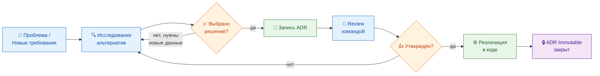
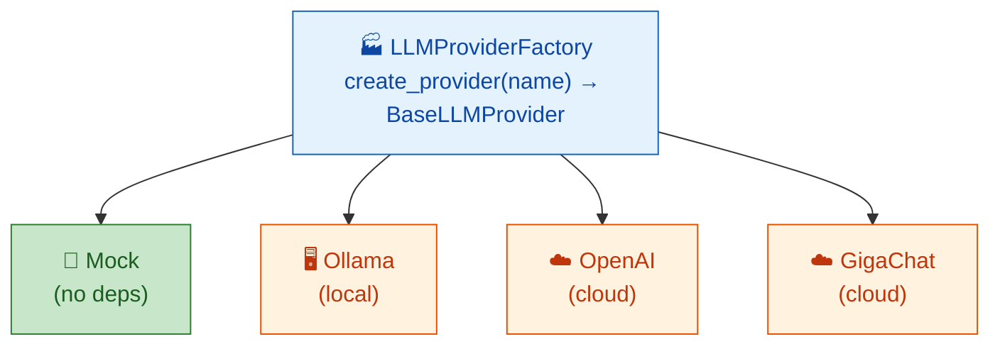
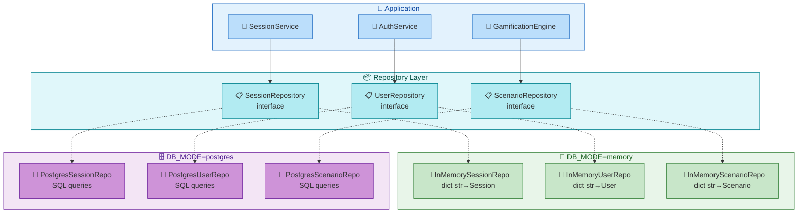
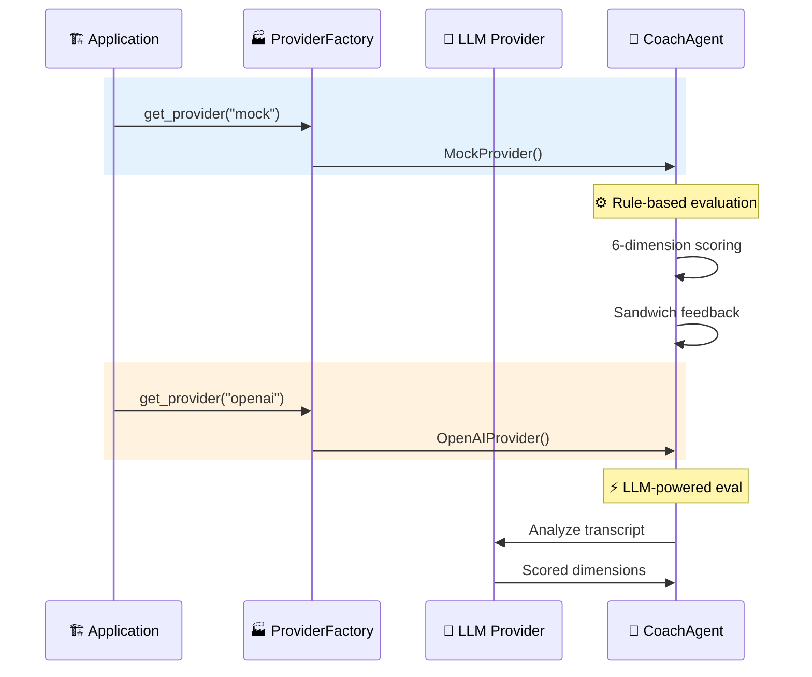
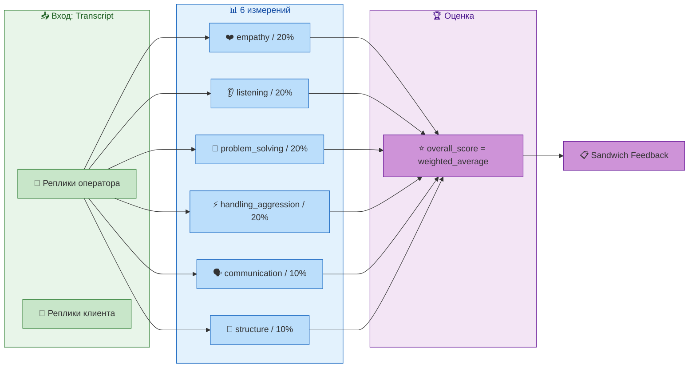
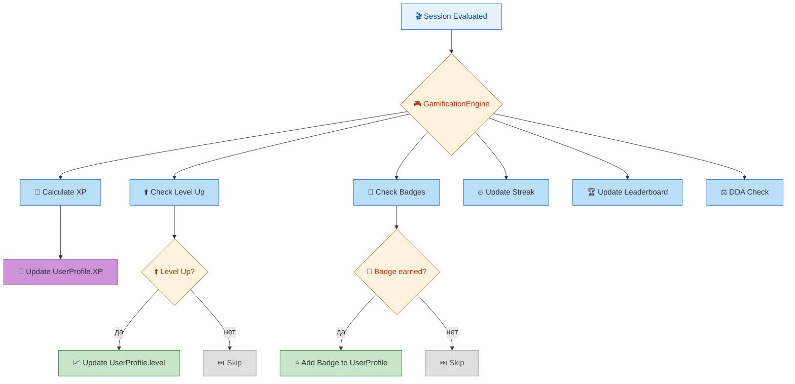
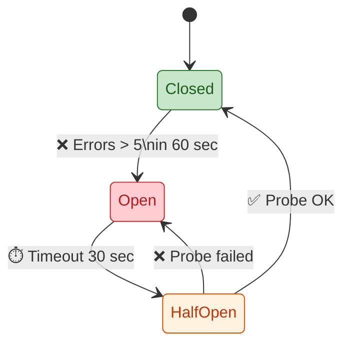
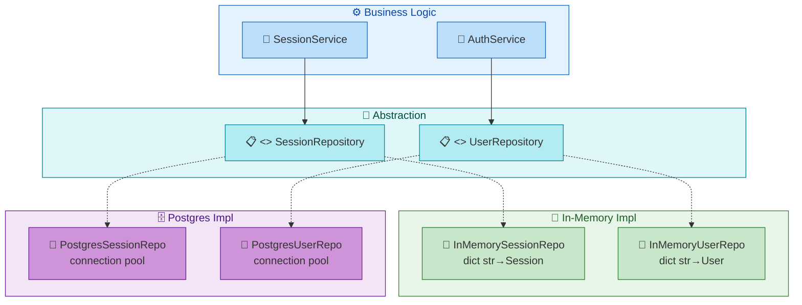
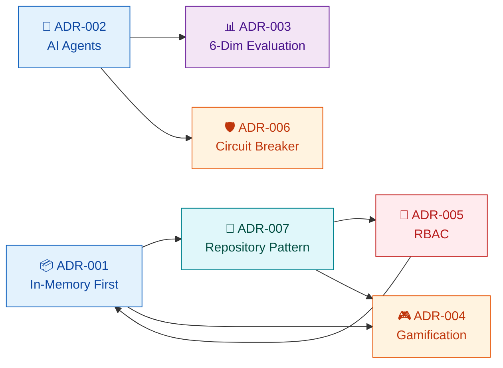

# Архитектурные решения — AI Roleplay Coach Hub

> Сводка всех Architecture Decision Records (ADR). Полный контекст каждого решения — в отдельных ADR в [`adr/`](./adr/).

---

## Содержание

- [Процесс принятия решений](#процесс-принятия-решений)
- [Сводная таблица решений](#сводная-таблица-решений)
- [Архитектурные принципы](#архитектурные-принципы)
- [Подробный обзор ADR](#подробный-обзор-adr)
- [Отменённые альтернативы](#отменённые-альтернативы)
- [Хронология решений](#хронология-решений)
- [Будущие решения](#будущие-решения)
- [Ссылки](#ссылки)

---

## Процесс принятия решений

Архитектурные решения в проекте принимаются по следующему процессу. Этот процесс гарантирует, что каждое решение обосновано, задокументировано и может быть пересмотрено в будущем. Процесс вдохновлён классическим ADR-подходом, описанным в статье Michael Nygard "Documenting Architecture Decisions".



**Правила процесса:**

1. **Любой может предложить ADR** — разработчик, архитектор, DevOps
2. **Исследование** — минимум 2 альтернативы, каждая с оценкой pro/contra
3. **Запись** — ADR фиксируется в `[adr/ADR-NNN-name.md](./adr/ADR-NNN-name.md)` по шаблону
4. **Review** — решение обсуждается командой (в асинхронном режиме)
5. **Утверждение** — консенсус команды, после чего ADR считается Accepted
6. **Immutable** — принятые ADR не редактируются. Если решение меняется — создаётся новый ADR, который ссылается на старый как Superseded

---

## Сводная таблица решений

| ID | Название | Решение | Ключевой эффект | Теги |
|----|----------|---------|-----------------|------|
| [ADR-001](./adr/ADR-001-in-memory-first-architecture.md) | In-Memory-First Архитектура | По умолчанию in-memory, опционально PostgreSQL | Zero-config разработка | `infrastructure`, `data` |
| [ADR-002](./adr/ADR-002-ai-agent-architecture.md) | AI Agent Архитектура | Rule-based по умолчанию, LLM через Provider Factory | Не требует LLM | `ai`, `architecture` |
| [ADR-003](./adr/ADR-003-6-dimension-coach-evaluation.md) | 6-мерная оценка Coach | 6 взвешенных измерений + sandwich feedback | Объяснимая оценка | `ai`, `evaluation` |
| [ADR-004](./adr/ADR-004-gamification-engine-design.md) | Gamification Engine | Единый класс GamificationEngine | Один тестируемый компонент | `gamification` |
| [ADR-005](./adr/ADR-005-rbac-3-roles.md) | RBAC с 3 ролями | Иерархия operator / trainer / admin | Простая модель аудита | `security`, `auth` |
| [ADR-006](./adr/ADR-006-circuit-breaker-llm.md) | Circuit Breaker для LLM | Circuit Breaker на каждый LLM провайдер | Устойчивость к сбоям | `infrastructure`, `resilience` |
| [ADR-007](./adr/ADR-007-repository-pattern-data-access.md) | Repository Pattern | Interface + 2 реализации на entity | Прозрачное переключение режимов | `architecture`, `data` |

---

## Архитектурные принципы

### 1. In-Memory First

**Принцип:** Все функции работают без внешних сервисов. PostgreSQL добавляет персистентность, не меняя поведение.

**Обоснование:** Проект предназначен для обучения и демонстрации. Новый пользователь (оператор, тренер, администратор) должен получить рабочий продукт за минимальное время. Установка Docker, PostgreSQL, Redis и Qdrant требует 30-60 минут даже у опытного разработчика. In-Memory режим сокращает этот процесс до 1 минуты.

**Влияние на архитектуру:** Весь слой данных абстрагирован через репозитории. Бизнес-логика не знает, в каком режиме она работает. Это означает, что:
- Код сервисов идентичен для обоих режимов
- Тесты можно писать без Docker
- Новые разработчики начинают без инфраструктурных проблем

**Как это выглядит в коде:**
```python
# src/infrastructure/repository_factory.py
def create_repository(entity: str, mode: str) -> BaseRepository:
    if mode == "memory":
        return InMemoryRepository()
    elif mode == "postgres":
        return PostgresRepository()
```

- Разработчик запускает `python main.py` и получает полностью рабочее приложение
- Никакого Docker, PostgreSQL, Redis не требуется для старта
- В production достаточно сменить `DB_MODE=postgres` — и все данные сохраняются в PostgreSQL
- 460+ тестов работают в memory mode — быстрее и надёжнее

**Когда стоит перейти на PostgreSQL:**
- При работе нескольких разработчиков над одной БД
- При необходимости аналитических запросов (JOIN, GROUP BY)
- При объёме данных > 100 MB

### 2. Rule-Based by Default

**Принцип:** AI-агенты дают детерминированные, объяснимые результаты без LLM. LLM — улучшение, а не требование.

**Обоснование:** LLM API (OpenAI, GigaChat) — это внешняя зависимость с потенциальными проблемами: недоступность, задержки, стоимость, изменение модели. Для учебного продукта такие риски неприемлемы. Rule-based подход гарантирует, что приложение работает всегда одинаково — в классе, в демо-режиме, в CI, в production.

**Влияние на архитектуру:** Provider Factory позволяет каждому агенту работать с любым провайдером. Добавление нового провайдера — это один класс и одна строка в фабрике. Rule-based логика и LLM-логика сосуществуют: один и тот же агент может работать в обоих режимах, переключаясь через конфиг.

**Архитектура провайдеров:**



- **MockProvider:** Всегда возвращает предсказуемый ответ. Используется в тестах и CI.
- **OllamaProvider:** Локальный LLM через Ollama. Требуется GPU для 7B+ моделей.
- **OpenAIProvider:** Облачный LLM через OpenAI API.
- **GigaChatProvider:** Облачный LLM через Сбер GigaChat. Для российских пользователей.

### 3. Single Responsibility per Agent

**Принцип:** У каждого агента одна задача. Ни один агент не делает две разные вещи.

**Обоснование:** Когда CoachAgent и оценивает, и генерирует учебные планы, и анализирует тренды — код становится сложным в тестировании и поддержке. Разделение на 6 агентов (Simulator, Coach, Gamification, Analyst, Fairness, Curator) позволяет:
- Тестировать каждый компонент изолированно
- Менять один агент без влияния на другие
- Переиспользовать агентов в разных сценариях
- Асинхронно разрабатывать разных агентов разными разработчиками

| Агент | Файл | Ответственность |
|-------|------|-----------------|
| **SimulatorAgent** | `[src/agents/simulator_agent.py](src/agents/simulator_agent.py)` | Генерирует реплики клиента в диалоге |
| **CoachAgent** | `[src/agents/coach_agent.py](src/agents/coach_agent.py)` | Оценивает ответы оператора по 6 измерениям |
| **GamificationEngine** | `[src/services/gamification/engine.py](src/services/gamification/engine.py)` | XP, бейджи, streak, leaderboard |
| **AnalystService** | `[src/services/analyst/service.py](src/services/analyst/service.py)` | Статистика сессий, тренды |
| **FairnessService** | `[src/services/analyst/fairness.py](src/services/analyst/fairness.py)` | Аудит справедливости оценок |
| **CuratorAgent** | `[src/agents/curator_agent.py](src/agents/curator_agent.py)` | Учебные планы на основе слабых мест |

### 4. Testability (Тестируемость)

**Принцип:** Repository Pattern + Dependency Injection делают каждый компонент изолированно тестируемым. Ни один тест не требует внешних сервисов.

**Обоснование:** Тесты, которые зависят от внешних сервисов (БД, Redis, LLM), — хрупкие, медленные и невоспроизводимые. In-Memory репозитории решают эту проблему: они реализуют тот же интерфейс, что и PostgreSQL-репозитории, но работают в памяти. Это позволяет:
- Запускать 460+ тестов за секунды
- Получать детерминированные результаты
- Не настраивать Docker для CI/CD
- Легко воспроизводить баги, подменяя репозиторий

```python
# В тесте: подменяем репозиторий на in-memory
repo = InMemorySessionRepository()
service = SessionService(repository=repo)

# В production: тот же код, но с PostgreSQL
repo = PostgresSessionRepository(pool)
service = SessionService(repository=repo)
```

- **460+ тестов** покрывают все ключевые сценарии
- **84% coverage** (цель: 85%)
- **Тесты не требуют внешних сервисов** — всё работает в памяти

### 5. Fail Gracefully (Отказоустойчивость)

**Принцип:** Приложение никогда не падает из-за сбоев внешних зависимостей. Каждая внешняя интеграция имеет fallback.

**Обоснование:** Внешние сервисы (LLM API, PostgreSQL) могут быть недоступны по разным причинам: сетевые проблемы, превышение лимитов, плановое обслуживание. Приложение для обучения не должно становиться бесполезным при недоступности хотя бы одного сервиса. Каждый сбой должен быть локализован и не влиять на остальные функции.

**Стратегия отказоустойчивости:**

| Уровень | Механизм | Пример |
|---------|----------|--------|
| **LLM провайдеры** | Circuit Breaker + Fallback chain | OpenAI → GigaChat → Mock |
| **База данных** | In-Memory fallback | Если PostgreSQL недоступен — read-only режим с последними кэшированными данными |
| **Rate Limiting** | Token Bucket + HTTP 429 | При превышении лимита — возвращаем Retry-After header |
| **Health Checks** | Graceful degradation | /health возвращает статус каждого компонента отдельно |
| **Startup** | Dependency wait | Docker healthcheck ждёт готовности всех сервисов |

| Механизм | Что защищает | Поведение при сбое |
|----------|-------------|-------------------|
| Circuit Breaker | LLM провайдеры | Переключение на fallback провайдера |
| Mock LLM Provider | Внешний LLM | Детерминированный ответ без сети |
| In-Memory Mode | PostgreSQL | Работа без БД (без сохранения) |
| Rate Limiting | API от DDoS | HTTP 429 вместо crash |

---

## Подробный обзор ADR

### ADR-001: In-Memory-First Архитектура

**Статус:** Accepted ✅  
**Дата:** 2026-07-12

#### Контекст

Проект разрабатывается небольшой командой. Новые разработчики должны иметь возможность клонировать репозиторий и запустить приложение за 5 минут, без установки PostgreSQL, Redis, Qdrant и других внешних сервисов. При этом архитектура обязана поддерживать полноценную PostgreSQL-персистентность для production-развёртывания.

**Ключевые требования:**
- Zero-config dev — одна команда для запуска
- Никаких внешних зависимостей для разработки
- Полная функциональность без PostgreSQL
- Production-класса персистентность при необходимости

#### Решение

Принять **in-memory-first архитектуру**:

1. **`DB_MODE=memory`** (по умолчанию) — все данные в Python dicts
2. **`DB_MODE=postgres`** — полноценная PostgreSQL персистентность
3. **Repository Pattern** абстрагирует доступ к данным
4. **Seed data** (3 пользователя, 3 сценария) загружаются при старте



#### Ссылки на код

- [src/core/config.py](../src/core/config.py) — `DB_MODE` переменная
- [src/infrastructure/repository.py](../src/infrastructure/repository.py) — реализации
- [src/infrastructure/repository_factory.py](../src/infrastructure/repository_factory.py) — фабрика

---

### ADR-002: AI Agent Архитектура

**Статус:** Accepted ✅  
**Дата:** 2026-07-12

#### Контекст

Приложению нужны AI-агенты (Simulator, Coach, Curator, Analyst, Gamification), которые работают надёжно без внешних LLM-зависимостей. Разные пользователи могут использовать разные LLM-бэкенды.

**Ключевые требования:**
- Приложение работает без LLM
- Поддержка нескольких LLM провайдеров
- Лёгкое добавление новых провайдеров
- Каждый агент тестируется изолированно

#### Решение

Принять **модульную архитектуру агентов**:

1. Каждый агент — независимый класс с единой ответственностью
2. Агенты используют **rule-based логику** по умолчанию
3. LLM-варианты используют **Provider Factory**
4. Планируется: LangGraph для stateful orchestration



#### Ссылки на код

- [src/core/config.py](../src/core/config.py) — `LLM_PROVIDER`
- [src/infrastructure/llm/provider_factory.py](../src/infrastructure/llm/provider_factory.py) — фабрика
- [src/agents/coach_agent.py](../src/agents/coach_agent.py) — example agent
- [src/agents/simulator_agent.py](../src/agents/simulator_agent.py) — simulator

---

### ADR-003: 6-мерная оценка Coach

**Статус:** Accepted ✅  
**Дата:** 2026-07-12

#### Контекст

Coach Agent должен оценивать навыки общения оператора. Оценка обязана быть многомерной, объяснимой и полезной для обучения. Оператор должен понимать, что именно он сделал хорошо, а что нужно улучшить.

**Ключевые требования:**
- Многомерная оценка (не один счёт)
- Объяснимость — оператор видит критерии
- Детерминированность — одинаковый диалог → одинаковый результат
- Sandwich feedback — конструктивная обратная связь

#### Решение



**Формула оценки:**
```
overall_score = sum(dimension_score * weight) / sum(weight)
```

**Категоризация:**
| Уровень | Score | Действие |
|---------|-------|----------|
| Strength (сильная сторона) | >= 70 | Отмечается в feedback |
| Adequate (достаточно) | 50-69 | "Можно улучшить" |
| Weakness (слабая сторона) | < 50 | Цель учебного плана |

#### Ссылки на код

- [src/agents/coach_agent.py](../src/agents/coach_agent.py) — `evaluate_transcript()`
- [src/core/entities/evaluation.py](../src/core/entities/evaluation.py) — `EvaluationResult`
- [tests/unit/test_coach_agent.py](../tests/unit/test_coach_agent.py) — тесты

---

### ADR-004: Gamification Engine

**Статус:** Accepted ✅  
**Дата:** 2026-07-12

#### Контекст

Для повышения мотивации операторов нужна геймификация: XP, уровни, бейджи, streak, leaderboard. Все механики централизованы в одном компоненте.

**Ключевые требования:**
- XP за каждую оценённую сессию
- Уровни с накоплением XP
- Бейджи за достижения
- Streak — серия успешных оценок
- Leaderboard — сравнение операторов
- DDA — адаптация сложности

#### Решение



**XP формула:**
```python
def calculate_xp(score: float, difficulty: str, streak: bool) -> int:
    base = int(score * 10)
    mult = {"easy": 1.0, "medium": 1.5, "hard": 2.0}.get(difficulty, 1.0)
    bonus = 1.5 if streak else 1.0
    return int(base * mult * bonus)
```

**Level thresholds:** `{1:0, 2:100, 3:300, 4:600, 5:1000, 6:1500, 7:2100, 8:2800, 9:3600, 10:4500}`

#### Ссылки на код

- [src/services/gamification/engine.py](../src/services/gamification/engine.py)
- [src/services/gamification/models.py](../src/services/gamification/models.py)
- [src/services/gamification/dda.py](../src/services/gamification/dda.py)

---

### ADR-005: RBAC с 3 ролями

**Статус:** Accepted ✅  
**Дата:** 2026-07-12

#### Контекст

Приложением пользуются операторы, тренеры и администраторы. Нужна простая система разграничения доступа.

**Решение:** Иерархия `admin > trainer > operator`

**Права:**
| Роль | Симуляции | Сценарии | Группы | Пользователи | Система |
|------|-----------|----------|--------|-------------|---------|
| operator | прохождение | — | — | — | — |
| trainer | всё | создание | управление | — | — |
| admin | всё | всё | всё | всё | всё |

**JWT payload (без хардкода):**
```json
{
  "sub": "user_id",
  "role": "trainer",
  "exp": 1700000000
}
```

#### Ссылки на код

- [src/api/auth.py](../src/api/auth.py) — эндпоинты
- [src/core/entities/user.py](../src/core/entities/user.py) — `UserRole`
- [src/infrastructure/auth/jwt_service.py](../src/infrastructure/auth/jwt_service.py)
- [src/infrastructure/auth/middleware.py](../src/infrastructure/auth/middleware.py)

---

### ADR-006: Circuit Breaker для LLM

**Статус:** Accepted ✅  
**Дата:** 2026-07-12

#### Контекст

Внешние LLM провайдеры могут быть недоступны. Приложение не должно падать.

**Решение:** Circuit Breaker на каждый провайдер с fallback.



**Конфигурация:**
```python
CIRCUIT_BREAKER_CONFIG = {
    "failure_threshold": 5,
    "recovery_timeout": 30,
    "failure_window": 60,
}
```

**Fallback:** `OpenAI → GigaChat → Mock` (всегда работает)

#### Ссылки на код

- [src/infrastructure/llm/circuit_breaker.py](../src/infrastructure/llm/circuit_breaker.py)
- [src/infrastructure/llm/provider_factory.py](../src/infrastructure/llm/provider_factory.py)
- [src/core/config.py](../src/core/config.py) — настройки

---

### ADR-007: Repository Pattern

**Статус:** Accepted ✅  
**Дата:** 2026-07-12

#### Контекст

Два режима хранения (in-memory, PostgreSQL). Код не должен знать о режиме.

**Решение:** Interface + 2 реализации на entity.



**Generic interface:**
```python
class BaseRepository[T](ABC):
    async def create(self, entity: T) -> T: ...
    async def get(self, id: str) -> T | None: ...
    async def update(self, entity: T) -> T: ...
    async def delete(self, id: str) -> bool: ...
    async def list(self, **filters) -> list[T]: ...
```

#### Ссылки на код

- [src/infrastructure/repository.py](../src/infrastructure/repository.py)
- [src/infrastructure/repository_factory.py](../src/infrastructure/repository_factory.py)
- [src/infrastructure/postgres/repositories.py](../src/infrastructure/postgres/repositories.py)

---

## Отменённые альтернативы

В процессе разработки были рассмотрены и отвергнуты следующие альтернативы. Каждое решение принималось на основе конкретных требований проекта и с учётом долгосрочной поддержки.

### Постоянное хранилище данных

| Альтернатива | Почему отвергнута | В пользу чего |
|-------------|-------------------|---------------|
| **PostgreSQL-only** | Каждый разработчик должен устанавливать и настраивать PostgreSQL. Это создаёт высокий порог входа для новых участников и усложняет CI-пайплайн. | In-Memory First (ADR-001) |
| **SQLite** | SQLite использует другой SQL-диалект, не поддерживает расширения PostgreSQL (pg_stat_statements, jsonb operators) и ведёт к расхождениям между dev и production окружениями. | In-Memory + PostgreSQL |
| **MongoDB** | Документо-ориентированная БД избыточна для текущей модели данных (Session, User, Scenario — плоские структуры). Отсутствие ACID-транзакций на одном узле (до версии 4.0) делало консистентность данных сложнее. | PostgreSQL + In-Memory |

### AI / LLM архитектура

| Альтернатива | Почему отвергнута | В пользу чего |
|-------------|-------------------|---------------|
| **LLM-only** | Если приложение работает только с LLM, то при недоступности API или отсутствии GPU приложение становится бесполезным. Для учебных целей и демонстраций это неприемлемо. | Rule-Based (ADR-002) |
| **Microservice per agent** | Каждый агент как микросервис — слишком тяжёлая архитектура для текущего масштаба (< 1000 RPS). Увеличивает operational overhead (Docker, network, monitoring) без значимой выгоды. | Modular agents (ADR-002) |
| **Одна нейросеть на всё** | Огромная модель, которая и симулирует, и оценивает, и анализирует — сложна в тестировании и доработке. Изменение в одном навыке может сломать другой. | Single Responsibility per Agent |

### Оценка и геймификация

| Альтернатива | Почему отвергнута | В пользу чего |
|-------------|-------------------|---------------|
| **Одно число** | Оценка "35/100" бесполезна для обучения. Оператор не знает, что именно он сделал не так. | 6-dimension scoring (ADR-003) |
| **Pass/Fail** | Бинарная оценка слишком груба. Оператор, получивший "Fail", не понимает, на сколько процентов он не дотянул и что улучшать. | 6-dimension scoring (ADR-003) |
| **Только LLM feedback** | LLM даёт красивый текст, но непредсказуемый результат. Одна и та же сессия может получить разный фидбек от разных провайдеров. | Rule-based scoring + LLM enrichment |

### Инфраструктура

| Альтернатива | Почему отвергнута | В пользу чего |
|-------------|-------------------|---------------|
| **Kubernetes с самого начала** | K8s добавляет огромную сложность (ingress, service mesh, RBAC, helm), которая не оправдана для проекта с 4 сервисами. Docker Compose даёт 80% возможностей при 5% сложности. | Docker Compose (Plan: K8s в будущем) |
| **RabbitMQ / Kafka** | В приложении нет асинхронных задач, требующих очереди сообщений. Все операции — синхронные HTTP запросы. Брокер сообщений был бы overengineering. | Прямые HTTP вызовы |
| **AsyncAPI / WebSocket** | API преимущественно RESTful. WebSocket используется только для одного сценария (live session). Отдельный AsyncAPI-спецификация не оправдана. | FastAPI WebSocket routes |

### Фронтенд

| Альтернатива | Почему отвергнута | В пользу чего |
|-------------|-------------------|---------------|
| **Next.js / SSR** | Приложение — SPA с дашбордами, не требует SSR для SEO. Next.js добавил бы сложности с серверным рендерингом без выгоды. | React SPA (Vite) |
| **Redux** | Redux требует много boilerplate (actions, reducers, sagas). Для проекта среднего размера Zustand с FSD даёт ту же предсказуемость при меньшем коде. | Zustand (FSD) |
| **CSS Modules / Tailwind** | CSS Modules использовались на старте, но FSD рекомендует CSS-переменные и глобальные стили для единообразия. Tailwind — опция для будущих фич. | CSS Variables + CSS Modules |

---

## Хронология решений

| Дата | ADR | Решение |
|------|-----|---------|
| 2026-07-12 | ADR-001 | In-Memory-First Architecture |
| 2026-07-12 | ADR-002 | AI Agent Architecture |
| 2026-07-12 | ADR-003 | 6-Dimension Coach Evaluation |
| 2026-07-12 | ADR-004 | Gamification Engine Design |
| 2026-07-12 | ADR-005 | RBAC with 3 Roles |
| 2026-07-12 | ADR-006 | Circuit Breaker for LLM Providers |
| 2026-07-12 | ADR-007 | Repository Pattern for Data Access |

---

## Матрица ADR → Код → Документы

Ниже — таблица, показывающая, какие файлы и документы реализуют каждое архитектурное решение. Это помогает быстро найти, где искать реализацию конкретного решения.

| ADR | Ключевые файлы в `src/` | Документация |
|-----|------------------------|--------------|
| ADR-001 | `infrastructure/repository.py`, `infrastructure/repository_factory.py`, `core/config.py` | [SPECIFICATION.md](./SPECIFICATION.md#data-storage), [API.md](./API.md#session) |
| ADR-002 | `agents/` (coach_agent, simulator_agent, curator_agent), `infrastructure/llm/provider_factory.py` | [SPECIFICATION.md](./SPECIFICATION.md#ai-agents), [DATA_FLOWS.md](./DATA_FLOWS.md#uc-1) |
| ADR-003 | `agents/coach_agent.py`, `core/entities/evaluation.py` | [SPECIFICATION.md](./SPECIFICATION.md#evaluation), [USER_GUIDE.md](./USER_GUIDE.md#coach) |
| ADR-004 | `services/gamification/engine.py`, `services/gamification/dda.py` | [SPECIFICATION.md](./SPECIFICATION.md#gamification), [USER_GUIDE.md](./USER_GUIDE.md#xp) |
| ADR-005 | `api/auth.py`, `core/entities/user.py`, `infrastructure/auth/` | [SPECIFICATION.md](./SPECIFICATION.md#auth), [API.md](./API.md#auth) |
| ADR-006 | `infrastructure/llm/circuit_breaker.py`, `infrastructure/llm/provider_factory.py` | [ADMIN_GUIDE.md](./ADMIN_GUIDE.md#llm), [DEPLOYMENT_PLAN.md](./DEPLOYMENT_PLAN.md#security) |
| ADR-007 | `infrastructure/repository.py`, `infrastructure/postgres/repositories.py` | [SPECIFICATION.md](./SPECIFICATION.md#data-layer) |

---

## Как ADR влияют друг на друга

Некоторые решения взаимосвязаны. Понимание этих связей важно при изменении архитектуры:



**Ключевые зависимости:**

1. **ADR-001 (In-Memory First) → ADR-007 (Repository Pattern):** Repository Pattern — это механизм, который делает In-Memory First возможным. Без абстракции данных пришлось бы писать два разных набора кода для memory и postgres режимов.

2. **ADR-002 (AI Agents) → ADR-003 (6-Dim Evaluation):** Coach Agent использует 6-мерную систему оценки. Если бы архитектура агентов была другой (например, monolithic LLM agent), система оценки могла бы быть другой.

3. **ADR-002 (AI Agents) → ADR-006 (Circuit Breaker):** Circuit Breaker защищает LLM провайдеров, которых используют AI-агенты. Отказоустойчивость имеет смысл именно потому, что есть внешние LLM-зависимости.

4. **ADR-001 (In-Memory First) → ADR-004 (Gamification):** Gamification Engine хранит XP, бейджи и streak в репозиториях. In-Memory режим означает, что геймификация работает даже без БД.

---

## Будущие решения

| Решение | Статус | Описание |
|---------|--------|----------|
| **LangGraph Migration** | 📋 Plan | Миграция rule-based агентов на LangGraph |
| **Voice Pipeline** | 📋 Plan | LiveKit + ASR + TTS для голосовых симуляций |
| **Multi-tenant** | 📋 Plan | Изоляция данных между организациями |
| **Kubernetes** | 📋 Plan | Переход с Docker Compose на K8s |
| **Event Sourcing** | 💡 Idea | Хранение событий для audit trail |
| **WebSocket Gateway** | 💡 Idea | Выделенный сервис для WS соединений |

Подробнее: [docs/ARCHITECTURE_ROADMAP.md](../docs/ARCHITECTURE_ROADMAP.md)

---

## Ссылки

- [adr/README.md](./adr/README.md) — индекс ADR и шаблон
- [ADR-001](./adr/ADR-001-in-memory-first-architecture.md) — ADR-001
- [ADR-002](./adr/ADR-002-ai-agent-architecture.md) — ADR-002
- [ADR-003](./adr/ADR-003-6-dimension-coach-evaluation.md) — ADR-003
- [ADR-004](./adr/ADR-004-gamification-engine-design.md) — ADR-004
- [ADR-005](./adr/ADR-005-rbac-3-roles.md) — ADR-005
- [ADR-006](./adr/ADR-006-circuit-breaker-llm.md) — ADR-006
- [ADR-007](./adr/ADR-007-repository-pattern-data-access.md) — ADR-007
- [SPECIFICATION.md](./SPECIFICATION.md) — спецификация
- [IMPLEMENTATION_PLAN.md](./IMPLEMENTATION_PLAN.md) — план реализации
- [docs/ARCHITECTURE_ROADMAP.md](../docs/ARCHITECTURE_ROADMAP.md) — roadmap
- [src/](../src/) — исходный код