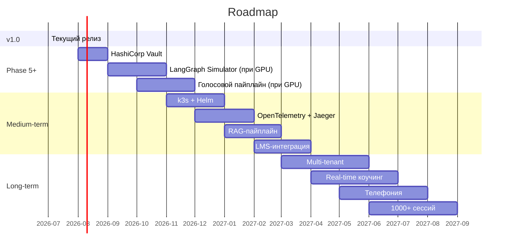

# Архитектурная дорожная карта (Architecture Roadmap)

> **Дата:** 2026-07-12  
> **Релиз:** v1.0.0 (текущий)  
> **Видение:** Полноценная мультиагентная система с LangGraph, голосовым пайплайном и production-grade инфраструктурой

---

## V1.0 — Текущий релиз ✅

**Что реализовано:**
- Rule-based агенты (Simulator, Coach, Curator, Gamification, Analyst)
- Fairness-аудит с 4 метриками
- JWT + RBAC (Operator / Trainer / Admin)
- Rate limiting, CORS, Security headers, RFC 7807 Problem Details
- Observability: structlog, Prometheus, Request ID
- In-memory режим + опциональные PostgreSQL/Qdrant/Redis
- Покрытие тестами: core ≥90%, agents ≥80%
- Dockerfile.prod с multi-stage сборкой
- 462 теста, ruff clean, mypy clean

---

## Phase 5+ — Ближайшие улучшения

### 1. LangGraph-миграция агентов

**Статус:** ⏸️ Заблокировано (нет GPU / архитектурного решения)  
**Приоритет:** Высокий (после появления GPU)

Что даст:
- Детерминированные графы состояний с чекпоинтами
- Human-in-the-loop (прерывание для ручной проверки)
- Встроенная наблюдаемость каждого шага
- Возможность отката к предыдущему состоянию

План:
1. Миграция SimulatorAgent → LangGraph (первый, как самый сложный)
2. CoachAgent → LangGraph (анализ с ветвлением по ошибкам)
3. CuratorAgent → LangGraph (адаптивное обучение)
4. GamificationEngine → LangGraph (игровые механики как граф)

### 2. Полноценный голосовой пайплайн

**Статус:** ⏸️ Заблокировано (нет GPU)  
**Приоритет:** Высокий

Компоненты:
- **LiveKit Agents 1.5+** — WebRTC, adaptive barge-in < 300 мс
- **Whisper-Large-V3 (fine-tuned)** — ASR с WER < 8%
- **Silero TTS v5** — эмоциональная модуляция речи

Текущее состояние: заглушки (echo, stub ASR, stub TTS).

### 3. vLLM production-интеграция

**Статус:** ⏸️ Заблокировано (нет GPU)  
**Приоритет:** Средний

- Разворот vLLM как отдельного сервиса (OpenAI-совместимый API)
- PagedAttention для эффективного инференса
- Semantic caching (SemShareKV) для снижения стоимости
- Замена Ollama на vLLM в production

### 4. HashiCorp Vault

**Статус:** ⏸️ Отложено  
**Приоритет:** Средний

- Хранение всех секретов (JWT ключи, пароли БД, API ключи)
- Автоматическая ротация секретов
- Динамические секреты для БД

Текущее решение: `.env` + `core/config.py` с валидацией (достаточно для MVP).

---

## Среднесрочные планы (6–12 месяцев)

### 5. k3s / Helm

- Развёртывание on-premise на k3s
- Helm-чарты для всех компонентов
- Auto-scaling, self-healing, rolling updates
- Ingress с TLS (Let's Encrypt)

### 6. OpenTelemetry + Jaeger

- Распределённый трейсинг между агентами
- Полная карта запросов
- Интеграция с существующим Prometheus + structlog

### 7. RAG-пайплайн

- Автоматическое обновление эмбеддингов при изменении Wiki/скриптов
- Airflow/Prefect для оркестрации обновлений
- Инкрементальная индексация (без перестроения всей коллекции)

### 8. LMS-интеграция

- iSpring Learn REST API
- Moodle Web Services
- Битрикс24 Учебный центр
- Двусторонняя синхронизация прогресса

---

## Долгосрочное видение (12+ месяцев)

### 9. Multi-tenant архитектура

- Изоляция данных между клиентами (tenant_id)
- Бесшовное переключение между скриптами разных компаний
- Кастомные модели оценки под каждого клиента

### 10. Real-time коучинг

- Анализ реальных звонков в реальном времени
- Подсказки оператору во время разговора
- Sentiment-анализ и детекция эскалации

### 11. Интеграция с телефонией

- FreeSWITCH / Asterisk
- Прослушивание реальных звонков в режиме «Тень»
- Автоматическая оценка после звонка

### 12. 1000+ параллельных сессий

- Горизонтальное масштабирование агентов
- Очереди (RabbitMQ/Kafka) для асинхронного взаимодействия
- Read replicas для PostgreSQL

---

## График

