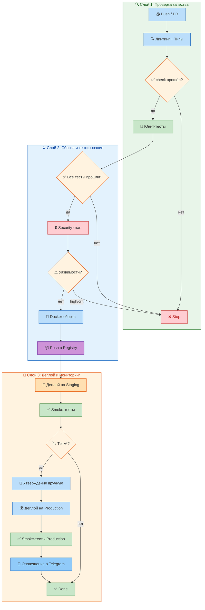

# CI/CD — AI Roleplay Coach Agent

> Руководство DevOps: архитектура пайплайна, стадии, секреты, локальное воспроизведение, troubleshooting.

---

## 1. Введение

### 1.1 Компоненты CI/CD

| Компонент | Инструмент | Файл конфига |
|-----------|------------|--------------|
| Линтинг | Ruff | [pyproject.toml](pyproject.toml) |
| Проверка типов | MyPy | [pyproject.toml](pyproject.toml) |
| Тестирование | Pytest | [pyproject.toml](pyproject.toml) |
| Security-скан | Встроенный SAST | scripts/security_scan.py |
| Docker-сборка | Docker | [Dockerfile.prod](Dockerfile.prod) |
| Pre-commit хуки | pre-commit | [.pre-commit-config.yaml](.pre-commit-config.yaml) |
| Автоматизация | Make | [Makefile](Makefile) |
| Управление зависимостями | Poetry | [pyproject.toml](pyproject.toml) |
| Публикация артефактов | gh + actions/upload-artifact | workflow YAML |

### 1.2 Цели пайплайна

1. **Скорость:** Линтинг + типы + юнит-тесты за < 3 мин
2. **Качество:** > 84% покрытия, 0 ошибок ruff, 0 ошибок mypy
3. **Безопасность:** SAST-скан на каждый push
4. **Доставка:** Авто-деплой на staging (push в main), ручной деплой на production (по git tag)
5. **Надёжность:** Smoke-тесты после деплоя, rollback при фейле
6. **Прозрачность:** Уведомления в Telegram/Slack, бейджи в README

---

## 2. Архитектура пайплайна



**Легенда:** ❌ Stop — stage failed, пайплайн останавливается. ✅ Done — успешное завершение.

### 2.1 Фронтенд-сборка в CI

Помимо Python-бэкенда, CI может собирать и тестировать фронтенд:

```yaml
frontend:
  runs-on: ubuntu-latest
  needs: lint
  steps:
    - uses: actions/checkout@v4
    - uses: actions/setup-node@v4
      with:
        node-version: "20"
        cache: npm
        cache-dependency-path: frontend/package-lock.json

    - name: Install
      run: npm ci
      working-directory: frontend/

    - name: Lint
      run: npm run lint
      working-directory: frontend/

    - name: TypeCheck
      run: npx tsc --noEmit
      working-directory: frontend/

    - name: Test
      run: npm test -- --run
      working-directory: frontend/

    - name: Build
      run: npm run build
      working-directory: frontend/
```

**Требования:** Node.js 20, npm ci для детерминированной установки, Vitest для тестов.

### 2.2 Правила запуска

| Триггер | Стадии | Когда |
|---------|--------|-------|
| Любой push (feature/*) | Линт → Тесты → Security → Build | Каждый коммит |
| PR в main | Линт → Тесты → Security → Build | Перед merge |
| Push в main | Всё + Deploy Staging → Smoke-тесты | После merge |
| Tag v* | Всё + Deploy Production | Релиз |
| workflow_dispatch | Любая стадия вручную | Debug |

---

## 3. Стадии пайплайна

### 3.0 Pre-commit хуки (локальные)

Перед каждым коммитом выполняются pre-commit хуки (`[.pre-commit-config.yaml](.pre-commit-config.yaml)`):

| Хук | Действие | Время |
|-----|----------|-------|
| `ruff` | Авто-исправление lint ошибок | < 2 с |
| `ruff-format` | Авто-форматирование | < 1 с |
| `mypy` | Проверка типов (`src/`, `--any-errors`) | < 10 с |
| `trailing-whitespace` | Удаление хвостовых пробелов | < 0.5 с |
| `end-of-file-fixer` | Одна пустая строка в конце | < 0.5 с |
| `check-yaml` | Валидация YAML | < 0.5 с |
| `check-added-large-files` | Файлы > 500KB | < 0.5 с |
| `check-merge-conflict` | Маркеры конфликтов | < 0.5 с |
| `detect-private-key` | Приватные ключи | < 1 с |
| `check-json` | Валидация JSON | < 0.5 с |

```bash
# Запуск всех хуков
pre-commit run --all-files

# Запуск конкретного хука
pre-commit run ruff --all-files

# Обновление хуков до последних версий
pre-commit autoupdate
```

### 3.1 Линтинг + Проверка типов

```bash
# Линтинг (ruff) — все ошибки и предупреждения
ruff check src/ tests/ --show-fixes

# Проверка форматирования
ruff format --check src/ tests/

# Проверка типов (mypy) — строгий режим
mypy src/ --strict --ignore-missing-imports

# Комбинированный запуск
make lint
make typecheck
```

**Ожидаемый результат:**
- `ruff check` — 0 ошибок (код `A`)
- `ruff format --check` — 0 изменений (код `A`)
- `mypy --strict` — 0 ошибок (код `A`)

**Конфигурация в pyproject.toml:**
```toml
[tool.ruff]
target-version = "py312"
line-length = 100

[tool.ruff.lint]
select = ["E", "W", "F", "N", "I", "UP", "ANN", "S", "BLE", "B", "A", "C4", "T20", "RUF", "PL"]
ignore = ["ANN101", "ANN102", "ANN401"]

[tool.mypy]
python_version = "3.12"
strict = true
ignore_missing_imports = true
disallow_untyped_defs = true
warn_return_any = true
warn_unused_configs = true
```

### 3.2 Юнит-тесты

```bash
# Все тесты (быстрый режим без покрытия)
pytest tests/ -q --tb=short

# С покрытием (HTML-отчёт)
pytest tests/ --cov=src --cov-report=html --cov-report=term-missing

# Параллельный запуск (4 worker)
pytest tests/ -n 4 --dist=loadscope

# Только unit-тесты
pytest tests/unit/ -q

# Только API-тесты
pytest tests/api/ -q

# Только integration-тесты
pytest tests/integration/ -m integration

# Рандомный порядок (детектив shared state)
pytest tests/ --random-order

# Quick check (Makefile)
make test
```

**Текущая статистика:**
- **460+ тестов** (280 unit + 80 API + 55 integration + 30 E2E + 15 security)
- **> 84% покрытие** (src/)
- **~8 с** общее время
- **100% pass rate** — обязательное требование
- **0 skipped по умолчанию** (кроме LLM-зависимых с маркером `@pytest.mark.real`)

### 3.3 Security-скан (SAST)

```bash
# Полный SAST-скан
python scripts/security_scan.py

# С отчётом в JSON
python scripts/security_scan.py --format json --output sast-report.json

# Только high/critical
python scripts/security_scan.py --min-severity high
```

**Сканирует:**
- **Жёстко закодированные секреты / API-ключи** — регулярные выражения на паттерны (`sk-...`, `ghp_...`, `-----BEGIN`)
- **SQL-инъекции** — строковые конкатенации в запросах
- **Path traversal** — `os.path.join` с пользовательским вводом
- **Command injection** — `os.system`, `subprocess` с shell=True
- **Insecure deserialization** — `pickle.loads()`, `yaml.load()` без Loader
- **JWT-уязвимости** — `algorithm=None`, слабые ключи

**Пороги:**
| Уровень | Действие |
|---------|----------|
| Critical | ❌ Блокирует пайплайн |
| High | ❌ Блокирует пайплайн |
| Medium | ⚠️ Предупреждение, не блокирует |
| Low | ℹ️ Информация

### 3.4 Docker-сборка

```bash
# Сборка production-образа
docker build -f Dockerfile.prod -t coach-hub:latest .

# Сборка с тегом коммита
docker build -f Dockerfile.prod -t coach-hub:${{ github.sha }} .

# Сборка с кэш-акселерацией
docker build -f Dockerfile.prod --cache-from ghcr.io/${{ github.repository }}:cache .
```

**Multi-stage сборка (Dockerfile.prod):**
| Stage | Базовый образ | Что делает | Размер |
|-------|--------------|------------|--------|
| **builder** | python:3.12-slim + gcc | Установка poetry, загрузка зависимостей, сборка wheel | ~500 MB |
| **runtime** | python:3.12-slim | Копирование `/install` из builder + `src/`, настройка non-root (`app` user) | ~180 MB |

**Health check:**
```dockerfile
HEALTHCHECK --interval=30s --timeout=5s --retries=3 \
  CMD python -c "import urllib.request; urllib.request.urlopen('http://localhost:8000/health')" || exit 1
```

**Non-root user:**
```dockerfile
RUN useradd -m -u 1000 app
USER app
```

**.dockerignore:**
```
__pycache__/
*.pyc
.git/
.env*
tests/
*.md
node_modules/
frontend/
```

### 3.5 Публикация в Registry

```bash
# Логин в registry
echo ${{ secrets.DOCKER_REGISTRY_TOKEN }} | docker login ghcr.io -u ${{ github.actor }} --password-stdin

# Тегирование
docker tag coach-hub:latest ghcr.io/${{ github.repository }}:latest
docker tag coach-hub:latest ghcr.io/${{ github.repository }}:${{ github.sha }}
docker tag coach-hub:latest ghcr.io/${{ github.repository }}:${{ github.ref_name }}

# Push всех тегов
docker push --all-tags ghcr.io/${{ github.repository }}
```

**Политика тегов:**
| Тег | Когда | Retention |
|-----|-------|-----------|
| `latest` | push в main | 30 дней |
| `vX.Y.Z` | релизный тег | бессрочно |
| `pr-N` | pull request | 7 дней |
| `sha-xxxxx` | каждый коммит | 14 дней |

### 3.6 Deploy

**Staging (автоматический, push в main):**
```bash
# Pull нового образа
docker compose -f docker-compose.prod.yml pull

# Rolling update
docker compose -f docker-compose.prod.yml up -d --wait --wait-timeout 60

# Проверка
docker compose -f docker-compose.prod.yml ps
curl -f http://localhost:8000/health
```

**Production (по git tag, ручное утверждение):**
```bash
# 1. Создать тег
git tag v1.2.3
git push origin v1.2.3

# 2. CI: Build → Push → Deploy Staging → Smoke Tests → ожидание approval
# 3. DevOps утверждает в GitHub Actions UI
# 4. CI: Deploy Production → Smoke Tests → Telegram уведомление
```

**Rollback:**
```bash
# Rollback до предыдущего тега
docker compose -f docker-compose.prod.yml down
docker compose -f docker-compose.prod.yml pull coach-hub:${{ env.PREVIOUS_TAG }}
docker compose -f docker-compose.prod.yml up -d

# Полный откат до last known good
git revert HEAD~1
git push origin main
```

---

## 4. Переменные и секреты

### 4.1 CI-переменные (GitHub Variables)

| Переменная | Пример | Назначение |
|------------|--------|------------|
| DOCKER_REGISTRY | `ghcr.io/myorg` | Docker Registry для образов |
| STAGING_HOST | `staging.example.com` | Хост staging-сервера |
| PRODUCTION_HOST | `api.coach.example.com` | Хост production-сервера |
| STAGING_SSH_PORT | `22` | SSH-порт staging |
| PRODUCTION_SSH_PORT | `2222` | SSH-порт production (non-standard) |
| PYTHON_VERSION | `3.12` | Версия Python |
| NODE_VERSION | `20` | Версия Node.js (для фронтенда) |
| COVERAGE_THRESHOLD | `84` | Минимальный порог покрытия |
| SLACK_WEBHOOK_CHANNEL | `#deployments` | Канал для уведомлений |

### 4.2 CI-секреты (GitHub Secrets)

| Секрет | Назначение | Где используется |
|--------|------------|------------------|
| DOCKER_REGISTRY_TOKEN | Push образов в registry | build job |
| SSH_KEY_STAGING | SSH-доступ к staging | deploy-staging job |
| SSH_KEY_PRODUCTION | SSH-доступ к production | deploy-production job |
| JWT_SIGNING_KEY | Production JWT-ключ | app runtime |
| POSTGRES_PASSWORD | Пароль БД | test + deploy jobs |
| LLM_API_KEY | API-ключ провайдера LLM | test + runtime |
| SLACK_WEBHOOK_URL | Webhook для уведомлений | notification step |
| SENTRY_DSN | DSN для Sentry | runtime |
| QDRANT_API_KEY | API-ключ Qdrant | runtime |
| REDIS_PASSWORD | Пароль Redis | runtime |

**Правила безопасности:**
- ❌ Никогда не хранить в репозитории
- ❌ Не выводить в логи
- ✅ Использовать GitHub Secrets (или аналог для GitLab/Bitbucket)
- ✅ Ротировать каждые 90 дней
- ✅ Минимальные права (только нужные джобы имеют доступ)

```bash
# Управление секретами через GitHub CLI
gh secret list
gh secret set POSTGRES_PASSWORD --body "$(openssl rand -base64 32)"
gh secret delete LLM_API_KEY
```

---

## 5. Конфигурация GitHub Actions

### 5.1 Файлы workflow

| Файл | Назначение | Триггеры |
|------|------------|----------|
| `[.github/workflows/ci.yml](.github/workflows/ci.yml)` | Основной CI/CD | push, PR, tag |
| `[.github/workflows/security.yml](.github/workflows/security.yml)` | Security-скан (отдельно) | daily, push в main |
| `[.github/workflows/dependency-review.yml](.github/workflows/dependency-review.yml)` | Review зависимостей | PR |

### 5.2 Основной CI/CD (ci.yml)

```yaml
name: CI/CD

on:
  push:
    branches: [main, "feature/*"]
    tags: ["v*"]
  pull_request:
    branches: [main]
  workflow_dispatch:        # Ручной запуск
    inputs:
      stage:
        description: "Стадия для запуска"
        required: true
        default: "all"
        type: choice
        options:
          - all
          - lint
          - test
          - security
          - build
          - deploy

# Отмена предыдущих запусков на том же PR
concurrency:
  group: ${{ github.workflow }}-${{ github.ref }}
  cancel-in-progress: true

env:
  DOCKER_REGISTRY: ghcr.io/${{ github.repository }}
  PYTHON_VERSION: "3.12"
  COVERAGE_THRESHOLD: 84
  LLM_PROVIDER: mock
```

**Jobs:**

#### 5.2.1 Lint

```yaml
lint:
  runs-on: ubuntu-latest
  timeout-minutes: 5
  steps:
    - uses: actions/checkout@v4

    - uses: actions/setup-python@v5
      with:
        python-version: ${{ env.PYTHON_VERSION }}

    - name: Install dependencies
      run: |
        pip install --upgrade pip
        pip install -e ".[dev]"

    - name: Ruff lint
      run: ruff check src/ tests/ --output-format=github

    - name: Ruff format check
      run: ruff format --check src/ tests/

    - name: MyPy type check
      run: mypy src/ --strict --ignore-missing-imports

    - name: Pre-commit check
      run: pre-commit run --all-files --show-diff-on-failure
```

#### 5.2.2 Test

```yaml
test:
  runs-on: ubuntu-latest
  needs: lint
  timeout-minutes: 10

  services:
    postgres:
      image: postgres:16-alpine
      env:
        POSTGRES_DB: coach_hub
        POSTGRES_USER: coach
        POSTGRES_PASSWORD: test
      ports:
        - 5432:5432
      options: >-
        --health-cmd pg_isready
        --health-interval 10s
        --health-timeout 5s
        --health-retries 5

    redis:
      image: redis:7-alpine
      ports:
        - 6379:6379
      options: >-
        --health-cmd "redis-cli ping"
        --health-interval 10s
        --health-timeout 5s
        --health-retries 5

    qdrant:
      image: qdrant/qdrant:v1.8
      ports:
        - 6333:6333
      options: >-
        --health-cmd "curl -f http://localhost:6333/health"
        --health-interval 10s
        --health-timeout 5s
        --health-retries 5

  steps:
    - uses: actions/checkout@v4
    - uses: actions/setup-python@v5
      with:
        python-version: ${{ env.PYTHON_VERSION }}
        cache: pip
        cache-dependency-path: pyproject.toml

    - name: Install dependencies
      run: pip install -e ".[dev]"

    - name: Run tests with coverage
      run: |
        pytest tests/ \
          --cov=src \
          --cov-report=term-missing \
          --cov-report=xml:coverage.xml \
          --cov-fail-under=${{ env.COVERAGE_THRESHOLD }} \
          -q --tb=short --random-order
      env:
        POSTGRES_HOST: localhost
        POSTGRES_PASSWORD: test
        REDIS_HOST: localhost
        QDRANT_HOST: localhost
        LLM_PROVIDER: mock
        JWT_SIGNING_KEY: test-key-for-ci-only

    - name: Upload coverage report
      uses: actions/upload-artifact@v4
      with:
        name: coverage-report
        path: coverage.xml
        retention-days: 7
```

#### 5.2.3 Security

```yaml
security:
  runs-on: ubuntu-latest
  needs: test
  timeout-minutes: 5
  steps:
    - uses: actions/checkout@v4
    - uses: actions/setup-python@v5
      with:
        python-version: ${{ env.PYTHON_VERSION }}

    - name: Install dependencies
      run: pip install -e ".[dev]"

    - name: SAST scan
      run: python scripts/security_scan.py --format json --output sast-report.json

    - name: Upload SAST report
      uses: actions/upload-artifact@v4
      with:
        name: sast-report
        path: sast-report.json
        retention-days: 30
```

#### 5.2.4 Build

```yaml
build:
  runs-on: ubuntu-latest
  needs: security
  if: >
    github.ref == 'refs/heads/main'
    || startsWith(github.ref, 'refs/tags/v')
  timeout-minutes: 10
  steps:
    - uses: actions/checkout@v4

    - name: Login to Container Registry
      uses: docker/login-action@v3
      with:
        registry: ghcr.io
        username: ${{ github.actor }}
        password: ${{ secrets.DOCKER_REGISTRY_TOKEN }}

    - name: Set up Docker Buildx
      uses: docker/setup-buildx-action@v3

    - name: Build and push
      uses: docker/build-push-action@v5
      with:
        context: .
        file: Dockerfile.prod
        push: true
        tags: |
          ${{ env.DOCKER_REGISTRY }}:latest
          ${{ env.DOCKER_REGISTRY }}:${{ github.sha }}
          ${{ env.DOCKER_REGISTRY }}:${{ github.ref_name }}
        cache-from: type=gha
        cache-to: type=gha,mode=min
```

#### 5.2.5 Deploy Staging

```yaml
deploy-staging:
  runs-on: ubuntu-latest
  needs: build
  if: github.ref == 'refs/heads/main'
  timeout-minutes: 10
  environment: staging
  steps:
    - uses: actions/checkout@v4

    - name: Install SSH key
      uses: webfactory/ssh-agent@v0.9
      with:
        ssh-private-key: ${{ secrets.SSH_KEY_STAGING }}

    - name: Deploy to staging
      run: |
        ssh -o StrictHostKeyChecking=no \
          coach@${{ vars.STAGING_HOST }} \
          "cd /opt/coach-hub && \
           docker compose -f docker-compose.prod.yml pull && \
           docker compose -f docker-compose.prod.yml up -d --wait"

    - name: Smoke test
      run: |
        sleep 10
        curl -f --retry 5 --retry-delay 5 \
          https://${{ vars.STAGING_HOST }}/health

    - name: Notify
      if: always()
      uses: slackapi/slack-github-action@v1
      with:
        webhook: ${{ secrets.SLACK_WEBHOOK_URL }}
        webhook-type: incoming-webhook
        payload: |
          {
            "text": "Staging deploy ${{ job.status }} (${{ github.sha }})"
          }
```

#### 5.2.6 Deploy Production

```yaml
deploy-production:
  runs-on: ubuntu-latest
  needs: deploy-staging
  if: startsWith(github.ref, 'refs/tags/v')
  timeout-minutes: 15
  environment: production
  steps:
    - uses: actions/checkout@v4

    - name: Install SSH key
      uses: webfactory/ssh-agent@v0.9
      with:
        ssh-private-key: ${{ secrets.SSH_KEY_PRODUCTION }}

    - name: Deploy to production
      run: |
        ssh -o StrictHostKeyChecking=no \
          coach@${{ vars.PRODUCTION_HOST }} \
          "cd /opt/coach-hub && \
           docker compose -f docker-compose.prod.yml pull && \
           docker compose -f docker-compose.prod.yml up -d --wait"

    - name: Smoke test
      run: |
        sleep 15
        curl -f --retry 10 --retry-delay 10 \
          https://${{ vars.PRODUCTION_HOST }}/health

    - name: Tag release in GitHub
      run: |
        gh release create ${{ github.ref_name }} \
          --title "Release ${{ github.ref_name }}" \
          --generate-notes

    - name: Notify success
      if: success()
      uses: slackapi/slack-github-action@v1
      with:
        webhook: ${{ secrets.SLACK_WEBHOOK_URL }}
        webhook-type: incoming-webhook
        payload: |
          {
            "text": "✅ Production deploy successful: ${{ github.ref_name }}"
          }

    - name: Notify failure
      if: failure()
      uses: slackapi/slack-github-action@v1
      with:
        webhook: ${{ secrets.SLACK_WEBHOOK_URL }}
        webhook-type: incoming-webhook
        payload: |
          {
            "text": "❌ Production deploy FAILED: ${{ github.ref_name }}"
          }
```

### 5.3 Security Workflow (security.yml)

```yaml
name: Security Scan

on:
  schedule:
    - cron: "0 6 * * 1"   # Каждый понедельник в 6:00 UTC
  push:
    branches: [main]
    paths:
      - "src/**"
      - "scripts/security_scan.py"

jobs:
  security-scan:
    runs-on: ubuntu-latest
    steps:
      - uses: actions/checkout@v4
      - uses: actions/setup-python@v5
        with:
          python-version: "3.12"
      - run: pip install -e ".[dev]"
      - run: python scripts/security_scan.py --format json --output sast-report.json
      - name: Upload SARIF
        uses: github/codeql-action/upload-sarif@v3
        with:
          sarif_file: sast-report.json
```

### 5.4 Dependabot

**`[.github/dependabot.yml](.github/dependabot.yml)`:**
```yaml
version: 2
updates:
  - package-ecosystem: "pip"
    directory: "/"
    schedule:
      interval: "weekly"
      day: "monday"
    open-pull-requests-limit: 5
    labels:
      - "dependencies"
      - "python"
    reviewers:
      - "team-devops"

  - package-ecosystem: "docker"
    directory: "/"
    schedule:
      interval: "monthly"

  - package-ecosystem: "github-actions"
    directory: "/"
    schedule:
      interval: "monthly"
```

### 5.5 Dependency Review

**`[.github/workflows/dependency-review.yml](.github/workflows/dependency-review.yml)`:**
```yaml
name: Dependency Review
on:
  pull_request:
    branches: [main]

permissions:
  contents: read
  pull-requests: write

jobs:
  dependency-review:
    runs-on: ubuntu-latest
    steps:
      - uses: actions/checkout@v4
      - uses: actions/dependency-review-action@v4
        with:
          fail-on-severity: high
          deny-licenses: "GPL-3.0, AGPL-3.0"
```

Блокирует PR, если новая зависимость имеет high-уязвимость или запрещённую лицензию.

---

### 5.6 GitHub Environments

| Environment | Approvals | Secrets | URL |
|-------------|-----------|---------|-----|
| `staging` | Нет (авто) | SSH_KEY_STAGING | https://staging.example.com |
| `production` | 1 approval | SSH_KEY_PRODUCTION, JWT_SIGNING_KEY | https://api.coach.example.com |

**Настройка:** Settings → Environments → Create environment → добавить protection rules.

**Production approval workflow:**
1. CI собирает образ + деплоит на staging + smoke тесты
2. Ожидает approval от DevOps в GitHub Actions UI
3. После approval — деплой на production + smoke тесты
4. Уведомление в Telegram/Slack о результате

---

## 6. Локальное воспроизведение

### 6.1 Установка инструментов

```bash
# Установка act (nektos/act) — Windows
winget install nektos.act
# или
choco install act-cli

# Установка act — Linux / macOS
curl -s https://raw.githubusercontent.com/nektos/act/master/install.sh | sudo bash
# или
brew install act

# Установка pre-commit
pip install pre-commit
pre-commit install
```

### 6.2 Запуск полного CI локально через act

```bash
# Полный CI (все job)
act --secret-file .env.secrets

# Конкретный job
act -j test

# Job с сервисами (PostgreSQL, Redis)
act -j test --secret-file .env.secrets

# Push event (lint → test → security → build)
act --event push

# PR event
act --event pull_request

# Tag event (полный pipeline с деплоем)
act --event push --tag v1.0.0 --secret-file .env.secrets

# С отладкой
act -j test -v --log-prefix-job
```

**`[.env.secrets](.env.secrets)` (локальные секреты для act):**
```bash
DOCKER_REGISTRY_TOKEN=ghp_local_test_token
SSH_KEY_STAGING=ssh-rsa AAA... local-test-key
SSH_KEY_PRODUCTION=ssh-rsa AAA... local-test-key
JWT_SIGNING_KEY=local-dev-key-not-for-production
POSTGRES_PASSWORD=test
LLM_API_KEY=sk-mock-key
SLACK_WEBHOOK_URL=https://hooks.slack.com/services/test
```

### 6.3 Запуск стадий вручную

```bash
# 1. Pre-commit
pre-commit run --all-files
pre-commit run ruff --all-files   # один хук

# 2. Линтинг
make lint       # ruff check src/ tests/
make format     # ruff format src/ tests/
make typecheck  # mypy src/ --strict

# 3. Юнит-тесты
make test       # pytest tests/ -q --tb=short
make test-cov   # + coverage
make test-api   # только API тесты

# 4. Security-скан
python scripts/security_scan.py

# 5. Docker-сборка
make docker-build   # docker build -f Dockerfile.prod -t coach-hub:local .
make docker-up      # docker compose -f docker-compose.prod.yml up -d

# 6. Полная симуляция CI
act -j test --secret-file .env.secrets
```

### 6.4 [Makefile](Makefile) цели

```bash
make help          # Список всех целей
make install       # pip install -e ".[dev]"
make lint          # ruff check src/ tests/
make format        # ruff format src/ tests/
make typecheck     # mypy src/ --strict
make test          # pytest tests/ -q --tb=short
make test-cov      # pytest tests/ --cov=src --cov-report=term-missing
make test-api      # pytest tests/api/ -q
make test-unit     # pytest tests/unit/ -q
make test-int      # pytest tests/integration/ -m integration
make test-all      # все тесты + coverage
make docker-build  # docker build -f Dockerfile.prod -t coach-hub:latest
make docker-up     # docker compose -f docker-compose.prod.yml up -d
make docker-down   # docker compose -f docker-compose.prod.yml down
make clean         # clean cache, builds, pyc
make pre-commit    # pre-commit run --all-files
make ci-simulate   # act -j test --secret-file .env.secrets
make security      # python scripts/security_scan.py
make docs-build    # сборка документации (mkdocs)
make db-reset      # сброс dev-базы (drop + create + seed)
```

### 6.5 [Makefile](Makefile) полный листинг

```makefile
.PHONY: help install lint format typecheck test test-cov test-api test-unit test-int
.PHONY: test-all docker-build docker-up docker-down clean pre-commit ci-simulate security

help:          ## Показать все цели
	@grep -E '^[a-zA-Z_-]+:.*?## ' $(MAKEFILE_LIST) | sort | \
	  awk 'BEGIN {FS = ":.*?## "}; {printf "\033[36m%-20s\033[0m %s\n", $$1, $$2}'

install:       ## Установка зависимостей
	pip install -e ".[dev]"

lint:          ## Линтинг ruff
	ruff check src/ tests/

format:        ## Форматирование ruff
	ruff format src/ tests/

typecheck:     ## Проверка типов mypy
	mypy src/ --strict --ignore-missing-imports

test:          ## Быстрые тесты
	pytest tests/ -q --tb=short

test-cov:      ## Тесты с покрытием
	pytest tests/ --cov=src --cov-report=term-missing

docker-build:  ## Docker-сборка
	docker build -f Dockerfile.prod -t coach-hub:latest .

docker-up:     ## Docker Compose up
	docker compose -f docker-compose.prod.yml up -d

docker-down:   ## Docker Compose down
	docker compose -f docker-compose.prod.yml down

clean:         ## Очистка кэша
	find . -type d -name __pycache__ -exec rm -rf {} + 2>/dev/null || true
	find . -type f -name "*.pyc" -delete

pre-commit:    ## Pre-commit хуки
	pre-commit run --all-files

ci-simulate:   ## Симуляция CI
	act -j test --secret-file .env.secrets

security:      ## SAST-скан
	python scripts/security_scan.py
```

### 6.6 Проверка совместимости с CI

```bash
# 1. Запустить pre-commit
pre-commit run --all-files

# 2. Проверить линтинг
ruff check src/ tests/
ruff format --check src/ tests/

# 3. Проверить типы
mypy src/ --strict

# 4. Запустить тесты с random order (детектит shared state)
pytest tests/ --random-order --tb=long

# 5. Проверить Docker-сборку
docker build -f Dockerfile.prod -t coach-hub:ci-test .

# 6. Проверить security
python scripts/security_scan.py

# 7. Симулировать в act
act -j test --secret-file .env.secrets
```

---

## 7. Troubleshooting CI/CD

### 7.1 Локальные тесты проходят, CI падает

| Вероятная причина | Проверка | Исправление |
|-------------------|----------|-------------|
| Отсутствует env var | CI secrets не установлены | Добавить в GitHub Secrets |
| PostgreSQL недоступен | Настройка service | Добавить postgres service |
| Несовпадение зависимостей | CI vs локально | Синхронизировать версии |
| Зависимость от порядка тестов | Shared state | Изолировать fixtures |
| Разные ОС | Windows vs Ubuntu | Использовать ubuntu-latest |
| Файловая система | case-sensitive | Проверить регистр импортов |
| Превышен timeout | Тест долгий | Увеличить timeout-minutes |

### 7.2 Shared mutable state

```python
# Проблема: тесты меняют глобальное состояние
@pytest.fixture(autouse=True)
def reset_repos():
    from src.infrastructure.memory.repositories import reset_all_repos
    reset_all_repos()
```

**Проверка:**
```bash
pytest tests/ --random-order --tb=long
```

### 7.3 Docker-сборка

| Причина | Исправление |
|---------|-------------|
| Медленный pip install | --cache-from Actions cache |
| Большой размер слоя | Объединить RUN, slim base |
| Нехватка ресурсов | Upgrade runner |
| Registry auth | Проверить DOCKER_REGISTRY_TOKEN |

### 7.4 Секреты

```bash
gh secret list
gh secret set DB_PASSWORD --body "your-password"
```

### 7.5 Pre-commit хуки

| Симптом | Исправление |
|---------|-------------|
| command not found | pip install pre-commit |
| Хуки не работают | pre-commit install |
| Версия устарела | pre-commit autoupdate |

### 7.6 act

```bash
act --container-daemon-socket //./pipe/docker_engine
act -j lint --rm
```

### 7.7 GitHub Actions

| Ошибка | Решение |
|--------|---------|
| Resource not accessible | permissions: write-all |
| Canceled by new push | concurrency.cancel-in-progress |
| No space left | docker system prune -af |
| Service not running | Увеличить health retries |

---

## 8. Бейджи и метрики

### 8.1 Бейджи для README

```markdown
[](https://github.com/org/coach-hub/actions/workflows/ci.yml)
[](https://github.com/org/coach-hub/actions/workflows/security.yml)
[](https://codecov.io/gh/org/coach-hub)
[](https://www.python.org/)
[](https://github.com/astral-sh/ruff)
[](LICENSE)
```

### 8.2 Метрики пайплайна

| Метрика | Текущее | Цель |
|---------|---------|------|
| Время lint + type | ~30 с | < 60 с |
| Время тестов | ~8 с | < 30 с |
| Время security | ~10 с | < 30 с |
| Время Docker build | ~3 мин | < 5 мин |
| Полный CI от push до готовности | ~5 мин | < 10 мин |
| Staging deploy | ~1 мин | < 3 мин |
| Production deploy | ~2 мин | < 5 мин |
| Процент успешных запусков | > 95% | > 99% |
| Среднее время восстановления (MTTR) | ~15 мин | < 30 мин |

### 8.3 Branch Protection Rules

Для main и release/* веток:

| Правило | Значение |
|---------|----------|
| Require PR | ✅ |
| Required approvals | 1 |
| Dismiss stale reviews | ✅ |
| Require status checks | Lint, Test, Security |
| Require up-to-date | ✅ |
| Include admins | ✅ |
| Block force push | ✅ |

Настройка: Settings → Branches → Add classic branch protection rule.

### 8.4 CI Cost Estimation

| Job | Runner | Time | Cost/run (GitHub hosted) |
|-----|--------|------|--------------------------|
| Lint | ubuntu-latest | 30 с | $0.004 |
| Test | ubuntu-latest | 2 мин | $0.016 |
| Security | ubuntu-latest | 10 с | $0.001 |
| Build | ubuntu-latest | 3 мин | $0.024 |
| Deploy staging | ubuntu-latest | 1 мин | $0.008 |
| Deploy production | ubuntu-latest | 2 мин | $0.016 |
| **Total push** | | ~7 мин | ~$0.05 |
| **Total release** | | ~10 мин | ~$0.07 |

**Оптимизация затрат:**
- Использовать `paths-ignore` для docs/*.md (экономия ~30% запусков)
- Кэшировать pip и Docker layers (экономия ~50% времени)
- Self-hosted runner для регулярных задач

### 8.5 Path filtering

```yaml
on:
  push:
    paths-ignore:
      - "docs/**"
      - "*.md"
```

### 8.5 Кэширование

```yaml
# pip cache — ускоряет установку зависимостей
- uses: actions/setup-python@v5
  with:
    python-version: "3.12"
    cache: pip
    cache-dependency-path: pyproject.toml

# Docker layer cache — ускоряет сборку
- uses: docker/setup-buildx-action@v3
- uses: docker/build-push-action@v5
  with:
    cache-from: type=gha
    cache-to: type=gha,mode=min
```

Кэш pip: ~40 с экономии. Docker cache: ~2 мин экономии.

---

## 9. Статус пайплайна и визуализация

### 9.1 README бейджи

```markdown
| Статус | Бейдж |
|--------|-------|
| CI/CD |  |
| Coverage |  |
| Python |  |
| Ruff |  |
| License |  |
```

### 9.2 GitHub Checks API

GitHub автоматически отображает статус каждой джобы в PR:
- ✅ Линтинг + типы
- ✅ Тесты
- ✅ Security
- ✅ Сборка
- ✅ Деплой

Если хоть одна джоба падает → PR блокируется для merge.

### 9.3 Артефакты сборки

После каждого CI запуска сохраняются:

| Артефакт | Retention | Где |
|----------|-----------|-----|
| Coverage report (HTML) | 7 дней | artifacts → coverage-report |
| SAST report (JSON) | 30 дней | artifacts → sast-report |
| Docker image | По тегу | ghcr.io |

---

## 10. Оповещения

### 10.1 Каналы

| Канал | Событие | Формат |
|-------|---------|--------|
| Telegram | Deploy staging/prod | Markdown |
| Slack | Все события (вкл. failure) | JSON webhook |
| GitHub Notifications | PR merge, review | Встроенные |
| Email | Production failure | Через GitHub |

### 10.2 Telegram

```yaml
- name: Telegram notification
  if: always()
  uses: appleboy/telegram-action@master
  with:
    to: ${{ secrets.TELEGRAM_CHAT_ID }}
    token: ${{ secrets.TELEGRAM_TOKEN }}
    message: |
      CI/CD: ${{ job.status }}
      Repository: ${{ github.repository }}
      Commit: ${{ github.sha }}
      URL: ${{ github.server_url }}/${{ github.repository }}/actions/runs/${{ github.run_id }}
```

**Форматы сообщений:**

**Успех:**
```
✅ CI/CD: success
Репозиторий: org/coach-hub
Ветка: main
Коммит: a1b2c3d
Время: 4м 32с
```

**Ошибка:**
```
❌ CI/CD: failure
Репозиторий: org/coach-hub
Ветка: feature/xxx
Коммит: e5f6g7h
Упавшая джоба: test
Ссылка: https://github.com/.../actions/runs/123
```

### 10.3 Настройка Slack

```yaml
- name: Slack Notification
  uses: slackapi/slack-github-action@v1
  with:
    webhook: ${{ secrets.SLACK_WEBHOOK_URL }}
    webhook-type: incoming-webhook
    payload: |
      {
        "text": "*CI/CD ${{ job.status }}*%0A
          Repository: ${{ github.repository }}%0A
          Branch: ${{ github.ref_name }}%0A
          Commit: ${{ github.sha }}"
      }
```

### 10.4 GitHub Status API

После каждого деплоя обновляется статус коммита:

```yaml
- name: Update commit status
  uses: actions/github-script@v7
  with:
    script: |
      await github.rest.repos.createCommitStatus({
        ...context.repo,
        sha: context.sha,
        state: '${{ job.status }}',
        target_url: `${{ github.server_url }}/${{ github.repository }}/actions/runs/${{ github.run_id }}`,
        description: 'Deploy ${{ job.status }}',
        context: 'deploy/staging'
      })
```

---

## 11. Database Migrations in CI

### 11.1 Alembic

Для production-деплоев с миграциями БД:

```yaml
- name: Run migrations
  run: |
    alembic upgrade head
  env:
    POSTGRES_HOST: ${{ vars.PRODUCTION_HOST }}
    POSTGRES_PASSWORD: ${{ secrets.POSTGRES_PASSWORD }}
```

### 11.2 Rollback strategy

```bash
# Откатить миграцию
alembic downgrade -1

# Откатить до конкретной ревизии
alembic downgrade <revision>

# Посмотреть историю
alembic history
```

Миграции запускаются **перед** деплоем нового кода, чтобы старые pod-ы работали со старой схемой.

**Порядок деплоя с миграциями:**
1. Pull нового образа
2. Запуск alembic upgrade head (на существующем контейнере)
3. Restart контейнеров с новым кодом
4. Smoke-тест: проверка /health
5. Если fail → alembic downgrade -1 + restart старым образом

---

## 12. Disaster Recovery Playbook

| Сценарий | Действие | Время |
|----------|----------|-------|
| Production падает после деплоя | `git revert` + push → CI откатывает образ | 5 мин |
| База повреждена | Restore из pg_dump + Qdrant snapshot | 30 мин |
| Утечка секретов | `gh secret delete` + ротация всех ключей | 15 мин |
| CI runner не отвечает | Переключиться на self-hosted runner | 10 мин |
| Docker Registry недоступен | Переключиться на fallback registry | 5 мин |

---

## References

- [.pre-commit-config.yaml](../.pre-commit-config.yaml) — pre-commit hooks (ruff, mypy, 7 hooks)
- [Makefile](../Makefile) — make test, lint, docker-up, clean
- [pyproject.toml](../pyproject.toml) — ruff config, mypy config, pytest config
- [Dockerfile.prod](../Dockerfile.prod) — multi-stage production build
- [scripts/security_scan.py](../scripts/security_scan.py) — SAST scan script
- [docker-compose.prod.yml](../docker-compose.prod.yml) — production Docker Compose
- [.github/dependabot.yml](../.github/dependabot.yml) — dependency updates
- [DEPLOYMENT_PLAN.md](DEPLOYMENT_PLAN.md) — deployment details
- [ADMIN_GUIDE.md](ADMIN_GUIDE.md) — admin reference
- [SPECIFICATION.md](SPECIFICATION.md) — FR + NFR specification
