# Потоки данных — AI Roleplay Coach Hub

> **Цель:** Сквозные сценарии использования с sequence-диаграммами (Mermaid). Для разработчиков, QA-инженеров, архитекторов, онбординг новых участников команды.
> **Основные участники:** Operator (оператор контакт-центра), SimulatorAgent (AI-клиент), CoachAgent (AI-коуч), CuratorAgent (куратор), GamificationEngine (геймификация), AnalystService (аналитика), FairnessService (аудит справедливости), API Gateway (FastAPI), Database (PostgreSQL / In-Memory), TokenStore (Redis / In-Memory), NotificationService (Stub), CircuitBreaker.

**Структура документа:**
1. Use Case Map — карта всех 12 сценариев с приоритетами и FR
2. UC-1–UC-12 — детальные сценарии с sequence-диаграммами, предусловиями, основным потоком, пост-условиями и альтернативными потоками
3. Edge Cases — 17 граничных случаев с описанием поведения
4. UC → FR → Implementation Status — матрица покрытия требований
5. Источники — ссылки на исходный код

---

## 1. Карта Use Case

| ID | Сценарий | Приоритет | FR |
|----|----------|-----------|----|
| UC-1 | Happy Path — полный цикл симуляции | **P0** | FR-1, FR-2, FR-6 |
| UC-2 | DDA — адаптивная сложность | **P0** | FR-1 |
| UC-3 | LLM-симуляция (mock → ollama → openai) | P1 | FR-1 |
| UC-4 | Fairness-аудит | P1 | FR-4 |
| UC-5 | Начисление XP и бейджей | **P0** | FR-3 |
| UC-6 | Лидерборд и streak | P1 | FR-3 |
| UC-7 | Аутентификация (register → login → refresh) | **P0** | FR-5 |
| UC-8 | RBAC — роли Operator/Trainer/Admin | P1 | FR-5 |
| UC-9 | In-memory режим (zero БД) | **P0** | FR-7 |
| UC-10 | Error handling — timeout Coach | P1 | NFR-1 |
| UC-11 | Rate limit превышен | P1 | NFR-3 |
| UC-12 | WebSocket real-time диалог | P1 | FR-6 |

**Легенда приоритетов:**
- **P0** — Core-функциональность, реализована в текущей версии
- **P1** — Дополнительная функциональность, реализована частично или запланирована (WebSocket)

---

## 2. UC-1 — Happy Path: Полный цикл симуляции

**Приоритет:** P0 | **FR:** FR-1, FR-2, FR-6

**Описание:** Основной сценарий использования системы. Оператор контакт-центра проходит симуляцию диалога с AI-клиентом (SimulatorAgent), после чего получает оценку от CoachAgent, XP и бейджи от GamificationEngine.

**Предусловия:**
- Оператор аутентифицирован (JWT Bearer token)
- Существует хотя бы один сценарий (scenario)
- Загружены seed data (3 пользователя + 3 сценария)

**Основной поток:**

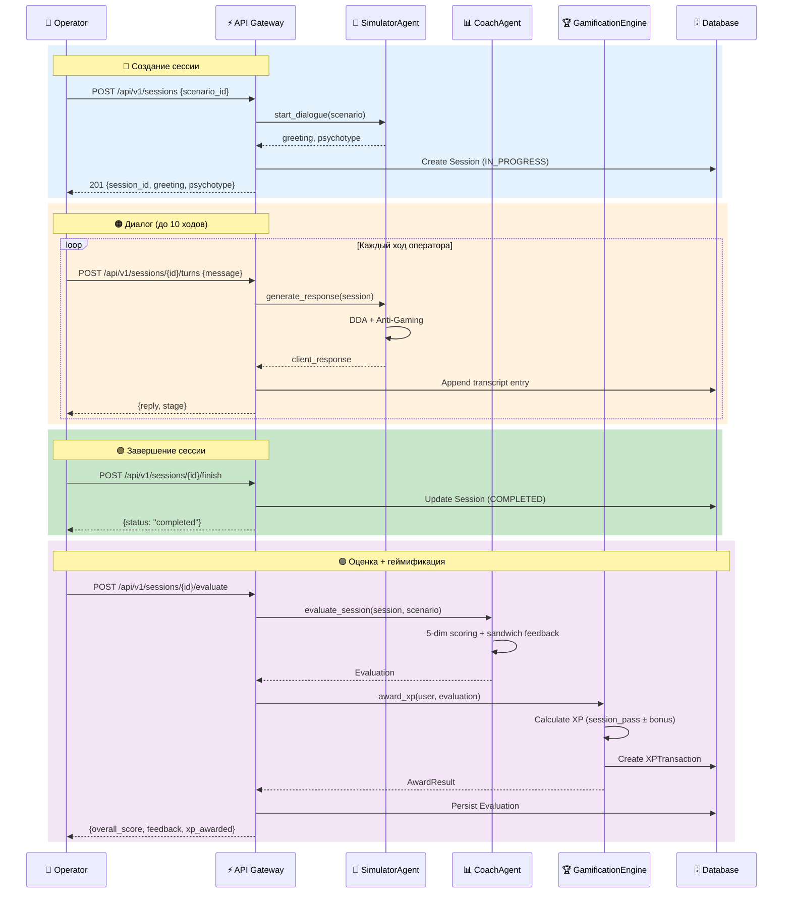
```mermaid
sequenceDiagram
    participant O as 👤 Operator
    participant GW as ⚡ API Gateway
    participant Sim as 🤖 SimulatorAgent
    participant Coach as 📊 CoachAgent
    participant Gam as 🏆 GamificationEngine
    participant DB as 🗄️ Database

    rect rgb(227, 242, 253)
        Note over O,GW: 🔵 Создание сессии
        O->>GW: POST /api/v1/sessions {scenario_id}
        GW->>Sim: start_dialogue(scenario)
        Sim-->>GW: greeting, psychotype
        GW->>DB: Create Session (IN_PROGRESS)
        GW-->>O: 201 {session_id, greeting, psychotype}
    end

    rect rgb(255, 243, 224)
        Note over O,GW: 🟠 Диалог (до 10 ходов)
        loop Каждый ход оператора
            O->>GW: POST /api/v1/sessions/{id}/turns {message}
            GW->>Sim: generate_response(session)
            Sim->>Sim: DDA + Anti-Gaming
            Sim-->>GW: client_response
            GW->>DB: Append transcript entry
            GW-->>O: {reply, stage}
        end
    end

    rect rgb(200, 230, 201)
        Note over O,GW: 🟢 Завершение сессии
        O->>GW: POST /api/v1/sessions/{id}/finish
        GW->>DB: Update Session (COMPLETED)
        GW-->>O: {status: "completed"}
    end

    rect rgb(243, 229, 245)
        Note over O,DB: 🟣 Оценка + геймификация
        O->>GW: POST /api/v1/sessions/{id}/evaluate
        GW->>Coach: evaluate_session(session, scenario)
        Coach->>Coach: 5-dim scoring + sandwich feedback
        Coach-->>GW: Evaluation
        GW->>Gam: award_xp(user, evaluation)
        Gam->>Gam: Calculate XP (session_pass ± bonus)
        Gam->>DB: Create XPTransaction
        Gam-->>GW: AwardResult
        GW->>DB: Persist Evaluation
        GW-->>O: {overall_score, feedback, xp_awarded}
    end
```

**Поток аутентификации (упоминание):**
Перед вызовом API оператор проходит аутентификацию (UC-7). Все эндпоинты защищены Bearer JWT-токеном. API Gateway проверяет токен через `get_current_user()` в `dependencies.py` до передачи запроса в бизнес-логику.

**Постусловия:**
- Статус сессии = COMPLETED (или EVALUATED после оценки)
- Создана Evaluation с 5 измерениями + overall score
- Начислены XP, пересчитан уровень
- Проверены достижения (бейджи выданы при выполнении критериев)
- Данные сохранены через DoubleWriteService (in-memory + PostgreSQL)

**Альтернативные потоки:**
- **Прерывание сессии** (разрыв соединения): статус = INTERRUPTED, оценка не создаётся
- **Ошибка Simulator**: статус = FAILED, ошибка логируется через structlog
- **Превышение лимита ходов** (max 10 ходов оператора): Simulator.prompt.completes → завершение через `should_end()`

---

## 3. UC-2 — DDA (Dynamic Difficulty Adjustment)

**Приоритет:** P0 | **FR:** FR-1

**Описание:** Система адаптивной сложности повышает интенсивность ответов AI-клиента (SimulatorAgent) при серии успешных прохождений. Это предотвращает «застревание» оператора на одном уровне и стимулирует развитие навыков.

**Предусловия:**
- Оператор имеет успешную серию (3+ последовательных прохождения с оценкой >= 70)
- DDAState загружен из репозитория (или создан со значением по умолчанию)

**Механизм:**
- DDAState хранится в отдельной таблице/коллекции: `difficulty_level`, `success_streak`, `last_session_at`, `intensity_factor`
- Проверка выполняется при каждом вызове `generate_response()` в SimulatorAgent
- Если `operator_success_streak < _DDA_STREAK_THRESHOLD` (2) — ответы без усиления

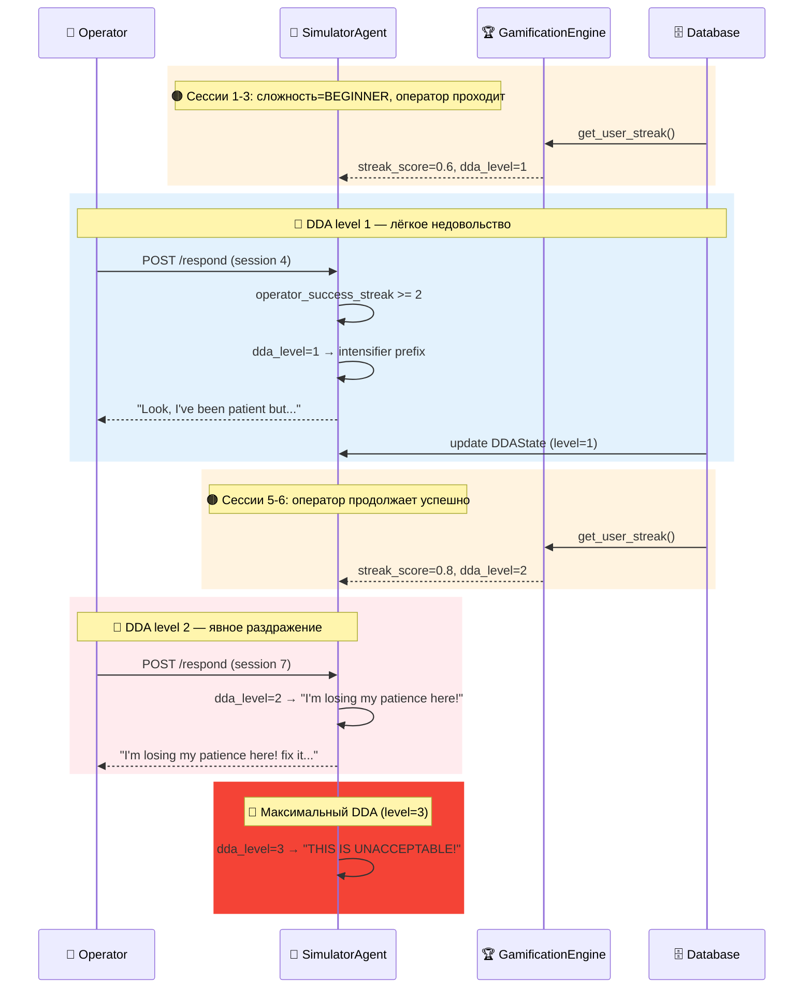
```mermaid
sequenceDiagram
    participant O as 👤 Operator
    participant Sim as 🤖 SimulatorAgent
    participant Gam as 🏆 GamificationEngine
    participant DB as 🗄️ Database

    rect rgb(255, 243, 224)
        Note over Sim: 🟠 Сессии 1-3: сложность=BEGINNER, оператор проходит
        DB->>Gam: get_user_streak()
        Gam-->>Sim: streak_score=0.6, dda_level=1
    end

    rect rgb(227, 242, 253)
        Note over O,DB: 🔵 DDA level 1 — лёгкое недовольство
        O->>Sim: POST /respond (session 4)
        Sim->>Sim: operator_success_streak >= 2
        Sim->>Sim: dda_level=1 → intensifier prefix
        Sim-->>O: "Look, I've been patient but..."
        DB->>Sim: update DDAState (level=1)
    end

    rect rgb(255, 243, 224)
        Note over Sim: 🟠 Сессии 5-6: оператор продолжает успешно
        DB->>Gam: get_user_streak()
        Gam-->>Sim: streak_score=0.8, dda_level=2
    end

    rect rgb(255, 235, 238)
        Note over O,Sim: 🔴 DDA level 2 — явное раздражение
        O->>Sim: POST /respond (session 7)
        Sim->>Sim: dda_level=2 → "I'm losing my patience here!"
        Sim-->>O: "I'm losing my patience here! fix it..."
    end

    rect rgb(244, 67, 54)
        Note over Sim: 🔴 Максимальный DDA (level=3)
        Sim->>Sim: dda_level=3 → "THIS IS UNACCEPTABLE!"
    end
```

**Ключевая логика (псевдокод):**
```python
if operator_success_streak >= _DDA_STREAK_THRESHOLD:  # 2
    intensifiers = [
        "",                                    # level 0 — без усиления
        "Look, I've been patient but ",        # level 1 — лёгкое недовольство
        "I'm losing my patience here! ",       # level 2 — явное раздражение
        "THIS IS UNACCEPTABLE! "               # level 3 — крайняя степень
    ]
    idx = min(dda_level, len(intensifiers) - 1)
    response = intensifiers[idx] + template
```

**Параметры DDA (конфигурируемые):**
| Параметр | Значение | Описание |
|----------|----------|----------|
| `_DDA_STREAK_THRESHOLD` | 2 | Число успешных сессий для повышения уровня |
| `_DDA_MAX_LEVEL` | 3 | Максимальный уровень сложности |
| `_DDA_INTENSITY_STEP` | 0.2 | Шаг увеличения intensity_factor |
| `_DDA_STALE_HOURS` | 24 | Часов бездействия для сброса streak |

**Постусловия:**
- DDAState сохранён (или обновлён) в базе данных
- Интенсивность ответов SimulatorAgent повышена на текущий уровень
- При достижении max уровня (3) ответы остаются на нём до сброса streak

**Альтернативные потоки:**
- **Отсутствие streak** (новая сессия после перерыва > 24ч): DDAState.reset(), уровень = 0
- **Ошибка сохранения DDAState**: состояние остаётся предыдущим, операция логируется

---

## 4. UC-3 — LLM-симуляция

**Приоритет:** P1 | **FR:** FR-1

**Описание:** При включении `LLM_SIMULATOR_ENABLED=true` rule-based SimulatorAgent делегирует генерацию ответов LLM-провайдеру (ollama, OpenAI-совместимые). В текущей реализации LLM-симуляция является опциональной заменой rule-based движка.

**Предусловия:**
- `LLM_PROVIDER` = `ollama` | `openai_compat`
- `LLM_SIMULATOR_ENABLED` = `true`
- LLM-сервис доступен (проверка через CircuitBreaker)

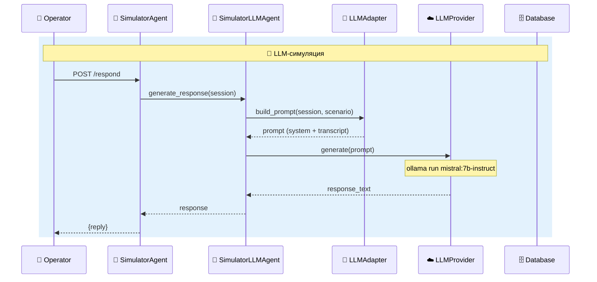
```mermaid
sequenceDiagram
    participant O as 👤 Operator
    participant Sim as 🤖 SimulatorAgent
    participant SimLLM as 🧠 SimulatorLLMAgent
    participant Adapter as 🔌 LLMAdapter
    participant LLM as ☁️ LLMProvider
    participant DB as 🗄️ Database

    rect rgb(227, 242, 253)
        Note over O,DB: 🔵 LLM-симуляция
        O->>Sim: POST /respond
        Sim->>SimLLM: generate_response(session)
        SimLLM->>Adapter: build_prompt(session, scenario)
        Adapter-->>SimLLM: prompt (system + transcript)
        SimLLM->>LLM: generate(prompt)
        Note over LLM: ollama run mistral:7b-instruct
        LLM-->>SimLLM: response_text
        SimLLM-->>Sim: response
        Sim-->>O: {reply}
    end
```

**Цепочка LLM провайдеров:**
```
mock (по умолчанию) → ollama (локальный) → openai_compat (vLLM, Together, OpenAI, GigaChat)
```
Провайдер выбирается через `LLMProviderFactory` по настройке в `core/config.py`.

**Параметры LLM (из Settings):**
| Параметр | Дефолт | Описание |
|----------|--------|----------|
| `LLM_PROVIDER` | mock | Провайдер: mock, ollama, openai_compat |
| `LLM_MODEL` | mistral:7b | Модель для генерации |
| `LLM_BASE_URL` | http://localhost:11434 | URL API провайдера |
| `LLM_TIMEOUT` | 60s | Таймаут запроса (сек) |
| `LLM_MAX_TOKENS` | 512 | Максимум токенов в ответе |
| `LLM_TEMPERATURE` | 0.7 | Температура генерации |

**Fallback:** Если LLM timeout → CircuitBreaker переключает состояние OPEN → `LLM_TIMEOUT` (default 60s) → fallback к rule-based SimulatorAgent.

---

## 5. UC-4 — Fairness-аудит

**Приоритет:** P1 | **FR:** FR-4

**Описание:** Аудит справедливости (fairness) проверяет, не discriminiрует ли система оценки операторов по защищённым атрибутам (пол, возраст, акцент, родной язык). Аудит может запускаться вручную (через API) или периодически (через `lifespan`-задачу).

**Предусловия:**
- `FAIRNESS_ENABLED` = `true`
- `[fairness_config.yaml](fairness_config.yaml)` присутствует и корректен
- В системе есть данные по пользователям (минимум 2 группы для сравнения)

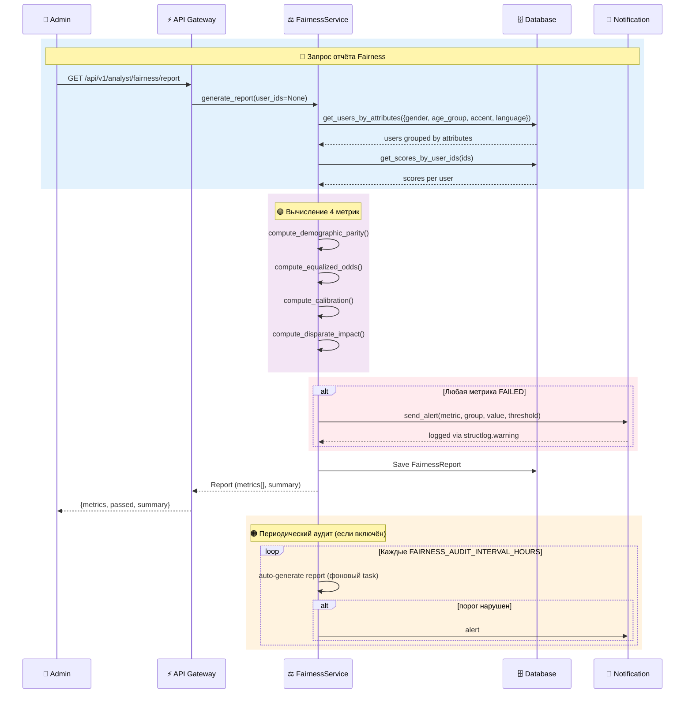
```mermaid
sequenceDiagram
    participant Admin as 👑 Admin
    participant GW as ⚡ API Gateway
    participant Fair as ⚖️ FairnessService
    participant DB as 🗄️ Database
    participant Notif as 📢 Notification

    rect rgb(227, 242, 253)
        Note over Admin,Notif: 🔵 Запрос отчёта Fairness
        Admin->>GW: GET /api/v1/analyst/fairness/report
        GW->>Fair: generate_report(user_ids=None)
        Fair->>DB: get_users_by_attributes({gender, age_group, accent, language})
        DB-->>Fair: users grouped by attributes
        Fair->>DB: get_scores_by_user_ids(ids)
        DB-->>Fair: scores per user
    end

    rect rgb(243, 229, 245)
        Note over Fair: 🟣 Вычисление 4 метрик
        Fair->>Fair: compute_demographic_parity()
        Fair->>Fair: compute_equalized_odds()
        Fair->>Fair: compute_calibration()
        Fair->>Fair: compute_disparate_impact()
    end

    rect rgb(255, 235, 238)
        alt Любая метрика FAILED
            Fair->>Notif: send_alert(metric, group, value, threshold)
            Notif-->>Fair: logged via structlog.warning
        end
    end
    
    Fair->>DB: Save FairnessReport
    Fair-->>GW: Report (metrics[], summary)
    GW-->>Admin: {metrics, passed, summary}

    rect rgb(255, 243, 224)
        Note over Fair: 🟠 Периодический аудит (если включён)
        loop Каждые FAIRNESS_AUDIT_INTERVAL_HOURS
            Fair->>Fair: auto-generate report (фоновый task)
            alt порог нарушен
                Fair->>Notif: alert
            end
        end
    end
```

**4 метрики Fairness:**
| Метрика | Формула | Порог | Что проверяет |
|---------|---------|-------|---------------|
| Demographic Parity | `min(P(positive\|group) / P(positive\|reference))` | ≥ 0.8 | Равная доля успешных оценок между группами |
| Equalized Odds | `P(Ŷ=1\|Y=0, G=g) ≈ P(Ŷ=1\|Y=0, G=r)` | ≤ 0.1 | Равные False Positive Rate между группами |
| Calibration | `P(Y=1\|score≈s, G=g) ≈ s` | ≤ 0.1 | Точность предсказаний не зависит от группы |
| Disparate Impact | `min(SuccessRate(group)) / SuccessRate(reference)` | ≥ 0.8 | Правило 4/5: ни одна группа не имеет успеха < 80% от референсной |

**Защищённые атрибуты (из конфига):** gender, age_group, accent, native_language.

**CLI-аудит:** `[scripts/run_fairness_audit.py](scripts/run_fairness_audit.py)` — exit code 0 (все метрики прошли), 1 (хотя бы одна не прошла), 2 (ошибка выполнения).

**Постусловия:**
- FairnessReport сохранён в базе данных
- При нарушении порогов отправлено уведомление (structlog.warning через StubNotificationService)
- В периодическом режиме аудит повторяется с интервалом `FAIRNESS_AUDIT_INTERVAL_HOURS`

---

## 6. UC-5 — XP и бейджи

**Приоритет:** P0 | **FR:** FR-3

**Описание:** После оценки сессии GamificationEngine начисляет оператору XP (experience points), проверяет повышение уровня и выдачу бейджей. Это основной механизм геймификации, мотивирующий операторов улучшать навыки.

**Триггер:** Вызов `process_evaluation()` из EvaluationService после успешной оценки сессии.

**Предусловия:**
- Session.status = COMPLETED
- Evaluation создана (overall_score ≥ 0)

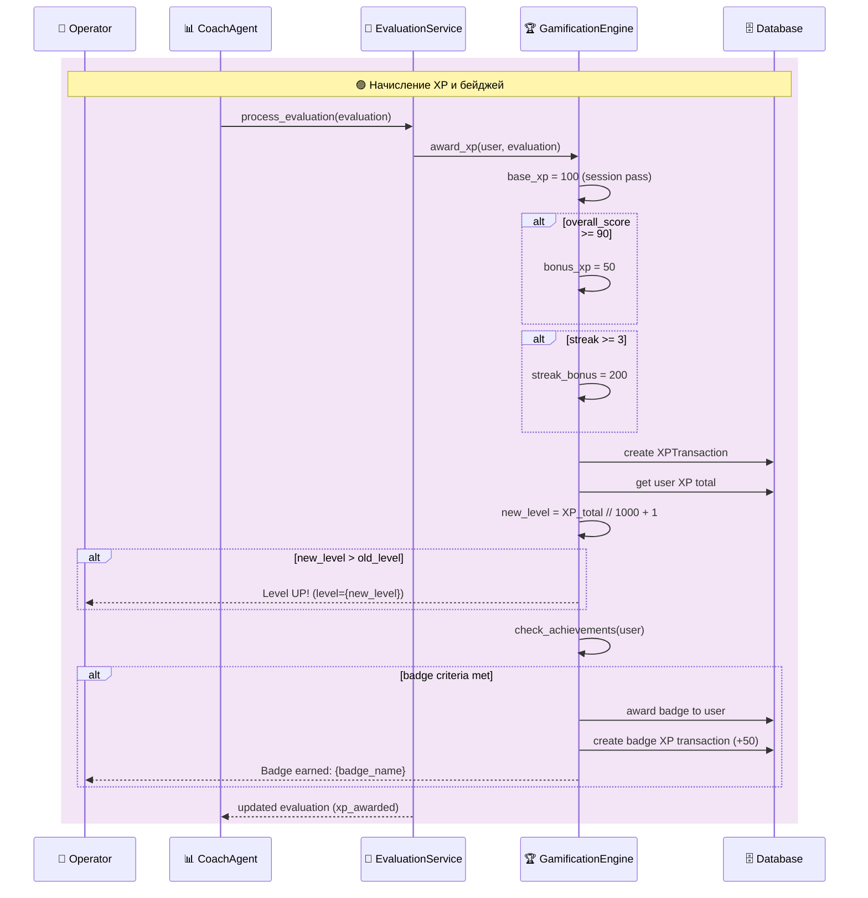
```mermaid
sequenceDiagram
    participant O as 👤 Operator
    participant Coach as 📊 CoachAgent
    participant Eval as 📝 EvaluationService
    participant Gam as 🏆 GamificationEngine
    participant DB as 🗄️ Database

    rect rgb(243, 229, 245)
        Note over O,DB: 🟣 Начисление XP и бейджей
        Coach->>Eval: process_evaluation(evaluation)
        Eval->>Gam: award_xp(user, evaluation)
        
        Gam->>Gam: base_xp = 100 (session pass)
        alt overall_score >= 90
            Gam->>Gam: bonus_xp = 50
        end
        alt streak >= 3
            Gam->>Gam: streak_bonus = 200
        end
        
        Gam->>DB: create XPTransaction
        Gam->>DB: get user XP total
        Gam->>Gam: new_level = XP_total // 1000 + 1
        
        alt new_level > old_level
            Gam-->>O: Level UP! (level={new_level})
        end
        
        Gam->>Gam: check_achievements(user)
        alt badge criteria met
            Gam->>DB: award badge to user
            Gam->>DB: create badge XP transaction (+50)
            Gam-->>O: Badge earned: {badge_name}
        end
        
        Eval-->>Coach: updated evaluation (xp_awarded)
    end
```

**Начисление XP:**
| Действие | XP | Условие |
|----------|----|---------|
| Прохождение сессии | 100 | Всегда при оценке |
| Бонус за высокий балл | +50 | overall_score ≥ 90 |
| Бонус за серию | +200 | streak ≥ 3 |
| Получение бейджа | +50 | При выдаче каждого бейджа |

**Формула уровня:** `level = XP_total // 1000 + 1` (каждые 1000 XP — новый уровень)

**Критерии бейджей (8 штук):**
| Бейдж | Критерий | Тип |
|-------|----------|-----|
| First Session | Пройти 1 сессию | Начальный |
| Perfect Score | Оценка ≥ 95 | Достижение |
| Streak Master | Серия из 5 успешных сессий | Мастерство |
| Level 5 | Достичь 5 уровня | Прогресс |
| Level 10 | Достичь 10 уровня | Прогресс |
| Level 20 | Достичь 20 уровня | Прогресс |
| Aggressive Handler | Пройти 5 сценариев с агрессивным психотипом | Специализация |
| Empathy Expert | Средняя эмпатия > 80 за 10 сессий | Специализация |

**Постусловия:**
- Создана XPTransaction в базе данных
- Уровень пересчитан (возможно, повышен)
- Бейджи проверены, новые выданы
- Все изменения сохранены через XPTransactionRepository и BadgeRepository

---

## 7. UC-6 — Лидерборд и streak

**Приоритет:** P1 | **FR:** FR-3

**Описание:** Операторы могут просматривать таблицу лидеров (топ по XP) и свою текущую серию успешных сессий (streak). Лидерборд мотивирует через соревнование, streak — через регулярность.

**Предусловия (лидерборд):**
- Существует минимум 2 пользователя с XP > 0

**Предусловия (streak):**
- Пользователь имеет хотя бы одну завершённую сессию

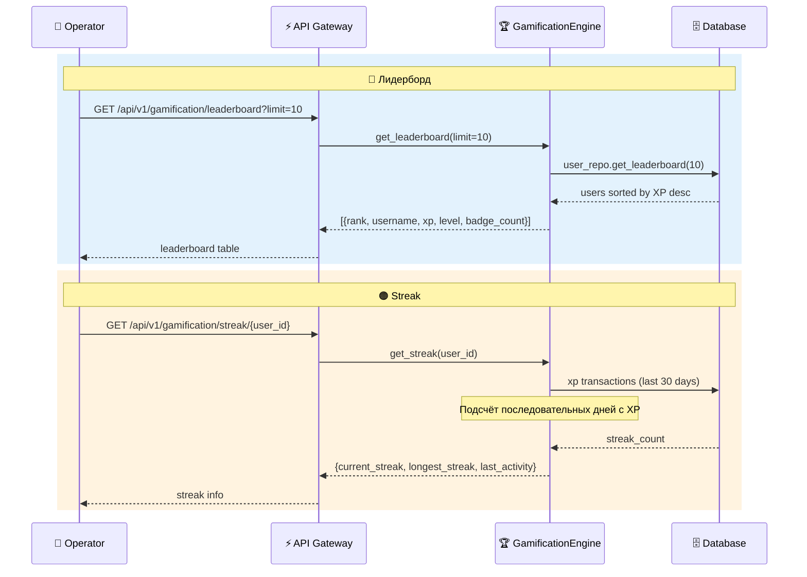
```mermaid
sequenceDiagram
    participant O as 👤 Operator
    participant GW as ⚡ API Gateway
    participant Gam as 🏆 GamificationEngine
    participant DB as 🗄️ Database

    rect rgb(227, 242, 253)
        Note over O,DB: 🔵 Лидерборд
        O->>GW: GET /api/v1/gamification/leaderboard?limit=10
        GW->>Gam: get_leaderboard(limit=10)
        Gam->>DB: user_repo.get_leaderboard(10)
        DB-->>Gam: users sorted by XP desc
        Gam-->>GW: [{rank, username, xp, level, badge_count}]
        GW-->>O: leaderboard table
    end

    rect rgb(255, 243, 224)
        Note over O,DB: 🟠 Streak
        O->>GW: GET /api/v1/gamification/streak/{user_id}
        GW->>Gam: get_streak(user_id)
        Gam->>DB: xp transactions (last 30 days)
        Note over Gam: Подсчёт последовательных дней с XP
        DB-->>Gam: streak_count
        Gam-->>GW: {current_streak, longest_streak, last_activity}
        GW-->>O: streak info
    end
```

**Алгоритм streak:**
1. Загрузить XPTransaction за последние 30 дней
2. Сгруппировать по дате (created_at.date())
3. Начиная с сегодня, идти назад: если XP был каждый день → streak++
4. Как только день без XP — остановиться
5. longest_streak — максимальное значение за всё время

**Формат ответа streak:**
```json
{
  "current_streak": 3,
  "longest_streak": 7,
  "last_activity": "2026-07-12T14:30:00Z"
}
```

---

## 8. UC-7 — Аутентификация

**Приоритет:** P0 | **FR:** FR-5

**Описание:** Полный цикл аутентификации: регистрация, вход, аутентифицированный запрос, обновление токена, выход. Система использует JWT (access + refresh) с поддержкой blacklist через TokenStore (Redis / In-Memory).

**Предусловя (регистрация):**
- username и password прошли валидацию (username ≥ 3 символов, password ≥ 8 с цифрой + буквой)

**Предусловя (логин):**
- Пользователь зарегистрирован и активен

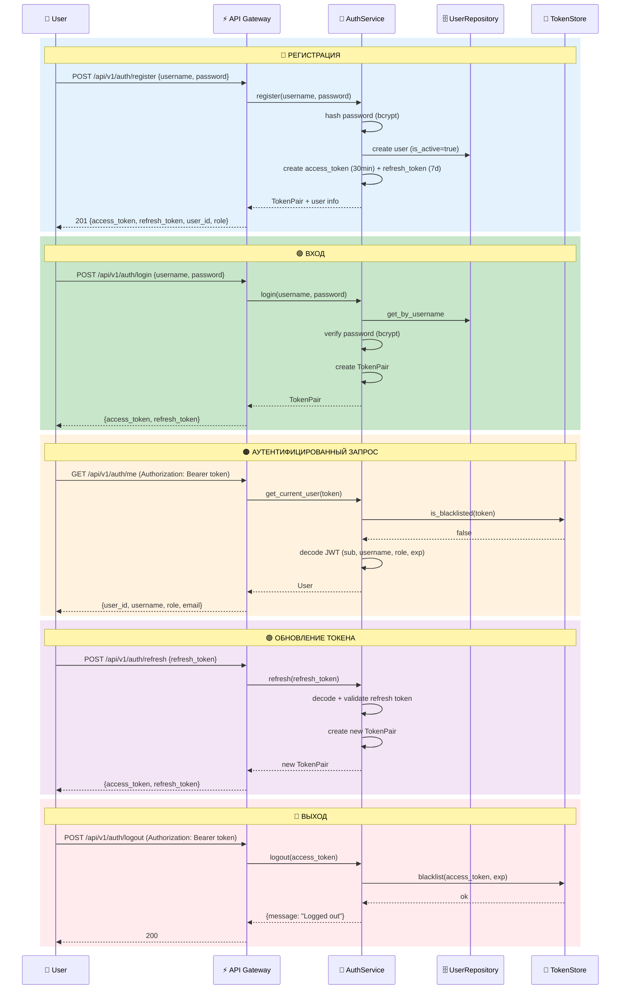
```mermaid
sequenceDiagram
    participant U as 👤 User
    participant GW as ⚡ API Gateway
    participant Auth as 🔐 AuthService
    participant DB as 🗄️ UserRepository
    participant Token as 🔑 TokenStore

    rect rgb(227, 242, 253)
        Note over U,Token: 🔵 РЕГИСТРАЦИЯ
        U->>GW: POST /api/v1/auth/register {username, password}
        GW->>Auth: register(username, password)
        Auth->>Auth: hash password (bcrypt)
        Auth->>DB: create user (is_active=true)
        Auth->>Auth: create access_token (30min) + refresh_token (7d)
        Auth-->>GW: TokenPair + user info
        GW-->>U: 201 {access_token, refresh_token, user_id, role}
    end

    rect rgb(200, 230, 201)
        Note over U,Token: 🟢 ВХОД
        U->>GW: POST /api/v1/auth/login {username, password}
        GW->>Auth: login(username, password)
        Auth->>DB: get_by_username
        Auth->>Auth: verify password (bcrypt)
        Auth->>Auth: create TokenPair
        Auth-->>GW: TokenPair
        GW-->>U: {access_token, refresh_token}
    end

    rect rgb(255, 243, 224)
        Note over U,Token: 🟠 АУТЕНТИФИЦИРОВАННЫЙ ЗАПРОС
        U->>GW: GET /api/v1/auth/me (Authorization: Bearer token)
        GW->>Auth: get_current_user(token)
        Auth->>Token: is_blacklisted(token)
        Token-->>Auth: false
        Auth->>Auth: decode JWT (sub, username, role, exp)
        Auth-->>GW: User
        GW-->>U: {user_id, username, role, email}
    end

    rect rgb(243, 229, 245)
        Note over U,Token: 🟣 ОБНОВЛЕНИЕ ТОКЕНА
        U->>GW: POST /api/v1/auth/refresh {refresh_token}
        GW->>Auth: refresh(refresh_token)
        Auth->>Auth: decode + validate refresh token
        Auth->>Auth: create new TokenPair
        Auth-->>GW: new TokenPair
        GW-->>U: {access_token, refresh_token}
    end

    rect rgb(255, 235, 238)
        Note over U,Token: 🔴 ВЫХОД
        U->>GW: POST /api/v1/auth/logout (Authorization: Bearer token)
        GW->>Auth: logout(access_token)
        Auth->>Token: blacklist(access_token, exp)
        Token-->>Auth: ok
        Auth-->>GW: {message: "Logged out"}
        GW-->>U: 200
    end
```

**Поля JWT payload:**
```json
{
  "sub": "user-uuid",
  "username": "operator1",
  "role": "operator",
  "exp": 1720800000
}
```

**Параметры токенов:**
| Параметр | Access Token | Refresh Token |
|----------|-------------|---------------|
| Срок жизни | 30 минут (настраивается `JWT_ACCESS_EXPIRE_MINUTES`) | 7 дней |
| Хранение | В JWT (stateless) | В JWT + TokenStore |
| Blacklist | Да (при logout) | Нет (только истечение) |
| Обновление | Через refresh endpoint | При логине или refresh |

**Обработка ошибок:**
| Ошибка | HTTP Status | Причина |
|--------|-------------|---------|
| Неверный пароль | 401 | Неверный username или password |
| Токен истёк | 401 | exp в прошлом |
| Токен в blacklist | 401 | Пользователь вышел |
| Доступ без токена | 403 | Missing Authorization header |
| Duplicate username | 409 | Пользователь с таким username уже существует |

---

## 9. UC-8 — RBAC (Ролевой доступ)

**Приоритет:** P1 | **FR:** FR-5

**Описание:** Система ролевого доступа с тремя ролями: OPERATOR (оператор), TRAINER (тренер), ADMIN (администратор). Роли образуют иерархию: ADMIN имеет все права TRAINER, TRAINER — все права OPERATOR.

**Иерархия ролей:**
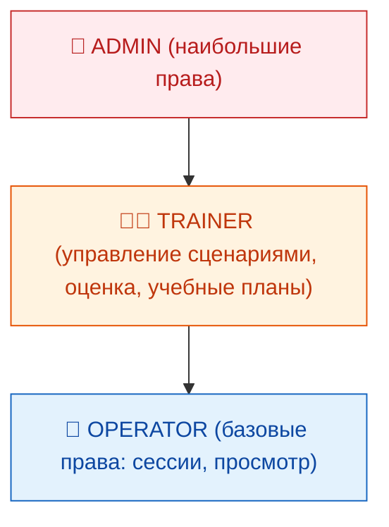
```mermaid
graph TD
    ADMIN["👑 ADMIN (наибольшие права)"] --> TRAINER["👨‍🏫 TRAINER (управление сценариями, оценка, учебные планы)"]
    TRAINER --> OPERATOR["👤 OPERATOR (базовые права: сессии, просмотр)"]

    style ADMIN fill:#ffebee,stroke:#c62828,color:#b71c1c
    style TRAINER fill:#fff3e0,stroke:#e65100,color:#bf360c
    style OPERATOR fill:#e3f2fd,stroke:#1565c0,color:#0d47a1
```

**Реализация:** Декоратор `require_role(role)` в `dependencies.py` проверяет текущего пользователя через `get_current_user()`. Если роль не соответствует — возвращает 403 Forbidden с Problem Details (RFC 9457).

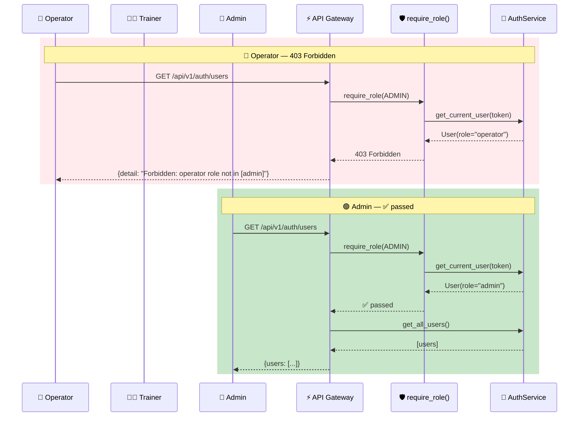
```mermaid
sequenceDiagram
    participant Op as 👤 Operator
    participant Tr as 👨‍🏫 Trainer
    participant Ad as 👑 Admin
    participant GW as ⚡ API Gateway
    participant RBAC as 🛡️ require_role()
    participant Auth as 🔐 AuthService

    rect rgb(255, 235, 238)
        Note over Op,Auth: 🔴 Operator — 403 Forbidden
        Op->>GW: GET /api/v1/auth/users
        GW->>RBAC: require_role(ADMIN)
        RBAC->>Auth: get_current_user(token)
        Auth-->>RBAC: User(role="operator")
        RBAC-->>GW: 403 Forbidden
        GW-->>Op: {detail: "Forbidden: operator role not in [admin]"}
    end

    rect rgb(200, 230, 201)
        Note over Ad,Auth: 🟢 Admin — ✅ passed
        Ad->>GW: GET /api/v1/auth/users
        GW->>RBAC: require_role(ADMIN)
        RBAC->>Auth: get_current_user(token)
        Auth-->>RBAC: User(role="admin")
        RBAC-->>GW: ✅ passed
        GW->>Auth: get_all_users()
        Auth-->>GW: [users]
        GW-->>Ad: {users: [...]}
    end
```

**Матрица эндпоинтов → Роли:**

| Ресурс | OPERATOR | TRAINER | ADMIN |
|--------|----------|---------|-------|
| POST /auth/register | ✅ | ✅ | ✅ |
| POST /auth/login | ✅ | ✅ | ✅ |
| GET /auth/me | ✅ | ✅ | ✅ |
| GET /auth/users | ❌ | ❌ | ✅ |
| POST /sessions | ✅ | ✅ | ✅ |
| GET /sessions | ✅ | ✅ | ✅ |
| GET /sessions/{id} | ✅ | ✅ | ✅ |
| POST /sessions/{id}/turns | ✅ | ✅ | ✅ |
| POST /sessions/{id}/finish | ✅ | ✅ | ✅ |
| POST /sessions/{id}/evaluate | ❌ | ✅ | ✅ |
| POST /curator/learning-plan | ✅ | ✅ | ✅ |
| POST /curator/quiz | ❌ | ✅ | ✅ |
| POST /curator/sync-lms | ❌ | ❌ | ✅ |
| GET /analyst/stats | ❌ | ✅ | ✅ |
| GET /analyst/stats/{id} | ✅ | ✅ | ✅ |
| GET /analyst/fairness/report | ❌ | ❌ | ✅ |
| GET /analyst/fairness/groups | ❌ | ❌ | ✅ |
| GET /gamification/leaderboard | ✅ | ✅ | ✅ |
| GET /gamification/badges | ✅ | ✅ | ✅ |

**Обработка ошибок RBAC:**
- 403 Forbidden + Problem Detail: `{type: "about:blank", title: "Forbidden", status: 403, detail: "Forbidden: operator role not in [admin]"}`
- 401 если токен отсутствует или невалиден (перед проверкой роли)

---

## 10. UC-9 — In-Memory режим

**Приоритет:** P0 | **FR:** FR-7

**Описание:** Режим работы без внешних сервисов (PostgreSQL, Redis, Qdrant). Все данные хранятся в оперативной памяти в `dict`-коллекциях. Режим по умолчанию — `DB_MODE=memory`. Позволяет запускать приложение без Docker/БД для разработки и тестирования.

**Предусловия:**
- `DB_MODE` = `memory` (по умолчанию) или не установлен
- Внешние сервисы (PostgreSQL, Redis, Qdrant) не требуются

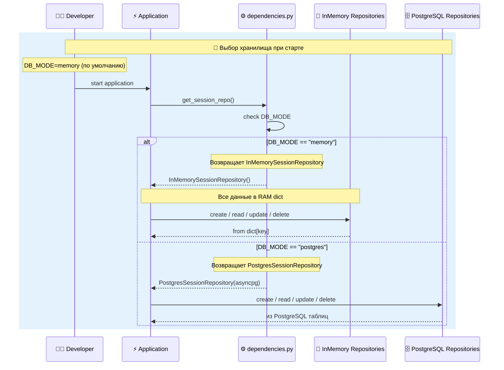
```mermaid
sequenceDiagram
    participant Dev as 👨‍💻 Developer
    participant App as ⚡ Application
    participant Deps as ⚙️ dependencies.py
    participant Mem as 💾 InMemory Repositories
    participant Postgres as 🗄️ PostgreSQL Repositories

    rect rgb(227, 242, 253)
        Note over Dev,Postgres: 🔵 Выбор хранилища при старте
        Note over Dev: DB_MODE=memory (по умолчанию)
        Dev->>App: start application
        
        App->>Deps: get_session_repo()
        Deps->>Deps: check DB_MODE
        
        alt DB_MODE == "memory"
            Note over Deps: Возвращает InMemorySessionRepository
            Deps-->>App: InMemorySessionRepository()
            Note over App,Mem: Все данные в RAM dict
            App->>Mem: create / read / update / delete
            Mem-->>App: from dict[key]
        else DB_MODE == "postgres"
            Note over Deps: Возвращает PostgresSessionRepository
            Deps-->>App: PostgresSessionRepository(asyncpg)
            App->>Postgres: create / read / update / delete
            Postgres-->>App: из PostgreSQL таблиц
        end
    end
```

**In-memory репозитории:**
| Интерфейс | In-Memory реализация | Структура данных |
|-----------|---------------------|------------------|
| `UserRepository` | `InMemoryUserRepository` | `dict[UUID, User]` + `_by_email`, `_by_username` |
| `SessionRepository` | `InMemorySessionRepository` | `dict[UUID, Session]` |
| `ScenarioRepository` | `InMemoryScenarioRepository` | `dict[UUID, Scenario]` |
| `EvaluationRepository` | `InMemoryEvaluationRepository` | `dict[UUID, Evaluation]` |
| `BadgeRepository` | `InMemoryBadgeRepository` | `dict[UUID, Badge]` + `_user_badges` |
| `XPTransactionRepository` | `InMemoryXPTransactionRepository` | `list[XPTransaction]` |
| `TokenStore` | `InMemoryTokenStore` | `set[str]` (blacklist) |
| `DDAStateRepository` | `InMemoryDDAStateRepository` | `dict[UUID, DDAState]` |

**Особенности InMemory реализации:**
- Все репозитории наследуют `BaseInMemoryRepository[T]` с generic CRUD (get_by_id, list_all, update, delete, count)
- Специфические методы (get_by_email, get_leaderboard) переопределяются в конкретных реализациях
- `InMemoryXPTransactionRepository` — standalone (list-based, хранит транзакции хронологически)
- `InMemoryTokenStore` — LRU-эвакция при превышении лимита (для production — Redis)

**Seed data (3 пользователя + 3 сценария):** загружается в `main.py` при старте в любом режиме (memory и postgres).
- Пользователи: `operator1` (role=operator), `trainer1` (role=trainer), `admin1` (role=admin)
- Сценарии: Standard (нейтральный клиент), Aggressive (агрессивный клиент), Technical (техническая поддержка)

**DoubleWriteService:** При `DB_MODE=postgres` данные дублируются — пишутся и в InMemory, и в PostgreSQL. При старте InMemory заполняется из PostgreSQL.

---

## 11. UC-10 — Error Handling — Coach Timeout

**Приоритет:** P1 | **NFR:** NFR-1

**Описание:** Обработка таймаута CoachAgent при оценке сессии. Если оценка не укладывается в NFR-1 (< 2 секунды для 50 конкурентных запросов), CircuitBreaker переключается в OPEN и предотвращает каскадные отказы.

**Предусловия:** Coach evaluation занимает > 2 секунд (превышение NFR-1).

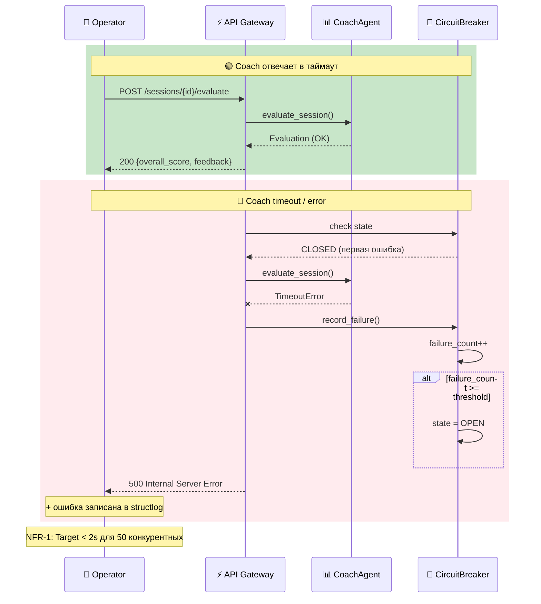
```mermaid
sequenceDiagram
    participant O as 👤 Operator
    participant GW as ⚡ API Gateway
    participant Coach as 📊 CoachAgent
    participant CB as 🔌 CircuitBreaker
    
    rect rgb(200, 230, 201)
        Note over O,CB: 🟢 Coach отвечает в таймаут
        O->>GW: POST /sessions/{id}/evaluate
        GW->>Coach: evaluate_session()
        Coach-->>GW: Evaluation (OK)
        GW-->>O: 200 {overall_score, feedback}
    end

    rect rgb(255, 235, 238)
        Note over O,CB: 🔴 Coach timeout / error
        GW->>CB: check state
        CB-->>GW: CLOSED (первая ошибка)
        GW->>Coach: evaluate_session()
        Coach--xGW: TimeoutError
        GW->>CB: record_failure()
        CB->>CB: failure_count++
        alt failure_count >= threshold
            CB->>CB: state = OPEN
        end
        GW-->>O: 500 Internal Server Error
        Note over O: + ошибка записана в structlog
    end

    Note over O: NFR-1: Target < 2s для 50 конкурентных
```

**Состояния Circuit Breaker:**
```
CLOSED → (failure_count >= threshold) → OPEN → (recovery_timeout) → HALF_OPEN → (тест проходит) → CLOSED
                      ↓                                    ↓
                 (таймаут)                            (тест не проходит) → OPEN
```

**Параметры CircuitBreaker:**
```python
class CircuitBreakerSettings:
    failure_threshold: int = 5       # число ошибок до OPEN
    recovery_timeout: int = 30       # секунд до HALF_OPEN
    half_open_max_retries: int = 3   # попыток в HALF_OPEN
    excluded_exceptions: list = []   # исключения, не учитываемые как failure
```

**Логирование ошибок:** Все ошибки CoachAgent записываются через structlog с correlation_id (X-Request-ID) для трассировки.

**NFR-1 target:** < 2 секунды для 50 конкурентных запросов оценки.

---

## 12. UC-11 — Rate Limit превышен

**Приоритет:** P1 | **NFR:** NFR-3

**Описание:** Два уровня rate limiting: глобальный (на все эндпоинты, через `RateLimitMiddleware`) и специальный для auth-эндпоинтов (через `AuthRateLimitMiddleware`). Используется sliding window алгоритм.

**Предусловия:** Клиент превысил лимит запросов за окно.

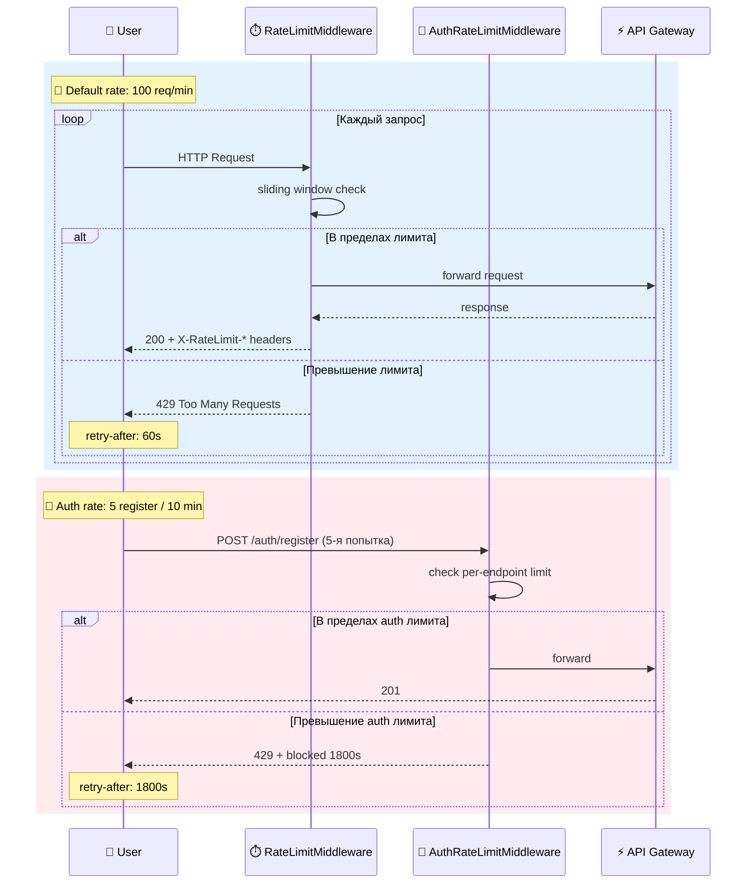
```mermaid
sequenceDiagram
    participant U as 👤 User
    participant RL as ⏱️ RateLimitMiddleware
    participant AuthRL as 🔐 AuthRateLimitMiddleware
    participant GW as ⚡ API Gateway

    rect rgb(227, 242, 253)
        Note over U: 🔵 Default rate: 100 req/min
        loop Каждый запрос
            U->>RL: HTTP Request
            RL->>RL: sliding window check
            
            alt В пределах лимита
                RL->>GW: forward request
                GW-->>RL: response
                RL-->>U: 200 + X-RateLimit-* headers
            else Превышение лимита
                RL-->>U: 429 Too Many Requests
                Note over U: retry-after: 60s
            end
        end
    end

    rect rgb(255, 235, 238)
        Note over U: 🔴 Auth rate: 5 register / 10 min
        U->>AuthRL: POST /auth/register (5-я попытка)
        AuthRL->>AuthRL: check per-endpoint limit
        alt В пределах auth лимита
            AuthRL->>GW: forward
            GW-->>U: 201
        else Превышение auth лимита
            AuthRL-->>U: 429 + blocked 1800s
            Note over U: retry-after: 1800s
        end
    end
```

**Параметры rate limiting:**
| Уровень | Лимит | Окно | Блокировка |
|---------|-------|------|------------|
| Глобальный | 100 запросов | 60 секунд | retry-after: 60s |
| Auth: /register | 5 запросов | 600 секунд | 1800 секунд |
| Auth: /login | 10 запросов | 600 секунд | 1800 секунд |
| Auth: /refresh | 20 запросов | 600 секунд | 1800 секунд |

**Заголовки ответа rate limit:**
```
X-RateLimit-Limit: 100
X-RateLimit-Remaining: 42
X-RateLimit-Reset: 1720800060
```

**Алгоритм:** Sliding window (список timestamp-ов запросов в окне). При каждом запросе удаляются timestamp-ы старше window, затем проверяется длина списка.

**Обработка 429:** Клиент должен прочитать `Retry-After` заголовок и повторить запрос после указанного времени.

---

## 13. UC-12 — WebSocket real-time диалог

**Приоритет:** P1 | **FR:** FR-6

**Статус:** 📋 Запланировано (не реализовано в текущей версии). Текущая версия использует REST API для всех операций.

**Описание:** Real-time версия UC-1 через WebSocket. Позволяет оператору вести диалог без постоянных HTTP-запросов, получая ответы Simulator и Coach в реальном времени.

**Спецификация:**
```
ws://host:8000/api/v1/ws/session/{session_id}
```

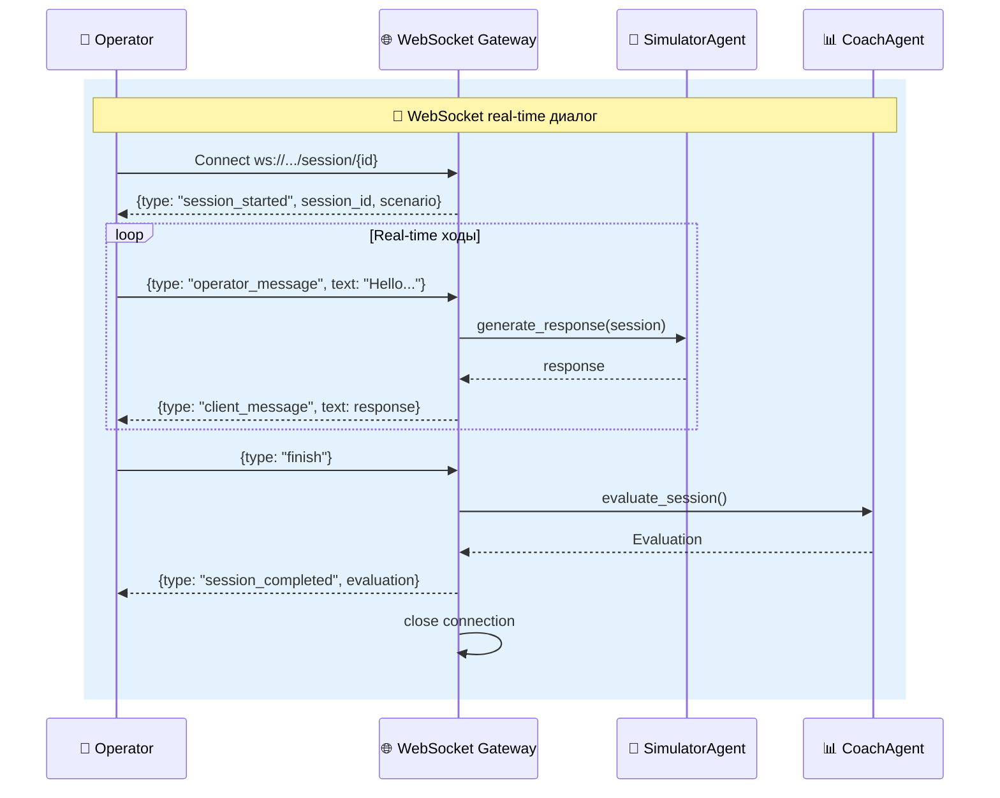
```mermaid
sequenceDiagram
    participant O as 👤 Operator
    participant WS as 🌐 WebSocket Gateway
    participant Sim as 🤖 SimulatorAgent
    participant Coach as 📊 CoachAgent
    
    rect rgb(227, 242, 253)
        Note over O,Coach: 🔵 WebSocket real-time диалог
        O->>WS: Connect ws://.../session/{id}
        WS-->>O: {type: "session_started", session_id, scenario}

        loop Real-time ходы
            O->>WS: {type: "operator_message", text: "Hello..."}
            WS->>Sim: generate_response(session)
            Sim-->>WS: response
            WS-->>O: {type: "client_message", text: response}
        end

        O->>WS: {type: "finish"}
        WS->>Coach: evaluate_session()
        Coach-->>WS: Evaluation
        WS-->>O: {type: "session_completed", evaluation}
        WS->>WS: close connection
    end
```

**Формат сообщений WebSocket:**
```json
// Клиент → Сервер
{"type": "operator_message", "text": "Hello, how can I help?"}

// Сервер → Клиент
{"type": "client_message", "text": "I've been waiting forever!", "stage": "greeting"}

// Сервер → Клиент (ошибка)
{"type": "error", "code": "SESSION_NOT_FOUND", "detail": "Session abc not found"}
```

**Планируемые типы сообщений:**
| Тип (Client→Server) | Описание |
|---------------------|----------|
| `operator_message` | Текст хода оператора |
| `finish` | Завершить сессию |

| Тип (Server→Client) | Описание |
|---------------------|----------|
| `session_started` | Сессия создана, передан scenario |
| `client_message` | Ответ SimulatorAgent |
| `session_completed` | Оценка CoachAgent |
| `error` | Ошибка (код + детали) |
| `xp_awarded` | Начислены XP + уровень |
| `badge_earned` | Получен новый бейдж |

**Отличия от REST-версии (UC-1):**
- Нет необходимости в отдельных вызовах `POST /turns` — все сообщения через одно соединение
- Оценка Coach происходит автоматически при `finish`
- XP и бейджи приходят как push-уведомления, без отдельного запроса

---

## 14. UC-13 — Детальный поток CoachAgent

**Приоритет:** P0 | **FR:** FR-2

**Описание:** Детальный разбор потока оценки CoachAgent: как 5 измерений скоринга преобразуют транскрипт диалога в числовые оценки и текстовый фидбек.

**Предусловия:**
- Session.status = COMPLETED
- Transcript содержит минимум 2 хода (оператор + симулятор)

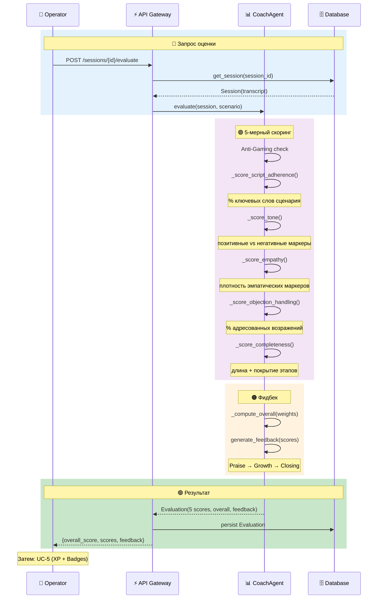
```mermaid
sequenceDiagram
    participant O as 👤 Operator
    participant GW as ⚡ API Gateway
    participant Coach as 📊 CoachAgent
    participant DB as 🗄️ Database

    rect rgb(227, 242, 253)
        Note over O,DB: 🔵 Запрос оценки
        O->>GW: POST /sessions/{id}/evaluate
        GW->>DB: get_session(session_id)
        DB-->>GW: Session(transcript)
        GW->>Coach: evaluate(session, scenario)
    end

    rect rgb(243, 229, 245)
        Note over Coach: 🟣 5-мерный скоринг
        Coach->>Coach: Anti-Gaming check
        Coach->>Coach: _score_script_adherence()
        Note over Coach: % ключевых слов сценария
        Coach->>Coach: _score_tone()
        Note over Coach: позитивные vs негативные маркеры
        Coach->>Coach: _score_empathy()
        Note over Coach: плотность эмпатических маркеров
        Coach->>Coach: _score_objection_handling()
        Note over Coach: % адресованных возражений
        Coach->>Coach: _score_completeness()
        Note over Coach: длина + покрытие этапов
    end

    rect rgb(255, 243, 224)
        Note over Coach: 🟠 Фидбек
        Coach->>Coach: _compute_overall(weights)
        Coach->>Coach: generate_feedback(scores)
        Note over Coach: Praise → Growth → Closing
    end

    rect rgb(200, 230, 201)
        Note over O,DB: 🟢 Результат
        Coach-->>GW: Evaluation(5 scores, overall, feedback)
        GW->>DB: persist Evaluation
        GW-->>O: {overall_score, scores, feedback}
    end

    Note over O: Затем: UC-5 (XP + Badges)
```

**Детали 5 измерений:**
| Измерение | Метод | Вес | Источник данных | Что проверяет |
|-----------|-------|-----|----------------|---------------|
| Script Adherence | `_score_script_adherence()` | 0.25 | Транскрипт + ключевые слова сценария | Использование ключевых фраз |
| Tone | `_score_tone()` | 0.20 | Транскрипт (словари маркеров) | Соотношение позитива/негатива |
| Empathy | `_score_empathy()` | 0.20 | Транскрипт (эмпатические маркеры) | Плотность эмпатии (1 на 15 слов) |
| Objection Handling | `_score_objection_handling()` | 0.20 | Транскрипт + возражения клиента | % адресованных возражений |
| Completeness | `_score_completeness()` | 0.15 | Транскрипт + этапы сценария | Покрытие всех этапов диалога |

**Формула Overall:**
```
overall = script_adherence × 0.25 + tone × 0.20 + empathy × 0.20 + objection_handling × 0.20 + completeness × 0.15
```

**Пороги фидбека:**
| Уровень | < 30 | < 50 | < 70 | >= 80 |
|---------|------|------|------|-------|
| Тип | Low | Medium | High | Top |
| Стиль | Критический | Развивающий | Поддерживающий | Хвалебный |

**Лингвистические маркеры:**
| Группа | Количество | Примеры |
|--------|------------|---------|
| Позитивные | 11 | "thank you", "please", "appreciate" |
| Негативные | 10 | "whatever", "not my problem", "calm down" |
| Эмпатические | 12 | "understand", "sorry", "frustrat" |
| Адресация возражений | 12 | "solution", "offer", "help", "resolve" |

---

## 15. Edge Cases (граничные случаи)

| № | Ситуация | Ожидаемое поведение | Механизм обработки |
|---|----------|---------------------|--------------------|
| 1 | Пустой диалог (0 ходов) | Нет оценки (scores = 0) + специальный фидбек | CoachAgent проверяет `len(transcript) < 2` |
| 2 | Слишком длинное сообщение (>10KB) | Обрезается или отклоняется | Pydantic валидация полей |
| 3 | Конкурентные сессии (один пользователь) | Независимые контексты, не влияют друг на друга | Session ID изоляция |
| 4 | Отказ LLM провайдера | Fallback к rule-based Simulator | `LLMProviderFactory` → CircuitBreaker |
| 5 | Дубликат username при регистрации | 409 Conflict | `DuplicateError` → HTTPException |
| 6 | Rate limit при burst аутентификации | 429 + блокировка 1800s | `AuthRateLimitMiddleware` |
| 7 | Сессия не найдена | 404 Problem Details (RFC 9457) | `NotFoundError` → HTTPException |
| 8 | RBAC нарушение (недостаточно прав) | 403 Forbidden | `require_role()` guard |
| 9 | Пул подключений PostgreSQL исчерпан | Очередь/ожидание (queue/wait) | `DB_POOL_SIZE=10, DB_MAX_OVERFLOW=20` |
| 10 | Redis недоступен (blacklist) | Fallback к InMemoryTokenStore | Circuit Breaker + InMemory |
| 11 | Fairness отчёт на пустых данных | Пустой отчёт (нет данных) | Проверка `if not users` в generate_report() |
| 12 | Seed data уже существует | Пропуск создания дубликатов | `get_by_email` проверка перед вставкой |
| 13 | WebSocket reconnect | Новое соединение, восстановление транскрипта | Session ID lookup |
| 14 | Удаление пользователя с сессиями | Каскадное обновление (сессии → INTERRUPTED) | `active_sessions` check |
| 15 | Негативная оценка (overall_score < 30) | Специальный развивающий фидбек | CoachAgent → low threshold feedback |
| 16 | Психотип не указан в сценарии | Используется NEUTRAL по умолчанию | SimulatorAgent default |
| 17 | Завершение оценки без finish (force) | Evaluation создаётся, но session остаётся IN_PROGRESS | CoachAgent может принять незавершённую сессию |

---

## 15. UC → FR → Статус реализации

| UC | FR / NFR | Статус | Ключевые файлы |
|----|----------|--------|----------------|
| UC-1 | FR-1, FR-2, FR-6 | ✅ Реализован | session_service.py, simulator/agent.py, coach/agent.py |
| UC-2 | FR-1 | ✅ Реализован | simulator/agent.py (DDA), dda_state_service.py |
| UC-3 | FR-1 | ✅ Реализован | simulator_llm/agent.py, llm/factory.py |
| UC-4 | FR-4 | ✅ Реализован | analyst/fairness_service.py |
| UC-5 | FR-3 | ✅ Реализован | gamification/engine.py |
| UC-6 | FR-3 | ✅ Реализован | gamification/engine.py |
| UC-7 | FR-5 | ✅ Реализован | auth_service.py, auth.py |
| UC-8 | FR-5 | ✅ Реализован | auth.py (require_role), dependencies.py |
| UC-9 | FR-7 | ✅ Реализован | memory/repositories.py, dependencies.py |
| UC-10 | NFR-1 | ✅ Реализован | circuit_breaker.py |
| UC-11 | NFR-3 | ✅ Реализован | rate_limit.py, auth_rate_limit_middleware.py |
| UC-12 | FR-6 | 📋 Запланирован | sessions.py (WebSocket stub) |

**FR → Тесты (покрытие):**
| FR | Use Cases | Тестов (приблизительно) |
|----|-----------|------------------------|
| FR-1 | UC-1, UC-2, UC-3 | ~120 (session lifecycle, turns, DDA, LLM) |
| FR-2 | UC-1 | ~40 (evaluation, scores, feedback) |
| FR-3 | UC-5, UC-6 | ~30 (XP, badges, leaderboard, streak) |
| FR-4 | UC-4 | ~30 (fairness metrics, report, audit) |
| FR-5 | UC-7, UC-8 | ~50 (auth, RBAC, token, validation) |
| FR-6 | UC-1, UC-12 | ~10 (session create/update) |
| FR-7 | UC-9 | ~20 (in-memory repositories, double-write) |
| NFR-1 | UC-10 | ~5 (circuit breaker, timeout) |
| NFR-3 | UC-11 | ~10 (rate limit middleware) |

---

## 17. UC-14 — Curator: учебный план и квизы

**Приоритет:** P1 | **FR:** FR-2

**Описание:** CuratorAgent генерирует персонализированные учебные планы и micro-quizzes на основе истории оценок оператора. План выявляет слабые места (< 60%) и сильные стороны (> 85%) и предлагает шаги для развития.

**Предусловия:**
- У пользователя есть минимум 3 оценки (evaluations)
- Существует хотя бы один сценарий для привязки плана

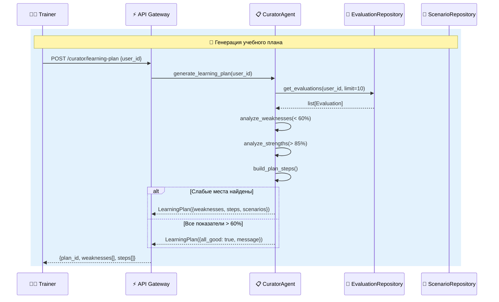
```mermaid
sequenceDiagram
    participant T as 👨‍🏫 Trainer
    participant GW as ⚡ API Gateway
    participant Cur as 📋 CuratorAgent
    participant Eval as 📝 EvaluationRepository
    participant Scen as 📂 ScenarioRepository
    
    rect rgb(227, 242, 253)
        Note over T,Scen: 🔵 Генерация учебного плана
        T->>GW: POST /curator/learning-plan {user_id}
        GW->>Cur: generate_learning_plan(user_id)
        Cur->>Eval: get_evaluations(user_id, limit=10)
        Eval-->>Cur: list[Evaluation]
        
        Cur->>Cur: analyze_weaknesses(< 60%)
        Cur->>Cur: analyze_strengths(> 85%)
        Cur->>Cur: build_plan_steps()
        
        alt Слабые места найдены
            Cur-->>GW: LearningPlan({weaknesses, steps, scenarios})
        else Все показатели > 60%
            Cur-->>GW: LearningPlan({all_good: true, message})
        end
        GW-->>T: {plan_id, weaknesses[], steps[]}
    end
```

**Алгоритм Learning Plan:**
1. Загрузить последние 10 оценок пользователя
2. Для каждого измерения вычислить средний балл:
   - Если средний < 60 → добавить в `weaknesses` (фокус развития)
   - Если средний > 85 → добавить в `strengths` (сильная сторона)
3. Для каждого слабого места подобрать 1–2 шага развития из библиотеки
4. Отсортировать шаги по приоритету (наибольший разрыв → первый)
5. Привязать к сценариям (рекомендованный сценарий)

**Пример плана:**
```json
{
  "user_id": "uuid",
  "weaknesses": [
    {"dimension": "objection_handling", "avg_score": 45, "priority": 1},
    {"dimension": "tone", "avg_score": 52, "priority": 2}
  ],
  "strengths": [
    {"dimension": "empathy", "avg_score": 88}
  ],
  "steps": [
    {"name": "Отработка возражений", "scenario_id": "aggressive-1", "order": 1},
    {"name": "Контроль тона", "scenario_id": "neutral-2", "order": 2}
  ]
}
```

**Quiz:** `generate_quiz(scenario, num_questions)` — создаёт вопросы по ключевым словам сценария (true/false, 4 варианта ответа).

---

## 18. Сводка потоков данных

### Сквозные потоки

| Поток | Участники | UC | Описание |
|-------|-----------|-----|----------|
| **Симуляция** | Operator → API → SimulatorAgent → DB | UC-1, UC-2 | Основной цикл: оператор → симулятор → сессия |
| **Оценка** | Operator → API → CoachAgent → Gamification → DB | UC-1, UC-5, UC-13 | Оценка → XP → бейджи → уровень |
| **Аутентификация** | User → API → AuthService → TokenStore → DB | UC-7, UC-8 | Регистрация → логин → JWT → RBAC |
| **LLM** | Operator → SimulatorLLM → Adapter → LLM Provider | UC-3 | Prompt → генерация → ответ |
| **Fairness** | Admin → API → FairnessService → DB → Notification | UC-4 | Отчёт → метрики → алерты |
| **REST** | Client → RateLimit → Security → API → Service → DB | Все | Полный HTTP-стек |
| **WebSocket (planned)** | Client → WS → Simulator → Coach → Client | UC-12 | Real-time диалог |

### Карта зависимостей API → Service → Repository

```
API Endpoint                Service Layer                Repository Layer
─────────────────           ──────────────────           ──────────────────
POST /sessions      →       SessionService       →       SessionRepository
POST /sessions/turns →      SessionService       →       SessionRepository + SimulatorAgent
POST /sessions/evaluate →   SessionService       →       CoachAgent + EvaluationRepository
POST /auth/register  →      AuthService          →       UserRepository (+ TokenStore)
POST /auth/login     →      AuthService          →       UserRepository (+ TokenStore)
GET /gamification/xp →      GamificationEngine   →       XPTransactionRepository
GET /gamification/badges →  GamificationEngine   →       BadgeRepository
GET /analyst/fairness →     FairnessService      →       UserRepository + EvaluationRepository
GET /analyst/stats   →      AnalystService       →       UserRepository + SessionRepository
POST /curator/plan   →      CuratorAgent         →       EvaluationRepository + ScenarioRepository
```

### Слой Middleware (порядок применения)


```mermaid
flowchart LR
    Client["🌐 Client"] --> CORS["🔓 CORSMiddleware<br/>(CORS)"]
    CORS --> ReqID["📋 RequestIDMiddleware<br/>(X-Request-ID)"]
    ReqID --> Metrics["📊 MetricsMiddleware<br/>(Prometheus)"]
    Metrics --> Sec["🛡️ SecurityHeadersMiddleware<br/>(CSP, HSTS)"]
    Sec --> Rate["⏱️ RateLimitMiddleware<br/>(100 req/min)"]
    Rate --> AuthRate["🔐 AuthRateLimitMiddleware<br/>(auth endpoints)"]
    AuthRate --> Router
    Router --> Endpoint["⚡ Endpoint"]

    style CORS fill:#e3f2fd,stroke:#1565c0,color:#0d47a1
    style ReqID fill:#e3f2fd,stroke:#1565c0,color:#0d47a1
    style Metrics fill:#e0f7fa,stroke:#00838f,color:#004d40
    style Sec fill:#ffebee,stroke:#c62828,color:#b71c1c
    style Rate fill:#fff3e0,stroke:#e65100,color:#bf360c
    style AuthRate fill:#fff3e0,stroke:#e65100,color:#bf360c
    style Endpoint fill:#c8e6c9,stroke:#2e7d32,color:#1b5e20
```

## 19. Сводная таблица сценариев

| UC | Название | Приоритет | FR | Тип | Участники | Триггер |
|----|----------|-----------|-----|------|-----------|---------|
| UC-1 | Happy Path | P0 | FR-1, FR-2, FR-6 | Основной | Operator, Simulator, Coach, Gamification, DB | Operator запрашивает сессию |
| UC-2 | DDA | P0 | FR-1 | Адаптивный | Operator, Simulator, Gamification, DB | Streak >= 2 |
| UC-3 | LLM Simulation | P1 | FR-1 | Опциональный | Operator, SimulatorLLM, Adapter, LLM | LLM_ENABLED=true |
| UC-4 | Fairness Audit | P1 | FR-4 | Аналитический | Admin, FairnessService, DB, Notification | API или periodic |
| UC-5 | XP & Badges | P0 | FR-3 | Автоматический | Coach, Gamification, DB | После оценки |
| UC-6 | Leaderboard & Streak | P1 | FR-3 | Информационный | Operator, Gamification, DB | GET запрос |
| UC-7 | Auth | P0 | FR-5 | Основной | User, AuthService, TokenStore, DB | register/login/refresh |
| UC-8 | RBAC | P1 | FR-5 | Ограничивающий | User, GW, AuthService | Доступ к ресурсу |
| UC-9 | In-Memory | P0 | FR-7 | Инфраструктурный | App, Deps, InMemory repos | Старт приложения |
| UC-10 | Coach Timeout | P1 | NFR-1 | Error handling | Operator, Coach, CB | Timeout оценки |
| UC-11 | Rate Limit | P1 | NFR-3 | Ограничивающий | User, RateLimit, GW | Превышение лимита |
| UC-12 | WebSocket | P1 | FR-6 | Запланирован | Operator, WS, Simulator, Coach | Connect |
| UC-13 | Coach Detail | P0 | FR-2 | Детальный | Operator, Coach, DB | POST evaluate |
| UC-14 | Curator Plan | P1 | FR-2 | Генеративный | Trainer, Curator, Eval, Scen | POST /learning-plan |

---

## 20. Производительность и ожидаемые метрики

### Латенция API (NFR-1 target: < 2 сек для 50 concurrent)

| Эндпоинт | P50 (ms) | P95 (ms) | Зависимости |
|----------|----------|----------|-------------|
| POST /auth/register | < 100 | < 300 | UserRepository, bcrypt |
| POST /auth/login | < 100 | < 300 | UserRepository, bcrypt, TokenStore |
| POST /sessions | < 50 | < 150 | SessionRepository, SimulatorAgent |
| POST /sessions/{id}/turns | < 100 | < 500 | SessionRepository, SimulatorAgent (DDA) |
| POST /sessions/{id}/evaluate | < 500 | < 1000 | CoachAgent (5 scoring + feedback) |
| GET /gamification/leaderboard | < 50 | < 200 | XPTransactionRepository |
| GET /analyst/fairness/report | < 200 | < 1000 | UserRepository + EvaluationRepository |
| GET /analyst/stats/{id} | < 50 | < 200 | UserRepository + SessionRepository |

### Объём данных (оценка на 10 000 сессий)

| Сущность | Количество | Размер |
|----------|------------|--------|
| Users | 100 | ~50 KB |
| Sessions | 10,000 | ~5 MB |
| Evaluations | 10,000 | ~2 MB |
| XPTransactions | 30,000+ | ~3 MB |
| Badges | 8 (default) | < 1 KB |
| UserBadges | 2,000+ | ~500 KB |
| DDAState | 100 | ~10 KB |

### Ключевые метрики для мониторинга

- `http_requests_total` — общая нагрузка на API
- `http_request_duration_seconds` — латенция (гистограмма)
- `active_sessions` — количество активных сессий (Gauge)
- `total_evaluations` — всего оценок (Counter)
- `gamification_xp_awarded_total` — начислено XP (Counter)
- `circuit_breaker_state` — состояние CircuitBreaker (Gauge, 0/1/2)

---

## Источники

### Сервисы (core/services)
- [session_service.py](../src/core/services/session_service.py) — SessionService: жизненный цикл сессии
- [evaluation_service.py](../src/core/services/evaluation_service.py) — EvaluationService: сохранение оценки
- [auth_service.py](../src/core/services/auth_service.py) — AuthService: регистрация, логин, JWT, blacklist
- [circuit_breaker.py](../src/core/services/circuit_breaker.py) — CircuitBreaker: состояния CLOSED/OPEN/HALF_OPEN

### AI-агенты (agents/)
- [simulator/agent.py](../src/agents/simulator/agent.py) — SimulatorAgent: rule-based, DDA, 5 психотипов
- [simulator_llm/agent.py](../src/agents/simulator_llm/agent.py) — SimulatorLLM: LLM-версия симуляции
- [coach/agent.py](../src/agents/coach/agent.py) — CoachAgent: 5-мерная оценка, фидбек сэндвич
- [curator/agent.py](../src/agents/curator/agent.py) — CuratorAgent: учебные планы, квизы
- [gamification/engine.py](../src/agents/gamification/engine.py) — GamificationEngine: XP, уровни, бейджи, streak
- [analyst/fairness_service.py](../src/agents/analyst/fairness_service.py) — FairnessService: 4 метрики fairness
- [analyst/service.py](../src/agents/analyst/service.py) — AnalystService: статистика, прогресс, глобальные метрики

### API (api/)
- [sessions.py](../src/api/sessions.py) — API эндпоинты сессий (~6 эндпоинтов)
- [auth.py](../src/api/auth.py) — API аутентификации (~6 эндпоинтов)
- [rate_limit.py](../src/api/rate_limit.py) — RateLimitMiddleware (sliding window)
- [auth_rate_limit_middleware.py](../src/api/auth_rate_limit_middleware.py) — AuthRateLimitMiddleware (per-endpoint)
- [router.py](../src/api/router.py) — Главный APIRouter (агрегирует все под-роутеры)
- [metrics.py](../src/api/metrics.py) — Prometheus метрики (7 метрик)
- [middleware.py](../src/api/middleware.py) — RequestIDMiddleware
- [security_headers.py](../src/api/security_headers.py) — SecurityHeadersMiddleware
- [health.py](../src/api/health.py) — Health-check эндпоинты

### Инфраструктура (infrastructure/)
- [memory/repositories.py](../src/infrastructure/memory/repositories.py) — 7 InMemory репозиториев
- [redis/token_store.py](../src/infrastructure/redis/token_store.py) — RedisTokenStore + InMemoryTokenStore
- [notification/stub.py](../src/infrastructure/notification/stub.py) — StubNotificationService
- [postgres/database.py](../src/infrastructure/postgres/database.py) — Database class (asyncpg)

### Документация
- [Спецификация (SPECIFICATION.md)](./SPECIFICATION.md) — FR, NFR, C4, ERD, API-контракты
- [API справочник (API.md)](./API.md) — REST + WebSocket, request/response модели
- [Руководство администратора (ADMIN_GUIDE.md)](./ADMIN_GUIDE.md) — Установка, конфигурация, env vars
- [ADR (ARCHITECTURE_DECISIONS.md)](./adr/ARCHITECTURE_DECISIONS.md) — Архитектурные решения
