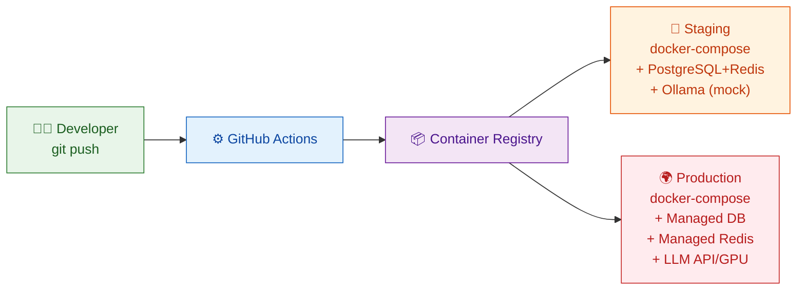
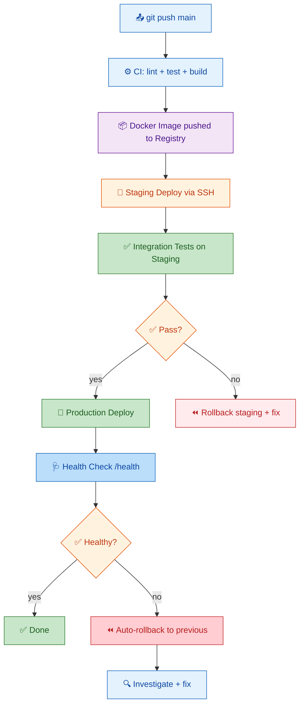

# План развёртывания — AI Roleplay Coach Hub

> Для DevOps и администраторов. Полный план production-развёртывания.

---

## 1. Введение

### 1.1 Назначение

Этот документ охватывает полный жизненный цикл развёртывания AI Roleplay Coach Agent: требования к инфраструктуре, настройка окружений (dev/staging/production), процесс деплоя, чеклист production-готовности, runbook (сценарии отказов), масштабирование и мониторинг.

**Архитектура развёртывания (обзор):**



### 1.2 Компоненты системы

| Компонент | Сервис | Порт | Хранение | Масштабирование | Зависимость |
|-----------|--------|------|----------|-----------------|-------------|
| FastAPI App | API-сервер | 8000 | Stateless | Горизонтальное (workers) | Все сервисы |
| PostgreSQL 16 | База данных | 5432 | Volume (pgdata) | Read replicas | — |
| Redis 7 | Кэш / token store | 6379 | AOF / RDB | Cluster / Sentinel | — |
| Qdrant 1.13 | Векторная БД | 6333 | Volume (qdrant_storage) | Cluster | — |
| Nginx | Reverse proxy, TLS | 80/443 | Stateless | Не требуется | API |
| Prometheus | Метрики | 9090 | Volume (prometheus_data) | Не требуется | Все сервисы |
| Grafana | Дашборды | 3000 | Volume (grafana_data) | Не требуется | Prometheus, Loki |
| Loki | Логи | 3100 | Volume (loki_data) | Не требуется | Все сервисы |
| Ollama | LLM-инференс | 11434 | Volume (~4-8 GB) | GPU | — |

### 1.3 Принципы развёртывания

1. **Immutable infrastructure:** Каждый деплой — новый Docker-образ, никаких hotfix-ов на сервере
2. **Zero-downtime:** Rolling update без прерывания активных сессий
3. **In-memory по умолчанию:** Приложение работает без PostgreSQL/Redis/Qdrant в dev-режиме
4. **Fail gracefully:** При недоступности LLM — fallback на rule-based оценку
5. **Observability встроена:** Prometheus метрики + structured logging с первого дня
6. **Security by default:** Non-root пользователь, TLS, rate limiting, security headers

---

## 2. Требования к инфраструктуре

### 2.1 Аппаратные требования

| Окружение | CPU | RAM | Диск | Примечания |
|-----------|-----|-----|------|-----------|
| Разработка (dev) | 2 ядра | 4 GB | 10 GB SSD | Docker Desktop, in-memory режим |
| Стенд (staging) | 2 ядра | 8 GB | 20 GB SSD | + Ollama (mock в CI) |
| Production (без LLM) | 2 ядра | 8 GB | 50 GB SSD | Базовая конфигурация |
| Production (Ollama) | 4+ ядер | 16+ GB | 100 GB SSD | GPU опционально для 7B |
| Production (OpenAI) | 2 ядра | 8 GB | 50 GB SSD | Без локальной LLM |

**Дополнительные требования к диску:**

| Тип данных | Размер | Тип диска | IOPS |
|------------|--------|-----------|------|
| PostgreSQL data | 10-50 GB | SSD (NVMe) | >3000 |
| Redis AOF/RDB | 1-5 GB | SSD | >1000 |
| Qdrant vectors | 5-20 GB | SSD | >2000 |
| Docker images | 2-5 GB | SSD | Любой |
| Backups | 10-100 GB | HDD или S3 | Любой |
| Logs | 5-20 GB | SSD или HDD | Любой |

### 2.2 Сетевые требования

| Направление | Порт | Источник | Назначение | Назначение |
|-------------|------|----------|------------|------------|
| Inbound | 80 | Интернет | Reverse proxy | HTTP (редирект на HTTPS) |
| Inbound | 443 | Интернет | Reverse proxy | HTTPS (API + фронтенд) |
| Inbound | 8000 | Reverse proxy | FastAPI | Backend API |
| Inbound | 9090 | Администраторы | Prometheus | Метрики |
| Inbound | 3000 | Администраторы | Grafana | Дашборды |
| Inbound | 22 | Администраторы | SSH | Управление |
| Internal | 5432 | FastAPI | PostgreSQL | База данных |
| Internal | 6379 | FastAPI | Redis | Кэш / rate limiting |
| Internal | 6333 | FastAPI | Qdrant | Векторная БД (HTTP) |
| Outbound | 11434 | FastAPI | Ollama | LLM-инференс (локальный) |
| Outbound | 443 | FastAPI | OpenAI API | LLM-инференс (облачный) |

### 2.3 DNS-записи

```
api.coach.example.com    → A / AAAA → Reverse proxy IP  (API-сервер)
app.coach.example.com    → CNAME    → CDN                (Фронтенд SPA)
grafana.coach.example.com → A       → Reverse proxy IP   (Grafana, опционально)
```

**Рекомендации:**
- Используйте CNAME для CDN (CloudFront, Cloudflare, Fastly)
- Для API используйте A-запись с низким TTL (60-300s) для быстрой смены IP
- Настройте SPF/DKIM/DMARC для email-уведомлений (если используются)

### 2.4 Network Security

| Мера | Реализация |
|------|------------|
| Firewall | Docker bridge network (внутренняя изоляция) + iptables/nftables |
| TLS termination | Nginx Reverse Proxy с Let's Encrypt |
| SSH access | Key-only, disable password auth, fail2ban |
| Docker security | Non-root user, read-only rootfs, no privileged mode |
| Secrets | Все секреты через env vars, никогда в образах |
| CORS | Разрешён только домен фронтенда |
| Rate limiting | 100 req/min для API, 5 req/10min для /auth/login |
| WAF | ModSecurity в Nginx (опционально) |

### 2.5 CDN Integration

Для раздачи фронтенда (SPA) через CDN:

```bash
# Cloudflare (рекомендуется)
# - API через Nginx → FastAPI
# - Фронтенд через Cloudflare Pages / CDN

# AWS CloudFront
# - Origin: Nginx / Load Balancer
# - Static assets: S3 bucket

# Ограничения CDN для API:
# - Не кэшировать POST/PUT/DELETE
# - Не кэшировать /api/v1/*
# - WebSocket должен идти напрямую
```

**Правила кэширования CDN:**
```
/api/v1/*            → No-cache, must-revalidate
/health              → No-cache
/metrics             → No-cache
/assets/*            → Cache 1 year, immutable
/*.js, /*.css        → Cache 1 year, immutable
/static/*            → Cache 1 year, immutable
```

### 2.6 Мониторинг инфраструктуры

**Рекомендуемый стек:**

| Компонент | Роль | Порт |
|-----------|------|------|
| Prometheus | Сбор метрик (pull model) | 9090 |
| Grafana | Визуализация + алерты | 3000 |
| Node Exporter | Метрики сервера (CPU, RAM, disk) | 9100 |
| cAdvisor | Метрики Docker-контейнеров | 8080 |
| Loki | Агрегация логов | 3100 |
| Promtail | Сборщик логов в Loki | — |
| Alertmanager | Маршрутизация алертов | 9093 |
| Blackbox Exporter | Внешний мониторинг (endpoint health) | 9115 |

**Алерты (Prometheus Alerting Rules):**

```yaml
groups:
  - name: coach-hub
    rules:
      - alert: HighErrorRate
        expr: rate(http_request_duration_seconds_count{status=~"5.."}[5m]) > 0.05
        for: 5m
        labels:
          severity: critical
        annotations:
          summary: "Error rate > 5% за 5 мин"

      - alert: HighLatency
        expr: histogram_quantile(0.95, rate(http_request_duration_seconds_bucket[5m])) > 2
        for: 5m
        labels:
          severity: warning
        annotations:
          summary: "P95 latency > 2s"

      - alert: LLMTimeouts
        expr: rate(llm_request_timeouts_total[5m]) > 0.1
        for: 2m
        labels:
          severity: critical
        annotations:
          summary: "LLM timeout rate > 10%"

      - alert: CircuitBreakerOpen
        expr: circuit_breaker_state{state="open"} == 1
        for: 1m
        labels:
          severity: critical
        annotations:
          summary: "Circuit breaker OPEN для LLM провайдера"

      - alert: DiskUsage
        expr: (node_filesystem_avail_bytes / node_filesystem_size_bytes) < 0.1
        for: 5m
        labels:
          severity: warning
        annotations:
          summary: "Менее 10% свободного места на диске"
```

---

## 3. Окружения

### 3.1 Таблица окружений

| Параметр | Dev | Staging | Production |
|----------|-----|---------|------------|
| **Docker Compose** | [docker-compose.dev.yml](docker-compose.dev.yml) | [docker-compose.prod.yml](docker-compose.prod.yml) | [docker-compose.prod.yml](docker-compose.prod.yml) |
| **LLM провайдер** | mock | mock / ollama | ollama / openai |
| **PostgreSQL** | Контейнер (эфемерный) | Контейнер (persistent) | Managed (Cloud) или контейнер |
| **Redis** | In-memory (mock) | Контейнер (AOF) | Managed (ElastiCache) или контейнер |
| **Qdrant** | In-memory (mock) | Контейнер (on-disk) | Контейнер (on-disk) |
| **Бэкапы** | Не требуются | Ежедневно (7 дней) | Ежедневно (30 дн) + еженед. (6 мес) |
| **Мониторинг** | Нет | Prometheus + Grafana | Prometheus + Grafana + алерты |
| **TLS** | Нет (http) | Да (self-signed) | Да (Let's Encrypt) |
| **Rate limiting** | Выключен | Включён (100/min) | Включён (100/min, auth 5/10min) |
| **CORS** | * (все) | Домен стенда | Домен продакшена |
| **Workers** | 1 (reload) | 4 | 4-8 |
| **Secrets** | Значения по умолч. | Установлены | Ротированы каждые 90 дней |

### 3.2 Разработка (dev)

**Цель:** Локальная разработка, модульное тестирование

**Запуск:**
```bash
# In-memory режим (без Docker, самый быстрый)
make install
uvicorn src.main:app --reload

# С Docker сервисами
docker compose -f docker-compose.dev.yml up -d
uvicorn src.main:app --reload

# Полный стек в Docker
docker compose -f docker-compose.dev.yml -f docker-compose.monitoring.yml up -d
```

**Особенности:**
- Доступ только локальный (localhost)
- LLM: mock (детерминированные ответы, не требует GPU)
- Данные: in-memory (опционально PostgreSQL контейнер)
- Hot-reload: uvicorn --reload
- Rate limiting: выключен (LLM_PROVIDER=mock)
- Логи: цветной вывод в STDOUT
- Мониторинг: опционально (docker-compose.monitoring.yml)
- Фронтенд: Vite dev server (hot reload)

### 3.3 Стенд (staging)

**Цель:** Интеграционное тестирование, проверка перед релизом

**Запуск:**
```bash
# Полный деплой
docker compose -f docker-compose.prod.yml up -d

# С мониторингом
docker compose -f docker-compose.prod.yml -f docker-compose.monitoring.yml up -d
```

**Особенности:**
- Доступ: ограниченный (VPN или IP whitelist)
- LLM: mock в CI, ollama для ручного тестирования
- Данные: persistent PostgreSQL + Redis + Qdrant
- Бэкапы: ежедневные (7 дней retention)
- Мониторинг: Prometheus + Grafana (обязательно)
- Алерты: только warning (не critical)
- Логи: JSON-формат, Loki retention 7 дней
- Авто-деплой: через CI/CD (GitHub Actions)

**Подготовка стенда:**
```bash
# 1. Настройка окружения
cp .env.example .env
# Отредактировать: JWT_SIGNING_KEY, POSTGRES_PASSWORD,
# REDIS_PASSWORD, LLM_API_KEY (если используется)

# 2. Развернуть
docker compose -f docker-compose.prod.yml up -d

# 3. Проверить
curl -f http://localhost:8000/health

# 4. Загрузить seed-данные
python scripts/seed_postgres.py

# 5. Настроить мониторинг
docker compose -f docker-compose.monitoring.yml up -d
```

### 3.4 Production (prod)

**Цель:** Рабочая среда для пользователей

**Особенности:**
- Доступ: через reverse proxy (Nginx) с TLS
- LLM: ollama (локальный GPU) или OpenAI API
- Данные: Managed PostgreSQL (AWS RDS / GCP Cloud SQL) или persistent контейнеры
- Бэкапы: ежедневные (30 дней) + еженедельные (6 месяцев)
- Мониторинг: Prometheus + Grafana + PagerDuty/Slack алерты
- Security: SAST scan, dependency audit, rate limiting, WAF
- Disaster recovery: runbook (раздел 7)

**Production deployment checklist (детально в разделе 6):**
```bash
# Пред-деплой
python scripts/health_check.py --env production
python scripts/security_scan.py
pytest tests/security/ -v

# Деплой (rolling update)
docker compose -f docker-compose.prod.yml pull
docker compose -f docker-compose.prod.yml up -d --wait --wait-timeout 60

# Пост-деплой
curl -f https://api.coach.example.com/health
curl -f https://api.coach.example.com/api/v1/metrics
docker compose -f docker-compose.prod.yml ps
```

---

## 4. Настройка инфраструктуры

### 4.1 Docker Compose Production

**Файл:** [docker-compose.prod.yml](../docker-compose.prod.yml)

**Шаг 1 — Клонирование и настройка:**
```bash
git clone https://github.com/example/ai-roleplay-coach-hub.git
cd ai-roleplay-coach-hub
cp .env.example .env
nano .env  # Сменить JWT_SECRET, POSTGRES_PASSWORD, LLM_API_KEY
```

**Шаг 2 — Деплой:**
```bash
docker compose -f docker-compose.prod.yml up -d
```

**Шаг 3 — Проверка:**
```bash
docker compose -f docker-compose.prod.yml ps
curl http://localhost:8000/api/v1/health
docker compose -f docker-compose.prod.yml logs --tail=50
```

**Сервисы в production compose:**

| Сервис | Образ | Healthcheck | Перезапуск |
|--------|-------|-------------|------------|
| api | coach-hub (build) | GET /health -> 200 | unless-stopped |
| postgres | postgres:16-alpine | pg_isready | unless-stopped |
| redis | redis:7-alpine | redis-cli ping | unless-stopped |
| qdrant | qdrant/qdrant:v1.13.6 | /health -> {"ok":true} | unless-stopped |

**Production [Dockerfile.prod](Dockerfile.prod) (multi-stage):**
```dockerfile
FROM python:3.12-slim AS builder
RUN apt-get update && apt-get install -y --no-install-recommends gcc
COPY pyproject.toml .
RUN pip install --user -e ".[prod]"

FROM python:3.12-slim
COPY --from=builder /root/.local /root/.local
ENV PATH=/root/.local/bin:$PATH
RUN adduser --disabled-password --gecos '' app
USER app
COPY src/ src/
EXPOSE 8000
HEALTHCHECK --interval=5s --timeout=3s --retries=3 \
  CMD python -c "import urllib.request; urllib.request.urlopen('http://localhost:8000/api/v1/health')"
CMD ["uvicorn", "src.main:app", "--host", "0.0.0.0", "--port", "8000", "--workers", "4"]
```

### 4.2 PostgreSQL Configuration

**Настройки (через env vars):**
- `POSTGRES_USER=coach`, `POSTGRES_DB=coach_hub`
- `DB_POOL_SIZE=10` (увеличить при нагрузке)
- `DB_MAX_OVERFLOW=20` (запас при пиках)

**Production hardening:**
```sql
-- Пользователь приложения (не superuser)
CREATE USER coach_app WITH PASSWORD '<strong_password>';
GRANT CONNECT ON DATABASE coach_hub TO coach_app;
GRANT USAGE ON SCHEMA public TO coach_app;
GRANT SELECT, INSERT, UPDATE, DELETE ON ALL TABLES IN SCHEMA public TO coach_app;
ALTER DEFAULT PRIVILEGES IN SCHEMA public GRANT SELECT, INSERT, UPDATE, DELETE ON TABLES TO coach_app;
CREATE EXTENSION IF NOT EXISTS pg_stat_statements;
ALTER SYSTEM SET max_connections = 100;
```

**postgresql.conf (рекомендуемые настройки):**
```conf
shared_buffers = '2GB'
effective_cache_size = '6GB'
work_mem = '64MB'
maintenance_work_mem = '512MB'
random_page_cost = 1.1
effective_io_concurrency = 200
wal_level = replica
max_wal_size = '4GB'
min_wal_size = '1GB'
wal_buffers = '64MB'
shared_preload_libraries = 'pg_stat_statements'
track_io_timing = on
```

**Расписание бэкапов:**
```bash
# Ежедневно в 2:00
0 2 * * * pg_dump -U coach -d coach_hub | gzip > /backups/pg/coach_hub_$(date +\%Y\%m\%d).sql.gz
# Очистка старше 30 дней
0 3 * * * find /backups/pg -name "*.sql.gz" -mtime +30 -delete
```

### 4.3 Redis Configuration

**Настройки:**
- Образ: `redis:7-alpine`
- Персистентность: AOF
- Политика: `allkeys-lru`

**Production конфиг:**
```conf
maxmemory 2gb
maxmemory-policy allkeys-lru
appendonly yes
appendfsync everysec
auto-aof-rewrite-percentage 100
auto-aof-rewrite-min-size 64mb
bind 0.0.0.0
protected-mode yes
latency-monitor-threshold 100
```

**Мониторинг:**
```bash
docker exec redis redis-cli INFO memory
docker exec redis redis-cli DBSIZE
docker exec redis redis-cli SLOWLOG GET 10
```

### 4.4 Qdrant Configuration

**Настройки:**
- Образ: `qdrant/qdrant:v1.13.6`
- Режим: on-disk (данные в `/qdrant/storage`)
- Порт: `6333` (HTTP)

**Создание коллекции при старте:**
```bash
curl -X PUT http://localhost:6333/collections/sessions \
  -H "Content-Type: application/json" \
  -d '{"vectors": {"size": 1024, "distance": "Cosine"}}'
```

**Снапшоты:**
```bash
curl -X POST http://localhost:6333/collections/sessions/snapshots
curl -X GET http://localhost:6333/collections/sessions/snapshots
```

### 4.5 Reverse Proxy (Nginx)

**Планируемый файл:** `[deploy/nginx/nginx.conf](deploy/nginx/nginx.conf)`

```nginx
upstream coach_api {
    server localhost:8000;
}

server {
    listen 80;
    server_name api.coach.example.com app.coach.example.com;
    return 301 https://$server_name$request_uri;
}

server {
    listen 443 ssl http2;
    server_name api.coach.example.com;

    ssl_certificate /etc/letsencrypt/live/api.coach.example.com/fullchain.pem;
    ssl_certificate_key /etc/letsencrypt/live/api.coach.example.com/privkey.pem;
    ssl_protocols TLSv1.2 TLSv1.3;

    add_header Strict-Transport-Security "max-age=63072000" always;
    add_header X-Content-Type-Options "nosniff" always;
    add_header X-Frame-Options "DENY" always;

    location / {
        proxy_pass http://coach_api;
        proxy_set_header Host $host;
        proxy_set_header X-Real-IP $remote_addr;
        proxy_set_header X-Forwarded-For $proxy_add_x_forwarded_for;
        proxy_set_header X-Forwarded-Proto $scheme;
        proxy_connect_timeout 60s;
        proxy_read_timeout 120s;
    }

    location /ws/ {
        proxy_pass http://coach_api;
        proxy_http_version 1.1;
        proxy_set_header Upgrade $http_upgrade;
        proxy_set_header Connection "upgrade";
        proxy_read_timeout 3600s;
    }

    client_max_body_size 10M;
}
```

### 4.6 Volumes и сети

**Docker Compose volumes:**
```yaml
volumes:
  postgres_data:
    driver: local
    driver_opts:
      type: none
      device: /data/postgres
      o: bind
  redis_data:
    driver: local
  qdrant_data:
    driver: local
  prometheus_data:
    driver: local
  grafana_data:
    driver: local
  loki_data:
    driver: local
```

**Docker Compose networks:**
```yaml
networks:
  backend:
    driver: bridge
    ipam:
      config:
        - subnet: 172.20.0.0/16
  monitoring:
    driver: bridge
    ipam:
      config:
        - subnet: 172.21.0.0/16
```

Сервисы API, PostgreSQL, Redis, Qdrant — в сети `backend`. Prometheus, Grafana, Loki — в сети `monitoring`. API имеет доступ в обе сети.

### 4.7 Env vars (.env)

| Переменная | Обязательная | Default | Описание |
|-----------|-------------|---------|----------|
| JWT_SIGNING_KEY | ✅ | — | Ключ подписи JWT (min 32 символа) |
| POSTGRES_PASSWORD | ✅ | — | Пароль PostgreSQL |
| REDIS_PASSWORD | ❌ | — | Пароль Redis (если требуется) |
| LLM_API_KEY | ❌ | — | API-ключ для OpenAI/GigaChat |
| LLM_PROVIDER | ❌ | mock | Провайдер LLM |
| LLM_TIMEOUT | ❌ | 60 | Таймаут LLM запроса (сек) |
| CORS_ORIGINS | ❌ | ["*"] | Разрешённые CORS origin |
| RATE_LIMIT_DEFAULT | ❌ | 100 | Лимит запросов в минуту |
| RATE_LIMIT_AUTH | ❌ | 5 | Лимит на /auth/login |
| DB_POOL_SIZE | ❌ | 10 | Размер пула PostgreSQL |
| LOG_LEVEL | ❌ | INFO | Уровень логирования |

### 4.8 Prometheus + Grafana Stack

**Prometheus конфиг (prometheus.yml):**
```yaml
global:
  scrape_interval: 15s
  evaluation_interval: 15s
scrape_configs:
  - job_name: coach-hub
    metrics_path: /metrics
    static_configs:
      - targets: [api:8000]
  - job_name: node
    static_configs:
      - targets: [node-exporter:9100]
  - job_name: cadvisor
    static_configs:
      - targets: [cadvisor:8080]
```

**Grafana datasource:**
```yaml
apiVersion: 1
datasources:
  - name: Prometheus
    type: prometheus
    access: proxy
    url: http://prometheus:9090
    isDefault: true
```

**Docker Compose monitoring:**
```yaml
services:
  prometheus:
    image: prom/prometheus
    volumes:
      - prometheus_data:/prometheus
    ports:
      - 9090:9090

  grafana:
    image: grafana/grafana
    environment:
      - GF_SECURITY_ADMIN_USER=admin
      - GF_SECURITY_ADMIN_PASSWORD_FILE=/run/secrets/grafana_admin
    volumes:
      - grafana_data:/var/lib/grafana
    ports:
      - 3000:3000
    secrets:
      - grafana_admin

  node-exporter:
    image: prom/node-exporter
    ports:
      - 9100:9100

  cadvisor:
    image: gcr.io/cadvisor/cadvisor:latest
    volumes:
      - /:/rootfs:ro
      - /var/run:/var/run:ro
      - /sys:/sys:ro
      - /var/lib/docker/:/var/lib/docker:ro
    ports:
      - 8080:8080
```

**Grafana дашборды (рекомендуемые):**

| ID | Название | Источник | Описание |
|----|---------|----------|----------|
| 1860 | Node Exporter Full | node-exporter | CPU, RAM, Disk, Network |
| 14282 | Prometheus 2.0 Stats | Prometheus | TSDB stats, scrape health |
| 1860 | Docker & Container | cAdvisor | Container CPU, memory, IO |
| 22919 | Coach Hub API | API metrics | Request rate, latency, errors |
| 13659 | Loki Logs | Loki | Log query + rate |

**PromQL запросы для дашборда Coach Hub:**

| Панель | PromQL |
|--------|--------|
| HTTP Rate | `rate(http_request_count[5m])` |
| P95 Latency | `histogram_quantile(0.95, rate(http_request_duration_seconds_bucket[5m]))` |
| Error Rate | `rate(http_request_count{status=~"5.."}[5m])` |
| Active Sessions | `active_sessions_total` |
| LLM avg duration | `rate(llm_request_duration_seconds_sum[5m]) / rate(llm_request_duration_seconds_count[5m])` |
| DB Pool Usage | `db_pool_usage` |
| Cache Hit Ratio | `rate(cache_hits_total[5m]) / (rate(cache_hits_total[5m]) + rate(cache_misses_total[5m]))` |

### 4.9 Graceful Shutdown & Readiness

**API health endpoint (`/health`):**
```python
@app.get("/health")
async def health():
    db_ok = await check_db_connection()
    redis_ok = await check_redis_connection()
    qdrant_ok = await check_qdrant_connection()
    status = 200 if all([db_ok, redis_ok, qdrant_ok]) else 503
    return {
        "status": "healthy" if status == 200 else "degraded",
        "timestamp": datetime.utcnow().isoformat(),
        "checks": {"db": "ok" if db_ok else "down",
                   "redis": "ok" if redis_ok else "down",
                   "qdrant": "ok" if qdrant_ok else "down"},
    }
```

**Readiness probe (Nginx):**
```nginx
# Отключает трафик на нездоровый бэкенд
upstream coach_api {
    server api:8000 max_fails=3 fail_timeout=30s;
}
```

**Graceful shutdown (SIGTERM):**
```python
@asynccontextmanager
async def lifespan(app: FastAPI):
    yield
    logger.info("Shutting down gracefully...")
    await db.close()
    await redis.close()
    await qdrant.close()
    logger.info("All connections closed")
```

### 4.10 Backup & Recovery

**PostgreSQL:**
```bash
# /scripts/backup.sh
#!/bin/bash
BACKUP_DIR="/backups/pg"
DATE=$(date +%Y%m%d_%H%M%S)
pg_dump -U coach -d coach_hub | gzip > $BACKUP_DIR/coach_hub_$DATE.sql.gz

# Retention: 30 daily, 6 monthly
find $BACKUP_DIR -name "*.sql.gz" -mtime +30 -delete
```

**Qdrant:**
```bash
# Qdrant snapshot (live, no downtime)
curl -X POST "http://localhost:6333/collections/scenarios/snapshot"
curl -X POST "http://localhost:6333/collections/sessions/snapshot"
```

**Redis:**
```bash
# RDB snapshot (automatically if save config is set)
docker exec redis redis-cli SAVE
# AOF: automatically if appendonly yes

# Backup RDB file
cp /var/lib/docker/volumes/redis-data/_data/dump.rdb /backups/redis/
```

**Restore procedure:**
```bash
# PostgreSQL
gunzip -c /backups/pg/coach_hub_latest.sql.gz | docker exec -i postgres psql -U coach

# Qdrant
curl -X POST "http://localhost:6333/collections/scenarios/snapshots/upload" \
  -F "snapshot=@/backups/qdrant/scenarios-latest.snapshot"
```

### 4.11 Logging (Loki + Promtail)

**Loki конфиг:**
```yaml
services:
  loki:
    image: grafana/loki:3.0
    ports:
      - 3100:3100
    volumes:
      - loki_data:/loki

  promtail:
    image: grafana/promtail:3.0
    volumes:
      - /var/log:/var/log
      - /var/lib/docker/containers:/var/lib/docker/containers
```

**Grafana Loki datasource:**
```yaml
apiVersion: 1
datasources:
  - name: Loki
    type: loki
    access: proxy
    url: http://loki:3100
```

**Log levels and alerts:**

| Level | Действие | Канал |
|-------|----------|-------|
| ERROR | Alert → Telegram | #alerts |
| WARN | Grafana notification | #warnings |
| INFO | Loki retention 30d | — |
| DEBUG | Loki retention 7d | — |

---

## 5. Deployment Process



### 5.1 Стратегии деплоя

| Стратегия | Описание | Downtime | Сложность |
|-----------|----------|----------|-----------|
| **Rolling update** | Постепенная замена контейнеров по одному | Нет | Низкая |
| **Blue-green** | Полный новый стек, переключение трафика | Нет | Средняя |
| **Canary** | Новый трафик на 10% пользователей | Нет | Высокая |
| **Recreate** | Остановить все, запустить новые | Есть | Минимальная |

**Рекомендуется:** Rolling update (Docker Compose native) для первого релиза, Blue-green для продакшена.

### 5.2 Build

```bash
# Production сборка
docker build -f Dockerfile.prod -t coach-hub:latest .

# С тегом версии
docker build -f Dockerfile.prod \
  -t coach-hub:latest \
  -t coach-hub:v1.2.3 \
  .

# С тегом коммита
docker build -f Dockerfile.prod \
  -t ghcr.io/org/coach-hub:${{ github.sha }} \
  .
```

**Dockerfile.prod детали:**
| Stage | Base | Установка | Размер |
|-------|------|-----------|--------|
| builder | python:3.12-slim | gcc + poetry install | ~500 MB |
| runtime | python:3.12-slim | Copy /install + src/ | ~180 MB |
| User | app (non-root, UID 1000) | — | — |
| Healthcheck | HTTP GET /health | 30s interval | — |
| Port | 8000 | uvicorn 4 workers | — |

### 5.3 Deploy (Rolling Update)

```bash
# Шаг 1: Pull нового образа
docker compose -f docker-compose.prod.yml pull

# Шаг 2: Rolling update (по одному контейнеру)
docker compose -f docker-compose.prod.yml up -d --no-deps --scale api=2 api
# Wait for new container to be healthy
sleep 15
# Stop old container
docker compose -f docker-compose.prod.yml up -d --no-deps --scale api=1 api

# Шаг 3: Проверка
docker compose -f docker-compose.prod.yml ps
curl -f http://localhost:8000/health
curl -f http://localhost:8000/api/v1/metrics
```

**Blue-green деплой (Nginx):**
```nginx
upstream coach_api {
    server api-blue:8000 weight=100;
    server api-green:8000 weight=0;   # переключить при деплое
}
```

**Команды blue-green:**
```bash
# Поднять green стек
docker compose -f docker-compose.prod.yml -p coach-green up -d

# Переключить Nginx
sed -i 's/server api-blue:8000 weight=100;/server api-blue:8000 weight=0;/' nginx.conf
sed -i 's/server api-green:8000 weight=0;/server api-green:8000 weight=100;/' nginx.conf
nginx -s reload

# Проверить green
curl -f https://api.coach.example.com/health

# Остановить blue
docker compose -f docker-compose.prod.yml -p coach-blue down
```

### 5.4 Rollback

```bash
# Rollback к предыдущему тегу
docker compose -f docker-compose.prod.yml down
docker tag ghcr.io/org/coach-hub:previous ghcr.io/org/coach-hub:latest
docker compose -f docker-compose.prod.yml up -d

# Auto-rollback (если healthcheck не проходит)
# В CI pipeline добавляется шаг:
./scripts/auto-rollback.sh || echo "Rollback triggered"
```

**`[scripts/auto-rollback.sh](scripts/auto-rollback.sh)`:**
```bash
#!/bin/bash
set -euo pipefail

ATTEMPTS=5
INTERVAL=10

for i in $(seq 1 $ATTEMPTS); do
  if curl -sf http://localhost:8000/health > /dev/null 2>&1; then
    echo "Health check passed"
    exit 0
  fi
  echo "Attempt $i/$ATTEMPTS failed, retrying in ${INTERVAL}s..."
  sleep $INTERVAL
done

echo "Health check failed after $ATTEMPTS attempts. Rolling back..."
docker compose -f docker-compose.prod.yml down
docker tag ghcr.io/org/coach-hub:previous ghcr.io/org/coach-hub:latest
docker compose -f docker-compose.prod.yml up -d
exit 1
```

---

## 6. Production Readiness Checklist

### 6.1 Secrets и конфигурация

- [ ] **JWT_SIGNING_KEY** изменён (min 32 символа, `openssl rand -base64 48`)
- [ ] **POSTGRES_PASSWORD** изменён (не `test`)
- [ ] **LLM_API_KEY** установлен (для OpenAI/GigaChat)
- [ ] **CORS_ORIGINS** ограничен доменом фронтенда (не `["*"]`)
- [ ] **Все env vars** проверены в `.env` или в CI secrets
- [ ] **Secrets не захардкожены** в коде или образах
- [ ] **Secrets ротированы** каждые 90 дней

### 6.2 Безопасность

- [ ] **TLS/SSL** настроен через Let's Encrypt (Certbot / acme.sh)
- [ ] **HTTP → HTTPS** редирект настроен (Nginx return 301)
- [ ] **HSTS** включён (`max-age=63072000`)
- [ ] **Security headers** установлены (CORS, nosniff, DENY frame)
- [ ] **Rate limiting** включён (default 100/min, auth 5/10min)
- [ ] **Non-root user** в [Dockerfile](Dockerfile) (UID 1000)
- [ ] **SAST scan** пройден (`python scripts/security_scan.py`)
- [ ] **SSH** key-only, парольная аутентификация отключена

### 6.3 Данные

- [ ] **Backups** настроены: daily pg_dump (30 дней), weekly (6 месяцев)
- [ ] **Backup script** протестирован (восстановление из бэкапа)
- [ ] **Qdrant snapshots** настроены (daily API snapshot)
- [ ] **Redis AOF** включён (appendonly yes)
- [ ] **PostgreSQL connection pooling** настроен (10-20 connections)
- [ ] **Миграции БД** применены (`alembic upgrade head`)

### 6.4 Мониторинг

- [ ] **Health endpoint** отвечает 200 (`/health`)
- [ ] **Prometheus metrics** доступны (`/api/v1/metrics`)
- [ ] **Grafana** настроен (datasource + dashboards)
- [ ] **Loki/Promtail** собирают логи
- [ ] **Алерты** настроены (Telegram/Slack/PagerDuty)
- [ ] **Uptime monitor** настроен (Pingdom / Better Uptime)

### 6.5 Производительность

- [ ] **Workers** настроены (2*CPU+1 для uvicorn/gunicorn)
- [ ] **DB_POOL_SIZE** настроен (10-20)
- [ ] **Rate limiting** не блокирует легитимный трафик
- [ ] **P95 latency** < 2s (измерить через k6/vegeta)
- [ ] **Ошибки 5xx** < 1% (измерить через Prometheus)

### 6.6 Resilience

- [ ] **Circuit breaker** настроен для LLM (таймаут + fallback)
- [ ] **LLM fallback** на rule-based при недоступности
- [ ] **Graceful shutdown** работает (SIGTERM → завершение запросов)
- [ ] **Rollback** протестирован (health check fail → auto-rollback)
- [ ] **Restart policy** `unless-stopped` для всех сервисов

### 6.7 Финальные проверки

```bash
# 1. End-to-end тест
pytest tests/e2e/ -v --tb=short

# 2. Security аудит
python scripts/security_scan.py --format json --output final-audit.json

# 3. Нагрузочный тест (k6)
k6 run tests/load/smoke-test.js --vus 10 --duration 30s

# 4. Health всех сервисов
curl -f https://api.example.com/health
curl -f https://api.example.com/api/v1/metrics

# 5. Логи без ошибок
docker compose logs --tail=100 | grep -i error || echo "No errors"

# 6. Disk space
df -h
docker system df
```
---

## 7. Runbook — Сценарии отказов

### 7.1 PostgreSQL не стартует

**Симптомы:** API возвращает 500, health check не проходит, `docker logs` показывает connection refused.

**Проверка:**
```bash
docker compose logs postgres | tail -50
docker volume ls  # pgdata volume существует?
df -h             # диск полон?
docker inspect postgres --format '{{.State.Health.Status}}'
```

**Исправление:**
```bash
# Restart
docker compose restart postgres

# Recreate (data preserved in volume)
docker compose up -d postgres

# Если повреждены данные — восстановить из бэкапа
gunzip -c /backups/pg/coach_hub_latest.sql.gz | docker exec -i postgres psql -U coach

# Full rebuild (DATA LOSS — крайний случай)
docker compose down -v
docker compose up -d
```

### 7.2 Redis OOM

**Симптомы:** Rate limiting перестаёт работать, token blacklist не обновляется, 500 на auth.

**Проверка:**
```bash
docker exec redis redis-cli INFO memory
docker exec redis redis-cli DBSIZE
docker exec redis redis-cli INFO stats | grep evicted_keys
```

**Исправление:**
```bash
# Временно: увеличить maxmemory
docker exec -it redis redis-cli CONFIG SET maxmemory 4gb

# Постоянно: обновить redis.conf
# maxmemory 4gb
# maxmemory-policy allkeys-lru
docker compose restart redis
```

### 7.3 LLM Timeout

**Симптомы:** Coach evaluation падает, simulator не отвечает, пользователи видят ошибки.

**Проверка:**
```bash
curl -s http://localhost:11434/api/tags  # Ollama running?
ollama ps                                 # Модель загружена?
docker logs coach-hub-api --tail 50 | grep -i "llm\|timeout\|error"
```

**Быстрое исправление:**
```bash
# Переключить на mock (rule-based evaluation)
export LLM_PROVIDER=mock
docker compose restart api
```

**Постоянное исправление:**
```bash
# Увеличить таймаут
export LLM_TIMEOUT=120
# Добавить GPU для локальной LLM
# Переключить на OpenAI API
export LLM_PROVIDER=openai
export OPENAI_API_KEY=<placeholder>
docker compose restart api
```

### 7.4 Диск полон

**Симптомы:** PostgreSQL падает, логи показывают disk errors, health check не проходит.

**Проверка:**
```bash
df -h
du -sh /var/lib/docker/volumes/* | sort -rh | head -10
docker system df
du -sh /backups/* | sort -rh
```

**Исправление:**
```bash
# Очистить Docker
docker system prune -af  # удаляет все неиспользуемые образы/контейнеры

# Удалить старые бэкапы
find /backups -name "*.sql.gz" -mtime +30 -delete
find /backups -name "*.snapshot" -mtime +14 -delete

# Очистить старые Docker образы
docker image prune -af

# Очистить Loki данные (если retention > 30 дней)
# Уменьшить retention в loki-config.yaml

# Добавить диск (cloud)
# Resize volume в облачной консоли, затем:
sudo resize2fs /dev/sda1

# Настроить alert на 80% заполнения диска
```

### 7.5 Application Crash Loop

**Симптомы:** Контейнер перезапускается каждые несколько секунд, health check не проходит.

**Проверка:**
```bash
docker logs coach-hub-api --tail 100
docker inspect coach-hub-api --format '{{.State.Health}}'
docker inspect coach-hub-api --format '{{.RestartCount}}'
```

**Исправление:**
```bash
# Rollback к предыдущему образу
docker compose down
docker tag ghcr.io/org/coach-hub:previous ghcr.io/org/coach-hub:latest
docker compose up -d

# После восстановления — анализ
docker logs coach-hub-api --tail 200 > crash.log
# Проверить ImportError / ModuleNotFoundError
# Проверить ConfigError / missing env vars
```

### 7.6 Network Partition

**Симптомы:** API работает, но не может подключиться к PostgreSQL/Redis.

**Проверка:**
```bash
# Проверить сетевую связность
docker exec api ping -c 3 postgres
docker exec api ping -c 3 redis

# Проверить DNS
docker exec api nslookup postgres
docker exec api nslookup redis

# Проверить сеть Docker
docker network ls
docker network inspect coach-hub_backend
```

**Исправление:**
```bash
# Перезапустить Docker network
docker compose down
docker compose up -d

# Если проблема с хостом — переключить на запасной
export DB_HOST=postgres-replica
export REDIS_HOST=redis-replica
docker compose restart api
```

### 7.7 DDoS / Rate Limit Bypass

**Симптомы:** Высокая нагрузка на API, rate limit не срабатывает, 429 для легитимных пользователей.

**Проверка:**
```bash
# Метрики rate limiting
curl http://localhost:8000/api/v1/metrics | grep rate_limit

# Логи Nginx
tail -100 /var/log/nginx/access.log | awk '{print $1}' | sort | uniq -c | sort -rn | head -10
```

**Исправление:**
```bash
# Временно ужесточить rate limit
export RATE_LIMIT_DEFAULT=20
export RATE_LIMIT_AUTH=2
docker compose restart api

# Добавить IP block в Nginx
# Включить Cloudflare / AWS WAF
# Добавить fail2ban
```

### 7.8 SSL Certificate Expired

**Симптомы:** Браузер показывает `NET::ERR_CERT_DATE_INVALID`, API недоступен через HTTPS.

**Проверка:**
```bash
# Проверить дату истечения
openssl s_client -connect api.coach.example.com:443 -servername api.coach.example.com </dev/null 2>/dev/null | openssl x509 -noout -dates
```

**Исправление:**
```bash
# Auto-renew через certbot
certbot renew --force-renewal
nginx -s reload

# Ручная установка (если auto-renew не настроен):
# 1. Получить новый сертификат
certbot certonly --standalone -d api.coach.example.com
# 2. Скопировать в Docker volume
cp /etc/letsencrypt/live/api.coach.example.com/* /docker/nginx/certs/
# 3. Перезагрузить Nginx
docker exec nginx nginx -s reload
```

### 7.9 Database Connection Exhausted

**Симптомы:** API медленный, ошибки `too many clients`, `connection refused`.

**Проверка:**
```bash
docker exec postgres psql -U coach -c "SELECT count(*) FROM pg_stat_activity;"
docker exec postgres psql -U coach -c "SELECT state, count(*) FROM pg_stat_activity GROUP BY state;"
docker exec postgres psql -U coach -c "SELECT query, wait_event FROM pg_stat_activity WHERE state='active';"
```

**Исправление:**
```bash
# Временно: увеличить max_connections
docker exec postgres psql -U coach -c "ALTER SYSTEM SET max_connections = 200;"
docker compose restart postgres

# Постоянно: настроить pool_size
export DB_POOL_SIZE=20
export DB_MAX_OVERFLOW=40
docker compose restart api

# Добавить PgBouncer (connection pooling)
```

---

## 8. Масштабирование

### 8.1 Application Servers

```bash
# Uvicorn с workers (рекомендуется для Docker)
CMD ["uvicorn", "src.main:app", "--host", "0.0.0.0", "--port", "8000", "--workers", "4"]

# Gunicorn + Uvicorn workers (для высоких нагрузок)
CMD ["gunicorn", "src.main:app", "--worker-class", "uvicorn.workers.UvicornWorker", "--workers", "4", "--bind", "0.0.0.0:8000", "--keep-alive", "65"]
```

**Формула:** `workers = (2 * CPU cores) + 1`

| CPU Cores | Workers | RAM (ориентир) | RPS (ориентир) |
|-----------|---------|-----------------|----------------|
| 2 | 5 | 1-2 GB | ~500 |
| 4 | 9 | 2-4 GB | ~1000 |
| 8 | 17 | 4-8 GB | ~2000 |
| 16 | 33 | 8-16 GB | ~4000 |

**Горизонтальное масштабирование (несколько инстансов):**
```bash
# Docker Compose (несколько реплик)
docker compose up -d --scale api=3 api

# Перед этим: настроить Nginx upstream
upstream coach_api {
    server api:8000 weight=1;
    server api-2:8000 weight=1;
    server api-3:8000 weight=1;
}
```

### 8.2 Database

| Параметр | Default | Когда увеличить |
|----------|---------|-----------------|
| DB_POOL_SIZE | 10 | > 50 concurrent users |
| DB_MAX_OVERFLOW | 20 | Трафик spikes |
| max_connections | 100 | > 100 concurrent |
| shared_buffers | 2 GB | > 10 GB data |
| work_mem | 64 MB | Сложные запросы |
| effective_cache_size | 6 GB | Сервер > 8 GB RAM |

**Read replicas:**
- Для read-heavy workloads: настроить PostgreSQL read replica
- В config.py: `DB_HOST=primary`, `DB_RO_HOST=replica`
- Read-запросы направлять на replica (evaluation list, leaderboard, reports)

**PgBouncer (connection pooling):**
```bash
# Добавить PgBouncer между API и PostgreSQL
# Позволяет держать постоянный пул соединений к БД
services:
  pgbouncer:
    image: edoburu/pgbouncer:latest
    environment:
      - DB_USER=coach
      - DB_PASSWORD=<placeholder>
      - DB_HOST=postgres
      - DB_PORT=5432
      - POOL_MODE=transaction
      - DEFAULT_POOL_SIZE=25
```

### 8.3 Redis

| Режим | Максимум | Описание |
|-------|----------|----------|
| Standalone | ~10 GB | До 1000 запросов/с |
| Sentinel | ~50 GB | High-availability, auto-failover |
| Cluster | ~100+ GB | Шардирование на несколько нод |

**Redis Sentinel конфиг:**
```bash
# sentinel.conf
sentinel monitor master redis-master 6379 2
sentinel down-after-milliseconds master 5000
sentinel failover-timeout master 60000
sentinel parallel-syncs master 1
```

### 8.4 Qdrant

| Объём векторов | Конфигурация | RAM |
|----------------|-------------|-----|
| < 100K | Single node, in-memory | 2 GB |
| < 1M | Single node, on-disk | 4 GB |
| < 10M | Cluster (2-3 nodes) | 8-16 GB |
| > 10M | Cluster (3+ nodes) | 16+ GB |

**Qdrant Cluster:**
```bash
# Для > 1M векторов — Qdrant cluster mode
# Требуется: 2+ ноды, внутренняя сеть, shared storage
QDRANT_CLUSTER_ENABLED=true
QDRANT_CLUSTER_URI=http://qdrant-node1:6335,qdrant-node2:6335
```

### 8.5 Caching strategy

| Уровень | Тип | Назначение | TTL | Размер |
|---------|-----|------------|-----|--------|
| L1 | In-memory (Python dict) | Session scenarios | App lifetime | < 10 MB |
| L2 | Redis | Rate limit counters | 60 s | < 1 MB |
| L3 | Redis | Token blacklist | Token TTL | < 100 MB |
| L4 | Redis | Evaluation cache | 5 min | < 50 MB |
| L5 | CDN | Static assets | 1 year | unlimited |

### 8.6 Kubernetes Migration Path

**Когда переходить на K8s:**
- > 5 микросервисов
- > 3 инстанса API
- Нужен auto-scaling по нагрузке
- Production в multi-zone / multi-region

**Миграция (постепенная):**
```
Phase 1: Docker Compose → Docker Swarm (минимальные изменения)
Phase 2: Docker Swarm → K8s via kompose
Phase 3: Разделение на микросервисы (api, curator, evaluator)
Phase 4: Helm charts + GitOps (ArgoCD)
```

**Пример K8s deployment:**
```yaml
apiVersion: apps/v1
kind: Deployment
metadata:
  name: coach-hub-api
spec:
  replicas: 3
  selector:
    matchLabels:
      app: coach-hub
  template:
    metadata:
      labels:
        app: coach-hub
    spec:
      containers:
      - name: api
        image: ghcr.io/org/coach-hub:latest
        ports:
        - containerPort: 8000
        env:
        - name: JWT_SIGNING_KEY
          valueFrom:
            secretKeyRef:
              name: coach-hub-secrets
              key: jwt-signing-key
        livenessProbe:
          httpGet:
            path: /health
            port: 8000
        readinessProbe:
          httpGet:
            path: /health
            port: 8000
        resources:
          requests:
            memory: "256Mi"
            cpu: "250m"
          limits:
            memory: "1Gi"
            cpu: "500m"
```

### 8.7 Cost Estimation

| Сервис | Dev (мес) | Staging (мес) | Production (мес) |
|--------|-----------|---------------|-------------------|
| VM / VPS | $5-10 | $20-40 | $80-200 |
| PostgreSQL | — (Docker) | $10-20 | $50-200 (managed) |
| Redis | — (Docker) | — (Docker) | $20-50 (ElastiCache) |
| Qdrant | — (Docker) | $5-10 | $50-100 |
| GPU (Ollama) | — | — | $100-500 (T4/A10G) |
| LLM API | — | $5-20 | $50-500 (OpenAI) |
| CDN | — | — | $5-20 (CloudFront) |
| Мониторинг | — | $5-10 | $10-30 |
| **Total** | **$5-10** | **$45-100** | **$365-1600** |

**Оптимизация:**
- Без GPU: $200-1100/мес (использовать OpenAI API вместо локальной LLM)
- Минимальный production (2 vCPU, no GPU, OpenAI API): ~$300/мес
- Для малого бизнеса (50-100 users): достаточно staging-конфигурации

---

## 9. Security

### 9.1 Secrets Management

**Правила:**
- Secrets никогда не хардкодятся в коде или Docker-образах
- Используются environment variables, injected при деплое
- CI/CD secrets через GitHub Actions secrets / GitLab CI variables
- Secrets ротируются каждые 90 дней

**Vault-подход (для production):**
```bash
vault kv put coach-hub/production jwt_signing_key=<placeholder>
```

### 9.2 JWT Authentication

| Параметр | Development | Production |
|-----------|-------------|------------|
| Алгоритм | HS256 | RS256 |
| Access Token TTL | 1 hour | 15 min |
| Refresh Token TTL | 7 days | 7 days |
| Key rotation | never | every 90 days |
| Blacklist | in-memory | Redis |

**Генерация ключей RS256:**
```bash
openssl genpkey -algorithm RSA -out private.pem -pkeyopt rsa_keygen_bits:2048
openssl rsa -pubout -in private.pem -out public.pem
```

**Token blacklist в Redis:**
```python
# При logout: сохранить jti с оставшимся TTL
redis.setex(f"blacklist:{jti}", remaining_ttl, "revoked")

# В middleware: проверка каждого запроса
if redis.exists(f"blacklist:{jti}"):
    raise HTTPException(status_code=401, detail="Token revoked")
```

### 9.3 Rate Limiting

```python
RATE_LIMIT_CONFIG = {
    "default":        {"rate": "100/minute",     "burst": 150},
    "auth":           {"rate": "5/10minutes",    "burst": 10},
    "llm_eval":       {"rate": "10/minute",      "burst": 20},
}
```

**Sliding window implementation:**
```python
class SlidingWindowRateLimiter:
    def __init__(self, redis_client):
        self.redis = redis_client

    async def check(self, key: str, max_req: int, window_sec: int) -> bool:
        now = time.time()
        window_start = now - window_sec
        await self.redis.zremrangebyscore(key, 0, window_start)
        count = await self.redis.zcard(key)
        if count >= max_req:
            return False
        await self.redis.zadd(key, {str(now): now})
        await self.redis.expire(key, window_sec)
        return True
```

**Multi-level limiting:**
```python
# IP-based: 100 req/min (DDoS protection)
key_ip = f"rl:ip:{request.client.host}"

# User-based: 10 LLM evals/min (abuse protection)
key_user = f"rl:user:{user_id}:llm"
```

### 9.4 Network Security

**Network isolation (Docker Compose):**
```yaml
networks:
  backend:
    internal: true    # PostgreSQL, Redis не доступны извне
  frontend:
    internal: false   # Только Nginx снаружи

services:
  api:
    networks: [backend, frontend]
  postgres:
    networks: [backend]
  redis:
    networks: [backend]
```

**Nginx security headers:**
```nginx
add_header X-Content-Type-Options "nosniff" always;
add_header X-Frame-Options "DENY" always;
add_header Strict-Transport-Security "max-age=63072000" always;
```

### 9.5 Docker Security

| Practice | Setting | Purpose |
|----------|---------|---------|
| Non-root user | `USER app` | UID 1000, minimal privileges |
| Read-only FS | `read_only: true` | Mount /tmp separately |
| Resource limits | `mem_limit: 512m` | Prevent OOM |
| Healthcheck | `healthcheck` | Graceful shutdown |
| Drop capabilities | `cap_drop: ALL` | Minimal privileges |
| No new privileges | `security_opt: no-new-privileges` | No escalation |
| Specific image tag | `image: v1.2.3` | Never `latest` |

**Пример production конфигурации:**
```yaml
api:
  image: ghcr.io/org/coach-hub:v1.2.3
  user: "1000:1000"
  read_only: true
  tmpfs:
    - /tmp:size=100m
  cap_drop:
    - ALL
  security_opt:
    - "no-new-privileges:true"
  mem_limit: 512m
  healthcheck:
    test: ["CMD", "curl", "-f", "http://localhost:8000/health"]
    interval: 30s
    timeout: 10s
    retries: 3
```

### 9.6 Security Scanning

```bash
# SAST scan (bandit)
pip install bandit
bandit -r src/ -f json -o reports/sast.json

# Secret scan (trufflehog)
trufflehog --json . > reports/secrets.json

# Docker vulnerability scan
docker scout quickview ghcr.io/org/coach-hub:latest

# Dependency audit
pip-audit -r requirements.txt --json > reports/deps.json
```

**CI/CD security pipeline (GitHub Actions):**
```yaml
security-check:
  runs-on: ubuntu-latest
  steps:
    - uses: actions/checkout@v4
    - name: SAST scan
      run: bandit -r src/ -f json -o reports/sast.json
    - name: Secret scan
      uses: trufflesecurity/trufflehog@v3
    - name: Dependency audit
      run: pip-audit -r requirements.txt
```

### 9.7 GDPR & Data Privacy

- Logs не содержат PII (user ID вместо email)
- User data export endpoint: `GET /api/v1/user/export`
- User data deletion: `DELETE /api/v1/user/data`
- Session data хранится не дольше 90 дней

### 9.8 Incident Response

```
Detection -> Containment -> Eradication -> Recovery -> Post-mortem
```

## 10. Monitoring & Observability

### 10.1 Metrics Collection

| Category | Metric | Alert threshold | Severity |
|----------|--------|-----------------|----------|
| Availability | API health check | < 1 failure/min | Critical |
| Latency | P95 response time | > 2s | Warning |
| Latency | P99 response time | > 5s | Critical |
| Errors | 5xx rate | > 1% | Critical |
| Errors | 4xx rate | > 5% | Warning |
| Traffic | Requests/min | > 10x baseline | Info |
| Resources | CPU usage | > 80% | Warning |
| Resources | Memory usage | > 85% | Warning |
| Resources | Disk usage | > 80% | Warning |
| Resources | Disk usage | > 90% | Critical |
| DB | Connection pool | > 80% | Warning |
| Redis | Memory usage | > 80% | Warning |
| LLM | Error rate | > 5% | Critical |
| LLM | P95 latency | > 10s | Warning |

**Grafana dashboards:**
| ID | Dashboard | Source |
|----|-----------|--------|
| 1860 | Node Exporter Full | node-exporter |
| 14282 | Prometheus 2.0 Stats | Prometheus |
| 13659 | Loki Logs | Loki |

**PromQL запросы для Coach Hub:**
| Панель | PromQL |
|--------|--------|
| HTTP Rate | `sum(rate(http_requests_total[5m]))` |
| P95 Latency | `histogram_quantile(0.95, sum(rate(http_request_duration_seconds_bucket[5m])) by (le))` |
| Error Rate | `sum(rate(http_requests_total{status=~"5.."}[5m])) / sum(rate(http_requests_total[5m]))` |
| Active Users | `count(distinct(user_id) by (user_id))` |
| DB Pool Usage | `avg(db_pool_usage) by (service)` |

### 10.2 Prometheus Exporters

```bash
docker compose -f docker-compose.monitoring.yml run -d \
  --name node-exporter \
  --net="host" \
  --pid="host" \
  prom/node-exporter:latest
```

### 10.3 Alerting Rules

```yaml
groups:
  - name: coach-hub
    rules:
      - alert: APIHighErrorRate
        expr: rate(http_requests_total{status=~"5.."}[5m]) / rate(http_requests_total[5m]) > 0.01
        for: 5m
        labels:
          severity: critical
        annotations:
          summary: "API error rate > 1% for 5 min"
          
      - alert: HighLatency
        expr: histogram_quantile(0.95, rate(http_request_duration_seconds_bucket[5m])) > 2
        for: 5m
        labels:
          severity: warning
        annotations:
          summary: "P95 latency > 2s"
          
      - alert: LLMFailures
        expr: rate(llm_request_failures_total[5m]) > 0.05
        for: 5m
        labels:
          severity: critical
        annotations:
          summary: "LLM failure rate > 5%"
          
      - alert: DiskFull
        expr: node_filesystem_avail_bytes{mountpoint="/"} / node_filesystem_size_bytes{mountpoint="/"} < 0.2
        for: 10m
        labels:
          severity: warning
        annotations:
          summary: "Disk usage > 80%"
          
      - alert: ServiceDown
        expr: up == 0
        for: 1m
        labels:
          severity: critical
        annotations:
          summary: "Service {{ $labels.job }} is down"
```

**Alert destinations:**
```yaml
receivers:
  - name: slack
    slack_configs:
      - api_url: <slack-webhook-url>
        channel: "#alerts"
        send_resolved: true
        
  - name: pagerduty
    pagerduty_configs:
      - routing_key: <pagerduty-key>
        severity: critical
```

### 10.4 Structured Logging

```python
import structlog

structlog.configure(
    processors=[
        structlog.contextvars.merge_contextvars,
        structlog.processors.add_log_level,
        structlog.processors.TimeStamper(fmt="iso"),
        structlog.dev.ConsoleRenderer() if DEBUG else structlog.processors.JSONRenderer(),
    ],
    wrapper_class=structlog.make_filtering_bound_logger(logging.INFO),
    context_class=dict,
    logger_factory=structlog.PrintLoggerFactory(),
    cache_logger_on_first_use=True,
)

# Usage:
logger.info("request_started", method=request.method, path=request.url.path)
logger.error("llm_timeout", model=model_name, duration_ms=timeout, user_id=user.id)
logger.warning("rate_limit_hit", key=rate_limit_key, ttl=window_sec)
```

**Log field convention:**
| Field | Example | PII? | Retention |
|-------|---------|------|-----------|
| `user_id` | `uuid-xxxx` | No | 90 days |
| `session_id` | `uuid-yyyy` | No | 90 days |
| `request_id` | `req-zzzz` | No | 30 days |
| `ip_address` | excluded | Yes | Do not log |
| `email` | excluded | Yes | Do not log |
| `method` | `POST` | No | 30 days |
| `path` | `/api/v1/evaluate` | No | 30 days |
| `status` | `200` | No | 30 days |
| `duration_ms` | `1234` | No | 30 days |

**Log retention policy:**
- Логи Loki: 30 дней hot storage, 90 дней cold (S3)
- Audit logs: 1 год (отдельный индекс)
- Error logs: 90 дней
- Debug logs: 7 дней

### 10.5 Log Shipper (Promtail)

Log shipping via Promtail with Loki as storage backend.

```yaml
scrape_configs:
  - job_name: coach-hub
    static_configs:
      - targets: ["localhost"]
        labels:
          job: coach-hub
          __path__: /var/log/containers/*.log
```

**Loki + Promtail в Docker Compose:**
```yaml
services:
  loki:
    image: grafana/loki:3.0.0
    ports:
      - "3100:3100"
    volumes:
      - loki-data:/loki

  promtail:
    image: grafana/promtail:3.0.0
    volumes:
      - /var/log:/var/log:ro
      - /var/run/docker.sock:/var/run/docker.sock
    command: -config.file=/etc/promtail/config.yml
```

### 10.6 ELK Stack (альтернатива)

| Компонент | Назначение | Альтернатива |
|-----------|------------|-------------|
| Elasticsearch | Storage + search | Loki |
| Logstash | Log processing | Promtail / Fluentd |
| Kibana | Visualization | Grafana (Loki) |
| Filebeat | Log shipping | Promtail |

**ELK vs Loki+Grafana:**
- **ELK**: full-text search, сложная агрегация (Logstash filters), больше RAM (~4 GB)
- **Loki**: простота (один бинарник), интеграция с Grafana, меньше RAM (~1 GB), дешёвое хранение (S3/GCS)
- **Выбор для Coach Hub**: Loki+Grafana для MVP, ELK при необходимости full-text search

### 10.7 Monitoring Runbook

**Что проверять при инциденте:**
```
1. Проверить дашборд Grafana (Node Exporter + Coach Hub)
2. Проверить логи (Loki / Promtail)
3. Проверить health endpoint: curl -f http://localhost:8000/health
4. Проверить метрики: curl http://localhost:8000/api/v1/metrics
5. Проверить системные ресурсы: df -h, free -m, top
6. Проверить Docker: docker ps, docker logs --tail 50
```

**Ежедневные проверки:**
- [ ] Health endpoint возвращает 200
- [ ] Prometheus metrics endpoint доступен
- [ ] Loki logs поступают
- [ ] Rate limit не срабатывает для легитимных пользователей
- [ ] Disk usage < 80%
- [ ] Backups завершились успешно
- [ ] SSL сертификат не истекает (проверить через `openssl s_client`)  

## 11. Performance Tuning

### 11.1 Python/ASGI

| Параметр | Default | Production | Описание |
|----------|---------|----------|----------|
| `--workers` | 1 | `2*CPU+1` | Uvicorn workers |
| `--backlog` | 2048 | 4096 | TCP backlog |
| `--keep-alive` | 5 | 65 | Connection keep-alive (s) |
| `--limit-concurrency` | None | 1000 | Max concurrent |
| `--limit-max-requests` | None | 10000 | Restart per N requests |

### 11.2 PostgreSQL

```ini
shared_buffers = 25% of RAM
effective_cache_size = 75% of RAM
work_mem = 64MB
maintenance_work_mem = 512MB
random_page_cost = 1.1 (SSD)
effective_io_concurrency = 200
wal_buffers = 64MB
max_connections = 100
```

### 11.3 Redis

```ini
maxmemory 4gb
maxmemory-policy allkeys-lru
timeout 300
tcp-keepalive 60
```

### 11.4 Nginx

```nginx
worker_processes auto;
events {
    worker_connections 4096;
    multi_accept on;
}
http {
    sendfile on;
    tcp_nopush on;
    keepalive_timeout 65;
    keepalive_requests 1000;
    client_max_body_size 10M;
    gzip on;
    gzip_types text/plain application/json text/css;
    gzip_min_length 1000;
}
```

## 12. SRE Runbook

### 12.1 On-Call Rotation

- Primary on-call: 1 DevOps engineer (8h response SLA)
- Secondary on-call: 1 backend engineer
- Escalation: senior engineer (4h)
- Severity levels: Sev1 (production down), Sev2 (partial), Sev3 (minor)

### 12.2 Incident Response Times

| Severity | Response | Resolution | Communication |
|----------|----------|------------|---------------|
| Sev1 | < 15 min | < 1 hour | CEO + all hands |
| Sev2 | < 30 min | < 4 hours | Engineering team |
| Sev3 | < 2 hours | < 24 hours | Jira ticket |

### 12.3 Post-Mortem Template

```markdown
## Incident: [TITLE]
- Date: YYYY-MM-DD
- Severity: Sev1/Sev2/Sev3
- Duration: HH:MM
- Impact: X users affected, Y minutes downtime

## Timeline
- HH:MM — Detection (alert / user report)
- HH:MM — Containment
- HH:MM — Root cause identified
- HH:MM — Fix deployed
- HH:MM — All-clear

## Root Cause
[Technical explanation]

## Action Items
- [ ] Fix: [specific code/infra change]
- [ ] Test: [regression test]
- [ ] Monitor: [new alert/metric]
- [ ] Doc: [update runbook]
```

## 13. Environment Management

### 13.1 Dev

```bash
docker compose -f docker-compose.dev.yml up -d
docker compose -f docker-compose.dev.yml logs -f api
docker compose -f docker-compose.dev.yml down -v
```

### 13.2 Staging

Production-like, но с изменениями:
- Mock LLM (экономия затрат)
- 1 реплика вместо 2
- Debug-level logging
- Отсутствует PgBouncer

### 13.3 Production

```bash
docker compose -f docker-compose.prod.yml -f docker-compose.monitoring.yml up -d
```

### 13.4 Promotion Gates

| Dev -> Staging | Staging -> Production |
|----------------|----------------------|
| All tests pass | Integration tests pass |
| Lint passes | Load test < 2s P95 |
| Build succeeds | No SAST/secret findings |
| Code review done | Backup restore verified |
| Documentation updated | Rollback fully tested |

### 13.5 Cost Optimization

| Item | Monthly | Optimization |
|------|---------|-------------|
| VM (2 vCPU, 4 GB) | $20-40 | Use spot/preemptible instances |
| Managed PostgreSQL | $20-50 | Start with Docker PostgreSQL |
| Managed Redis | $10-20 | Start with Docker Redis |
| LLM API (OpenAI) | $50-200 | Cache common evaluations |
| GPU (if local LLM) | $100-300 | Use LLM API instead |

**Total estimated: $200-600/month (production without GPU)**

**Startup budget option (MVP, ~50 users, no GPU):** ~$50-100/month
- Single VM (2 vCPU, 4 GB, ~$20): runs Docker PostgreSQL, Redis, API
- LLM API (OpenAI / GigaChat, ~$30-80): no GPU needed
- No managed services: everything runs in Docker on a single VM (2 vCPU, 4 GB)

---

## References

- [docker-compose.prod.yml](../docker-compose.prod.yml) — production compose
- [docker-compose.dev.yml](../docker-compose.dev.yml) — dev compose (7 services)
- [Dockerfile.prod](../Dockerfile.prod) — multi-stage production build
- [Dockerfile.dev](../Dockerfile.dev) — dev build with hot-reload
- [Makefile](../Makefile) — common commands (docker-up, docker-down, test, lint, clean)
- [.env.example](../.env.example) — env template with all variables
- [src/core/config.py](../src/core/config.py) — Pydantic settings model
- [CICD.md](CICD.md) — CI/CD pipeline config (Round 10)
- [ADMIN_GUIDE.md](ADMIN_GUIDE.md) — full admin guide
- [SPECIFICATION.md](SPECIFICATION.md) — full system spec
- [ARCHITECTURE_DECISIONS.md](ARCHITECTURE_DECISIONS.md) — all ADRs
- [DATA_FLOWS.md](DATA_FLOWS.md) — data flow diagrams (Round 5, 14 diagrams)
- [PROJECT_STRUCTURE.md](PROJECT_STRUCTURE.md) — file tree and layout
