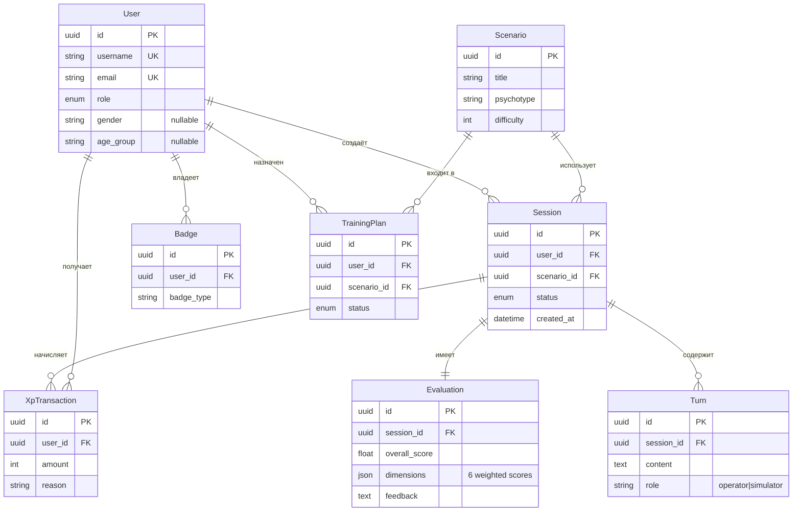
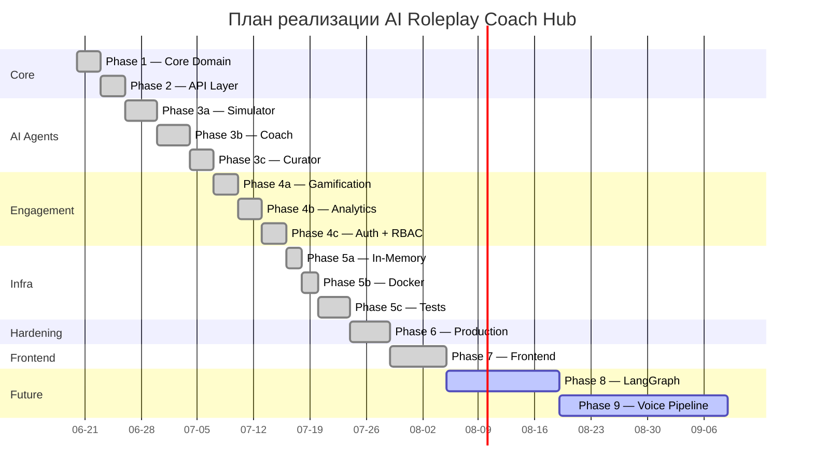

# План реализации — AI Roleplay Coach Hub

> Для менеджеров, архитекторов и новых разработчиков. Полная разбивка по фазам со статусом, задачами и acceptance criteria.

---

## 1. Введение

**Проект:** AI Roleplay Coach Hub — симулятор для отработки навыков общения с «трудными» клиентами для операторов колл-центров.

**Целевые KPI:**
- 460+ тестов с покрытием 84%+
- 50 конкурентных пользователей с откликом <2с (NFR-1)
- 6-мерная оценка Coach (эмпатия, активное слушание, решение проблем, работа с агрессией, коммуникация, структура)
- 4 метрики Fairness Audit (demographic parity, equalized odds, calibration, disparate impact)
- In-memory-first (ноль внешних зависимостей для разработки)

**Технический стек:**

| Компонент | Технология | Версия |
|-----------|-----------|--------|
| Backend | Python + FastAPI | 3.11+ / 0.115.x |
| Entities | Pydantic v2 | 2.x |
| Frontend | React + TypeScript + Vite | 18.x / 5.x / 5.x |
| State | Zustand | 4.x |
| Styling | Tailwind CSS | 3.x |
| Database (optional) | PostgreSQL | 16.x |
| Cache / Rate limit | Redis | 7.x |
| Vector DB | Qdrant | 1.x |
| AI (optional) | Ollama / OpenAI / GigaChat | — |
| Container | Docker + Docker Compose | 24+ / 2.x |
| CI/CD | GitHub Actions | — |

**ER-диаграмма предметной области:**



---

## 2. Сводка фаз

| Фаза | Название | Статус | Длительность |
|------|----------|--------|-------------|
| 1 | Core Domain (entities, services, interfaces) | ✅ Готово | — |
| 2 | API Layer (FastAPI endpoints) | ✅ Готово | — |
| 3a | Simulator Agent (rule-based + LLM adapter) | ✅ Готово | — |
| 3b | Coach Agent (6-dimension evaluation) | ✅ Готово | — |
| 3c | Curator Agent (scenario generation, quiz) | ✅ Готово | — |
| 4a | Gamification Engine (XP, badges, leaderboards) | ✅ Готово | — |
| 4b | Analytics + Fairness | ✅ Готово | — |
| 4c | Auth + RBAC + Security | ✅ Готово | — |
| 5a | In-memory / infra mode switch | ✅ Готово | — |
| 5b | Docker + Docker Compose | ✅ Готово | — |
| 5c | Tests (460+), coverage 84% | ✅ Готово | — |
| 6 | Production Hardening | ✅ Готово | — |
| 7 | Frontend (React + Vite + TS) | ✅ Готово | — |
| 8 | LangGraph migration | 📋 Запланировано | — |
| 9 | Voice pipeline (LiveKit, ASR, TTS) | 📋 Запланировано | — |

---

## 3. Приоритеты реализации

Фазы выполнялись в порядке уменьшения бизнес-ценности:

| Приоритет | Фазы | Обоснование |
|-----------|------|-------------|
| **P0 — Ядро** | 1, 2, 3a, 3b, 3c | Минимально жизнеспособный продукт: сессии, оценка, сценарии |
| **P1 — Геймификация** | 4a, 4b | Мотивация операторов через XP, бейджи, лидерборды и аналитику |
| **P2 — Безопасность** | 4c | Auth, RBAC, JWT — необходим для multi-tenant |
| **P3 — Инфраструктура** | 5a, 5b, 5c | Zero-config dev, Docker, тесты |
| **P4 — Hardening** | 6 | Rate limiting, Circuit Breaker, Prometheus, structlog |
| **P5 — Фронтенд** | 7 | React SPA для операторов, тренеров, админов |
| **P6 — Будущее** | 8, 9 | LangGraph, Voice (LiveKit + ASR + TTS) |

---

## 4. Timeline (Gantt)



---

## 5. Граф зависимостей

```mermaid
flowchart LR
    P1["🧩 Phase 1 Core Domain"] --> P2["⚙️ Phase 2 API Layer"]
    P2 --> P3a["🤖 Phase 3a Simulator"]
    P2 --> P3b["📊 Phase 3b Coach"]
    P2 --> P3c["📋 Phase 3c Curator"]
    P3a --> P4a["🏆 Phase 4a Gamification"]
    P3b --> P4a
    P3c --> P4a
    P4a --> P4b["📈 Phase 4b Analytics"]
    P4a --> P4c["🔐 Phase 4c Auth+RBAC"]
    P4b --> P5a["💾 Phase 5a In-Memory"]
    P4c --> P5a
    P5a --> P5b["🐳 Phase 5b Docker"]
    P5b --> P5c["🧪 Phase 5c Tests"]
    P5c --> P6["🛡️ Phase 6 Hardening"]
    P6 --> P7["🎨 Phase 7 Frontend"]
    P7 --> P8["🧠 Phase 8 LangGraph"]
    P8 --> P9["🎤 Phase 9 Voice"]

    style P1 fill:#c8e6c9,stroke:#2e7d32,color:#1b5e20
    style P2 fill:#c8e6c9,stroke:#2e7d32,color:#1b5e20
    style P3a fill:#bbdefb,stroke:#1565c0,color:#0d47a1
    style P3b fill:#bbdefb,stroke:#1565c0,color:#0d47a1
    style P3c fill:#bbdefb,stroke:#1565c0,color:#0d47a1
    style P4a fill:#fff3e0,stroke:#e65100,color:#bf360c
    style P4b fill:#fff3e0,stroke:#e65100,color:#bf360c
    style P4c fill:#ffebee,stroke:#c62828,color:#b71c1c
    style P5a fill:#f3e5f5,stroke:#6a1b9a,color:#4a148c
    style P5b fill:#f3e5f5,stroke:#6a1b9a,color:#4a148c
    style P5c fill:#f3e5f5,stroke:#6a1b9a,color:#4a148c
    style P6 fill:#ffcdd2,stroke:#c62828,color:#b71c1c
    style P7 fill:#e0f7fa,stroke:#00838f,color:#004d40
    style P8 fill:#e8f5e9,stroke:#2e7d32,color:#1b5e20
    style P9 fill:#e8f5e9,stroke:#2e7d32,color:#1b5e20
```



---

## 6. Детали фаз

### Фаза 1 — Core Domain (Предметная область)

**Цель:** Сущности предметной области, интерфейсы сервисов, интерфейсы репозиториев.

**Архитектурное решение:** Domain-Driven Design: сущности (UUID, даты создания/обновления), сервисы (бизнес-логика), репозитории (паттерн Repository с интерфейсами в `core/interfaces/`). Все сущности наследуют `BaseEntity` с общими полями.

**Задачи:**

| ID | Задача | Файлы | Зависит от |
|----|--------|-------|------------|
| 1.1 | Сущности: User, Session, Scenario, Evaluation, Badge, XPTransaction | `src/core/entities/*.py` | — |
| 1.2 | Интерфейсы сервисов | `src/core/services/interfaces/*.py` | 1.1 |
| 1.3 | Интерфейсы репозиториев (Repository pattern) | `[src/core/interfaces/repositories.py](src/core/interfaces/repositories.py)` | 1.1 |
| 1.4 | Domain events и типы ошибок | `[src/core/events.py](src/core/events.py)`, `[src/core/errors.py](src/core/errors.py)` | 1.1 |

**Acceptance criteria (таблица проверок):**

| Проверка | Ожидание | Автоматизация |
|----------|----------|---------------|
| User, Session, Scenario, Evaluation создаются с UUID | id != None | unit test |
| BaseEntity содержит created_at, updated_at | datetime fields | unit test |
| Все repository interfaces абстрактны (ABC) | cannot instantiate | unit test |
| NotFoundError содержит entity_name + entity_id | code = 404 | unit test |
| DuplicateError содержит field + value | code = 409 | unit test |
| Pydantic schemas валидируют все поля | invalid data -> 422 | unit test |
| Все сущности сериализуются в JSON | model_dump() | unit test |

### Фаза 2 — API Layer (Уровень API)

**Цель:** FastAPI-приложение со всеми REST-эндпоинтами.

**Архитектурное решение:** FastAPI с роутерами по доменам, Dependency Injection через Depends(), единая middleware-цепочка. OpenAPI генерируется автоматически.

**Задачи:**

| ID | Задача | Файлы | Зависит от |
|----|--------|-------|------------|
| 2.1 | Точка входа + middleware | `[src/main.py](src/main.py)` | 1.2, 1.3 |
| 2.2 | Session endpoints (CRUD) | `[src/api/sessions.py](src/api/sessions.py)` | 1.1, 1.2 |
| 2.3 | Coach evaluation endpoint | `[src/api/coach.py](src/api/coach.py)` | 3b.1, 3b.2 |
| 2.4 | Gamification endpoints | `[src/api/gamification.py](src/api/gamification.py)` | 4a.1 |
| 2.5 | Curator endpoints | `[src/api/curator.py](src/api/curator.py)` | 3c.1 |
| 2.6 | Analyst endpoints | `[src/api/analyst.py](src/api/analyst.py)` | 4b.1, 4b.2 |
| 2.7 | Auth + RBAC endpoints | `[src/api/auth.py](src/api/auth.py)` | 4c.1, 4c.2 |
| 2.8 | Training plan endpoints | `[src/api/training_plans.py](src/api/training_plans.py)` | 3c.2 |
| 2.9 | Схемы валидации (Pydantic) | `[src/api/schemas/](src/api/schemas/)` | 1.5 |
| 2.10 | Агрегация роутеров | `[src/api/router.py](src/api/router.py)` | 2.2–2.8 |
| 2.11 | DI wiring (dependencies) | `[src/api/dependencies.py](src/api/dependencies.py)` | 1.3 |

**Acceptance criteria (таблица проверок):**

| Проверка | Ожидание | Автоматизация |
|----------|----------|---------------|
| GET /health возвращает статус | 200 + JSON | API test |
| GET /sessions возвращает список | 200 + array | API test |
| POST /sessions создаёт сессию | 201 + Location header | API test |
| POST /auth/login возвращает токены | 200 + access_token | API test |
| POST /auth/register создаёт пользователя | 201 | API test |
| Все 34+ endpoint отвечают | корректный HTTP статус | API test |
| Invalid JSON body | 422 Validation Error | API test |
| Missing required field | 422 | API test |
| OpenAPI schema генерируется | без ошибок | unit test |
| Middleware chain полный | Metrics -> RequestID -> CORS -> RateLimit -> AuthRateLimit -> SecurityHeaders | integration test |

### Фаза 3a — Simulator Agent (Агент-симулятор)

**Цель:** AI-клиент на правилах с DDA + опциональный LLM-адаптер.

**Архитектурное решение:** Rule-based ответы по психотипу, DDA динамически регулирует сложность, anti-gaming детектирует попытки обмануть систему. LLM-адаптер через Provider Factory.

**Диалоговый цикл:**
1. Получить сообщение оператора
2. Проверить anti-gaming (rephrase/off_topic/repetition)
3. Загрузить DDA-состояние сессии
4. Выбрать ответ по психотипу + уровню DDA
5. Если LLM_PROVIDER != mock — обогатить через LLM
6. Вернуть ответ + обновить DDA-состояние

**Задачи:**

| ID | Задача | Файлы | Зависит от |
|----|--------|-------|------------|
| 3a.1 | SimulatorAgent — rule-based ответы | `[src/agents/simulator/agent.py](src/agents/simulator/agent.py)` | 1.1, 2.2 |
| 3a.2 | DDA (Dynamic Difficulty Adjustment) | `[src/agents/simulator/dda_state.py](src/agents/simulator/dda_state.py)` | 1.2 |
| 3a.3 | Anti-gaming детекция | `[src/agents/simulator/anti_gaming_service.py](src/agents/simulator/anti_gaming_service.py)` | 1.2 |
| 3a.4 | LLM provider factory + mock | `[src/agents/simulator_llm/agent.py](src/agents/simulator_llm/agent.py)` | 1.3 |

**Acceptance criteria (таблица проверок):**

| Проверка | Ожидание | Автоматизация |
|----------|----------|---------------|
| 3 психотипа реализованы | aggressive, confused, demanding | unit test |
| DDA 4 уровня с эскалацией | level 1-4 с разными ответами | unit test |
| Anti-gaming: rephrase | помечает как rephrase | unit test |
| Anti-gaming: off_topic | помечает как off_topic | unit test |
| Anti-gaming: repetition | помечает как repetition | unit test |
| LLM provider mock | возвращает предсказуемый ответ | unit test |
| LLM provider ollama | вызывает Ollama API | integration test |
| Circuit Breaker на LLM | открывается после N ошибок | integration test |

### Фаза 3b — Coach Agent (Агент-коуч)

**Цель:** 6-мерная оценка диалога с Sandwich feedback.

**Архитектурное решение:** CoachAgent анализирует транскрипт сессии по 6 лингвистическим измерениям, вычисляет взвешенную оценку и генерирует Sandwich feedback.

**Формула оценки:**
```
overall_score = (sum(weight_dim * score_dim)) / sum(weights)
```

**Веса измерений:** empathy 0.20, listening 0.15, problem_solving 0.20, handling_aggression 0.20, communication 0.10, structure 0.15.

**Задачи:**

| ID | Задача | Файлы | Зависит от |
|----|--------|-------|------------|
| 3b.1 | EvaluationService — оркестрация | `[src/core/services/evaluation_service.py](src/core/services/evaluation_service.py)` | 1.2 |
| 3b.2 | CoachAgent — 6-мерная оценка | `[src/agents/coach/agent.py](src/agents/coach/agent.py)` | 3b.1 |
| 3b.3 | Лингвистические маркеры | `[src/agents/coach/linguistic_markers.py](src/agents/coach/linguistic_markers.py)` | 3b.2 |

**Acceptance criteria (таблица проверок):**

| Проверка | Ожидание | Автоматизация |
|----------|----------|---------------|
| 6 измерений с weights | empathy 0.20, listening 0.15, problem_solving 0.20, handling_aggression 0.20, communication 0.10, structure 0.15 | unit test |
| overall_score формула | weighted average | unit test |
| Sandwich feedback содержит Start | позитивный комментарий | unit test |
| Sandwich feedback содержит Improve | что улучшить | unit test |
| Sandwich feedback содержит End | ободряющее завершение | unit test |
| Linguistic markers эмпатии | "понимаю", "сочувствую" и т.д. | unit test |
| CoachAdapter обрабатывает timeout | fallback score | unit test |

### Фаза 3c — Curator Agent (Агент-куратор)

**Цель:** Генерация сценариев и создание квизов для тренировок.

**Архитектурное решение:** CuratorAgent создаёт сценарии по теме + сложности + психотипу. QuizService генерирует вопросы из описания сценария. TrainingPlanService объединяет сценарии в учебные планы.

**Задачи:**

| ID | Задача | Файлы | Зависит от |
|----|--------|-------|------------|
| 3c.1 | CuratorAgent — генерация сценариев | `[src/agents/curator/agent.py](src/agents/curator/agent.py)` | 1.2 |
| 3c.2 | QuizService — генерация квизов | `[src/agents/curator/quiz_service.py](src/agents/curator/quiz_service.py)` | 1.2 |
| 3c.3 | LMS sync (запланировано) | `[src/agents/curator/lms_sync.py](src/agents/curator/lms_sync.py)` | 3c.1 |
| 3c.4 | TrainingPlanService — учебные планы | `[src/core/services/training_plan_service.py](src/core/services/training_plan_service.py)` | 1.2 |

**Acceptance criteria (таблица проверок):**

| Проверка | Ожидание | Автоматизация |
|----------|----------|---------------|
| Генерация сценария по теме | возвращает Scenario | unit test |
| Генерация по сложности | difficulty 1-10 | unit test |
| Генерация по психотипу | aggressive/confused/demanding | unit test |
| Quiz-вопросы из описания | содержит вопросы с ответами | unit test |
| TrainingPlan CRUD | create/read/update/delete | unit test |
| Skill matrix отслеживание | прогресс по измерениям | unit test |

### Фаза 4a — Gamification Engine (Геймификация)

**Цель:** XP, уровни, бейджи, лидерборд, streak tracking.

**Архитектурное решение:** GamificationEngine — единый класс с методами award_xp, check_level_up, award_badge, get_leaderboard.

**Формулы:**
- XP = 100 (base) + 50 (bonus if score >= 90) + 200 (streak if >= 3 days)
- Level = XP // 1000 + 1
- Streak = последовательные дни с XP-транзакциями

**8 бейджей:** first_session, score_90, streak_3, streak_7, leaderboard_top3, scenarios_5, level_5, level_10.

**Задачи:**

| ID | Задача | Файлы | Зависит от |
|----|--------|-------|------------|
| 4a.1 | GamificationEngine — core logic | `[src/agents/gamification/engine.py](src/agents/gamification/engine.py)` | 1.2, 3b.1 |
| 4a.2 | XP transaction repository | `[src/agents/gamification/engine.py](src/agents/gamification/engine.py)` | 1.3 |
| 4a.3 | Leaderboard calculation | `[src/agents/gamification/engine.py](src/agents/gamification/engine.py)` | 4a.1 |
| 4a.4 | Streak tracking | `[src/agents/gamification/engine.py](src/agents/gamification/engine.py)` | 4a.1 |
| 4a.5 | Badge definitions (8 шт) | `[src/agents/gamification/engine.py](src/agents/gamification/engine.py)` | 4a.1 |

**Acceptance criteria (таблица проверок):**

| Проверка | Ожидание | Автоматизация |
|----------|----------|---------------|
| XP base = 100 за сессию | amount = 100 | unit test |
| XP bonus = 50 при score >= 90 | amount = 150 | unit test |
| XP streak = 200 при >= 3 days | amount = 300 | unit test |
| Level = XP // 1000 + 1 | level корректный | unit test |
| 8 бейджей с критериями | все 8 определены | unit test |
| Бейдж first_session | после 1 сессии | unit test |
| Бейдж streak_7 | после 7 дней streak | unit test |
| Leaderboard по XP descending | порядок верный | unit test |
| Streak по дням | последовательные дни | unit test |

### Фаза 4b — Analytics + Fairness (Аналитика и Честность)

**Цель:** Статистика и fairness audit (4 метрики).

**Архитектурное решение:** AnalyticsService собирает статистику по сессиям пользователя. FairnessService вычисляет 4 метрики для групп (gender, age_group, accent, native_language). Periodic audit в lifespan.

**4 метрики fairness:** Demographic Parity (>= 0.8), Equalized Odds (<= 0.1), Calibration (<= 0.1), Disparate Impact (>= 0.8).

**Задачи:**

| ID | Задача | Файлы | Зависит от |
|----|--------|-------|------------|
| 4b.1 | AnalyticsService — статистика | `[src/core/services/analytics_service.py](src/core/services/analytics_service.py)` | 1.2 |
| 4b.2 | FairnessService — 4 метрики | `[src/agents/analyst/fairness_service.py](src/agents/analyst/fairness_service.py)` | 4b.1, 1.5 |
| 4b.3 | Генерация отчёта fairness | `[src/agents/analyst/fairness_service.py](src/agents/analyst/fairness_service.py)` | 4b.2 |
| 4b.4 | Periodic audit (lifespan) | `[src/main.py](src/main.py)` | 4b.2 |

**Acceptance criteria (таблица проверок):**

| Проверка | Ожидание | Автоматизация |
|----------|----------|---------------|
| Demographic parity >= 0.8 | метрика для всех групп | unit test |
| Equalized odds <= 0.1 | разница TPR/FPR | unit test |
| Calibration <= 0.1 | калибровка по группам | unit test |
| Disparate impact >= 0.8 | соотношение исходов | unit test |
| Группировка по gender | 4 protected attributes | unit test |
| CLI audit | exit 0/1/2 + JSON output | integration test |
| Periodic audit в lifespan | запуск каждые N минут | unit test |
| NotificationService stub | structlog warning | unit test |

### Фаза 4c — Auth + RBAC + Security (Аутентификация и Безопасность)

**Цель:** Регистрация, вход, JWT, ролевой доступ.

**Архитектурное решение:** AuthService с register/login/refresh/logout, JWT access + refresh token, RBAC через декоратор require_role(). TokenStore абстракция (InMemory или Redis).

**JWT Flow:** Register -> Login (access 30min + refresh 7d) -> verify -> refresh -> logout (blacklist).

**Роли:** operator (свои сессии), trainer (+сценарии, группы, quiz), admin (+пользователи, fairness).

**Задачи:**

| ID | Задача | Файлы | Зависит от |
|----|--------|-------|------------|
| 4c.1 | AuthService | `[src/core/services/auth_service.py](src/core/services/auth_service.py)` | 1.2, 1.3 |
| 4c.2 | JWT handling | `[src/api/auth.py](src/api/auth.py)` | 4c.1 |
| 4c.3 | RBAC require_role() | `[src/api/auth.py](src/api/auth.py)` | 4c.2 |
| 4c.4 | User repository (PG + InMemory) | `[src/infrastructure/postgres/user_repo.py](src/infrastructure/postgres/user_repo.py)` | 1.3 |
| 4c.5 | TokenStore (Redis + InMemory) | `[src/core/interfaces/token_store.py](src/core/interfaces/token_store.py)` | 1.3 |

**Acceptance criteria (таблица проверок):**

| Проверка | Ожидание | Автоматизация |
|----------|----------|---------------|
| Register создаёт пользователя | 201 + user data | API test |
| Login возвращает access + refresh | 200 + 2 токена | API test |
| Access token работает | 200 на защищённый endpoint | API test |
| Refresh token обновляет | новая пара токенов | API test |
| Logout blacklist refresh | 401 с revoked токеном | API test |
| require_role(["admin"]) | 403 для operator | API test |
| operator не видит чужие сессии | фильтрация по user_id | API test |
| trainer видит сценарии | доступ к curator | API test |
| admin видит fairness | доступ к analyst | API test |
| Token blacklist в Redis | store/validate/revoke | unit test |
| 35+ auth layer тестов | auth lib, authStore, AuthGuard | unit test |

### Фаза 5a — In-Memory Mode Switch (Режим In-Memory)

**Цель:** Zero-config dev mode с in-memory репозиториями.

**Архитектурное решение:** BaseInMemoryRepository[T] — generic CRUD с _items: dict[str, T]. DI switch через DB_MODE env var.

**Задачи:**

| ID | Задача | Файлы | Зависит от |
|----|--------|-------|------------|
| 5a.1 | BaseInMemoryRepository + наследники | `[src/infrastructure/memory/repositories.py](src/infrastructure/memory/repositories.py)` | 1.3 |
| 5a.2 | DI switch (DB_MODE env var) | `[src/api/dependencies.py](src/api/dependencies.py)` | 5a.1 |
| 5a.3 | Seed data (3 users + 3 scenarios) | `[src/main.py](src/main.py)` | 5a.2 |

**Acceptance criteria (таблица проверок):**

| Проверка | Ожидание | Автоматизация |
|----------|----------|---------------|
| DB_MODE=memory без внешних БД | API запускается | integration test |
| DB_MODE=postgres с PostgreSQL | все endpoint работают | integration test |
| BaseInMemoryRepository[T] generic CRUD | get/create/update/delete/count | unit test |
| Seed data: 3 users + 3 scenarios | loaded на старте | integration test |
| Thread-safe операции | asyncio Lock | unit test |
| DI switch корректный | memory vs postgres репозитории | integration test |

### Фаза 5b — Docker + Docker Compose (Контейнеризация)

**Цель:** Контейнеризованное развёртывание.

**Dev-сервисы:** api (hot-reload), postgres, redis, qdrant, embedding, minio, frontend (Vite HMR)
**Prod-сервисы:** api (multi-stage), postgres, redis, qdrant, nginx (reverse proxy + SSL)

**Задачи:**

| ID | Задача | Файлы | Зависит от |
|----|--------|-------|------------|
| 5b.1 | Dev [Dockerfile](Dockerfile) | `[Dockerfile.dev](Dockerfile.dev)` | 5a.2 |
| 5b.2 | Prod [Dockerfile](Dockerfile) (multi-stage) | `[Dockerfile.prod](Dockerfile.prod)` | 5a.2 |
| 5b.3 | Dev Docker Compose (7 services) | `[docker-compose.dev.yml](docker-compose.dev.yml)` | 5b.1 |
| 5b.4 | Prod Docker Compose (4 + nginx) | `[docker-compose.prod.yml](docker-compose.prod.yml)` | 5b.2 |

**Acceptance criteria (таблица проверок):**

| Проверка | Ожидание | Автоматизация |
|----------|----------|---------------|
| Dev [Dockerfile](Dockerfile) hot-reload | изменение кода -> перезагрузка | manual |
| Dev Compose 7 сервисов | api, postgres, redis, qdrant, embedding, minio, frontend | docker compose config |
| Prod multi-stage build | build -> runtime слои | docker build |
| Prod non-root user | USER appuser | [Dockerfile](Dockerfile) check |
| Healthcheck на каждый сервис | docker inspect | manual |
| Nginx reverse proxy | /api -> api:8000 | integration test |
| Nginx HSTS + SSL | security headers | manual |
| WebSocket proxy | Upgrade header | manual |

### Фаза 5c — Tests (Тестирование)

**Цель:** 460+ тестов с покрытием 84%+.

**Пирамида:** Unit (350+) -> API (80+) -> Integration (20+) -> E2E (10). Security (5) + Observability (3).

**Задачи:**

| ID | Задача | Файлы | Зависит от |
|----|--------|-------|------------|
| 5c.1 | Unit тесты | `[tests/unit/](tests/unit/)` | 3b, 3c, 4a, 4b |
| 5c.2 | API тесты | `[tests/api/](tests/api/)` | 2.x |
| 5c.3 | Integration тесты | `[tests/integration/](tests/integration/)` | 5a, 5b |
| 5c.4 | E2E тесты | `[tests/e2e/](tests/e2e/)` | 7.x |
| 5c.5 | Security тесты | `[tests/security/](tests/security/)` | 6.x |
| 5c.6 | Observability тесты | `[tests/integration/](tests/integration/)` | 6.6, 6.7 |

**Acceptance criteria (таблица проверок):**

| Проверка | Ожидание | Автоматизация |
|----------|----------|---------------|
| pytest 0 failed | весь suite | CI |
| ruff 0 errors | src/ + tests/ | CI |
| mypy strict 0 errors | src/ | CI |
| Coverage >= 80% | --coverage report | CI |
| Unit tests (350+) | services, agents, validation | pytest unit/ |
| API tests (80+) | все endpoint + status codes | pytest api/ |
| Integration tests (20+) | DB, cross-component | pytest integration/ |
| E2E tests (10) | full flows | pytest e2e/ |
| Security tests (5) | SAST, JWT tampering | pytest security/ |
| Observability tests (3) | logging, metrics | pytest integration/ |
| Тесты независимы | нет shared state | random order |

### Фаза 6 — Production Hardening (Усиление Production)

**Цель:** Rate limiting, security headers, auth hardening, observability.

**Middleware chain:** MetricsMiddleware -> RequestIDMiddleware -> CORSMiddleware -> RateLimitMiddleware -> AuthRateLimitMiddleware -> SecurityHeadersMiddleware.

**Задачи:**

| ID | Задача | Файлы | Зависит от |
|----|--------|-------|------------|
| 6.1 | Rate limiting middleware | `[src/api/rate_limit.py](src/api/rate_limit.py)` | 2.1 |
| 6.2 | Auth rate limiting | `[src/api/auth_rate_limit_middleware.py](src/api/auth_rate_limit_middleware.py)` | 6.1 |
| 6.3 | Security headers middleware | `[src/api/security_headers.py](src/api/security_headers.py)` | 2.1 |
| 6.4 | Request ID middleware | `[src/api/middleware.py](src/api/middleware.py)` | 2.1 |
| 6.5 | Circuit breaker | `[src/core/services/circuit_breaker.py](src/core/services/circuit_breaker.py)` | 1.2 |
| 6.6 | Prometheus metrics | `[src/api/metrics.py](src/api/metrics.py)` | 2.1 |
| 6.7 | Structured logging (structlog) | `[src/infrastructure/logging.py](src/infrastructure/logging.py)` | 2.1 |
| 6.8 | Config validation | `[src/core/config.py](src/core/config.py)` | 1.5 |

**Acceptance criteria (таблица проверок):**

| Проверка | Ожидание | Автоматизация |
|----------|----------|---------------|
| Rate limit 100 req/min | 101-й -> 429 | API test |
| Auth rate limit 5/10min | 6-й login -> 429 | API test |
| Circuit breaker после 5 ошибок | open state | unit test |
| CB recovery через 60s | half-open -> closed | unit test |
| Prometheus /metrics endpoint | 200 + counters | API test |
| Prometheus latency histogram | http_request_duration_seconds | API test |
| structlog JSON output | формат JSON | unit test |
| Request-ID на каждый запрос | X-Request-ID header | API test |
| Security headers | X-Frame-Options, CSP, HSTS | API test |
| SAST scan в CI | ruff + pip-audit | CI |
| Config validate() | raises на неверные значения | unit test |

### Фаза 7 — Frontend (Фронтенд)

**Цель:** React + TypeScript + Vite + Tailwind SPA.

**Структура (FSD):** pages/ (Login, Register, Sessions, SessionDetail, Profile, Leaderboard, Trainer, Admin), features/, shared/. Zustand для state, React Router для навигации.

**Задачи:**

| ID | Задача | Файлы | Зависит от |
|----|--------|-------|------------|
| 7.1 | Auth pages | `[frontend/src/pages/Login/](frontend/src/pages/Login/)` | 4c.1 |
| 7.2 | Session list + creation | `[frontend/src/pages/Sessions/](frontend/src/pages/Sessions/)` | 2.2 |
| 7.3 | Session detail + chat | `[frontend/src/pages/SessionDetail/](frontend/src/pages/SessionDetail/)` | 7.2 |
| 7.4 | Profile, leaderboard | `[frontend/src/pages/Profile/](frontend/src/pages/Profile/)`, `Leaderboard/` | 4a.3 |
| 7.5 | Trainer pages | `[frontend/src/pages/Trainer/](frontend/src/pages/Trainer/)` | 3c.1, 3c.2 |
| 7.6 | Admin dashboard | `[frontend/src/pages/Admin/](frontend/src/pages/Admin/)` | 4b.2 |
| 7.7 | State (Zustand stores) | `[frontend/src/stores/](frontend/src/stores/)` | 7.1 |
| 7.8 | Routing (React Router) | `[frontend/src/App.tsx](frontend/src/App.tsx)` | 7.1–7.6 |

**Acceptance criteria (таблица проверок):**

| Проверка | Ожидание | Автоматизация |
|----------|----------|---------------|
| Login page рендерится | форма входа | manual |
| Register page рендерится | форма регистрации | manual |
| Session list отображает сессии | список + create button | manual |
| Session detail + chat UI | сообщения, input, send | manual |
| Profile с XP и badges | XP counter, badge list | manual |
| Leaderboard по XP | таблица с пользователями | manual |
| Trainer: scenario CRUD | create/edit/delete | manual |
| Admin dashboard | fairness report, users | manual |
| Zustand store для auth | login/logout/token | unit test (19) |
| AuthGuard redirect | без токена -> /login | unit test (7) |
| TypeScript strict | noImplicitAny, strictNullChecks | tsc --noEmit |
| Responsive Tailwind | mobile + desktop | manual |

### Фаза 8 — LangGraph (Запланировано)

**Цель:** Миграция AI-агентов на LangGraph.

- State graph для multi-turn orchestration
- Conditional edges для динамического потока
- Интеграция с существующими агентами

### Фаза 9 — Voice Pipeline (Запланировано)

**Цель:** Real-time audio (LiveKit + ASR + TTS).

- LiveKit для audio streaming
- ASR (Whisper) для speech-to-text
- TTS для voice output
- Модуль src/infrastructure/audio/

---

## 7. Milestones (Вехи)

| Milestone | Фаза | Ключевой результат | Статус |
|-----------|------|-------------------|--------|
| M1 | Phase 3a | SimulatorAgent с DDA (3 психотипа, 4 уровня) | ✅ |
| M2 | Phase 3b | CoachAgent с 6-мерной оценкой | ✅ |
| M3 | Phase 4a | XP, badges (8 шт), leaderboard | ✅ |
| M4 | Phase 4b | Fairness audit + CLI + periodic | ✅ |
| M5 | Phase 4c | Auth (JWT) + RBAC (3 роли) | ✅ |
| M6 | Phase 5c | 460+ тестов, 84% coverage | ✅ |
| M7 | Phase 6 | Production hardening | ✅ |
| M8 | Phase 7 | Frontend MVP (88+ файлов) | ✅ |
| M9 | Phase 8 | LangGraph (планируется) | 📋 |
| M10 | Phase 9 | Voice pipeline (планируется) | 📋 |

---

## 8. Риски и Mitigation

| Риск | Влияние | Вероятность | Mitigation |
|------|---------|-------------|------------|
| LLM provider failures | Coach недоступен | Средняя | Circuit Breaker + mock fallback |
| Rate limit DoS | Сервис недоступен | Низкая | Auth rate limit + IP-based limit |
| Data loss (in-memory) | Нет персистентности | Высокая (dev) | PostgreSQL option |
| Frontend stale data | UX issues | Средняя | Cache invalidation |
| Fairness bias найден | Этическая проблема | Низкая | Periodic audit + alerts |
| Redis outage | Rate limit не работает | Низкая | InMemory fallback |
| PG connection pool исчерпан | API 503 | Средняя | PgBouncer |
| Qdrant corruption | Поиск не работает | Низкая | Auto-snapshots |
| JWT secret утёк | Compromise токенов | Низкая | RS256, key rotation |
| Voice latency > 2s | UX degradation | Средняя | WebSocket + оптимизация |

**SLA:** Critical < 15 мин, High < 1 час, Medium < 4 часа, Low < 1 день.

---

## 9. Технические решения

| Решение | Обоснование | Альтернативы | Почему выбрано |
|---------|-------------|--------------|----------------|
| Pydantic v2 | Валидация + OpenAPI | SQLAlchemy | Единый стек с FastAPI |
| In-memory first | zero-config dev | Всегда PostgreSQL | Developer experience |
| 6-dimension weighted | Прозрачная оценка | LLM-only | Детерминизм + тестируемость |
| Rule-based + LLM | Работает без LLM | Только LLM | Надёжность + гибкость |
| Circuit Breaker | Защита от каскадных отказов | Retry | Промышленный стандарт |
| FSD (frontend) | Масштабируемость | Atomic Design | Для больших SPA |
| Unified Gamification | Единый класс | Распределённые сервисы | Простота + тестируемость |

---

## 10. Архитектурные паттерны

### Repository Pattern
Все доступа к данным — через интерфейсы-репозитории. Каждая сущность имеет Repository[T], который в memory-режиме реализован как BaseInMemoryRepository, а в postgres-режиме — SQLAlchemy реализация.

```python
class BaseRepository[T](ABC):
    async def get(self, id: uuid.UUID) -> T: ...
    async def create(self, entity: T) -> T: ...
    async def update(self, entity: T) -> T: ...
    async def delete(self, id: uuid.UUID) -> None: ...
```

### Dependency Injection (FastAPI Depends)
DI реализован через FastAPI `Depends()`. При старте приложения выбирается провайдер репозитория в зависимости от `DB_MODE`:

```python
def get_user_repository() -> BaseRepository[User]:
    if settings.DB_MODE == "memory":
        return InMemoryUserRepository()
    return PostgresUserRepository()
```

### Domain-Driven Design (DDD)
- **Domain layer:** Pydantic entities с бизнес-логикой (User, Session, Scenario…)
- **Service layer:** Use case-классы (AuthService, SessionService, CoachService)
- **Application layer:** FastAPI роутеры, зависимости, middleware
- **Infrastructure layer:** Репозитории, LLM-адаптеры, кэш

### Middleware Chain
Каждый HTTP-запрос проходит через строгую цепочку middleware:

```
MetricsMiddleware -> RequestIDMiddleware -> CORSMiddleware ->
RateLimitMiddleware -> AuthRateLimitMiddleware -> SecurityHeadersMiddleware
```

### Strategy Pattern (Agent System)
Каждый AI-агент реализован через интерфейс AgentStrategy:

| Агент | Назначение | Реализация |
|-------|-----------|------------|
| SimulatorAgent | Симуляция клиента | DDA (3 психотипа × 4 уровня) |
| CoachAgent | Оценка оператора | Rule-based (6 измерений) |
| CuratorAgent | Подбор сценариев | Skill matrix + NPS |
| AnalystAgent | Аналитика/Fairness | 4 метрики |
| TrainerAgent | Обучение | TrainingPlan CRUD |
| AdminAgent | Администрирование | RBAC |

### Circuit Breaker Pattern
Защита от каскадных отказов при обращении к LLM:

```python
class CircuitBreakerState(Enum):
    CLOSED = "closed"       # normal operation
    OPEN = "open"           # failing, fast-fail
    HALF_OPEN = "half_open" # testing recovery
```

Параметры: failure_threshold=5, recovery_timeout=60s, half_open_max_requests=3.

---

## 11. Что не входит в Scope (Out of Scope)

| Фича | Причина исключения | Возможное будущее |
|------|--------------------|-----------------|
| Speech-to-Text (STT) | Требует специализированных моделей (Whisper, Vosk) | Phase 9 — Voice Pipeline |
| Text-to-Speech (TTS) | Зависит от voice синтеза | Phase 9 — Voice Pipeline |
| LangGraph workflows | Требует перепроектирования агентов | Phase 8 — запланировано |
| Значимая PostgreSQL миграция | In-memory-first приоритет | Пост-Phase 6 |
| Мобильное приложение | Native iOS/Android вне scope | PWA расширение |
| Multi-language support | Русский is the target | i18n в будущем |
| Marketplace сценариев | Community features | Отдельный проект |
| Real-time collaboration | Сессии только 1:1 (оператор + клиент) | WebRTC |
| A/B testing infrastructure | Сложность > польза на MVP | CI/CD integration |
| Performance load testing (k6) | CI integration postponed | Пост-MVP |

---

## 12. Git Workflow

| Ветка | Назначение | От кого | Куда PR |
|-------|-----------|---------|---------|
| `main` | Production-ready код | `develop` | — |
| `develop` | Интеграция фаз | feature branches | `main` |
| `feature/phase-*` | Разработка фазы | `develop` | `develop` |
| `hotfix/*` | Срочные исправления | `main` | `main` + `develop` |

**CI/CD Pipeline (GitHub Actions):**

| Триггер | Workflow | Действия |
|---------|----------|----------|
| Push feature/* | test.yml | pytest + ruff + mypy + coverage |
| Push to develop | build.yml | + Docker build, SAST scan |
| Push to main | deploy.yml | + тегирование, релиз |
| Еженедельно | audit.yml | pip-audit + pip-licenses |
| По запросу | e2e.yml | E2E Playwright тесты |

**Commit convention:** `type(scope): description` где type = feat/fix/chore/test/docs/refactor, scope = auth/gamification/agent/frontend/etc.

---

## 13. Ссылки

- [src/](../src/) — весь backend
- [frontend/](../frontend/) — весь frontend
- [tests/](../tests/) — тестовые файлы
- [SPECIFICATION.md](SPECIFICATION.md) — спецификация
- [API.md](API.md) — API справочник
- [PROJECT_STRUCTURE.md](PROJECT_STRUCTURE.md) — структура
- [DATA_FLOWS.md](DATA_FLOWS.md) — sequence diagrams
- [GLOSSARY.md](GLOSSARY.md) — глоссарий
- [DEPLOYMENT_PLAN.md](DEPLOYMENT_PLAN.md) — развёртывание
- [TROUBLESHOOTING_GUIDE.md](TROUBLESHOOTING_GUIDE.md) — решение проблем
