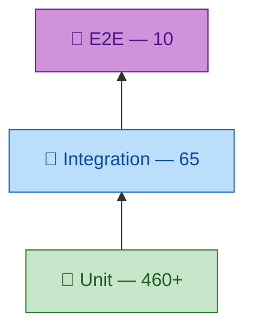
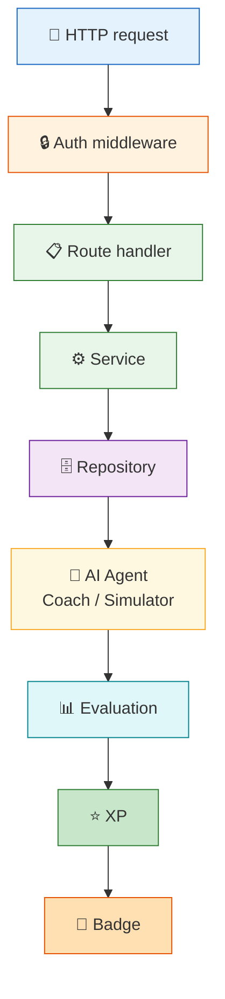
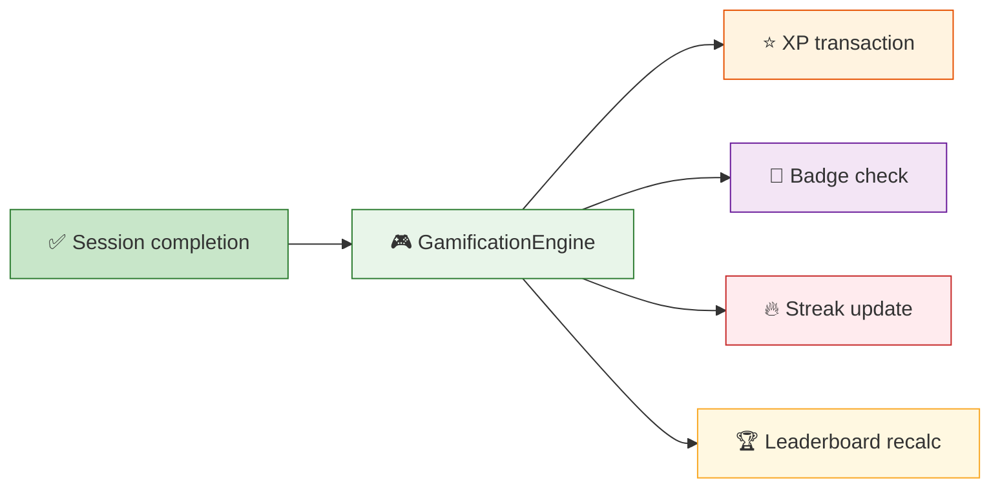
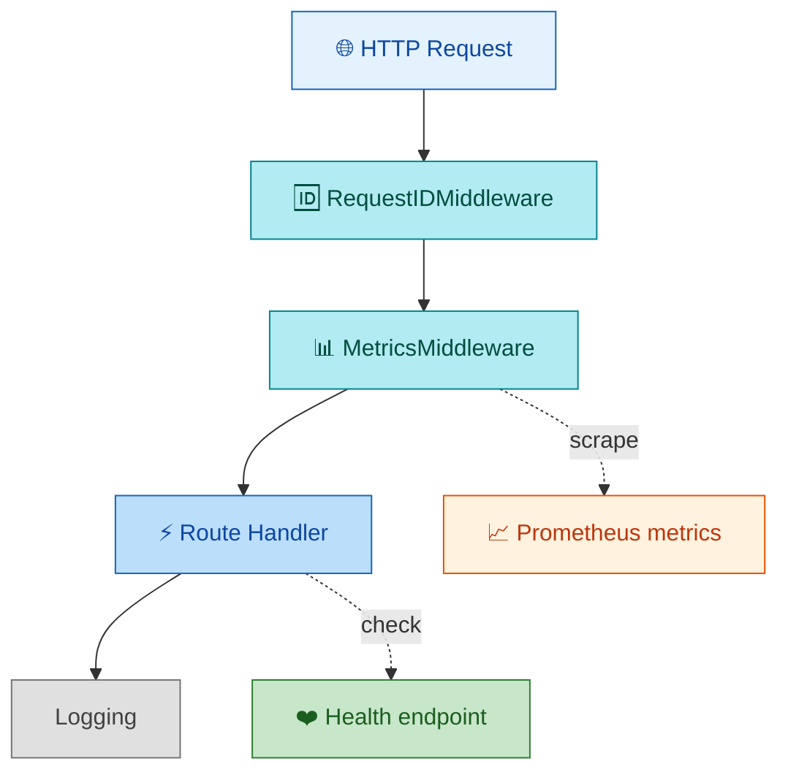
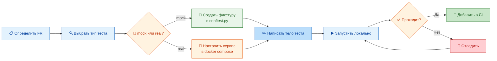

# Спецификация интеграционных тестов — AI Roleplay Coach Hub

> Для QA-инженеров и разработчиков. Стратегия, сценарии, окружение и чеклисты для интеграционного тестирования.

---

## Оглавление

1. [Введение](#1-введение)
2. [Подход к тестированию](#2-подход-к-тестированию)
3. [Карта интеграционных тестов](#3-карта-интеграционных-тестов)
4. [Тестовые сценарии](#4-тестовые-сценарии)
5. [Тестовые данные и фикстуры](#5-тестовые-данные-и-фикстуры)
6. [Настройка окружения](#6-настройка-окружения)
7. [Добавление новых тестов](#7-добавление-новых-тестов)
8. [Чеклисты](#8-чеклисты)
9. [Ссылки](#9-ссылки)

---

## 1. Введение

### 1.1 Назначение документа

Данный документ описывает стратегию, архитектуру и реализацию интеграционных тестов для AI Roleplay Coach Hub. Он предназначен для:

- **QA-инженеров** — понимание объёма покрытия, сценариев и ожидаемого поведения
- **Разработчиков** — шаблоны для добавления новых тестов, правила изоляции
- **DevOps** — настройка окружения для CI/CD и staging
- **Новых участников** — быстрое погружение в тестовую инфраструктуру

### 1.2 Текущее покрытие

| Метрика | Значение |
|---------|----------|
| Всего интеграционных тестов | ~65 |
| Тестовых файлов | 8 |
| Покрытие FR | 7 из 7 (100%) |
| Покрытие NFR | 5 из 7 (71%) |
| Время прогона (mock) | < 15 секунд |
| Время прогона (real) | ~2 минуты |
| Внешних зависимостей (mock) | 0 |
| Внешних зависимостей (real) | PostgreSQL, Redis, Qdrant, LLM |

### 1.3 Цели интеграционного тестирования

1. **Обнаружение дефектов взаимодействия** — компоненты работают корректно друг с другом (API → Service → Repository)
2. **Валидация контрактов** — данные корректно проходят через все слои (domain → DB → domain)
3. **Проверка адаптеров** — внешние сервисы (LLM, Qdrant, Redis) корректно интегрированы
4. **Сквозная функциональность** — полные user journey (register → login → session → evaluate → XP)
5. **Регрессионная защита** — изменения в одном компоненте не ломают другие

### 1.4 Определение интеграционного теста

Тест считается интеграционным, если выполняется **любое** из условий:

1. Тестирует взаимодействие **2+ компонентов** (например, API → service → repository)
2. Тестирует **маппинг данных** между слоями (domain ↔ DB model, DTO ↔ entity)
3. Тестирует **сквозной пайплайн** (полная цепочка: HTTP → auth → service → agent → repository)
4. Тестирует **адаптер внешнего сервиса** (LLM, Qdrant, Redis)
5. Тестирует **поведение под нагрузкой** (rate limiting, circuit breaker)
6. Тестирует **асинхронные сценарии** (WebSocket, background tasks)

---

## 2. Подход к тестированию

### 2.1 Пирамида тестирования



Интеграционные тесты занимают средний слой пирамиды. Они проверяют связи между компонентами, в отличие от unit-тестов (изолированная проверка одного компонента) и E2E-тестов (полный пользовательский сценарий через API).

### 2.2 Режимы выполнения

#### 2.2.1 Mock-режим (по умолчанию)

Все внешние сервисы заменены in-memory реализациями. Используется в CI и локальной разработке.

| Внешний сервис | Чем заменён | Файл |
|---------------|-------------|------|
| PostgreSQL | InMemoryRepository | `[src/infrastructure/memory/repositories.py](src/infrastructure/memory/repositories.py)` |
| Redis | InMemoryTokenStore | `[src/infrastructure/redis/token_store.py](src/infrastructure/redis/token_store.py)` |
| Qdrant | Mock QdrantClient | `[src/infrastructure/vector/qdrant_client.py](src/infrastructure/vector/qdrant_client.py)` |
| LLM | MockProvider | `[src/infrastructure/llm/providers/mock_provider.py](src/infrastructure/llm/providers/mock_provider.py)` |
| MinIO | Не используется (планируется) | — |

**Как включить:**
- `DB_MODE=memory` (по умолчанию) → все InMemory репозитории
- `LLM_PROVIDER=mock` (по умолчанию) → rule-based агент
- `FAIRNESS_ENABLED=false` (по умолчанию) → без fairness-аудита

#### 2.2.2 Real-режим (staging / manual)

Используются реальные сервисы (PostgreSQL, Redis, Qdrant, LLM). Для CI/CD запускается отдельным workflow.

| Переменная | Значение | Сервис |
|-----------|----------|--------|
| `DB_MODE` | postgres | PostgreSQL |
| `POSTGRES_HOST` | localhost | PostgreSQL host |
| `POSTGRES_PASSWORD` | <пароль> | PostgreSQL password |
| `REDIS_HOST` | localhost | Redis host |
| `QDRANT_HOST` | localhost | Qdrant host |
| `LLM_PROVIDER` | ollama | LLM integration |
| `LLM_BASE_URL` | http://localhost:11434/v1 | Ollama endpoint |
| `FAIRNESS_ENABLED` | true | FairnessService |
| `LOG_LEVEL` | info | Логирование |

### 2.3 Изоляция тестов

Каждый интеграционный тест должен быть **изолирован** от других:

**Правила изоляции:**
1. Каждый тест получает **свежие InMemory-репозитории** (scope=function в conftest.py)
2. Тесты **не зависят от порядка выполнения**
3. Rate limit сбрасывается перед каждым тестом (`_reset_rate_limit_store`)
4. Auth-токены генерируются заново для каждого теста
5. Тесты в real-режиме используют отдельные схемы БД (transaction rollback)

**Фикстуры изоляции:**
```python
# conftest.py — автоматический сброс состояния
@pytest.fixture(autouse=True)
def _reset_state():
    """Сброс rate limit хранилища перед каждым тестом."""
    _reset_rate_limit_store()
    yield

@pytest.fixture
def mock_repos(in_memory_repositories):
    """InMemory-репозитории для mock-режима."""
    return in_memory_repositories
```

### 2.4 Критерии качества интеграционных тестов

| Критерий | Требование | Проверка |
|---------|-----------|----------|
| Независимость | 0 тестов зависят от других тестов | `pytest --random-order` проходит |
| Скорость (mock) | Все тесты < 15 сек | `pytest tests/integration/ --durations=0` |
| Скорость (real) | Все тесты < 3 мин | `pytest tests/integration/ -m real` |
| Детерминизм | 3 прогона подряд — одинаковый результат | `for i in 1 2 3; do pytest ...; done` |
| FR покрытие | Каждый FR покрыт ≥ 1 интеграционным тестом | `pytest --coverage` |
| NFR покрытие | Каждый NFR покрыт ≥ 1 тестом | Manual review |

### 2.5 Измерение покрытия

Покрытие интеграционных тестов измеряется через FR→TC матрицу.

**Процесс:**
1. Каждый FR и NFR имеет минимум один интеграционный тест
2. Тест в docstring указывает `FR-X` или `NFR-Y`
3. Матрица актуализируется при каждом релизе

**Текущее состояние:**
```text
FR-1 (Scenario mgmt)   → TC-001, TC-009     ✅
FR-2 (AI Client)       → TC-001, TC-009     ✅
FR-3 (Coach Eval)      → TC-001             ✅
FR-4 (Curator)         → RAG тесты          ✅
FR-5 (Gamification)    → TC-001, TC-005     ✅
FR-6 (DDA)             → test_dda           ✅
FR-7 (Fairness)        → TC-007             ✅
NFR-C (Security)       → TC-002, TC-004     ✅
NFR-D (Resilience)     → TC-003             ✅
NFR-F (Observability)  → TC-008             ✅
```

### 2.6 Маркировка тестов

```python
@pytest.mark.integration        # Интеграционный тест (все режимы)
@pytest.mark.real                # Только для real-режима (требует внешних сервисов)
@pytest.mark.slow                # Долгие тесты (> 5 сек)
@pytest.mark.security            # Тесты безопасности
@pytest.mark.parametrize(...)    # Параметризованные тесты
```

[↑ К оглавлению](#оглавление)

---

## 3. Карта интеграционных тестов

### 3.1 LLM Provider Chain

**Назначение:** Проверка цепочки LLM-провайдеров, фабрики провайдеров и механизма Circuit Breaker.

**Архитектура:**
```
LLMProviderFactory
├── MockProvider (умолчание) — внешних вызовов нет
├── OllamaProvider — localhost:11434/v1
├── OpenAIProvider — api.openai.com/v1
└── GigaChatProvider — gigachat.devices.sberbank.ru
    └── Circuit Breaker — защита при недоступности
```

**Тестовые файлы:**

| Файл | Тестов | Описание |
|------|--------|----------|
| `[tests/unit/test_simulator_llm.py](tests/unit/test_simulator_llm.py)` | 2 | LLM provider integration (во Wrapper) |
| `[tests/integration/test_rag.py](tests/integration/test_rag.py)` | 8 | Qdrant + embedding интеграция |
| `[tests/unit/infrastructure/llm/test_providers.py](tests/unit/infrastructure/llm/test_providers.py)` | 6 | Provider factory, fallback chain |
| `[tests/unit/core/services/test_circuit_breaker.py](tests/unit/core/services/test_circuit_breaker.py)` | 4 | Circuit breaker states, transitions |

**Ключевые сценарии:**
1. MockProvider возвращает детерминированный ответ (всегда одинаковый для одного prompt)
2. ProviderFactory создаёт правильный тип провайдера по `LLM_PROVIDER`
3. Circuit Breaker переходит в Open после N ошибок, Half-Open после таймаута
4. Fallback chain: OpenAI → Ollama → Mock (при недоступности)
5. RAG поиск: эмбеддинг → Qdrant поиск → возврат релевантных сценариев

### 3.2 Database Layer

**Назначение:** Проверка PostgreSQL-репозиториев, мапперов (domain ↔ DB) и миграций.

**Архитектура:**
```
PostgreSQL repositories (src/infrastructure/postgres/)
├── UserRepository — пользователи (CRUD + поиск по email/username)
├── SessionRepository — сессии (CRUD + поиск по user/scenario/status)
├── ScenarioRepository — сценарии (CRUD + поиск по психотипу/сложности)
├── EvaluationRepository — оценки (CRUD + поиск по session/user/scenario)
├── BadgeRepository — бейджи (CRUD + поиск по user)
├── XPTransactionRepository — XP транзакции (CRUD + история по user)
└── TrainingPlanRepository — планы (CRUD + поиск по trainer/user)
```

**Тестовые файлы:**

| Файл | Тестов | Описание |
|------|--------|----------|
| `[tests/integration/test_database.py](tests/integration/test_database.py)` | 2 | DB URL, health check |
| `[tests/integration/test_mappers.py](tests/integration/test_mappers.py)` | 10 | Domain ↔ SQLAlchemy model roundtrip |
| `[tests/integration/test_repositories.py](tests/integration/test_repositories.py)` | 12 | CRUD операции всех репозиториев |
| `[tests/integration/test_migrations.py](tests/integration/test_migrations.py)` | 3 | Проверка миграций (up/down) |

**Ключевые сценарии:**
1. Маппинг: User domain → UserDB model → обратно (все поля)
2. Маппинг: Session domain → SessionDB (с вложенными Turn)
3. Маппинг: Evaluation domain → EvaluationDB (с 6 dimension scores)
4. Репозиторий: create → read (by id) → update → read (updated) → delete
5. Репозиторий: поиск по составным условиям (user_id + status + date range)
6. Репозиторий: пагинация (limit + offset)
7. Миграции: up применяется, down откатывается без ошибок

### 3.3 Redis Layer

**Назначение:** Проверка Redis-интеграции для token blacklist и rate limiting.

**Архитектура:**
```
Redis (localhost:6379)
├── Token blacklist — ключ: "blacklist:{jti}", TTL: 7 дней
├── Rate limit — ключ: "ratelimit:{prefix}:{key}", TTL: окно
└── InMemoryTokenStore — fallback для mock-режима
```

**Тестовые файлы:**

| Файл | Тестов | Описание |
|------|--------|----------|
| `[tests/integration/test_redis.py](tests/integration/test_redis.py)` | 4 | Token blacklist (add/check/expiry/revoke_all) |
| `[tests/unit/infrastructure/test_token_store.py](tests/unit/infrastructure/test_token_store.py)` | 5 | InMemory / Redis TokenStore (store/validate/revoke) |
| `[tests/api/test_rate_limit.py](tests/api/test_rate_limit.py)` | 7 | Rate limiting (headers, enforcement, auth limit) |

**Ключевые сценарии:**
1. TokenStore.store(token) → token сохраняется
2. TokenStore.validate(token) → True если валиден, False если в blacklist
3. TokenStore.revoke(token) → token попадает в blacklist
4. TokenStore.revoke_all_for_user(user_id) → все токены пользователя в blacklist
5. Rate limiting: превышение лимита → 429 Too Many Requests
6. Rate limiting: разные ключи не влияют друг на друга

### 3.4 Cross-Component Pipeline

**Назначение:** Сквозная проверка полного пайплайна приложения.

**Архитектура:**


**Тестовый файл:** `[tests/integration/test_cross_component.py](tests/integration/test_cross_component.py)`

**Тесты:**

| Тест | Описание | Шаги |
|------|---------|------|
| `test_full_pipeline` | Полный сценарий: register → login → create session → turn → finish → evaluate → check XP | 7 шагов |
| `test_multiple_sessions_pipeline` | Параллельные сессии: два независимых диалога, независимые контексты | 5 шагов |

**Ключевые проверки:**
1. Auth: registration → access token получен
2. Session: после создания session имеет status=pending
3. Turn: добавление turn увеличивает количество turn в сессии
4. Evaluation: после evaluate session имеет status=evaluated
5. XP: после evaluate количество XP пользователя увеличилось
6. Множественные сессии: контексты не пересекаются

### 3.5 Gamification Integration

**Назначение:** Проверка механик геймификации: XP, бейджи, streak, лидерборд.

**Архитектура:**


**Тестовый файл:** `[tests/integration/test_gamification_integration.py](tests/integration/test_gamification_integration.py)`

**Тесты (7):**

| # | Тест | Проверка |
|---|------|---------|
| 1 | Session completion awards XP | После завершения сессии XP > 0 |
| 2 | High score bonus XP | При оценке > 75 начисляется +50 бонус |
| 3 | Streak bonus XP | При streak >= 3 начисляется +200 |
| 4 | XP appears in leaderboard | После начисления XP пользователь в топе |
| 5 | Level up awards badge | При достижении нового уровня выдаётся бейдж |
| 6 | Streak tracking | День 1 → streak=1, день 2 → streak=2 |
| 7 | User stats | Статистика пользователя (sessions, xp, avg_score) |

**Ключевые сценарии:**
1. Создание сессии → добавление turn → завершение → оценка Coach → XP начислен
2. Высокая оценка (> 75) → +50 XP bonus
3. Streak >= 3 дня → +200 XP bonus
4. XP сумма > 1000 → Level Up → бейдж разблокирован
5. Лидерборд: топ-10 отсортирован по XP desc

### 3.6 Observability Integration

**Назначение:** Проверка мониторинга: логи, метрики, health, request ID.

**Архитектура:**


**Тестовый файл:** `[tests/integration/test_observability.py](tests/integration/test_observability.py)`

**Тесты (6):**

| # | Тест | Проверка |
|---|------|---------|
| 1 | structlog JSON output format | Логи валидный JSON |
| 2 | Prometheus metrics | Request counter увеличился |
| 3 | Request ID middleware | Response содержит X-Request-ID |
| 4 | Health endpoint | GET /health возвращает 200 + статусы |
| 5 | Circuit breaker gauge | Prometheus метрика circuit_breaker_state |
| 6 | Log correlation | Request ID в логах совпадает с X-Request-ID |

**Ключевые сценарии:**
1. GET /health → 200 + `{"status": "healthy", "version": "...", "uptime": ...}`
2. POST /auth/register → в логах structlog entry с register_user event
3. GET /api/v1/metrics → Prometheus text format с request_count
4. Каждый запрос → X-Request-ID в заголовке ответа

### 3.7 Security Integration

**Назначение:** Проверка безопасности: заголовки, CORS, rate limiting, валидация.

**Тестовый файл:** `[tests/integration/test_security.py](tests/integration/test_security.py)`

**Тесты (5):**

| # | Тест | Проверка |
|---|------|---------|
| 1 | Security headers present | Response содержит X-Content-Type-Options, X-Frame-Options, etc. |
| 2 | Auth cache control | `/auth/*` ответы содержат `Cache-Control: no-store` |
| 3 | Short password rejection | Пароль < 8 символов → 422 Validation Error |
| 4 | Empty scenario creation | Пустой сценарий → 422 Validation Error |
| 5 | Auth hardening | 6 попыток регистрации подряд → rate limit |

**Дополнительные проверки:**

| # | Тест | Проверка |
|---|------|---------|
| 6 | JWT tampering | Изменённый JWT → 401 Unauthorized |
| 7 | Role escalation | Operator пытается получить admin endpoint → 403 Forbidden |
| 8 | Expired token | Просроченный access token → 401 |

### 3.8 LiveKit Integration (Audio)

**Направление:** Проверка аудио-возможностей (планируется).

**Архитектура:**


**Тестовый файл:** `[tests/integration/test_livekit.py](tests/integration/test_livekit.py)`

**Тесты (17):**

| # | Тест | Проверка |
|---|------|---------|
| 1 | Start audio session | Запрос на старт → session_id + token |
| 2 | Stop audio session | Запрос на стоп → статус stopped |
| 3 | Echo audio | Отправка аудио → получение аудио (roundtrip) |
| 4 | Transcribe audio | Аудио → распознанный текст |
| 5 | Synthesize TTS | Текст → синтезированное аудио |
| 6 | Concurrent audio sessions | 2+ параллельных аудио-сессии |
| 7-17 | Edge cases | Таймауты, ошибки, восстановление |

[↑ К оглавлению](#оглавление)

---

## 4. Тестовые сценарии

### 4.1 Сценарий: Полный пайплайн (TC-001)

**Ссылка:** FR-1, FR-2, FR-3, FR-5, `test_full_pipeline`

**Описание:** Регистрация пользователя → создание сессии → добавление turn → завершение → оценка Coach → проверка XP.

**Предусловия:** Чистые репозитории (InMemory), mock-режим.

**Шаги:**

```python
async def test_full_pipeline(async_client, auth_header, scenario_id):
    # 1. Создание сессии
    resp = await async_client.post(
        "/api/v1/sessions",
        json={"scenario_id": scenario_id},
        headers=auth_header,
    )
    assert resp.status_code == 201
    session_id = resp.json()["id"]
    assert resp.json()["status"] == "pending"

    # 2. Добавление turn (оператор)
    resp = await async_client.post(
        f"/api/v1/sessions/{session_id}/turns",
        json={"content": "Здравствуйте, чем я могу помочь?"},
        headers=auth_header,
    )
    assert resp.status_code == 200
    assert "reply" in resp.json()  # ответ AI-клиента

    # 3. Добавление ещё нескольких turn
    for msg in ["У меня проблема с заказом", "Я хотел бы вернуть товар"]:
        resp = await async_client.post(
            f"/api/v1/sessions/{session_id}/turns",
            json={"content": msg},
            headers=auth_header,
        )
        assert resp.status_code == 200

    # 4. Завершение сессии
    resp = await async_client.post(
        f"/api/v1/sessions/{session_id}/finish",
        headers=auth_header,
    )
    assert resp.status_code == 200
    assert resp.json()["status"] == "completed"

    # 5. Оценка Coach
    resp = await async_client.post(
        f"/api/v1/sessions/{session_id}/evaluate",
        headers=auth_header,
    )
    assert resp.status_code == 200
    evaluation = resp.json()
    assert "scores" in evaluation
    assert all(dim in evaluation["scores"] for dim in [
        "rapport", "listening", "questioning",
        "empathy", "clarity", "structure",
    ])
    assert evaluation["status"] == "evaluated"

    # 6. Проверка XP
    resp = await async_client.get(
        "/api/v1/gamification/xp",
        headers=auth_header,
    )
    assert resp.status_code == 200
    assert resp.json()["total_xp"] > 0
```

**Ожидаемый результат:**
- Сессия создана (status=pending) → completed → evaluated
- Coach вернул 6 dimension scores (каждая 0-100)
- Пользователь получил XP > 0
- Все вызовы прошли через сервисы и репозитории

### 4.2 Сценарий: Rate Limiting (TC-002)

**Ссылка:** NFR-C, `test_rate_limit_exceeded`

**Описание:** Превышение лимита запросов → 429 Too Many Requests.

**Предусловия:** Rate limit = 10 запросов/минуту для auth.

**Шаги:**

```python
async def test_rate_limit_exceeded(async_client):
    # 1. 10 быстрых запросов подряд на /auth/register
    for i in range(10):
        resp = await async_client.post(
            "/api/v1/auth/register",
            json={
                "username": f"user{i}",
                "email": f"user{i}@test.com",
                "password": "StrongPass123",
            },
        )
        assert resp.status_code in (201, 409)  # 409 = duplicate (ok)

    # 2. 11-й запрос — rate limit
    resp = await async_client.post(
        "/api/v1/auth/register",
        json={
            "username": "overflow_user",
            "email": "overflow@test.com",
            "password": "StrongPass123",
        },
    )
    assert resp.status_code == 429
    assert "Retry-After" in resp.headers
```

**Ожидаемый результат:**
- 10 запросов: 201 Created или 409 Conflict (дубликат)
- 11-й запрос: 429 Too Many Requests
- Ответ содержит заголовок `Retry-After`

### 4.3 Сценарий: Circuit Breaker (TC-003)

**Ссылка:** NFR-D, `test_circuit_breaker_open`

**Описание:** При недоступности LLM провайдера Circuit Breaker переходит в Open состояние.

**Предусловия:** LLM_PROVIDER=openai, таймаут 1 сек, failure_threshold=3.

```python
async def test_circuit_breaker_open(async_client, auth_header, session_id):
    # 1. Попытка оценки с недоступным OpenAI
    for _ in range(3):
        resp = await async_client.post(
            f"/api/v1/sessions/{session_id}/evaluate",
            headers=auth_header,
        )
        # Первые 3: недоступен
        assert resp.status_code == 503

    # 2. Circuit Breaker теперь Open
    resp = await async_client.post(
        f"/api/v1/sessions/{session_id}/evaluate",
        headers=auth_header,
    )
    assert resp.status_code == 503
    assert "circuit_breaker" in resp.text.lower()
```

**Ожидаемый результат:**
- 3 ошибки → Circuit Breaker Open
- Следующие запросы: 503 + сообщение о Circuit Breaker

### 4.4 Сценарий: RBAC (TC-004)

**Ссылка:** NFR-C, `test_rbac_operator_cannot_access_admin`

**Описание:** Пользователь с ролью operator не может получить admin endpoint.

```python
async def test_rbac_operator_admin(async_client):
    # 1. Регистрация operator
    resp = await async_client.post(
        "/api/v1/auth/register",
        json={
            "username": "operator1",
            "email": "op1@test.com",
            "password": "Operator123",
            "role": "operator",
        },
    )
    operator_token = resp.json()["access_token"]

    # 2. Попытка доступа к admin endpoint
    resp = await async_client.get(
        "/api/v1/admin/users",
        headers={"Authorization": f"Bearer {operator_token}"},
    )
    assert resp.status_code == 403
```

**Ожидаемый результат:**
- 403 Forbidden для operator на admin endpoint
- 200 OK для admin на admin endpoint

### 4.5 Сценарий: Streak + XP Bonus (TC-005)

**Ссылка:** FR-5, `test_streak_bonus`

**Описание:** При streak >= 3 дней начисляется бонус +200 XP.

```python
async def test_streak_bonus(async_client, auth_header, scenario_id):
    # 1. 3 сессии подряд (имитация 3 дней)
    for day in range(3):
        # Создать сессию → завершить → оценить
        resp = await async_client.post(
            "/api/v1/sessions",
            json={"scenario_id": scenario_id},
            headers=auth_header,
        )
        s_id = resp.json()["id"]
        await async_client.post(f"/api/v1/sessions/{s_id}/turns",
            json={"content": "Тестовый диалог день " + str(day)},
            headers=auth_header,
        )
        await async_client.post(f"/api/v1/sessions/{s_id}/finish",
            headers=auth_header)
        await async_client.post(f"/api/v1/sessions/{s_id}/evaluate",
            headers=auth_header)

    # 2. Проверка XP с бонусом
    resp = await async_client.get(
        "/api/v1/gamification/xp",
        headers=auth_header,
    )
    xp_data = resp.json()
    assert xp_data["total_xp"] > 300  # base(100*3) + streak_bonus(200)
    # Или более точно:
    # base_xp = 300, bonus = 200 → total >= 500
```

**Ожидаемый результат:**
- 3 сессии → XP за 3 сессии + бонус за streak (>= 3 дней → +200 XP)

### 4.7 Сценарий: Fairness Audit (TC-007)

**Ссылка:** FR-7, `test_fairness_audit`

**Описание:** Запуск fairness-аудита, проверка метрик справедливости.

**Предусловия:** FAIRNESS_ENABLED=true, seed-пользователи с разными protected attributes.

```python
async def test_fairness_audit(async_client, admin_header):
    resp = await async_client.post(
        "/api/v1/fairness/report",
        headers=admin_header,
    )
    assert resp.status_code == 200
    report = resp.json()
    assert "demographic_parity" in report
    assert "equalized_odds" in report
    assert "calibration" in report
    assert "disparate_impact" in report

    # Проверка групповой статистики
    resp = await async_client.get(
        "/api/v1/fairness/groups",
        headers=admin_header,
    )
    assert resp.status_code == 200
    groups = resp.json()
    assert len(groups) > 0
```

**Ожидаемый результат:**
- Отчёт содержит все 4 метрики справедливости
- Групповая статистика показывает разбивку по protected attributes

### 4.8 Сценарий: Observability — Health + Metrics (TC-008)

**Ссылка:** NFR-F, `test_health_and_metrics`

**Описание:** Проверка health endpoint и Prometheus метрик.

```python
async def test_health_and_metrics(async_client):
    # Health check
    resp = await async_client.get("/health")
    assert resp.status_code == 200
    data = resp.json()
    assert data["status"] == "healthy"
    assert "version" in data

    # Prometheus metrics
    resp = await async_client.get("/api/v1/metrics")
    assert resp.status_code == 200
    assert "http_request_count" in resp.text
```

**Ожидаемый результат:**
- /health возвращает 200 с детальным статусом
- /metrics возвращает Prometheus-формат с ключевыми метриками

### 4.9 Сценарий: Множественные параллельные сессии (TC-009)

**Ссылка:** FR-2, `test_multiple_sessions_pipeline`

**Описание:** Два независимых диалога в параллельных сессиях.

```python
async def test_multiple_sessions_pipeline(async_client, auth_header, scenario_id):
    # Создание двух сессий
    resp1 = await async_client.post(
        "/api/v1/sessions",
        json={"scenario_id": scenario_id},
        headers=auth_header,
    )
    resp2 = await async_client.post(
        "/api/v1/sessions",
        json={"scenario_id": scenario_id},
        headers=auth_header,
    )
    s1_id = resp1.json()["id"]
    s2_id = resp2.json()["id"]

    # Параллельные turn
    for sid in [s1_id, s2_id]:
        resp = await async_client.post(
            f"/api/v1/sessions/{sid}/turns",
            json={"content": "Тестовое сообщение"},
            headers=auth_header,
        )
        assert resp.status_code == 200

    # Завершение и проверка
    for sid in [s1_id, s2_id]:
        await async_client.post(
            f"/api/v1/sessions/{sid}/finish",
            headers=auth_header,
        )
    # Контексты не пересекаются
    r1 = await async_client.get(f"/api/v1/sessions/{s1_id}", headers=auth_header)
    r2 = await async_client.get(f"/api/v1/sessions/{s2_id}", headers=auth_header)
    assert r1.json()["turns"] != r2.json()["turns"]
```

**Ожидаемый результат:**
- Обе сессии завершаются успешно
- Контексты диалогов не пересекаются

### 4.10 Сценарий: Маппинг User domain (TC-010)

**Ссылка:** NFR-A, `test_user_mapping`

**Описание:** Проверка roundtrip маппинга User domain → UserDB → User domain.

```python
async def test_user_mapping():
    user = User(
        id=uuid4(),
        username="test_user",
        email="test@example.com",
        password_hash="<hashed_password>",
        role=UserRole.OPERATOR,
        created_at=datetime.now(timezone.utc),
    )
    user_db = UserDB.from_domain(user)
    assert user_db.id == user.id
    user_restored = user_db.to_domain()
    assert user_restored.username == user.username
    assert user_restored.role == UserRole.OPERATOR
```

**Ожидаемый результат:**
- Все поля сохраняются при преобразовании domain → DB → domain
- Enum (UserRole) корректно маппится в/из строки

[↑ К оглавлению](#оглавление)

---

## 5. Тестовые данные и фикстуры

### 5.1 Seed Data

Для интеграционных тестов используется предопределённый набор данных. Сиды определены в `[tests/seed/](tests/seed/)`.

**Пользователи:**
```python
SEED_USERS = [
    {"username": "admin", "email": "admin@test.com", "role": "admin"},
    {"username": "trainer1", "email": "trainer1@test.com", "role": "trainer"},
    {"username": "operator1", "email": "op1@test.com", "role": "operator"},
    {"username": "operator2", "email": "op2@test.com", "role": "operator"},
]
```

**Сценарии:**
```python
SEED_SCENARIOS = [
    {
        "title": "Агрессивный клиент",
        "psychotype": "aggressive",
        "difficulty": 1,
        "description": "Клиент недоволен качеством обслуживания",
    },
    {
        "title": "Растерянный клиент",
        "psychotype": "confused",
        "difficulty": 1,
        "description": "Клиент не понимает условия возврата",
    },
    {
        "title": "Требовательный менеджер",
        "psychotype": "demanding",
        "difficulty": 2,
        "description": "Менеджер требует отчёт по KPI",
    },
]
```

**Бейджи:**
```python
SEED_BADGES = [
    {"name": "First Steps", "description": "Complete first session"},
    {"name": "Conversationalist", "description": "Complete 10 sessions"},
    {"name": "Streak Master", "description": "7-day streak"},
]
```

### 5.2 Основные фикстуры

Все фикстуры определены в `[tests/conftest.py](tests/conftest.py)` и доступны всем интеграционным тестам.

| Фикстура | Тип | Назначение | Scope |
|---------|-----|-----------|-------|
| `async_client` | `httpx.AsyncClient` | HTTP-клиент с FastAPI app | function |
| `auth_header` | `dict` | `{"Authorization": "Bearer <token>"}` для operator | function |
| `admin_header` | `dict` | Заголовок для admin-пользователя | function |
| `mock_repos` | `dict` | InMemory-репозитории | function |
| `scenario_id` | `UUID` | ID первого seed-сценария | function |
| `session_id` | `UUID` | ID созданной сессии | function |
| `operator_user` | `User` | Сущность operator-пользователя | function |
| `trainer_user` | `User` | Сущность trainer-пользователя | function |
| `admin_user` | `User` | Сущность admin-пользователя | function |

### 5.3 Примеры использования фикстур

```python
# Тест с авторизацией operator
async def test_operator_can_create_session(async_client, auth_header, scenario_id):
    resp = await async_client.post(
        "/api/v1/sessions",
        json={"scenario_id": str(scenario_id)},
        headers=auth_header,
    )
    assert resp.status_code == 201

# Тест с админским доступом
async def test_admin_can_list_users(async_client, admin_header):
    resp = await async_client.get(
        "/api/v1/admin/users",
        headers=admin_header,
    )
    assert resp.status_code == 200
    assert "users" in resp.json()

# Тест с InMemory-репозиториями напрямую
async def test_custom_repo_logic(mock_repos):
    user_repo = mock_repos["user"]
    user = User(id=uuid4(), username="custom", ...)
    await user_repo.create(user)
    found = await user_repo.get_by_id(user.id)
    assert found.username == "custom"
```

### 5.4 Кастомные фикстуры

Для сложных сценариев создаются кастомные фикстуры в `[tests/integration/conftest.py](tests/integration/conftest.py)`:

```python
@pytest.fixture
async def completed_session(async_client, auth_header, scenario_id):
    """Создаёт завершённую сессию для использования в тестах."""
    resp = await async_client.post(
        "/api/v1/sessions",
        json={"scenario_id": str(scenario_id)},
        headers=auth_header,
    )
    session_id = resp.json()["id"]
    for msg in ["Привет", "Помогите", "Спасибо"]:
        await async_client.post(
            f"/api/v1/sessions/{session_id}/turns",
            json={"content": msg},
            headers=auth_header,
        )
    await async_client.post(
        f"/api/v1/sessions/{session_id}/finish",
        headers=auth_header,
    )
    return session_id

@pytest.fixture
async def evaluated_session(completed_session, async_client, auth_header):
    """Завершённая + оценённая сессия."""
    await async_client.post(
        f"/api/v1/sessions/{completed_session}/evaluate",
        headers=auth_header,
    )
    return completed_session
```

[↑ К оглавлению](#оглавление)

---

## 6. Настройка окружения

### 6.1 Локальная разработка (Mock)

Для запуска интеграционных тестов в mock-режиме не требуется никаких внешних сервисов:

```bash
# Установка зависимостей
poetry install --with dev

# Запуск всех интеграционных тестов
poetry run pytest tests/integration/ -q --tb=short

# Запуск с отчётом о длительности
poetry run pytest tests/integration/ --durations=10

# Запуск конкретного файла
poetry run pytest tests/integration/test_cross_component.py -v

# Запуск конкретного теста
poetry run pytest tests/integration/test_cross_component.py::test_full_pipeline -v
```

### 6.2 Реальные сервисы (Staging)

**Шаг 1: Запустить Docker-сервисы**
```bash
docker compose -f docker-compose.dev.yml up -d postgres redis qdrant
docker compose ps  # Все три должны быть "Up"
```

**Шаг 2: Применить миграции**
```bash
DB_MODE=postgres poetry run alembic upgrade head
```

**Шаг 3: Настроить переменные окружения**
```bash
# PowerShell
$env:DB_MODE = "postgres"
$env:POSTGRES_HOST = "localhost"
$env:POSTGRES_PORT = "5432"
$env:POSTGRES_USER = "postgres"
$env:POSTGRES_DB = "roleplay_coach"
$env:REDIS_HOST = "localhost"
$env:REDIS_PORT = "6379"
$env:QDRANT_HOST = "localhost"
$env:QDRANT_PORT = "6333"
$env:LLM_PROVIDER = "ollama"
$env:LLM_BASE_URL = "http://localhost:11434/v1"
```

**Шаг 4: Запустить тесты**
```bash
poetry run pytest tests/integration/ -m "not slow" --tb=short
```

### 6.3 CI/CD окружение

**GitHub Actions — mock-тесты (каждый PR):**
```yaml
integration-tests-mock:
  runs-on: ubuntu-latest
  steps:
    - uses: actions/checkout@v4
    - uses: actions/setup-python@v5
      with: { python-version: "3.12" }
    - name: Install
      run: pip install poetry && poetry install --with dev
    - name: Run integration tests (mock)
      run: poetry run pytest tests/integration/ -q --tb=short -x
      env:
        DB_MODE: memory
        LLM_PROVIDER: mock
        FAIRNESS_ENABLED: false
```

**GitHub Actions — real-тесты (nightly):**
```yaml
integration-tests-real:
  runs-on: ubuntu-latest
  services:
    postgres:
      image: postgres:16-alpine
      env:
        POSTGRES_PASSWORD: testpass
        POSTGRES_DB: roleplay_coach
      ports: ["5432:5432"]
    redis:
      image: redis:7-alpine
      ports: ["6379:6379"]
    qdrant:
      image: qdrant/qdrant:v1.13.6
      ports: ["6333:6333"]
  steps:
    - uses: actions/checkout@v4
    - uses: actions/setup-python@v5
      with: { python-version: "3.12" }
    - run: pip install poetry && poetry install --with dev
    - run: poetry run alembic upgrade head
      env:
        DB_MODE: postgres
        POSTGRES_HOST: localhost
        POSTGRES_PASSWORD: testpass
    - run: poetry run pytest tests/integration/ -m "not slow" --tb=short
      env:
        DB_MODE: postgres
        POSTGRES_HOST: localhost
        POSTGRES_PASSWORD: testpass
        REDIS_HOST: localhost
        QDRANT_HOST: localhost
        LLM_PROVIDER: ollama
        FAIRNESS_ENABLED: true
```

### 6.4 Docker Compose профили

[docker-compose.dev.yml](docker-compose.dev.yml) поддерживает профили для разных сценариев тестирования:

```bash
# Минимальный набор (только PostgreSQL)
docker compose --profile minimal up -d

# Полный набор (PostgreSQL + Redis + Qdrant)
docker compose --profile full up -d

# С LLM (Ollama + все сервисы)
docker compose --profile with-llm up -d

# Все сервисы, включая мониторинг
docker compose --profile all up -d
```

Каждый профиль запускает только необходимые сервисы, экономя ресурсы CI-окружения.

### 6.5 Pytest конфигурация

Файл `[pyproject.toml](pyproject.toml)` содержит предустановленную конфигурацию pytest для интеграционных тестов:

```toml
[tool.pytest.ini_options]
testpaths = ["tests"]
markers = [
    "integration: integration tests (default)",
    "real: requires real external services",
    "slow: tests that take > 5 seconds",
    "security: security-focused tests",
]
addopts = "-q --tb=short"
filterwarnings = ["ignore::DeprecationWarning"]
```

Запуск с разными опциями:

```bash
# Только интеграционные тесты
poetry run pytest tests/integration/ -m integration

# Интеграционные без медленных
poetry run pytest tests/integration/ -m "not slow"

# Real-тесты (требуют внешних сервисов)
poetry run pytest tests/integration/ -m real

# Security-тесты
poetry run pytest tests/security/ -m security

# С подробным отчётом
poetry run pytest tests/integration/ -v --durations=5

# С random order (проверка независимости)
poetry run pytest tests/integration/ --random-order
```

### 6.6 Решение проблем с окружением

| Проблема | Причина | Решение |
|---------|--------|---------|
| `Connection refused` на localhost:5432 | PostgreSQL не запущен | `docker compose up -d postgres` |
| `pq: password authentication failed` | Неверный пароль | Проверьте `POSTGRES_PASSWORD` |
| `OllamaProviderError` | Ollama не запущен или нет модели | `ollama pull qwen2.5:7b && ollama serve` |
| `QdrantClientError` | Qdrant не запущен | `docker compose up -d qdrant` |
| Rate limit срабатывает в тестах | Не сброшен rate limit store | Проверьте `_reset_rate_limit_store` в conftest |
| `ModuleNotFoundError` | Не установлены dev-зависимости | `poetry install --with dev` |

[↑ К оглавлению](#оглавление)

---

## 7. Добавление новых тестов

### 7.1 Шаблон интеграционного теста

```python
"""
Integration test for [компонент].

Проверяет [что именно].
FR: [номер FR или NFR].
"""
import pytest

@pytest.mark.integration
async def test_my_new_integration(
    async_client: httpx.AsyncClient,
    auth_header: dict[str, str],
    scenario_id: str,
) -> None:
    """Test: [краткое описание].

    Arrange — подготовка данных (через фикстуры).
    Act — выполнение тестируемой операции.
    Assert — проверка результатов.
    """
    # Act
    resp = await async_client.post(
        "/api/v1/sessions",
        json={"scenario_id": str(scenario_id)},
        headers=auth_header,
    )

    # Assert
    assert resp.status_code == 201, f"Expected 201, got {resp.status_code}"
    data = resp.json()
    assert data["status"] == "pending"
    assert "id" in data
```

### 7.2 Рекомендации

1. **Осмысленные имена** — `test_full_pipeline` лучше, чем `test_1`
2. **Docstring** — описание, FR-ссылку, ожидаемый результат
3. **Проверяйте статус-код первым** — первый assert всегда про status_code
4. **Проверяйте структуру ответа** — ключи, типы данных, вложенность
5. **Не хардкодьте константы** — проверяйте бизнес-логику, не конкретные числа
6. **Изолируйте** — каждый тест независим (свежие репозитории)
7. **Используйте фикстуры** — не дублируйте setup-код
8. **Маркируйте правильно** — `@pytest.mark.integration`, `@pytest.mark.real`

### 7.3 Async тесты

Все интеграционные тесты асинхронные. Важные правила:

```python
# ✅ Правильно: await каждого вызова
resp = await async_client.post("/api/v1/sessions", ...)

# ✅ Правильно: asyncio.gather для параллельных вызовов
import asyncio
resp1, resp2 = await asyncio.gather(
    async_client.post("/api/v1/sessions", ...),
    async_client.post("/api/v1/sessions", ...),
)

# ❌ Неправильно: пропущен await
# resp = async_client.post(...)  # Не выполнится!

# ❌ Неправильно: time.sleep() в async тесте
# import time; time.sleep(1)  # Блокирует event loop!
```

**Event loop:** pytest-asyncio автоматически создаёт event loop для каждого async теста. Не требуется дополнительных декораторов.

**Timeout:** По умолчанию 30 секунд на тест. Для долгих тестов:
```python
@pytest.mark.slow
@pytest.mark.timeout(120)
async def test_long_running(async_client, ...):
    ...
```

### 7.4 Чего НЕ делать

| ❌ Неправильно | ✅ Правильно | Причина |
|---------------|-------------|---------|
| `time.sleep()` | `asyncio.sleep()` или await | Блокирует event loop |
| Хардкодить ID | Использовать фикстуры | Нестабильность при распараллеливании |
| Проверять `created_at` точно | Проверять, что дата не в будущем | Зависит от времени запуска |
| Зависить от других тестов | Каждый тест сам создаёт данные | Параллельный запуск |
| Проверять реализацию | Проверять только публичный контракт | Рефакторинг ломает тесты |

### 7.5 Использование parametrize

Для тестирования нескольких вариантов одного сценария:

```python
@pytest.mark.parametrize("psychotype,action", [
    ("aggressive", "interrupts"),
    ("confused", "ask_clarifying"),
    ("demanding", "insists_on_deadline"),
])
async def test_simulator_psychotypes(async_client, auth_header, scenario_id, psychotype, action):
    """Разные психотипы дают разное поведение."""
    resp = await async_client.get(
        f"/api/v1/sessions/{scenario_id}",
        headers=auth_header,
    )
    assert resp.status_code == 200
```

### 7.6 Процесс добавления



[↑ К оглавлению](#оглавление)

---

## 8. Чеклисты

### 8.1 Mock-режим (CI)

Перед коммитом:
- [ ] Все интеграционные тесты проходят с `DB_MODE=memory`
- [ ] Ни один тест не требует внешних сервисов
- [ ] Общее время выполнения < 15 секунд
- [ ] `LLM_PROVIDER=mock` (по умолчанию)
- [ ] `FAIRNESS_ENABLED=false` (по умолчанию)
- [ ] Нет тестов, помеченных `@pytest.mark.real`
- [ ] `pytest --random-order` не выявляет зависимостей
- [ ] ruff-линтер не выдаёт ошибок на новых тестах

### 8.2 Real-режим (Staging)

Перед релизом:
- [ ] PostgreSQL интеграционные тесты проходят
- [ ] Redis интеграционные тесты проходят
- [ ] Qdrant интеграционные тесты проходят
- [ ] LLM provider интеграционные тесты проходят
- [ ] Fairness audit интеграционные тесты проходят
- [ ] Настроены seed-данные для тестовой БД
- [ ] Применены миграции (`alembic upgrade head`)
- [ ] Все сервисы доступны (health check проходит)
- [ ] Rate limit сброшен для тестового окружения
- [ ] Документация обновлена

### 8.3 Security-режим

Периодически:
- [ ] JWT tampering: изменённый токен → 401
- [ ] Role escalation: operator на admin endpoint → 403
- [ ] Rate limiting: превышение лимита → 429
- [ ] Expired token: просроченный токен → 401
- [ ] SQL injection: специальные символы не ломают запрос
- [ ] XSS: HTML-теги в имени пользователя → экранирование

[↑ К оглавлению](#оглавление)

---

## 9. Ссылки

### Файлы тестов

| Файл | Описание | Тестов |
|------|----------|--------|
| `[tests/integration/test_cross_component.py](tests/integration/test_cross_component.py)` | Полный пайплайн + параллельные сессии | 2 |
| `[tests/integration/test_gamification_integration.py](tests/integration/test_gamification_integration.py)` | XP, бейджи, streak, лидерборд | 7 |
| `[tests/integration/test_observability.py](tests/integration/test_observability.py)` | Логи, метрики, health | 6 |
| `[tests/integration/test_security.py](tests/integration/test_security.py)` | Заголовки, CORS, валидация | 5 |
| `[tests/integration/test_database.py](tests/integration/test_database.py)` | PostgreSQL health | 2 |
| `[tests/integration/test_mappers.py](tests/integration/test_mappers.py)` | Domain ↔ DB roundtrip | 10 |
| `[tests/integration/test_repositories.py](tests/integration/test_repositories.py)` | CRUD репозиториев | 12 |
| `[tests/integration/test_rag.py](tests/integration/test_rag.py)` | Qdrant + embedding | 8 |
| `[tests/integration/test_redis.py](tests/integration/test_redis.py)` | Token blacklist | 4 |
| `[tests/integration/test_livekit.py](tests/integration/test_livekit.py)` | Аудио-сессии (planned) | 17 |

### Файлы фикстур

| Файл | Описание |
|------|----------|
| `[tests/conftest.py](tests/conftest.py)` | Общие фикстуры: async_client, auth_header, mock_repos |
| `[tests/integration/conftest.py](tests/integration/conftest.py)` | Интеграционные: completed_session, evaluated_session |
| `[tests/api/conftest.py](tests/api/conftest.py)` | API-тесты: _reset_rate_limit_store |

### Код приложения

| Файл | Описание |
|------|----------|
| `[src/infrastructure/memory/repositories.py](src/infrastructure/memory/repositories.py)` | InMemory репозитории (mock-mode) |
| `[src/infrastructure/postgres/repositories.py](src/infrastructure/postgres/repositories.py)` | PostgreSQL репозитории |
| `[src/infrastructure/llm/providers/](src/infrastructure/llm/providers/)` | LLM провайдеры (mock, ollama, openai) |
| `[src/infrastructure/redis/token_store.py](src/infrastructure/redis/token_store.py)` | Redis + InMemory token store |
| `[src/infrastructure/vector/qdrant_client.py](src/infrastructure/vector/qdrant_client.py)` | Qdrant client |
| `[src/api/main.py](src/api/main.py)` | FastAPI приложение |
| `[src/api/dependencies.py](src/api/dependencies.py)` | DI контейнер |

### Документация

- [TESTING.md](./TESTING.md) — полная стратегия тестирования
- [CICD.md](./CICD.md) — CI/CD пайплайн
- [SPECIFICATION.md](./SPECIFICATION.md) — FR/NFR требования
- [API.md](./API.md) — 34 REST эндпоинта
- [DEPLOYMENT_PLAN.md](./DEPLOYMENT_PLAN.md) — развёртывание
- [docker-compose.dev.yml](../docker-compose.dev.yml) — сервисы для интеграционных тестов

[↑ К оглавлению](#оглавление)
