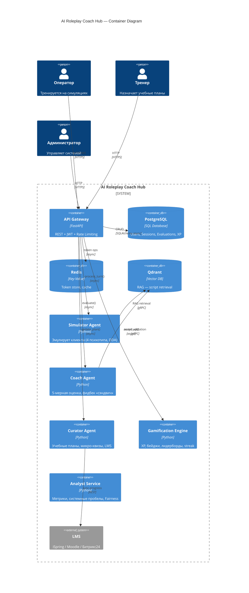
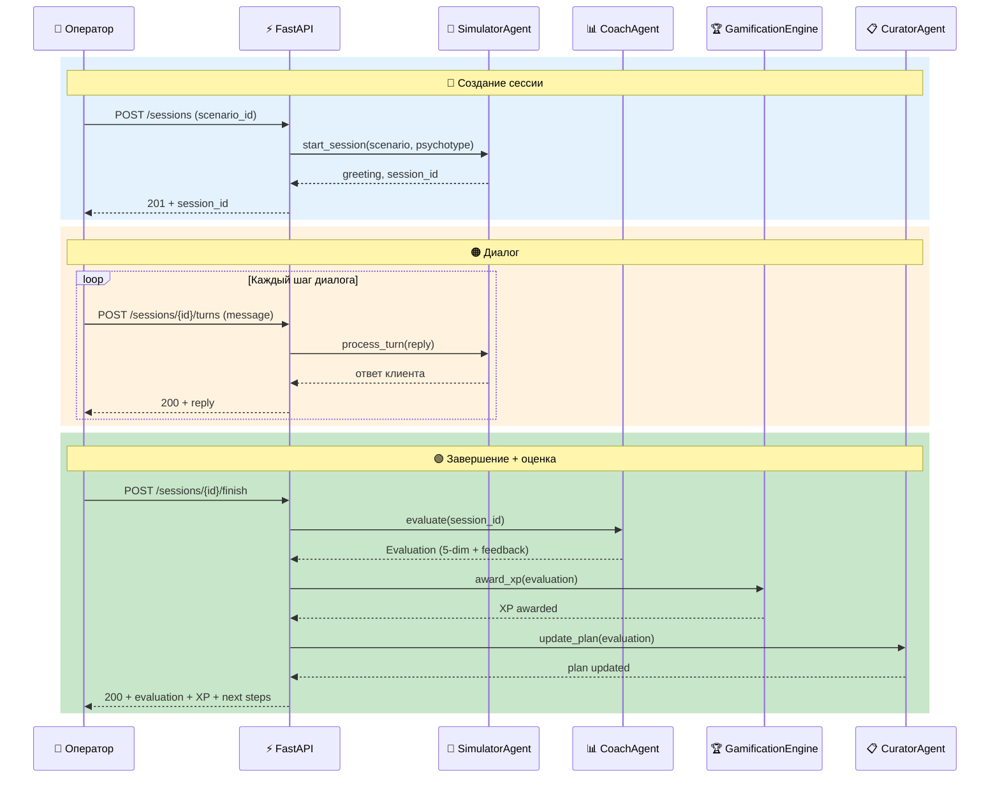
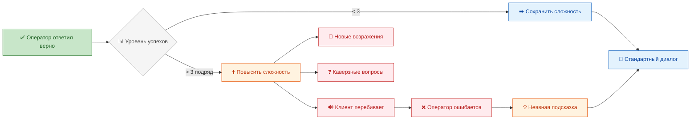

# AI Roleplay Coach Hub

> Мультиагентная система тренировки операторов контакт-центра через симуляцию диалогов с AI-клиентом.  
> Сократите Time-to-Proficiency с 4 недель до 2 недель и снизьте нагрузку на наставников на 70%.

     

---

## Оглавление

- [Описание проекта](#описание-проекта)
- [Основные возможности](#основные-возможности)
- [Целевые показатели](#целевые-показатели)
- [Архитектура](#архитектура)
- [Стек технологий](#стек-технологий)
- [Быстрый старт](#быстрый-старт)
- [API Endpoints](#api-endpoints)
- [Документация](#документация)
- [Тестирование и качество](#тестирование-и-качество)
- [Лицензия](#лицензия)

---

## Описание проекта

### Бизнес-проблема

Операторы контакт-центра тратят **4 недели** на выход на плановые показатели (Time-to-Proficiency). Всё это время наставники заняты индивидуальным обучением на 100% своего рабочего времени. После 10 симуляций новички всё ещё допускают ошибки в **100% случаев**. При масштабах крупного контакт-центра это оборачивается серьёзными потерями в качестве обслуживания и операционной эффективности.

| Метрика | Текущее состояние | Целевое состояние |
|---------|-------------------|-------------------|
| Time-to-Proficiency | 4 недели | 2 недели |
| Нагрузка на наставников | 100% времени | 30% времени |
| Ошибки новичков (после 10 симуляций) | 100% | 60% |
| Качество обслуживания (QA Score) | Базовый уровень | +25% |

### Решение

**AI Roleplay Coach Hub** — мультиагентная система, в которой:

1. **SimulatorAgent** играет роль клиента с заданным психотипом (нейтральный, агрессивный, растерянный, технически неграмотный) и адаптивной сложностью (DDA).
2. Оператор ведёт диалог с виртуальным клиентом через REST API или WebSocket.
3. **CoachAgent** анализирует диалог по 5 измерениям, даёт оценку и фидбек по принципу «сэндвич».
4. **CuratorAgent** управляет учебным планом, подбирает сценарии под слабые места.
5. **GamificationEngine** начисляет XP, выдаёт бейджи, ведёт лидерборды.
6. **AnalystService** строит дашборды и проводит Fairness-аудит.

Всё работает **in-memory** без внешних сервисов для разработки, и с опциональными PostgreSQL/Redis/Qdrant для production.

### Ключевые преимущества

- **Zero внешних зависимостей в dev-режиме** — in-memory репозитории, никаких БД
- **4 психотипа клиента** + DDA (Dynamic Difficulty Adjustment)
- **5-мерная оценка диалога** с RAG-валидацией по скриптам
- **Геймификация** — XP, уровни, бейджи, лидерборды, streak
- **Fairness-аудит** — 4 метрики: demographic parity, equalized odds, calibration, disparate impact
- **JWT + RBAC** — роли Operator / Trainer / Admin
- **Production-ready** — Docker, Prometheus, rate limiting, security headers

---

## Основные возможности

- **FR-1. Симуляция клиента** — 4 психотипа, 4-фазная структура диалога (Greeting → NeedIdentification → ObjectionHandling → Closing), DDA, Anti-Gaming, LLM-режим (Ollama / OpenAI)
- **FR-2. AI-коучинг** — 5-мерная оценка (Script Adherence, Tone, Empathy, Completeness, Professionalism) с весами, фидбек «сэндвич» с цитатами из скриптов
- **FR-3. Геймификация** — XP и уровни (1–100), 6+ бейджей («Укротитель гнева», «Мастер эмпатии»), лидерборды по подразделениям, челленджи, streak
- **FR-4. Аналитика и Fairness** — дашборды для руководителей, системные пробелы в скриптах, 4 метрики Fairness-аудита
- **FR-5. Аутентификация и RBAC** — JWT (access + refresh), роли Operator / Trainer / Admin
- **FR-6. REST API + WebSocket** — FastAPI, полный CRUD для сессий, оценок, сценариев, пагинация
- **FR-7. In-memory / external режимы** — переключение через USE_IN_MEMORY_REPOS, работа без БД/Redis/Qdrant

---

## Целевые показатели

| KPI | Текущее | Целевое | Метод измерения |
|-----|---------|---------|-----------------|
| Time-to-Proficiency | 4 недели | **< 2 недель** | Сравнение с контрольной группой |
| Качество обслуживания | Базовый уровень | **+25%** | QA Score до и после |
| Нагрузка на наставников | 100% | **30%** | Замер времени |
| Ошибки новичков | 100% | **< 60%** | После 10 симуляций |
| Время ответа Coach | — | **< 2 сек (p95)** | Prometheus |
| Параллельные сессии | — | **≥ 50** | Нагрузочное тестирование |

---

## Архитектура

### Контейнерная диаграмма (C4 — Level 2)

На диаграмме ниже показана архитектура системы на уровне контейнеров. Пять AI-агентов (Simulator, Coach, Curator, Gamification, Analyst) образуют ядро системы. API Gateway (FastAPI) обеспечивает единую точку входа для операторов, тренеров и администраторов. Хранилища (PostgreSQL, Redis, Qdrant) опциональны — в режиме разработки все данные хранятся in-memory.



### Поток обработки симуляции

Следующая диаграмма показывает основной сценарий работы системы: оператор начинает сессию, выбирает сценарий, ведёт пошаговый диалог с AI-клиентом, завершает сессию и получает оценку от CoachAgent с начислением XP и обновлением учебного плана.



### DDA (Dynamic Difficulty Adjustment) — как это работает

Система адаптивной сложности — ключевая механика SimulatorAgent. Когда оператор успешно отвечает на возражения клиента, сложность повышается: клиент начинает перебивать, задавать каверзные вопросы, менять тактику. Если оператор ошибается — клиент, наоборот, даёт неявные подсказки в рамках своей роли.



---

## Стек технологий

| Компонент | Технология |
|-----------|-----------|
| **Язык** | Python 3.12, async/await |
| **Web-фреймворк** | FastAPI 0.115+ (ASGI, uvicorn) |
| **ORM** | SQLAlchemy 2.0 async + asyncpg |
| **Валидация** | Pydantic v2 (entities, settings, schemas) |
| **Аутентификация** | python-jose (JWT) + passlib (bcrypt) |
| **Векторная БД** | Qdrant 1.13+ (AsyncQdrantClient) |
| **Сессионная память** | Redis 7+ |
| **Логирование** | structlog (JSON / console) |
| **Метрики** | prometheus_client |
| **LLM** | Ollama / Mock / OpenAI-совместимые (через Provider Layer) |
| **Линтинг** | Ruff (ALL rules), mypy strict |
| **Тестирование** | pytest 8.3+ (~462 теста, pytest-asyncio, pytest-cov) |
| **Контейнеризация** | Docker, docker-compose (dev + prod) |
| **CI** | GitHub Actions (ruff → mypy → pytest) |
| **Голосовой пайплайн (план)** | LiveKit Agents, Whisper-Large-V3, Silero TTS v5 |

---

## Быстрый старт

### In-memory mode (без внешних сервисов)

Самый быстрый способ запустить систему — in-memory режим. Не требуется ни БД, ни Redis, ни Qdrant. Все данные хранятся в оперативной памяти.

```bash
# 1. Установка
pip install -e ".[dev]"

# 2. Запуск (in-memory mode по умолчанию)
uvicorn src.main:app --reload --port 8000

# 3. Проверка
curl http://localhost:8000/health

# 4. Seed-данные загружаются автоматически (3 пользователя, 3 сценария)
```

### С Docker (полный стек)

Для работы с PostgreSQL, Redis и Qdrant используйте Docker Compose:

```bash
# 1. Запуск всех сервисов
docker compose -f docker-compose.dev.yml up -d

# 2. Проверка
curl http://localhost:8000/health

# 3. Просмотр логов
docker compose -f docker-compose.dev.yml logs -f api
```

### [Makefile](Makefile) команды

```bash
make install      # pip install -e ".[dev]"
make lint         # ruff check src/ tests/
make format       # ruff format src/ tests/
make typecheck    # mypy src/
make test         # pytest tests/ -q --tb=short
make test-cov     # pytest tests/ --cov=src --cov-report=term-missing
make docker-up    # docker compose -f docker-compose.dev.yml up -d
make docker-down  # docker compose -f docker-compose.dev.yml down
```

---

## API Endpoints

Система предоставляет REST API с версионированием через префикс `/api/v1`. Все защищённые endpoints требуют JWT Bearer-токена в заголовке `Authorization`.

### Аутентификация

| Метод | Путь | Аутентификация | Описание |
|-------|------|---------------|----------|
| POST | `/api/v1/auth/register` | Нет | Регистрация нового пользователя |
| POST | `/api/v1/auth/login` | Нет | Вход, получение access + refresh токенов |
| POST | `/api/v1/auth/refresh` | Нет | Обновление токенов |
| POST | `/api/v1/auth/logout` | Bearer | Отзыв refresh-токена |
| GET | `/api/v1/auth/me` | Bearer | Информация о текущем пользователе |
| GET | `/api/v1/auth/users` | Bearer + Admin | Список всех пользователей (админ) |

### Сессии симуляции

| Метод | Путь | Аутентификация | Описание |
|-------|------|---------------|----------|
| GET | `/api/v1/sessions` | Bearer | Список сессий текущего пользователя |
| POST | `/api/v1/sessions` | Bearer | Создать новую сессию (выбрать сценарий) |
| POST | `/api/v1/sessions/{id}/turns` | Bearer | Отправить реплику оператора |
| POST | `/api/v1/sessions/{id}/finish` | Bearer | Завершить сессию |
| POST | `/api/v1/sessions/{id}/evaluate` | Bearer + Trainer/Admin | Оценить диалог |
| GET | `/api/v1/sessions/{id}` | Bearer | Детали сессии |

### Оценки, геймификация, аналитика

| Метод | Путь | Аутентификация | Описание |
|-------|------|---------------|----------|
| GET | `/api/v1/coach/evaluate` | Bearer | Ручная оценка (для отладки) |
| GET | `/api/v1/scenarios` | Bearer | Список доступных сценариев |
| GET | `/api/v1/gamification/xp/{user_id}` | Bearer | XP пользователя |
| GET | `/api/v1/gamification/leaderboard` | Bearer | Топ пользователей |
| GET | `/api/v1/curator/plan/{user_id}` | Bearer | Учебный план |
| GET | `/api/v1/analyst/dashboard` | Bearer + Trainer/Admin | Дашборд аналитики |
| GET | `/api/v1/analyst/fairness/report` | Bearer + Admin | Fairness-отчёт |
| GET | `/api/v1/analyst/fairness/groups` | Bearer + Admin | Группы Fairness |
| GET | `/api/v1/analyst/fairness/history` | Bearer + Admin | История Fairness-отчётов |

### Health / Metrics

| Метод | Путь | Описание |
|-------|------|----------|
| GET | `/health` | Liveness probe (всегда ok) |
| GET | `/ready` | Readiness probe (проверка компонентов) |
| GET | `/metrics` | Prometheus-метрики |

Подробное описание всех endpoints с примерами запросов и ответов — в [API.md](./API.md).

---

## Структура проекта

```
ai-roleplay-coach-agent-local/
├── src/                         # 🟢 Backend (Python 3.12)
│   ├── main.py                  #   FastAPI entrypoint + lifespan
│   ├── core/
│   │   ├── entities/            #   Pydantic v2: User, Session, Scenario, ...
│   │   ├── services/            #   SessionService, EvaluationService, AuthService
│   │   ├── interfaces/          #   Protocols: repos + agents + LLM
│   │   ├── dto/                 #   Data Transfer Objects
│   │   ├── config.py            #   Pydantic Settings из .env
│   │   └── exceptions/          #   Иерархия исключений
│   ├── agents/
│   │   ├── simulator/           #   Rule-based Simulator
│   │   ├── simulator_llm/       #   LLM-powered Simulator (adapter)
│   │   ├── coach/               #   CoachAgent + LLMCoachAdapter
│   │   ├── curator/             #   CuratorAgent
│   │   ├── gamification/        #   GamificationEngine
│   │   └── analyst/             #   AnalystService + FairnessService
│   ├── api/                     #   FastAPI endpoints
│   │   ├── router.py            #   Агрегатор всех роутеров
│   │   ├── auth.py, sessions.py, coach.py, ...
│   │   ├── dependencies.py      #   DI wiring (singletons)
│   │   └── middleware.py, rate_limit.py, ...
│   ├── infrastructure/
│   │   ├── postgres/            #   SQLAlchemy models, mappers, migrations
│   │   ├── qdrant/              #   Qdrant client + RAG service
│   │   ├── memory/              #   In-memory repository implementations
│   │   ├── llm/                 #   LLM Provider Layer
│   │   ├── redis/               #   Redis token store
│   │   ├── livekit/             #   Voice stubs (echo, ASR, TTS)
│   │   └── notification/        #   Notification stubs
│   ├── security/                #   Guardrails stubs
│   └── monitoring/              #   Logging config
├── frontend/                    # 🔵 React + Vite + TypeScript
├── tests/                       # 🧪 462+ тестов (api, unit, e2e, integration, security)
├── docs-all/                    # 📚 Полная документация (17 документов)
│   ├── README.md                #   ← этот файл
│   ├── SPECIFICATION.md         #   Полное ТЗ
│   ├── API.md                   #   REST + WebSocket справочник
│   ├── ...                      #   см. таблицу документации
│   └── adr/                     #   Architecture Decision Records
├── deploy/                      # ⚙️ Docker, Prometheus, Grafana
├── [docker-compose.dev.yml](docker-compose.dev.yml)       # 🐳 Dev-стек (PostgreSQL, Redis, Qdrant)
├── [docker-compose.prod.yml](docker-compose.prod.yml)      # 🐳 Production-стек
├── [Dockerfile.dev](Dockerfile.dev)               # Dev-сборка с hot-reload
├── [Dockerfile.prod](Dockerfile.prod)              # Multi-stage production сборка
└── [Makefile](Makefile)                     # Основные команды
```

Детальное описание каждого модуля — в [PROJECT_STRUCTURE.md](./PROJECT_STRUCTURE.md). Пофайловый справочник с классами, функциями и зависимостями — в [SOURCE_CODE_REFERENCE.md](./SOURCE_CODE_REFERENCE.md).

---

## Документация

Проект содержит полный комплект документации в папке `docs-all/`. Каждый документ покрывает определённый аспект системы.

| Документ | Описание |
|----------|---------|
| [README.md](./README.md) | ← этот файл. Обзор проекта, архитектура, быстрый старт |
| [SPECIFICATION.md](./SPECIFICATION.md) | Полное техническое задание: FR, NFR, C4, ERD, API-контракты |
| [API.md](./API.md) | Полный справочник REST API + WebSocket с примерами |
| [PROJECT_STRUCTURE.md](./PROJECT_STRUCTURE.md) | Дерево репозитория, назначение каждого модуля |
| [SOURCE_CODE_REFERENCE.md](./SOURCE_CODE_REFERENCE.md) | Пофайловый навигатор по исходному коду |
| [DATA_FLOWS.md](./DATA_FLOWS.md) | Use cases, sequence-диаграммы, сценарии |
| [USER_GUIDE.md](./USER_GUIDE.md) | Руководство для операторов и тренеров |
| [ADMIN_GUIDE.md](./ADMIN_GUIDE.md) | Руководство администратора |
| [DEPLOYMENT_PLAN.md](./DEPLOYMENT_PLAN.md) | План развёртывания в production |
| [CICD.md](./CICD.md) | CI/CD пайплайн (GitHub Actions) |
| [TESTING.md](./TESTING.md) | Стратегия тестирования, тест-кейсы, матрица покрытия |
| [INTEGRATION_TEST_SPEC.md](./INTEGRATION_TEST_SPEC.md) | Интеграционное тестирование (LLM, DB, Qdrant) |
| [IMPLEMENTATION_PLAN.md](./IMPLEMENTATION_PLAN.md) | План реализации по фазам |
| [GLOSSARY.md](./GLOSSARY.md) | Словарь терминов и аббревиатур |
| [TROUBLESHOOTING_GUIDE.md](./TROUBLESHOOTING_GUIDE.md) | Типовые проблемы и решения |
| [adr/README.md](./adr/README.md) | Индекс архитектурных решений |
| [adr/ARCHITECTURE_DECISIONS.md](./adr/ARCHITECTURE_DECISIONS.md) | Все ADR с обоснованиями |

---

## Тестирование и качество

Проект имеет **462 теста**, все проходят в CI. Покрытие кода — **~84%**.

```bash
make test       # pytest tests/ -q --tb=short
make test-cov   # pytest tests/ --cov=src --cov-report=term-missing
make lint       # ruff check src/ tests/
make typecheck  # mypy src/
```

**Структура тестов:**

| Директория | Тип | Количество |
|-----------|-----|-----------|
| `[tests/unit/](tests/unit/)` | Модульные тесты | ~300 |
| `[tests/api/](tests/api/)` | API-тесты (httpx AsyncClient) | ~100 |
| `[tests/e2e/](tests/e2e/)` | E2E-тесты (полный цикл) | ~30 |
| `[tests/integration/](tests/integration/)` | Интеграционные тесты | ~20 |
| `[tests/security/](tests/security/)` | Тесты безопасности | ~12 |

Подробное описание стратегии тестирования — в [TESTING.md](./TESTING.md).

---

## Лицензия

MIT License. Подробнее — в файле [LICENSE](../LICENSE) (если применимо).

---

*Документация создана 2026-07-12. Актуально для версии 0.1.0.*
