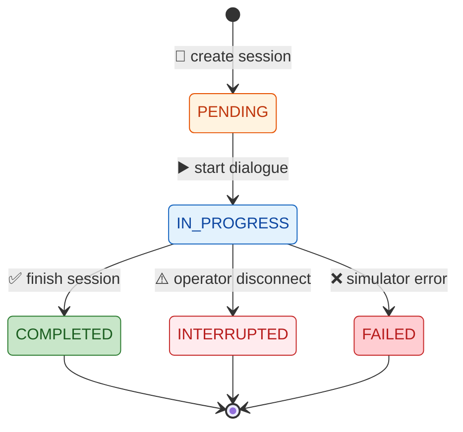
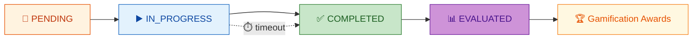
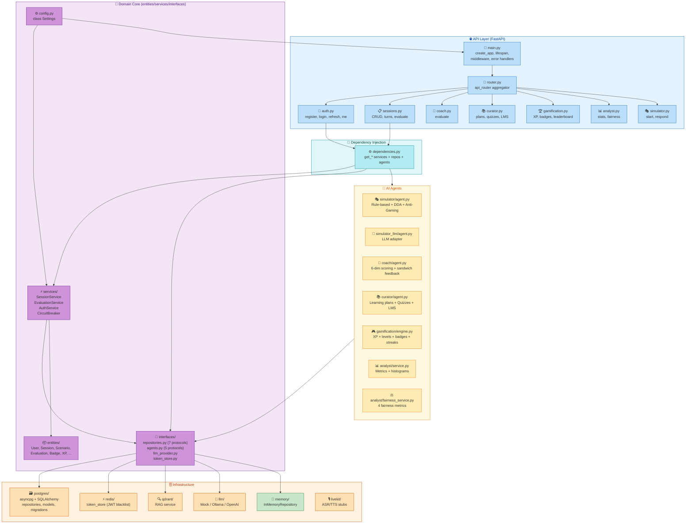

# Source Code Reference — AI Roleplay Coach Hub

> **Цель:** Навигатор по каждому значимому файлу исходного кода. Быстрый поиск, понимание зависимостей.
> **Аудитория:** Разработчики, архитекторы, code reviewers.
> **Принципы отбора:** Файлы, составляющие публичный API проекта — роутеры, сервисы, агенты, инфраструктура. Тесты включены выборочно (ключевые файлы).

---

## 1. Бэкенд

### 1.1. Точка входа и конфигурация

#### `[src/main.py](src/main.py)`

**Назначение:** Точка входа FastAPI-приложения. `create_app()` создаёт экземпляр `FastAPI`, регистрирует middleware, exception handlers, роутеры и health-эндпоинты.

```python
app = FastAPI(title="AI Roleplay Coach Hub", version="0.1.0", lifespan=lifespan)
```

**Middleware chain (порядок важен):**
1. `CORSMiddleware` — CORS (настраивается через `CORS_ORIGINS`)
2. `RequestIDMiddleware` — X-Request-ID (генерация/прокси)
3. `MetricsMiddleware` — Prometheus-метрики
4. `RateLimitMiddleware` — глобальный rate limiter
5. `SecurityHeadersMiddleware` — CSP, HSTS, X-Frame-Options
6. `AuthRateLimitMiddleware` — per-endpoint rate limit для auth

**Exception handlers (RFC 9457 Problem Details):**
- `StarletteHTTPException` → RFC 9457 JSON
- `RequestValidationError` → 422 + Pydantic errors
- `Exception` → 500 + логирование

**Lifespan (startup/shutdown):**
- Настройка structlog
- Валидация конфигурации
- Seed data (3 users + 3 scenarios)
- Периодический fairness audit (если включён)
- Graceful shutdown: закрытие DB, LLM, Qdrant

**Health endpoints:**
- `GET /health` — liveness probe (no auth)
- `GET /ready` — readiness probe (no auth)

**Пример создания приложения:**
```python
def create_app() -> FastAPI:
    app = FastAPI(title="AI Roleplay Coach Hub", version="0.1.0", lifespan=lifespan)
    app.add_middleware(CORSMiddleware, allow_origins=settings.CORS_ORIGINS, ...)
    app.add_middleware(RequestIDMiddleware)
    app.add_middleware(MetricsMiddleware)
    app.add_middleware(RateLimitMiddleware)
    app.add_middleware(SecurityHeadersMiddleware)
    app.add_middleware(AuthRateLimitMiddleware)
    app.add_exception_handler(StarletteHTTPException, http_exception_handler)
    app.add_exception_handler(RequestValidationError, validation_exception_handler)
    app.add_exception_handler(Exception, generic_exception_handler)
    app.include_router(api_router, prefix="/api/v1")
    app.include_router(health_router)
    return app
```

**Ссылка:** `FR-1..FR-7`
**Зависимости:** `core/config.py`, `api/router.py`, `api/middleware.py`

---

#### `[src/core/config.py](src/core/config.py)`

**Назначение:** `class Settings(BaseSettings)` — все переменные окружения через `pydantic-settings`.

| Группа | Переменные | Дефолт |
|--------|-----------|--------|
| JWT | `JWT_SIGNING_KEY`, `JWT_ALGORITHM`, `JWT_ACCESS_EXPIRE_MINUTES`, `JWT_REFRESH_EXPIRE_DAYS` | HS256, 30min, 7d |
| Database | `POSTGRES_HOST`, `POSTGRES_PORT`, `POSTGRES_USER`, `POSTGRES_PASSWORD`, `POSTGRES_DB`, `DB_POOL_SIZE`, `DB_MAX_OVERFLOW` | localhost, 5432 |
| LLM | `LLM_PROVIDER`, `LLM_MODEL`, `LLM_BASE_URL`, `LLM_API_KEY`, `LLM_TIMEOUT` | mock, mistral:7b |
| Embedding | `EMBEDDING_URL` | http://localhost:8001 |
| Redis | `REDIS_HOST`, `REDIS_PORT` | localhost, 6379 |
| Qdrant | `QDRANT_HOST`, `QDRANT_PORT`, `QDRANT_COLLECTION` | localhost, 6333 |
| MinIO | `MINIO_*` | localhost |
| Rate Limit | `RATE_LIMIT_DEFAULT`, `RATE_LIMIT_AUTH`, `RATE_LIMIT_WINDOW` | 100, 10, 60 |
| Fairness | `FAIRNESS_ENABLED`, `FAIRNESS_CONFIG_PATH`, `FAIRNESS_AUDIT_INTERVAL_HOURS` | false |
| Logging | `LOG_FORMAT`, `LOG_LEVEL` | console, INFO |
| CORS | `CORS_ORIGINS` | ["*"] |

**Feature flags (переменные-выключатели):**
| Флаг | Тип | Дефолт | Описание |
|------|-----|--------|----------|
| `FAIRNESS_ENABLED` | bool | false | Включить fairness-аудит |
| `RAG_ENABLED` | bool | false | Включить RAG-интеграцию |
| `LLM_SIMULATOR_ENABLED` | bool | false | Использовать LLM вместо rule-based Simulator |
| `LLM_COACH_ENABLED` | bool | false | Использовать LLM вместо rule-based Coach |
| `DDA_ENABLED` | bool | true | Включить Dynamic Difficulty Adjustment |
| `METRICS_ENABLED` | bool | true | Включить сбор Prometheus-метрик |
| `DOUBLE_WRITE_ENABLED` | bool | true | Дублирование данных (in-memory + PG) |

**LLM настройки:**
```python
class LLMSettings(BaseModel):
    provider: str = "mock"           # mock | openai | ollama | vllm
    model: str = "mistral:7b"
    base_url: str = "http://localhost:11434"
    api_key: str = ""
    timeout: int = 30
    max_tokens: int = 512
    temperature: float = 0.7
```

Метод `validate()` проверяет JWT-ключ, CORS-настройки и LLM-провайдера при старте.

**Файл:** [src/core/config.py](../src/core/config.py)

---

### 1.2. API-слой

#### `[src/api/router.py](src/api/router.py)`

**Назначение:** Единый `APIRouter`, агрегирующий все под-роутеры.

```python
api_router.include_router(sessions_router)
api_router.include_router(simulator_router)
api_router.include_router(coach_router)
api_router.include_router(curator_router)
api_router.include_router(gamification_router)
api_router.include_router(analyst_router)
api_router.include_router(auth_router)
```

**Под-роутеры:**
| Роутер | Префикс | Файл | Эндпоинтов |
|--------|---------|------|------------|
| `sessions_router` | `/sessions` | `api/sessions.py` | ~8 |
| `simulator_router` | `/simulator` | `api/simulator.py` | ~2 |
| `coach_router` | `/coach` | `api/coach.py` | ~2 |
| `curator_router` | `/curator` | `api/curator.py` | ~5 |
| `gamification_router` | `/gamification` | `api/gamification.py` | ~8 |
| `analyst_router` | `/analyst` | `api/analyst.py` | ~4 |
| `auth_router` | `/auth` | `api/auth.py` | ~4 |

**Все эндпоинты монтируются под общий префикс `/api/v1`.**

**Файл:** [src/api/router.py](../src/api/router.py)

---

#### `[src/api/health.py](src/api/health.py)`

**Назначение:** Health-check эндпоинты.

| Endpoint | Method | Описание |
|----------|--------|----------|
| `/health` | GET | Базовая проверка (alive) |
| `/health/ready` | GET | Readiness: проверка подключения к PostgreSQL и Redis |
| `/health/startup` | GET | Startup probe: проверка загрузки конфигурации |

**Файл:** [src/api/health.py](../src/api/health.py)

---

#### `[src/api/auth.py](src/api/auth.py)`

**Назначение:** Аутентификация. `prefix="/api/v1/auth"`.

| Endpoint | Method | Auth | Описание |
|----------|--------|------|----------|
| `/register` | POST | No | Регистрация (201) |
| `/login` | POST | No | Логин → TokenPair |
| `/refresh` | POST | No | Refresh token |
| `/logout` | POST | Bearer | Инвалидация токена |
| `/me` | GET | Bearer | Текущий пользователь |
| `/users` | GET | Bearer + ADMIN | Список пользователей |

**Request/Response модели:**
| Модель | Поля | Назначение |
|--------|------|------------|
| `RegisterRequest` | username, email, password, role | Регистрация нового пользователя |
| `LoginRequest` | username, password | Вход в систему |
| `RefreshRequest` | refresh_token | Обновление access-токена |
| `UserInfo` | id, username, email, role, is_active | Информация о пользователе |
| `TokenPair` | access_token, refresh_token, token_type | Пара токенов для аутентификации |

**Токены:** JWT (access — 15 мин, refresh — 7 дней). Refresh-токены хранятся в Redis blacklist для поддержки revoke. При logout access-токен добавляется в черный список.

**Файл:** [src/api/auth.py](../src/api/auth.py)

---

#### `[src/api/sessions.py](src/api/sessions.py)`

**Назначение:** CRUD сессий симуляции. `prefix="/api/v1/sessions"`.

| Endpoint | Method | Auth | Role | Описание |
|----------|--------|------|------|----------|
| `/` | POST | Bearer | OP/TRAINER/ADMIN | Создать сессию |
| `/` | GET | Bearer | Any | Список сессий (пагинация) |
| `/{id}` | GET | Bearer | Any | Детали сессии |
| `/{id}/turns` | POST | Bearer | Any | Шаг диалога |
| `/{id}/finish` | POST | Bearer | Any | Завершить сессию |
| `/{id}/evaluate` | POST | Bearer | TRAINER/ADMIN | Оценка сессии |

**Зависимости:** `SessionService`, `SimulatorAgent`, `CoachAgent`.

**Файл:** [src/api/sessions.py](../src/api/sessions.py)

---

#### `[src/api/simulator.py](src/api/simulator.py)`

**Назначение:** Simulator API для standalone-использования. `prefix="/api/v1/simulator"`.

| Endpoint | Method | Auth | Описание |
|----------|--------|------|----------|
| `/start` | POST | Bearer | Запустить симуляцию |
| `/respond` | POST | Bearer | Сгенерировать ответ |
| `/should-end/{id}` | POST | Bearer | Проверить завершение |

**Файл:** [src/api/simulator.py](../src/api/simulator.py)

---

#### `[src/api/coach.py](src/api/coach.py)`

**Назначение:** Coach API. `prefix="/api/v1/coach"`.

| Endpoint | Method | Auth | Описание |
|----------|--------|------|----------|
| `/evaluate` | POST | Bearer | Оценить диалог |

**Файл:** [src/api/coach.py](../src/api/coach.py)

---

#### `[src/api/curator.py](src/api/curator.py)`

**Назначение:** Curator API (учебные планы, квизы, LMS). `prefix="/api/v1/curator"`.

| Endpoint | Method | Auth | Role | Описание |
|----------|--------|------|------|----------|
| `/learning-plan` | POST | Bearer | Any | Сгенерировать learning plan |
| `/quiz` | POST | Bearer | TRAINER/ADMIN | Создать квиз |
| `/sync-lms` | POST | Bearer | ADMIN | Синхронизация с LMS |

**Файл:** [src/api/curator.py](../src/api/curator.py)

---

#### `[src/api/gamification.py](src/api/gamification.py)`

**Назначение:** Геймификация. `prefix="/api/v1/gamification"`.

| Endpoint | Method | Auth | Описание |
|----------|--------|------|----------|
| `/xp/{id}` | GET | Bearer | XP пользователя |
| `/xp/{id}/history` | GET | Bearer | История транзакций XP |
| `/badges` | GET | Bearer | Все бейджи |
| `/badges/{id}` | GET | Bearer | Бейджи пользователя |
| `/leaderboard` | GET | Bearer | Топ пользователей |
| `/streak/{id}` | GET | Bearer | Текущая серия |

**Файл:** [src/api/gamification.py](../src/api/gamification.py)

---

#### `[src/api/analyst.py](src/api/analyst.py)`

**Назначение:** Аналитика и Fairness-аудит. `prefix="/api/v1/analyst"`.

| Endpoint | Method | Auth | Role | Описание |
|----------|--------|------|------|----------|
| `/stats` | GET | Bearer | TRAINER/ADMIN | Глобальная статистика |
| `/stats/{id}` | GET | Bearer | Any | Статистика пользователя |
| `/distribution/{id}` | GET | Bearer | Any | Распределение оценок |
| `/progress/{id}` | GET | Bearer | Any | Прогресс за время |
| `/fairness/report` | GET | Bearer | ADMIN | Fairness-отчёт |
| `/fairness/groups` | GET | Bearer | ADMIN | Группы для отчёта |
| `/fairness/history` | GET | Bearer | ADMIN | История отчётов |

**Файл:** [src/api/analyst.py](../src/api/analyst.py)

---

#### `[src/api/dependencies.py](src/api/dependencies.py)`

**Назначение:** DI-контейнер. Все зависимости регистрируются через FastAPI `Depends()`.

**Ключевые функции:**

```python
def get_session_repo() -> SessionRepository
def get_user_repo() -> UserRepository
def get_scenario_repo() -> ScenarioRepository
def get_eval_repo() -> EvaluationRepository
def get_xp_repo() -> XPTransactionRepository
def get_badge_repo() -> BadgeRepository
def get_simulator() -> SimulatorAgent
def get_coach() -> CoachAgent
def get_curator() -> CuratorAgentImpl
def get_gamification_engine() -> GamificationEngine
def get_analyst_service() -> AnalystService
def get_session_service() -> SessionService
def get_evaluation_service() -> EvaluationService
def get_auth_service() -> AuthService
def get_llm_provider() -> LLMProvider
```

**Auth guards:**
```python
def get_current_user() -> User           # Bearer token → User
def require_role(*roles: UserRole)        # Role guard
```

Режим работы (in-memory / PostgreSQL) определяется настройкой `DB_MODE` в `Settings`.

**Файл:** [src/api/dependencies.py](../src/api/dependencies.py)

---

#### `[src/api/middleware.py](src/api/middleware.py)`

**Назначение:** `RequestIDMiddleware` — добавляет `X-Request-ID` в каждый request/response (генерирует UUID4, если не передан клиентом).

**Файл:** [src/api/middleware.py](../src/api/middleware.py)

---

#### `[src/api/rate_limit.py](src/api/rate_limit.py)`

**Назначение:** `RateLimitMiddleware` — sliding window rate limiter.

| Параметр | Default | Auth |
|----------|---------|------|
| Limit | 100 | 10 |
| Window | 60s | 60s |
| Response | 429 + `X-RateLimit-*` headers | |

**Файл:** [src/api/rate_limit.py](../src/api/rate_limit.py)

---

#### `[src/api/auth_rate_limit_middleware.py](src/api/auth_rate_limit_middleware.py)`

**Назначение:** Per-endpoint rate limit для auth-эндпоинтов.

| Path | Limit | Window | Block |
|------|-------|--------|-------|
| `/api/v1/auth/register` | 5 | 600s | 1800s |
| `/api/v1/auth/login` | 10 | 600s | 1800s |
| `/api/v1/auth/refresh` | 20 | 600s | 1800s |

**Файл:** [src/api/auth_rate_limit_middleware.py](../src/api/auth_rate_limit_middleware.py)

---

#### `[src/api/security_headers.py](src/api/security_headers.py)`

**Назначение:** `SecurityHeadersMiddleware` — добавляет HTTP security-заголовки:

| Header | Value |
|--------|-------|
| `X-Content-Type-Options` | `nosniff` |
| `X-Frame-Options` | `DENY` |
| `X-XSS-Protection` | `1; mode=block` |
| `Strict-Transport-Security` | `max-age=31536000; includeSubDomains` |
| `Content-Security-Policy` | `default-src 'self'` |
| `Referrer-Policy` | `strict-origin-when-cross-origin` |
| `Permissions-Policy` | `geolocation=(), microphone=()` |

**Файл:** [src/api/security_headers.py](../src/api/security_headers.py)

---

#### `[src/api/metrics.py](src/api/metrics.py)`

**Назначение:** Prometheus-метрики (Counter, Histogram, Gauge) + `/api/v1/metrics` endpoint.

**Middleware:** `MetricsMiddleware` — оборачивает каждый request, замеряет время и статус.

**Метрики:**
| Метрика | Тип | Теги | Описание |
|---------|-----|------|----------|
| `http_requests_total` | Counter | method, path, status | Общее количество запросов |
| `http_request_duration_seconds` | Histogram | method, path | Распределение времени ответа |
| `active_sessions` | Gauge | — | Текущее количество активных сессий |
| `total_evaluations` | Counter | — | Всего выполнено оценок |
| `gamification_xp_awarded_total` | Counter | badge_id | Всего начислено XP |
| `fairness_audits_total` | Counter | status | Количество fairness-аудитов |
| `circuit_breaker_state` | Gauge | service | Состояние Circuit Breaker (0=closed, 1=open, 2=half-open) |
- `circuit_breaker_state` (Gauge: circuit)

**Файл:** [src/api/metrics.py](../src/api/metrics.py)

---

### 1.3. Модели сущностей

Все сущности — Pydantic `BaseModel`, экспортируются через `[src/core/entities/__init__.py](src/core/entities/__init__.py)`.

| Entity | File | Key Fields |
|--------|------|------------|
| `User` | [user.py](../src/core/entities/user.py) | id, username, role, email, xp_total, level, gender*, age_group*, accent* |
| `Session` | [session.py](../src/core/entities/session.py) | id, user_id, scenario_id, status, transcript[] |
| `TranscriptEntry` | [session.py](../src/core/entities/session.py) | speaker (operator\|client), text, timestamp |
| `Scenario` | [scenario.py](../src/core/entities/scenario.py) | id, name, difficulty, psychotype, script_text |
| `Evaluation` | [evaluation.py](../src/core/entities/evaluation.py) | id, session_id, user_id, 6 scores, feedback text, gaming_detected |
| `Badge` | [badge.py](../src/core/entities/badge.py) | id, name, description, icon_url, criteria |
| `UserBadge` | [badge.py](../src/core/entities/badge.py) | user_id, badge_id, earned_at |
| `XPTransaction` | [xp.py](../src/core/entities/xp.py) | id, user_id, amount, reason, reference_id |
| `Metric` | [xp.py](../src/core/entities/xp.py) | id, user_id, metric_type, value |
| `LearningPlan` | [learning_plan.py](../src/core/entities/learning_plan.py) | id, user_id, scenario_id, steps[] |
| `MicroQuiz` | [quiz.py](../src/core/entities/quiz.py) | id, scenario_id, questions[] |
| `FairnessReport` | [fairness.py](../src/core/entities/fairness.py) | id, generated_at, metrics[], summary, config_snapshot |
| `DDAState` | [dda_state.py](../src/core/entities/dda_state.py) | session_id, level, streak, difficulty |
| `ScriptNode` | [script_node.py](../src/core/entities/script_node.py) | id, scenario_id, node_type, content |
| `EvaluationWeights` | [weights.py](../src/core/entities/weights.py) | dimension → weight mapping |
| `CoachWeights` | [weights.py](../src/core/entities/weights.py) | Coach-specific weights |

**Protected attributes (fairness):** `gender`, `age_group` (18-25,26-35,36-45,46-55,55+), `accent`, `native_language`.

**Entity states diagram:**



---

### 1.4. DTO

| File | Classes | Purpose |
|------|---------|---------|
| [pagination.py](../src/core/dto/pagination.py) | `PageParams`, `Page` | Пагинация (offset/limit) |
| [problem_detail.py](../src/core/dto/problem_detail.py) | `ProblemDetail` | RFC 9457 error response |
| [fairness_dto.py](../src/core/dto/fairness_dto.py) | Fairness DTOs | Запросы/ответы fairness |

---

### 1.5. Базовые сервисы

#### `[src/core/services/session_service.py](src/core/services/session_service.py)` — `SessionService`

**Назначение:** Оркестратор жизненного цикла сессии (start → turn → finish → evaluate).

**Жизненный цикл сессии:**


**Методы:**
| Метод | Вход | Выход | Описание |
|-------|------|-------|----------|
| `start_session(user_id, scenario_id)` | UUID, UUID | `Session` | Загружает сценарий, запрашивает приветствие у Simulator, создаёт IN_PROGRESS сессию |
| `process_turn(session_id, text)` | UUID, str | `TranscriptEntry` | Добавляет ход оператора, генерирует ответ Simulator |
| `finish_session(session_id)` | UUID | `Session` | Завершает сессию (→ COMPLETED) |
| `get_session(session_id)` | UUID | `Session` | Возвращает сессию |
| `evaluate_session(session_id)` | UUID | `Evaluation` | Запускает Coach-оценку, сохраняет результат |
| `get_user_sessions(user_id, limit)` | UUID, int | `list[Session]` | История сессий пользователя |
| `get_active_sessions()` | — | `list[Session]` | Все активные сессии |

**Детали process_turn:**
1. Загрузить сессию из репозитория
2. Проверить статус `IN_PROGRESS` (иначе `BusinessRuleViolationError`)
3. Создать `TranscriptEntry` с текстом оператора (роль `OPERATOR`)
4. Вызвать `SimulatorAgent.generate_response(session_id, transcript)` для ответа клиента
5. Создать `TranscriptEntry` с ответом симулятора (роль `SIMULATED_CLIENT`)
6. Сохранить оба хода в сессию
7. Вернуть только что созданный ход оператора (фронтенд получает список всех ходов)

**Зависимости:** `SessionRepository`, `ScenarioRepository`, `SimulatorAgent`, `CoachAgent`, `UserRepository`, `EvaluationRepository`.

**Ошибки:** `NotFoundError` (session/scenario не найдена), `BusinessRuleViolationError` (сессия не в IN_PROGRESS).

**Файл:** [src/core/services/session_service.py](../src/core/services/session_service.py)

---

#### `[src/core/services/evaluation_service.py](src/core/services/evaluation_service.py)` — `EvaluationService`

**Назначение:** Пост-обработка оценки: начисление XP, проверка бейджей, обновление статистики.

**Методы:**
| Метод | Вход | Выход |
|-------|------|-------|
| `process_evaluation(evaluation)` | Evaluation | Evaluation (с начисленным XP) |

Вызывает `GamificationEngine.award_xp()` и `check_achievements()`.

**Файл:** [src/core/services/evaluation_service.py](../src/core/services/evaluation_service.py)

---

#### `[src/core/services/auth_service.py](src/core/services/auth_service.py)` — `AuthService`

**Назначение:** JWT-аутентификация.

**Методы:**
| Метод | Описание |
|-------|----------|
| `register(username, password)` | Хэш bcrypt, создание User, TokenPair |
| `login(username, password)` | Проверка пароля, TokenPair |
| `refresh(refresh_token)` | Валидация refresh token, новый TokenPair |
| `logout(access_token)` | Blacklist (Redis/InMemory) |
| `get_current_user(token)` | Декодинг JWT → User |

**Token format:**
```python
access_token = jwt.encode({"sub": user_id, "username": ..., "role": ..., "exp": ...}, key, algorithm)
refresh_token = jwt.encode({"sub": user_id, "type": "refresh", "exp": ...}, key, algorithm)
```

**Файл:** [src/core/services/auth_service.py](../src/core/services/auth_service.py)

---

#### `[src/core/services/circuit_breaker.py](src/core/services/circuit_breaker.py)` — `CircuitBreaker`

**Назначение:** Circuit Breaker для внешних вызовов (LLM, DB, Redis).

**Состояния:** CLOSED (работает) → OPEN (отказ) → HALF_OPEN (проверка).

**Параметры:** failure_threshold, recovery_timeout, half_open_max_calls.

**Файл:** [src/core/services/circuit_breaker.py](../src/core/services/circuit_breaker.py)

---

### 1.6. Интерфейсы (Ports)

Все интерфейсы — `typing.Protocol` (structural typing, duck typing).

#### `[src/core/interfaces/repositories.py](src/core/interfaces/repositories.py)`

| Protocol | Methods |
|----------|---------|
| `UserRepository` | get_by_id, get_by_email, get_by_username, list_all, create, update, delete, count, get_leaderboard, get_users_by_attributes |
| `SessionRepository` | get_by_id, list_by_user, create, update, delete, list_all, count_by_user, count_completed |
| `ScenarioRepository` | get_by_id, list_all, create, update, delete, count, list_by_difficulty |
| `EvaluationRepository` | get_by_id, get_by_session, list_by_user, create, update, delete, list_all, get_average_score, get_scores_by_user_ids |
| `BadgeRepository` | get_by_id, list_all, create, award_to_user, get_user_badges, has_user_badge |
| `DDAStateRepository` | get_by_session, create, update, delete, list_stale, delete_stale |
| `XPTransactionRepository` | create, list_by_user, count_by_user, get_total_xp |

**Файл:** [src/core/interfaces/repositories.py](../src/core/interfaces/repositories.py)

#### `[src/core/interfaces/agents.py](src/core/interfaces/agents.py)`

| Protocol | Methods |
|----------|---------|
| `SimulatorAgent` | start_dialogue(scenario), generate_response(session), should_end(session) |
| `CoachAgent` | evaluate_session(session, scenario) → Evaluation |
| `CuratorAgent` | generate_learning_plan(user_id, evaluations, scenario), generate_quiz(scenario), sync_lms(data) |
| `GamificationEngine` | award_xp(user, evaluation), check_achievements(user) |
| `AnalystService` | get_session_stats(user_id), get_score_distribution(user_id), get_progress_over_time(user_id), get_global_stats() |

**Файл:** [src/core/interfaces/agents.py](../src/core/interfaces/agents.py)

#### `[src/core/interfaces/llm_provider.py](src/core/interfaces/llm_provider.py)`

**Protocol:** `LLMProvider` — `generate(prompt, system_prompt, ...)` → str.

**Файл:** [src/core/interfaces/llm_provider.py](../src/core/interfaces/llm_provider.py)

#### `[src/core/interfaces/token_store.py](src/core/interfaces/token_store.py)`

**Protocol:** `TokenStore` — `blacklist(token, exp)`, `is_blacklisted(token)` → bool, `close()`.

**Файл:** [src/core/interfaces/token_store.py](../src/core/interfaces/token_store.py)

---

### 1.7. AI-агенты

#### `[src/agents/simulator/agent.py](src/agents/simulator/agent.py)` — `SimulatorAgent`

**Назначение:** Rule-based эмуляция клиента контакт-центра.

**Психотипы (5):** `Psychotype.NEUTRAL`, `AGGRESSIVE`, `CONFUSED`, `TECHNICALLY_INEPT`, `FRAUDSTER`.

**Стадии диалога (6):**
1. Greeting (turns 1–2)
2. Need Identification (turns 3–5)
3. Objection Handling (turns 6–7)
4. Closing (turn 7+)
5. End (max 10 operator turns или closing + responded)

**Ключевые механизмы:**
- **DDA (Dynamic Difficulty Adjustment):** Если `operator_success_streak >= 2`, ответы становятся более интенсивными (агрессивные префиксы).
- **Anti-Gaming:** Обнаруживает повторяющиеся паттерны оператора (3+ одинаковых сообщения) и меняет сценарий непредсказуемо.
- **RAG-интеграция:** `RAGService` (опционально) для семантического поиска по скриптам.

**Поток generate_response:**
1. Определить текущую стадию диалога по числу ходов оператора
2. Выбрать психотип (из конфигурации сценария)
3. Проверить DDA: если `operator_success_streak >= 2`, повысить интенсивность (выбрать aggressive-вариацию шаблона)
4. Проверить Anti-Gaming: если 3+ одинаковых сообщения оператора подряд, выбрать случайную фразу из другого психотипа
5. Выбрать шаблон ответа для текущего психотипа и стадии (с учётом интенсивности)
6. Заполнить шаблон контекстом (имя клиента, продукт, причина обращения)
7. Вернуть `SimulatorResponse` с текстом, метаданными психотипа и стадии

**Пул ответов:** 3–5 шаблонных фраз на каждый психотип × стадию (всего ~100 фраз).

**Состояние сессии:** `SimulatorSessionState` — in-memory `dict[UUID, SimulatorSessionState]`.

**Файл:** [src/agents/simulator/agent.py](../src/agents/simulator/agent.py)

---

#### `[src/agents/simulator_llm/agent.py](src/agents/simulator_llm/agent.py)` — `SimulatorLLMAgent`

**Назначение:** LLM-адаптер для симуляции. Заменяет rule-based логику на вызов LLM.

**Файл:** [src/agents/simulator_llm/agent.py](../src/agents/simulator_llm/agent.py)

#### `[src/agents/simulator_llm/adapter.py](src/agents/simulator_llm/adapter.py)`

**Назначение:** Преобразование контекста сессии в промпт для LLM.

**Файл:** [src/agents/simulator_llm/adapter.py](../src/agents/simulator_llm/adapter.py)

---

#### `[src/agents/coach/agent.py](src/agents/coach/agent.py)` — `CoachAgent`

**Назначение:** Rule-based оценка диалога (6 измерений) + фидбек «сэндвич».

**Измерения оценки:**
| Измерение | Метод | Описание |
|-----------|-------|----------|
| Script Adherence (0-100) | `_score_script_adherence()` | % ключевых слов сценария в ответах оператора |
| Tone (0-100) | `_score_tone()` | Соотношение позитивных/негативных маркеров |
| Empathy (0-100) | `_score_empathy()` | Плотность эмпатических маркеров (1 на 15 слов) |
| Objection Handling (0-100) | `_score_objection_handling()` | % возражений клиента, которые адресованы |
| Completeness (0-100) | `_score_completeness()` | Длина диалога + покрытие этапов сценария |
| **Overall** | `_compute_overall()` | Среднее арифметическое 5 измерений |

**Лингвистические маркеры:**
- Позитивные (11): "thank you", "please", "appreciate", "welcome"…
- Негативные (10): "whatever", "not my problem", "calm down"…
- Эмпатические (12): "understand", "sorry", "frustrat"…
- Адресация возражений (12): "solution", "offer", "help", "resolve"…

**Формула Overall Score:**
```
overall = (script_adherence * weight_adherence +
           tone * weight_tone +
           empathy * weight_empathy +
           objection_handling * weight_objection +
           completeness * weight_completeness) / sum(weights)
```

**Пример результата оценки:**
```json
{
  "scores": {
    "script_adherence": 85,
    "tone": 72,
    "empathy": 90,
    "objection_handling": 65,
    "completeness": 78
  },
  "overall_score": 78,
  "feedback": {
    "praise": "Отличное использование эмпатии...",
    "growth": "Рекомендуется активнее адресовать возражения...",
    "closing": "В целом хороший диалог, продолжайте..."
  },
  "gaming_detected": false
}
```

**Поток evaluate:**
1. Получить транскрипт сессии (список `TranscriptEntry`)
2. Выполнить Anti-Gaming: проверить все ходы оператора на односложность (<15 символов) и повторяемость (3+ одинаковых)
3. Для каждого из 5 измерений вызвать соответствующий `_score_*` метод
4. Вычислить `_compute_overall()` — взвешенное среднее 5 измерений
5. Сгенерировать фидбек «сэндвич» на основе порогов каждого измерения
6. Вернуть `Evaluation` с баллами, фидбеком и флагом `gaming_detected`

**Пороги фидбека:**
| Уровень | Порог | Стиль |
|---------|-------|-------|
| Low | < 30 | Критический (разбор ошибок) |
| Medium | < 50 | Развивающий (точки роста) |
| High | < 70 | Поддерживающий (уверенный прогресс) |
| Top | >= 80 | Хвалебный (отличный результат) |

**Фидбек «сэндвич»:** Praise → Growth → Closing. Тексты генерируются на основе порогов.

**Anti-Gaming:** Обнаруживает односложные (<15 символов) или повторяющиеся ответы оператора.

**Файл:** [src/agents/coach/agent.py](../src/agents/coach/agent.py)

---

#### `[src/agents/coach/adapter.py](src/agents/coach/adapter.py)`

**Назначение:** Преобразование сессии + сценария в промпт для LLM (для LLM-версии Coach).

**Файл:** [src/agents/coach/adapter.py](../src/agents/coach/adapter.py)

#### `[src/agents/coach/llm_agent.py](src/agents/coach/llm_agent.py)`

**Назначение:** LLM-версия Coach (для внешних LLM вместо rule-based).

**Файл:** [src/agents/coach/llm_agent.py](../src/agents/coach/llm_agent.py)

---

#### `[src/agents/curator/agent.py](src/agents/curator/agent.py)` — `CuratorAgentImpl`

**Назначение:** Подбор сценариев, генерация learning plans и micro-quizzes, LMS sync.

**Методы:**
| Метод | Вход | Выход | Описание |
|-------|------|-------|----------|
| `generate_learning_plan(user_id, evaluations, scenario)` | UUID, list[Evaluation], Scenario | `LearningPlan` | Анализирует слабые места (<60%) и сильные (>85%), создаёт план из 3–5 шагов |
| `generate_quiz(scenario, num_questions)` | Scenario, int | `list[QuizQuestion]` | Создаёт квиз по ключевым словам сценария (true/false, 4 варианта) |
| `sync_lms(data)` | dict | bool | Stub: отправляет данные в LMS (iSpring) |
| `recommend_scenario(user_id)` | UUID | `Scenario` | Рекомендует следующий сценарий на основе истории оценок |

**Weakness threshold:** `< 60` → focus area.
**Strength threshold:** `> 85` → recognised as strength.

**Алгоритм generate_learning_plan:**
1. Загрузить последние N оценок пользователя
2. Для каждого измерения (script_adherence, tone, empathy, objection_handling, completeness):
   - Если средняя < 60 → добавить в слабые места (focus area)
   - Если средняя > 85 → отметить как сильную сторону
3. Для каждого слабого места подобрать 1–2 шага развития (на основе библиотеки шагов)
4. Собрать план из 3–5 шагов, упорядочить по приоритету
5. Привязать к сценарию (если передан)

**Файл:** [src/agents/curator/agent.py](../src/agents/curator/agent.py)

---

#### `[src/agents/gamification/engine.py](src/agents/gamification/engine.py)` — `GamificationEngine`

**Назначение:** XP, уровни, бейджи, лидерборды, streak.

**Константы:**
| Параметр | Значение |
|----------|----------|
| `_XP_SESSION_PASS` | 100 XP |
| `_XP_SESSION_HIGH_SCORE` | 50 XP (бонус за >= 90) |
| `_XP_STREAK_BONUS` | 200 XP |
| `_XP_BADGE_EARNED` | 50 XP |
| `_STREAK_THRESHOLD` | 3 consecutive passes |
| `_HIGH_SCORE_THRESHOLD` | 90 |
| `_XP_PER_LEVEL` | 1000 |

**Методы:**
| Метод | Вход | Выход | Описание |
|-------|------|-------|----------|
| `award_xp(user, evaluation)` | User, Evaluation | int | Начисляет XP за прохождение сессии (базовые + бонусные) |
| `check_achievements(user)` | User | list[Badge] | Проверяет условия получения всех бейджей |
| `get_leaderboard()` | — | list[User] | Возвращает топ пользователей по XP |
| `get_streak(user_id)` | UUID | int | Текущая серия успешных прохождений |
| `award_badge(user, badge_id)` | User, UUID | Badge | Выдаёт бейдж пользователю с начислением XP |
| `check_level_up(user)` | User | int | Проверяет и повышает уровень при достижении порога |

**Пример начисления XP:**
```python
async def award_xp(self, user: User, evaluation: Evaluation) -> int:
    xp = self._XP_SESSION_PASS  # 100 базовых
    if evaluation.overall_score >= self._HIGH_SCORE_THRESHOLD:
        xp += self._XP_SESSION_HIGH_SCORE  # +50 бонус
    streak = await self.get_streak(user.id)
    if streak >= self._STREAK_THRESHOLD:
        xp += self._XP_STREAK_BONUS  # +200 за серию
    return xp
```

**XP Transaction модель:**
```
id         — UUID транзакции
user_id    — UUID пользователя
amount     — int, количество XP
reason     — enum: session_pass | high_score_bonus | streak_bonus | badge_earned
created_at — datetime
```

**Бейджи (8 бейджей по умолчанию):**
| Badge | Criteria |
|-------|----------|
| First Session | Complete first session |
| Perfect Score | Score >= 95 |
| Streak Master | 5 session streak |
| Level 5 | Reach level 5 |
| Level 10 | Reach level 10 |
| Level 20 | Reach level 20 |
| Aggressive Handler | Complete 5 aggressive scenarios |
| Empathy Expert | Avg empathy > 80 in 10 sessions |

**DDA в геймификации:** Коэффициент сложности растёт при серии успехов (интенсивность +0.2 за streak).

**Файл:** [src/agents/gamification/engine.py](../src/agents/gamification/engine.py)

---

#### `[src/agents/analyst/service.py](src/agents/analyst/service.py)` — `AnalystService`

**Назначение:** Аналитика и метрики.

**Методы:**
| Метод | Вход | Выход | Описание |
|-------|------|-------|----------|
| `get_session_stats(user_id)` | UUID | `SessionStats` | Агрегированная статистика по сессиям: всего, средний балл, тренд |
| `get_score_distribution(user_id)` | UUID | `ScoreDistribution` | Гистограмма по 6 измерениям (6 бинов: 0-20, 21-40, …, 91-100) |
| `get_progress_over_time(user_id, limit)` | UUID, int | `list[ProgressPoint]` | Временной ряд оценок (дата, overall, 5 измерений) |
| `get_global_stats()` | — | `GlobalStats` | Платформенная статистика: всего пользователей, сессий, средний балл |
| `get_group_comparison(group_ids)` | list[UUID] | `dict[str, Metric]` | Сравнение групп по fairness-атрибутам |
| `export_report(user_id, format)` | UUID, str | `str` | Экспорт отчёта (JSON/CSV) |

**Метрики SessionStats:**
```
total_sessions       — общее количество сессий
completed_sessions   — завершённые (COMPLETED + EVALUATED)
average_score        — средний overall_score по всем оценкам
score_trend          — тренд (+/-/stable) за последние 10 сессий
improvement_rate     — процент сессий с улучшением
weakest_dimension    — измерение с наименьшим средним баллом
strongest_dimension  — измерение с наибольшим средним баллом
```

**Файл:** [src/agents/analyst/service.py](../src/agents/analyst/service.py)

---

#### `[src/agents/analyst/fairness_service.py](src/agents/analyst/fairness_service.py)` — `FairnessService`

**Назначение:** Fairness-аудит.

**4 метрики:**
| Метрика | Описание | Формула |
|---------|----------|---------|
| Demographic Parity | Равная доля положительных оценок между группами | `min(P(positive\|group) / P(positive\|reference))` |
| Equalized Odds | Равные FPR (False Positive Rate) и FNR (False Negative Rate) | `P(Ŷ=1\|Y=0, G=g) ≈ P(Ŷ=1\|Y=0, G=r)` |
| Calibration | Совпадение точности предсказаний по всем группам | `P(Y=1\|score ≈ s, G=g) ≈ s` |
| Disparate Impact | Правило 4/5: минимальный успех группы / успех референсной | `min(SuccessRate(group)) / SuccessRate(reference) >= 0.8` |

**Алгоритм generate_report:**
1. Разделить пользователей по защищённому атрибуту (gender, age_group, accent, native_language)
2. Для каждой группы вычислить среднюю оценку, дисперсию и процент успешных сессий
3. Вычислить 4 метрики относительно референсной группы
4. Проверить пороги срабатывания (alerting thresholds)
5. Сгенерировать `FairnessReport` с метриками, сводкой и конфигурацией

**Конфигурация:** YAML-файл (`[fairness_config.yaml](fairness_config.yaml)`): protected attributes, reference groups, alerting.
**Атрибуты:** gender, age_group, accent, native_language.
**Периодический аудит:** Включён/выключен через `FAIRNESS_ENABLED` (по умолчанию выключен).
**CLI-скрипт:** `[scripts/run_fairness_audit.py](scripts/run_fairness_audit.py)` — запуск полного аудита с exit code 0/1/2.

**Файл:** [src/agents/analyst/fairness_service.py](../src/agents/analyst/fairness_service.py)

---

#### `[src/agents/services/dda_state_service.py](src/agents/services/dda_state_service.py)`

**Назначение:** Управление состоянием DDA (persist/load/detect stale).

**Методы:**
| Метод | Описание |
|-------|----------|
| `load_state(user_id)` | Загружает DDA-состояние пользователя (сложность, streak, история) |
| `save_state(user_id, state)` | Сохраняет/обновляет DDA-состояние |
| `is_stale(state, threshold_hours=24)` | Проверяет устаревание (если не было сессий > N часов → сброс streak) |

**DDAState структура:**
```
difficulty_level   — float, текущий уровень сложности (1.0–3.0)
success_streak     — int, число успешных сессий подряд
last_session_at    — datetime, последняя активность
intensity_factor   — float, множитель интенсивности ответов (по умолчанию 1.0)
```

**Файл:** [src/agents/services/dda_state_service.py](../src/agents/services/dda_state_service.py)

#### `[src/agents/services/double_write_service.py](src/agents/services/double_write_service.py)`

**Назначение:** Double-write для дублирования данных в in-memory + PostgreSQL.

**Механизм:** При старте приложения данные загружаются в in-memory репозитории (быстрый доступ). Каждая запись одновременно пишется в in-memory и в PostgreSQL. При старте in-memory заполняется из PostgreSQL.

**Методы:**
| Метод | Описание |
|-------|----------|
| `write_user(user)` | Записать пользователя в оба хранилища |
| `write_session(session)` | Записать сессию в оба хранилища |
| `write_evaluation(evaluation)` | Записать оценку в оба хранилища |
| `sync_all()` | Полная синхронизация in-memory ← PostgreSQL |

**Файл:** [src/agents/services/double_write_service.py](../src/agents/services/double_write_service.py)

---

### 1.8. Инфраструктурный слой

#### PostgreSQL — `[src/infrastructure/postgres/](src/infrastructure/postgres/)`

| File | Purpose |
|------|---------|
| [database.py](../src/infrastructure/postgres/database.py) | `Database` class: async engine (asyncpg), session factory |
| [models/](../src/infrastructure/postgres/models/) | SQLAlchemy ORM-модели (User, Session, Scenario, Evaluation, …) |
| [repositories/](../src/infrastructure/postgres/repositories/) | Реализации репозиториев (user_repo, session_repo, scenario_repo, evaluation_repo, badge_repo, xp_repo, dda_state_repo) |
| [base.py](../src/infrastructure/postgres/repositories/base.py) | Базовый класс для репозиториев |
| [mappers/](../src/infrastructure/postgres/mappers/) | Mappers: Entity → ORM Model / ORM Model → Entity |
| [migrations/](../src/infrastructure/postgres/migrations/) | Alembic migration scripts |

**Connection pool:** `async_engine(AsyncAdaptedQueuePool(size=10, overflow=20))`.

**Database class API:**
| Метод | Описание |
|-------|----------|
| `connect()` | Инициализация async engine и session factory |
| `get_session()` | Получение новой async-сессии из пула |
| `close()` | Graceful shutdown: закрытие engine |
| `execute(query)` | Выполнение SQL через session |
| `transaction()` | Контекстный менеджер транзакции (commit/rollback) |

**ORM-модели:** User, Session, Scenario, Evaluation, Badge, UserBadge, XPTransaction, Metric, LearningPlan, MicroQuiz, DDAState, ScriptNode.

---

#### Redis — `[src/infrastructure/redis/](src/infrastructure/redis/)`

| File | Purpose |
|------|---------|
| [token_store.py](../src/infrastructure/redis/token_store.py) | `RedisTokenStore` — JWT blacklist (TTL-управление). `InMemoryTokenStore` — для тестов |

**RedisTokenStore методы:**
| Метод | Описание |
|-------|----------|
| `store(token_id, user_id, expires_at)` | Сохраняет токен с TTL |
| `validate(token_id)` | Проверяет, не отозван ли токен |
| `revoke(token_id)` | Добавляет в blacklist до истечения TTL |
| `revoke_all_for_user(user_id)` | Отзывает все токены пользователя |

**Ключи Redis:** `token:{token_id} → user_id`, `user_tokens:{user_id} → set[token_id]`. TTL = оставшееся время жизни refresh-токена.

---

#### LLM — `[src/infrastructure/llm/](src/infrastructure/llm/)`

| File | Purpose |
|------|---------|
| [factory.py](../src/infrastructure/llm/factory.py) | `LLMProviderFactory.create(provider_type, ...)` — фабрика |
| [mock_provider.py](../src/infrastructure/llm/mock_provider.py) | `MockLLMProvider` — для dev/testing (возвращает предсказуемые ответы) |
| [ollama_provider.py](../src/infrastructure/llm/ollama_provider.py) | `OllamaLLMProvider` — HTTP-клиент для Ollama API |

**Provider types:** `mock` (default), `ollama`, `openai_compat`.

---

#### Qdrant (Vector DB) — `[src/infrastructure/qdrant/](src/infrastructure/qdrant/)`

| File | Purpose |
|------|---------|
| [client.py](../src/infrastructure/qdrant/client.py) | `QdrantStore` — клиент Qdrant (gRPC/HTTP), управление коллекциями |
| [rag_service.py](../src/infrastructure/qdrant/rag_service.py) | `RAGService` — семантический поиск по скриптам (query → top-k chunks) |

---

#### In-Memory Repositories — `[src/infrastructure/memory/](src/infrastructure/memory/)`

| File | Purpose |
|------|---------|
| [repositories.py](../src/infrastructure/memory/repositories.py) | In-memory реализации всех репозиториев (`InMemoryUserRepository`, `InMemorySessionRepository`, `InMemoryScenarioRepository`, `InMemoryEvaluationRepository`, `InMemoryXPTransactionRepository`, `InMemoryBadgeRepository`) |

---

#### LiveKit — `[src/infrastructure/livekit/](src/infrastructure/livekit/)`

| File | Purpose |
|------|---------|
| [echo_agent.py](../src/infrastructure/livekit/echo_agent.py) | Voice echo agent (stub) |
| [asr_stub.py](../src/infrastructure/livekit/asr_stub.py) | ASR stub |
| [tts_stub.py](../src/infrastructure/livekit/tts_stub.py) | TTS stub |

---

#### Other Infrastructure

| Directory | File | Purpose | Status |
|-----------|------|---------|--------|
| `asr/` | `__init__.py` | Speech Recognition | 📋 Planned |
| `tts/` | `__init__.py` | Text-to-Speech | 📋 Planned |
| `minio/` | `__init__.py` | S3-совместимое хранилище | 📋 Planned |
| `notification/` | [stub.py](../src/infrastructure/notification/stub.py) | StubNotificationService (логгер) | 🔧 Stub |
| `vault/` | `__init__.py` | HashiCorp Vault интеграция | 📋 Planned |
| `logging.py` | [logging.py](../src/infrastructure/logging.py) | structlog config (json/console) | ✅ Active |

---

### 1.9. Утилиты

| File | Key Symbols | Purpose |
|------|-------------|---------|
| [core/utils.py](../src/core/utils.py) | `utcnow()`, `SanitizedStr` | Текущее UTC время, PII-безопасная строка |
| [core/exceptions/](../src/core/exceptions/) | `NotFoundError`, `AuthorizationError`, `DuplicateError`, `BusinessRuleViolationError`, `CoachError`, `CuratorError` | Иерархия исключений |

---

## 2. Фронтенд

### 2.1. Стек

- **React 18** (JSX, hooks, functional components)
- **TypeScript** (строгий режим)
- **Vite** (dev-сервер, сборка)
- **Tailwind CSS** (utility-first стилизация)
- **Zustand** (управление состоянием: authStore, sessionStore, metricsStore)
- **Orval** (авто-генерируемый API-клиент из OpenAPI)
- **Feature-Sliced Design** (app → pages → features → entities → shared)

### 2.2. Оболочка приложения

| Файл | Назначение |
|------|------------|
| [app/index.tsx](../frontend/src/app/index.tsx) | Точка входа |
| [app/router.tsx](../frontend/src/app/router.tsx) | React Router (auth guards, ленивые маршруты) |
| [app/providers.tsx](../frontend/src/app/providers.tsx) | Провайдеры контекста |

### 2.3. Страницы по ролям

| Страница | Файл | Роль |
|----------|------|------|
| Вход | [login.tsx](../frontend/src/pages/login.tsx) | Все |
| Регистрация | [register.tsx](../frontend/src/pages/register.tsx) | Все |
| Дашборд оператора | [operator/dashboard.tsx](../frontend/src/pages/operator/dashboard.tsx) | OPERATOR |
| Сессия (чат) | [operator/session/](../frontend/src/pages/operator/session/) | OPERATOR |
| Дашборд тренера | [trainer/dashboard.tsx](../frontend/src/pages/trainer/dashboard.tsx) | TRAINER |
| Учебный план | [trainer/learning-plan.tsx](../frontend/src/pages/trainer/learning-plan.tsx) | TRAINER |
| Квиз | [trainer/quiz/](../frontend/src/pages/trainer/quiz/) | TRAINER |
| Дашборд админа | [admin/dashboard.tsx](../frontend/src/pages/admin/dashboard.tsx) | ADMIN |
| Fairness-аудит | [admin/fairness.tsx](../frontend/src/pages/admin/fairness.tsx) | ADMIN |

### 2.4. Модули фич (по доменам)

| Фича | Файлы | Назначение |
|------|-------|------------|
| `auth/` | `api/`, `ui/` | Формы входа и регистрации |
| `session/` | `api/`, `ui/` | Список сессий, чат (реальном времени) |
| `evaluation/` | `api/`, `ui/` | Результаты оценки, графики оценок |
| `curator/` | `api/`, `ui/` | Учебные планы, интерфейс квизов |
| `gamification/` | `api/`, `ui/` | Отображение XP, галерея бейджей, лидерборд |
| `fairness/` | `api/`, `ui/` | Дашборд Fairness, сравнение групп |
| `admin/` | `api/`, `ui/` | Управление пользователями |

### 2.5. Компоненты (UI)

**Общие компоненты (`shared/ui/`):**
| Компонент | Назначение |
|-----------|------------|
| `Button` | Кнопка с вариантами (primary/secondary/danger) |
| `Input` | Поле ввода с валидацией |
| `Modal` | Модальное окно |
| `Spinner` | Индикатор загрузки |
| `Badge` | Отображение бейджа |
| `ScoreBar` | Шкала оценки (0-100) |
| `ProgressChart` | График прогресса |
| `DataTable` | Таблица с сортировкой |

**Компоненты фич (`features/`):**
| Фича | Ключевые компоненты |
|------|---------------------|
| `auth/` | `LoginForm`, `RegisterForm`, `AuthGuard` |
| `session/` | `SessionList`, `ChatWindow`, `MessageBubble`, `TurnInput` |
| `evaluation/` | `ScoreCard`, `RadarChart`, `FeedbackPanel` |
| `gamification/` | `XPBadge`, `LevelProgress`, `BadgeGallery`, `LeaderboardTable`, `StreakCounter` |
| `curator/` | `LearningPlanView`, `QuizCard`, `QuizProgress` |
| `fairness/` | `FairnessDashboard`, `GroupComparisonChart`, `MetricTable` |
| `admin/` | `UserTable`, `UserForm` |

### 2.6. Хранилища (Zustand)

| Хранилище | Файл | Состояние |
|-----------|------|-----------|
| authStore | [store/authStore.ts](../frontend/src/store/authStore.ts) | User, token, role, действия login/logout |
| sessionStore | [store/sessionStore.ts](../frontend/src/store/sessionStore.ts) | Активная сессия, транскрипт, ходы |
| metricsStore | [store/metricsStore.ts](../frontend/src/store/metricsStore.ts) | Метрики дашборда, реальное время |


---

## 3. Тесты

**Сводная статистика тестов (актуально на 2026-07-12):**
| Уровень | Файлов | Тестов | Фреймворк |
|---------|--------|--------|-----------|
| API (tests/api/) | 14 | ~80 | pytest + httpx |
| Unit (tests/unit/) | 20 | ~260 | pytest + mock |
| Integration (tests/integration/) | 11 | ~65 | pytest + docker |
| E2E (tests/e2e/) | 5 | ~10 | pytest + httpx |
| Security (tests/security/) | 1 | ~5 | pytest |
| Frontend (frontend/src/) | 3 | ~35 | vitest |
| **Итого** | **54** | **~460** | |

### 3.1. Конфигурация тестов

| Файл | Назначение |
|------|------------|
| [conftest.py](../tests/conftest.py) | Общие фикстуры: in-memory репозитории, тестовое приложение с DI-оверрайдами, async HTTP-клиент, auth-фикстуры (operator/trainer/admin), изоляция rate-limit |

### 3.2. API-тесты (`[tests/api/](tests/api/)`)

| Файл | Покрытие |
|------|----------|
| [test_auth_api.py](../tests/api/test_auth_api.py) | Register → Login → Refresh → Logout → Me → Users list, RBAC |
| [test_sessions_api.py](../tests/api/test_sessions_api.py) | Session CRUD, turn, finish, evaluate |
| [test_simulator_api.py](../tests/api/test_simulator_api.py) | Эндпоинты Simulator |
| [test_coach_api.py](../tests/api/test_coach_api.py) | Эндпоинт оценки |
| [test_curator_api.py](../tests/api/test_curator_api.py) | Учебные планы, квизы, LMS sync |
| [test_gamification_api.py](../tests/api/test_gamification_api.py) | XP, бейджи, лидерборд, streak |
| [test_analyst_api.py](../tests/api/test_analyst_api.py) | Статистика, распределение, прогресс |
| [test_fairness_api.py](../tests/api/test_fairness_api.py) | Fairness-отчёт, группы, история |
| [test_rate_limit.py](../tests/api/test_rate_limit.py) | Rate limiter (429, заголовки) |
| [test_auth_rate_limit.py](../tests/api/test_auth_rate_limit.py) | Auth rate limiter |
| [test_cors.py](../tests/api/test_cors.py) | CORS-заголовки |
| [test_health.py](../tests/api/test_health.py) | /health, /ready |
| [test_middleware.py](../tests/api/test_middleware.py) | RequestID middleware |
| [test_problem_details.py](../tests/api/test_problem_details.py) | Формат ошибок RFC 9457 |

### 3.3. Модульные тесты (`[tests/unit/](tests/unit/)`)

| Файл | Покрытие |
|------|----------|
| [test_simulator_agent.py](../tests/unit/test_simulator_agent.py) | Rule-based агент: 4 психотипа, стадии, DDA, Anti-Gaming |
| [test_simulator_llm.py](../tests/unit/test_simulator_llm.py) | LLM adapter |
| [test_coach_agent.py](../tests/unit/test_coach_agent.py) | 6 измерений оценки, фидбек, gaming detection |
| [test_coach_adapter.py](../tests/unit/test_coach_adapter.py) | Форматирование промптов |
| [test_coach_llm.py](../tests/unit/test_coach_llm.py) | LLM-агент |
| [test_curator_agent.py](../tests/unit/test_curator_agent.py) | Учебные планы, квизы |
| [test_entities.py](../tests/unit/test_entities.py) | Валидация сущностей (User, Session, Scenario, Evaluation, …) |
| [test_session_service.py](../tests/unit/test_session_service.py) | SessionService |
| [test_evaluation_service.py](../tests/unit/test_evaluation_service.py) | EvaluationService |
| [test_auth_service.py](../tests/unit/test_auth_service.py) | Auth (JWT, bcrypt, register/login) |
| [test_rbac.py](../tests/unit/test_rbac.py) | Ролевой доступ |
| [test_analyst_service.py](../tests/unit/test_analyst_service.py) | Метрики Analyst |
| [test_fairness_metrics.py](../tests/unit/test_fairness_metrics.py) | Все 4 метрики Fairness |
| [test_fairness_entities.py](../tests/unit/test_fairness_entities.py) | Валидация сущностей Fairness |
| [test_fairness_alert.py](../tests/unit/test_fairness_alert.py) | Оповещения Fairness |
| [test_llm_providers.py](../tests/unit/test_llm_providers.py) | Провайдеры Mock/Ollama |
| [test_config_validation.py](../tests/unit/test_config_validation.py) | Валидация конфигурации |
| [test_logging.py](../tests/unit/test_logging.py) | Конфигурация structlog |
| [test_shutdown.py](../tests/unit/test_shutdown.py) | Graceful shutdown |
| [test_validation.py](../tests/unit/test_validation.py) | Pydantic-валидация |

### 3.4. Интеграционные тесты (`[tests/integration/](tests/integration/)`)

| Файл | Покрытие |
|------|----------|
| [test_database.py](../tests/integration/test_database.py) | Репозитории PostgreSQL |
| [test_rag.py](../tests/integration/test_rag.py) | Qdrant RAG service |
| [test_cross_component.py](../tests/integration/test_cross_component.py) | Session + Coach + Gamification |
| [test_analyst_integration.py](../tests/integration/test_analyst_integration.py) | Analyst + Fairness |
| [test_coach_integration.py](../tests/integration/test_coach_integration.py) | Coach + Curator |
| [test_gamification_integration.py](../tests/integration/test_gamification_integration.py) | Gamification + Session |
| [test_api_hardening.py](../tests/integration/test_api_hardening.py) | Усиление безопасности |
| [test_security.py](../tests/integration/test_security.py) | Auth + RBAC + rate limit |
| [test_observability.py](../tests/integration/test_observability.py) | Метрики + логирование |
| [test_livekit.py](../tests/integration/test_livekit.py) | LiveKit stubs |
| [test_mappers.py](../tests/integration/test_mappers.py) | Мапперы Entity ↔ ORM |

### 3.5. E2E-тесты (`[tests/e2e/](tests/e2e/)`)

| Файл | Покрытие |
|------|----------|
| [test_auth_flow.py](../tests/e2e/test_auth_flow.py) | Register → Login → Session → Logout |
| [test_coach_flow.py](../tests/e2e/test_coach_flow.py) | Session → Evaluate → Feedback |
| [test_full_e2e_features.py](../tests/e2e/test_full_e2e_features.py) | Полный цикл: session → coach → gamification → fairness |
| [test_rbac_e2e.py](../tests/e2e/test_rbac_e2e.py) | Сценарии ролевого доступа |
| [test_performance.py](../tests/e2e/test_performance.py) | Производительность: конкурентные сессии, rate limits |

### 3.6. SAST-базовый уровень

| Файл | Назначение |
|------|------------|
| [test_sast_baseline.py](../tests/security/test_sast_baseline.py) | SAST baseline для сканирования безопасности |

---

## 4. Диаграмма архитектуры



---

## Источники

- [src/main.py](../src/main.py) — Точка входа
- [src/api/router.py](../src/api/router.py) — Роутер
- [src/api/auth.py](../src/api/auth.py) — Эндпоинты аутентификации
- [src/api/sessions.py](../src/api/sessions.py) — Эндпоинты сессий
- [src/api/coach.py](../src/api/coach.py) — Эндпоинты Coach
- [src/api/curator.py](../src/api/curator.py) — Эндпоинты Curator
- [src/api/gamification.py](../src/api/gamification.py) — Эндпоинты геймификации
- [src/api/analyst.py](../src/api/analyst.py) — Эндпоинты аналитики
- [src/api/simulator.py](../src/api/simulator.py) — Эндпоинты симулятора
- [src/api/dependencies.py](../src/api/dependencies.py) — DI-контейнер
- [src/core/config.py](../src/core/config.py) — Конфигурация
- [src/core/entities/](../src/core/entities/) — Доменные модели
- [src/core/interfaces/](../src/core/interfaces/) — Протоколы репозиториев и агентов
- [src/core/services/](../src/core/services/) — Бизнес-логика
- [src/agents/](../src/agents/) — AI-агенты
- [src/infrastructure/](../src/infrastructure/) — Внешние интеграции
- [tests/](../tests/) — Набор тестов
- [frontend/src/](../frontend/src/) — Фронтенд
- [Makefile](../Makefile) — Команды сборки/тестов
- [pyproject.toml](../pyproject.toml) — Конфигурация проекта
