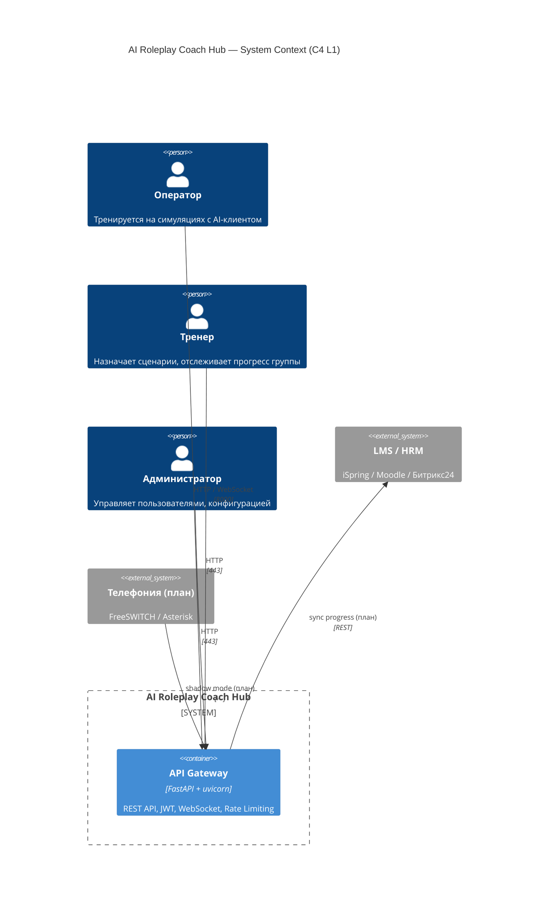
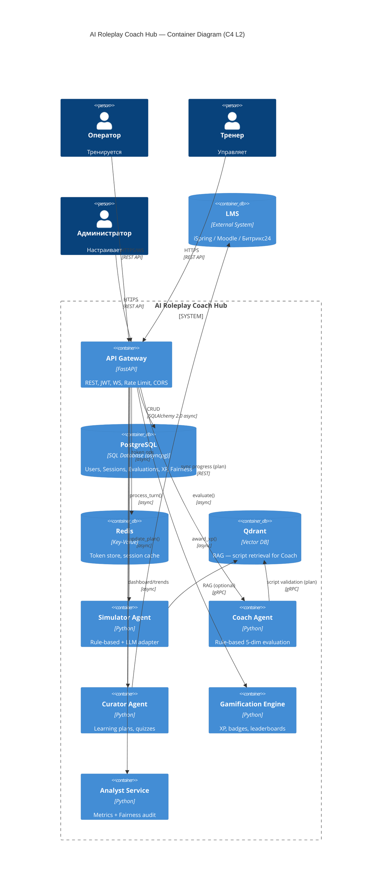
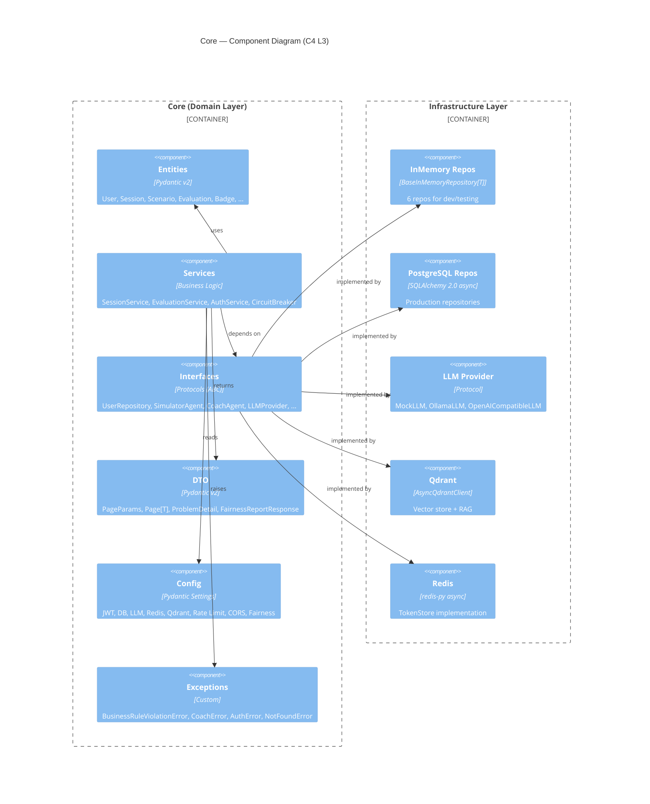
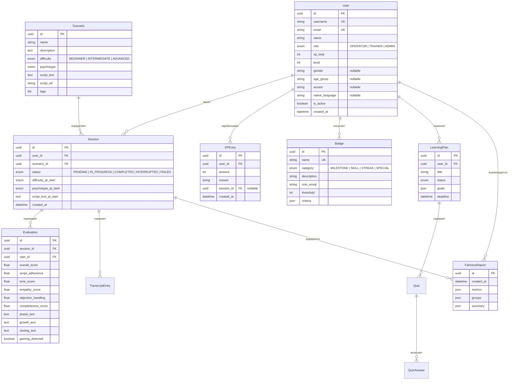
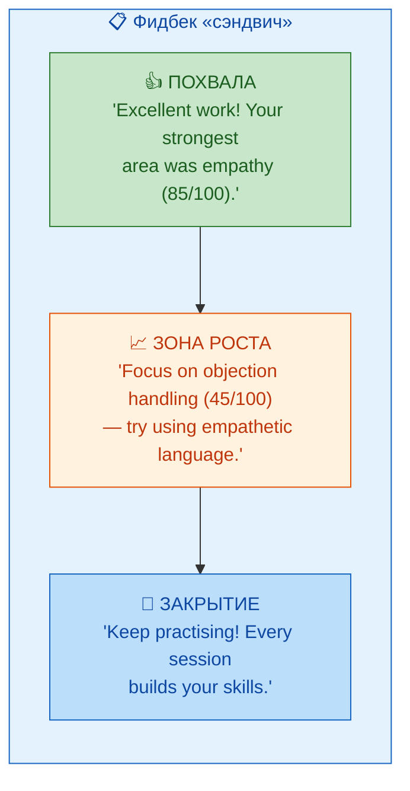

# SPECIFICATION — AI Roleplay Coach Hub

> **Версия:** 1.0.0  
> **Статус:** Production-ready MVP  
> **Последнее обновление:** 2026-07-12  
> **Назначение:** Полное техническое задание — бизнес-контекст, функциональные и нефункциональные требования, архитектура (C4 L1–L3), модель данных, API-контракты, AI-агенты.

---

## Оглавление

- [SPECIFICATION — AI Roleplay Coach Hub](#specification--ai-roleplay-coach-hub)
  - [Оглавление](#оглавление)
  - [1. Бизнес-контекст](#1-бизнес-контекст)
    - [1.1. Бизнес-проблема](#11-бизнес-проблема)
    - [1.2. Целевая аудитория](#12-целевая-аудитория)
    - [1.3. Ключевые стейкхолдеры](#13-ключевые-стейкхолдеры)
    - [1.4. ROI-модель](#14-roi-модель)
  - [2. Функциональные требования (FR)](#2-функциональные-требования-fr)
    - [FR-1: Симуляция диалога с AI-клиентом](#fr-1-симуляция-диалога-с-ai-клиентом)
    - [FR-2: AI-коучинг и оценка диалога](#fr-2-ai-коучинг-и-оценка-диалога)
    - [FR-3: Геймификация](#fr-3-геймификация)
    - [FR-4: Аналитика и Fairness-аудит](#fr-4-аналитика-и-fairness-аудит)
    - [FR-5: Аутентификация и RBAC](#fr-5-аутентификация-и-rbac)
    - [FR-6: REST API](#fr-6-rest-api)
    - [FR-7: In-memory / external режимы](#fr-7-in-memory--external-режимы)
  - [3. Нефункциональные требования (NFR)](#3-нефункциональные-требования-nfr)
  - [4. Архитектура (C4)](#4-архитектура-c4)
    - [4.1. Level 1 — System Context](#41-level-1--system-context)
    - [4.2. Level 2 — Container Diagram](#42-level-2--container-diagram)
    - [4.3. Level 3 — Component Diagram (Core)](#43-level-3--component-diagram-core)
  - [5. Модель данных](#5-модель-данных)
    - [5.1. ERD](#51-erd)
    - [5.2. Описание сущностей](#52-описание-сущностей)
      - [User (src/core/entities/user.py)](#user-srccoreentitiesuserpy)
      - [Session (src/core/entities/session.py)](#session-srccoreentitiessessionpy)
      - [Evaluation (src/core/entities/evaluation.py)](#evaluation-srccoreentitiesevaluationpy)
      - [Scenario (src/core/entities/scenario.py)](#scenario-srccoreentitiesscenariopy)
      - [XPEntry (src/core/entities/xp.py)](#xpentry-srccoreentitiesxppy)
      - [Badge (src/core/entities/badge.py)](#badge-srccoreentitiesbadgepy)
      - [FairnessReport (src/core/entities/fairness.py)](#fairnessreport-srccoreentitiesfairnesspy)
  - [6. API-контракты](#6-api-контракты)
    - [6.1. Аутентификация](#61-аутентификация)
    - [6.2. Сессии симуляции](#62-сессии-симуляции)
    - [6.3. Оценки](#63-оценки)
    - [6.4. Сценарии](#64-сценарии)
    - [6.5. Геймификация](#65-геймификация)
    - [6.6. Аналитика и Fairness](#66-аналитика-и-fairness)
    - [6.7. Администрирование](#67-администрирование)
    - [6.8. Health / Metrics](#68-health--metrics)
    - [6.9. HTTP-коды ошибок](#69-http-коды-ошибок)
    - [6.10. Rate Limiting](#610-rate-limiting)
  - [7. AI-агенты](#7-ai-агенты)
    - [7.1. SimulatorAgent](#71-simulatoragent)
    - [7.2. CoachAgent](#72-coachagent)
    - [7.3. CuratorAgent](#73-curatoragent)
    - [7.4. GamificationEngine](#74-gamificationengine)
    - [7.5. AnalystService / FairnessService](#75-analystservice--fairnessservice)
  - [8. Фронтенд](#8-фронтенд)
  - [9. Деплой и DevOps](#9-деплой-и-devops)
  - [10. Тестирование](#10-тестирование)
  - [Приложение A. Источники](#приложение-a-источники)

---

## 1. Бизнес-контекст

### 1.1. Бизнес-проблема

Операторы контакт-центра (КЦ) — ключевой актив компании, влияющий на лояльность клиентов и репутацию бренда. Однако обучение новых операторов сталкивается с рядом фундаментальных проблем:

| Проблема | Текущее состояние | Последствия |
|----------|-------------------|-------------|
| **Длительный выход на плановые показатели** | 4 недели до TтP | Высокие затраты на обучение, низкая отдача в первые недели |
| **100% нагрузка на наставников** | Каждый наставник занят обучением полный день | Невозможность масштабировать обучение, выгорание наставников |
| **Ошибки новичков после 10 симуляций** | 100% случаев | Падение качества обслуживания, рост недовольства клиентов |
| **Нехватка «сложных» клиентов для практики** | Новички работают только с простыми звонками | Отсутствие навыков работы с возражениями и конфликтами |
| **Субъективность оценки** | Оценка только живым наставником | Человеческий фактор,不一致 оценок |

**Решение:** Мультиагентная система **AI Roleplay Coach Hub**, которая позволяет операторам тренироваться на виртуальных клиентах с разными психотипами, получать объективную AI-оценку с рекомендациями, и прогрессировать через геймификацию — без участия живого наставника.

### 1.2. Целевая аудитория

| Роль | Потребность | Как система помогает |
|------|-------------|---------------------|
| **Оператор** | Практиковаться без стресса и риска | Симуляция с AI-клиентом, фидбек без осуждения |
| **Тренер** | Масштабировать обучение | Автоматическая оценка, учебные планы, дашборды |
| **Руководитель КЦ** | Сократить Time-to-Proficiency | Аналитика, Fairness-аудит, метрики прогресса |
| **Администратор** | Управлять системой | RBAC, конфигурация, мониторинг |

### 1.3. Ключевые стейкхолдеры

| Стейкхолдер | Интересы | Критерии успеха |
|-------------|----------|------------------|
| **CEO / VP Operations** | ROI, сокращение затрат | Time-to-Proficiency -50%, нагрузка наставников -70% |
| **Head of Contact Center** | Качество обслуживания | QA Score +25%, NPS > 4.7 |
| **L&D / Training Team** | Эффективность обучения | Автоматизация рутины, стандартизация оценки |
| **IT / DevOps** | Надёжность, безопасность | 99.9% availability, on-premise, compliance |
| **Operator** | Удобство, полезность | Понятный фидбек, рост навыков |

### 1.4. ROI-модель

| Статья затрат | Без системы | С системой | Экономия |
|---------------|-------------|------------|----------|
| Время наставника на 1 новичка | 160 часов | 48 часов | 70% |
| Time-to-Proficiency | 4 недели | 2 недели | 50% |
| Ошибки после 10 симуляций | 100% | 60% | 40% |
| Текучесть на испытательном сроке | Высокая | Снижение | 15-20% |

**Окупаемость:** 6–9 месяцев при внедрении в контакт-центре от 100 операторов.

---

## 2. Функциональные требования (FR)

### FR-1: Симуляция диалога с AI-клиентом

**Описание:** Система предоставляет возможность оператору вести диалог с AI-клиентом, который эмулирует реального человека с заданным психотипом и поведением.

**✅ Реализовано:**

| Компонент | Статус |
|-----------|--------|
| 4 психотипа клиента (NEUTRAL, AGGRESSIVE, CONFUSED, TECHNICALLY_INEPT) | ✅ |
| 4-фазная структура диалога (Greeting → NeedIdentification → ObjectionHandling → Closing) | ✅ |
| DDA (Dynamic Difficulty Adjustment) — повышение сложности при успехах | ✅ |
| Anti-Gaming — детекция шаблонных ответов | ✅ |
| Rule-based генерация реплик из шаблонов по психотипам | ✅ |
| LLM-режим (Ollama / OpenAI-совместимые) через `LLMSimulatorAdapter` | ✅ |
| Максимум 10 ходов оператора за сессию | ✅ |
| Автоматическое завершение при прохождении всех фаз | ✅ |

**📋 План / Roadmap:**
- LangGraph-оркестрация агентов (Фаза 8)
- Knowledge Graph для генерации возражений (план)
- RAG-генерация реплик из базы знаний (план)
- Voice pipeline с LiveKit (план)

**Референсы:**
- 🔗 [src/agents/simulator/agent.py](../src/agents/simulator/agent.py) — SimulatorAgent (rule-based)
- 🔗 [src/agents/simulator_llm/agent.py](../src/agents/simulator_llm/agent.py) — LLMSimulatorAgent (LLM adapter)
- 🔗 [src/core/entities/session.py](../src/core/entities/session.py) — Session, SessionStatus
- 🔗 [src/core/entities/scenario.py](../src/core/entities/scenario.py) — Scenario, Psychotype, DifficultyLevel

---

### FR-2: AI-коучинг и оценка диалога

**Описание:** После завершения сессии CoachAgent анализирует диалог оператора по 5 измерениям и генерирует фидбек по принципу «сэндвич».

**✅ Реализовано:**

| Измерение | Вес | Описание |
|-----------|-----|----------|
| Script Adherence | Средний | Следование скрипту — совпадение ключевых слов |
| Tone | Средний | Тональность, вежливость, профессионализм |
| Empathy | Средний | Эмпатия, понимание клиента |
| Objection Handling | Средний | Обработка возражений клиента |
| Completeness | Средний | Полнота решения проблемы |

**Механика оценки:**
- Rule-based анализ: подсчёт маркеров (позитивные/негативные слова, эмпатия, стоп-слова)
- Script Adherence: извлечение ключевых слов из `scenario.script_text` и проверка их наличия в транскрипте
- Детекция gaming: выявление односложных/повторяющихся ответов
- Фидбек «сэндвич»: похвала → зона роста → похвала, с указанием слабого измерения

**📋 План / Roadmap:**
- RAG-валидация с цитатами из Qdrant (план)
- BERT-based sentiment analysis (план)
- LangGraph-миграция (Фаза 8)

**Референсы:**
- 🔗 [src/agents/coach/agent.py](../src/agents/coach/agent.py) — CoachAgent
- 🔗 [src/core/entities/evaluation.py](../src/core/entities/evaluation.py) — Evaluation (5+1 измерений)

---

### FR-3: Геймификация

**Описание:** Система начисляет XP за успешные сессии, повышает уровень, выдаёт бейджи за достижения и ведёт лидерборды.

**✅ Реализовано:**

| Механика | Описание |
|----------|----------|
| XP | Начисляется за каждую завершённую сессию (пропорционально оценке) |
| Уровни | 1–100, каждый уровень = 1000 XP |
| Бейджи | 6 типов: FirstSession, QuickLearner, EmpathyMaster, AngerTamer, StreakMaster, PerfectScore |
| Лидерборды | Топ пользователей по XP |
| Streak | Серии ежедневных сессий, множитель XP |
| DDA в геймификации | Увеличенная награда за сложные сценарии |

**Референсы:**
- 🔗 [src/agents/gamification/engine.py](../src/agents/gamification/engine.py) — GamificationEngine
- 🔗 [src/core/entities/xp.py](../src/core/entities/xp.py) — XPEntry
- 🔗 [src/core/entities/badge.py](../src/core/entities/badge.py) — Badge

---

### FR-4: Аналитика и Fairness-аудит

**Описание:** Система собирает метрики по сессиям, оценкам и прогрессу операторов, а также проводит Fairness-аудит для выявления дискриминации по демографическим признакам.

**✅ Реализовано:**

| Компонент | Описание |
|-----------|----------|
| Dashboard | GET /analyst/dashboard — сводка метрик |
| Trends | GET /analyst/trends — динамика оценок |
| Fairness отчёт | 4 метрики: demographic parity, equalized odds, calibration, disparate impact |
| Fairness группы | Анализ по полу, возрасту, акценту, языку |
| Fairness история | Хранение последних 10 отчётов в памяти |
| Periodic audit | Фоновая задача в lifespan с настраиваемым интервалом |
| Alerting | StubNotificationService — логирование предупреждений |

**Референсы:**
- 🔗 [src/agents/analyst/fairness_service.py](../src/agents/analyst/fairness_service.py) — FairnessService
- 🔗 [src/agents/analyst/service.py](../src/agents/analyst/service.py) — AnalystService
- 🔗 [src/core/entities/fairness.py](../src/core/entities/fairness.py) — FairnessReport, FairnessConfig

---

### FR-5: Аутентификация и RBAC

**Описание:** JWT-аутентификация с access и refresh токенами, ролевая модель Operator / Trainer / Admin.

**✅ Реализовано:**

| Возможность | Описание |
|-------------|----------|
| Регистрация | POST /auth/register с созданием пользователя |
| Логин | POST /auth/login — выдача access (30 мин) + refresh (7 дней) |
| Refresh | POST /auth/refresh — обновление токенов |
| Logout | POST /auth/logout — отзыв refresh токена |
| Me | GET /auth/me — информация о текущем пользователе |
| RBAC | Роли: OPERATOR, TRAINER, ADMIN — проверка в dependencies |
| Password validation | Проверка длины, сложности, частых паролей |
| Rate limit на auth | 10 запросов в минуту на IP (отдельный middleware) |

**Референсы:**
- 🔗 [src/api/auth.py](../src/api/auth.py) — auth endpoints
- 🔗 [src/core/services/auth_service.py](../src/core/services/auth_service.py) — AuthService
- 🔗 [src/api/auth_rate_limit_middleware.py](../src/api/auth_rate_limit_middleware.py) — лимиты для auth

---

### FR-6: REST API

**Описание:** FastAPI-приложение с полным CRUD для сессий, оценок, сценариев, пользователей и геймификации.

**✅ Реализовано:**

- FastAPI с версионированием через `/api/v1/`
- 7 роутеров: auth, sessions, simulator, coach, curator, gamification, analyst
- WebSocket для real-time шагов диалога
- Пагинация (PageParams, Page[T])
- RFC 9457 Problem Details для ошибок
- CORS (настраиваемый)
- Prometheus метрики (/metrics)
- Health / Readiness пробы

**Референсы:**
- 🔗 [src/api/router.py](../src/api/router.py) — агрегатор роутеров
- 🔗 [src/api/dependencies.py](../src/api/dependencies.py) — DI-контейнер

---

### FR-7: In-memory / external режимы

**Описание:** Система может работать без внешних сервисов (БД, Redis, Qdrant) в in-memory режиме, что идеально для разработки и тестирования.

**✅ Реализовано:**

| Режим | USE_IN_MEMORY_REPOS | PostgreSQL | Redis | Qdrant |
|-------|---------------------|------------|-------|--------|
| In-memory (dev) | true (по умолчанию) | Не требуется | Не требуется | Не требуется |
| External (prod) | false | Опционально | Опционально | Опционально |

- In-memory реализации всех репозиториев (`BaseInMemoryRepository[T]`)
- Автоматический seed данных (3 пользователя, 3 сценария) при старте
- Config validation всех параметров

**Референсы:**
- 🔗 [src/infrastructure/memory/repositories.py](../src/infrastructure/memory/repositories.py) — InMemoryRepo
- 🔗 [src/core/config.py](../src/core/config.py) — настройки `FAIRNESS_ENABLED`, `LLM_PROVIDER` и др.

---

## 3. Нефункциональные требования (NFR)

| ID | Требование | Целевое значение | Статус |
|----|------------|------------------|--------|
| NFR-1 | Время ответа Coach (p95) | < 2 сек при 50 concurrent | ✅ Реализовано (rule-based) |
| NFR-2 | Время ответа API (p95) | < 500 мс | ✅ Реализовано |
| NFR-3 | Доступность | 99.9% | ✅ Docker Compose, health checks |
| NFR-4 | Безопасность | JWT, rate-limit, CORS, security headers | ✅ Реализовано |
| NFR-5 | Наблюдаемость | Prometheus + structlog | ✅ Реализовано |
| NFR-6 | Портируемость | Docker Compose, on-premise | ✅ Реализовано |
| NFR-7 | Graceful degradation | Работа без БД/Redis/Qdrant | ✅ In-memory mode |
| NFR-8 | Конфигурируемость | Все параметры через .env + validation | ✅ Реализовано |
| NFR-9 | Покрытие тестами | > 80% | ✅ ~84% |
| NFR-10 | Параллельные сессии | ≥ 50 | ✅ In-memory mode |
| NFR-11 | Время генерации фидбека | < 2 сек | ✅ Rule-based |
| NFR-12 | | | |
| 📋 | Голосовой пайплайн < 800 мс | LiveKit + Whisper + Silero | Планируется |
| 📋 | LangGraph-оркестрация | Детерминированные графы | Планируется (Фаза 8) |
| 📋 | Semantic Caching | Снижение стоимости LLM | Планируется |

**Реализованные механизмы безопасности:**
- JWT (HS256, access 30 мин, refresh 7 дней)
- Rate Limiting: default 100/мин, auth 10/мин (sliding window per IP)
- CORS: настраиваемый список origins
- Security Headers: Content-Security-Policy, X-Content-Type-Options, X-Frame-Options, Strict-Transport-Security
- Auth Rate Limit Middleware: отдельный лимит для auth endpoints
- PII-маркировка: поля email, transcript text помечены в Pydantic-моделях
- RFC 9457 Problem Details для всех ошибок
- Config validation при старте приложения (через `settings.validate()`)

---

## 4. Архитектура (C4)

### 4.1. Level 1 — System Context

Первый уровень C4 показывает систему в окружении внешних пользователей и систем. Операторы взаимодействуют с AI-клиентом через API Gateway, тренеры управляют учебными планами, администраторы настраивают систему. Внешняя LMS (iSpring, Moodle, Битрикс24) получает синхронизированные данные прогрессе.



### 4.2. Level 2 — Container Diagram

Второй уровень детализирует внутреннюю структуру системы. Пять AI-агентов образуют ядро, каждый со своей зоной ответственности. API Gateway (FastAPI) маршрутизирует запросы к агентам. Хранилища (PostgreSQL, Redis, Qdrant) опциональны — в режиме разработки все данные хранятся in-memory, что позволяет запускать систему без внешних зависимостей.



**Пояснения к диаграмме:**
- Все агенты реализованы как **rule-based** (без LangGraph). LangGraph-миграция запланирована на Фазу 8.
- **Толстые стрелки** показывают основные потоки данных.
- Хранилища обозначены пунктиром — каждое из них может быть заменено in-memory реализацией.
- CuratorAgent имеет внешнюю интеграцию с LMS (в текущей реализации — заглушка).

### 4.3. Level 3 — Component Diagram (Core)

Третий уровень показывает компоненты ядра системы (core), реализующие бизнес-логику в соответствии с Domain-Driven Design. Ядро разделено на сущности (entities), сервисы (services) и интерфейсы (interfaces), что обеспечивает чистую архитектуру и тестируемость.



**Архитектурные принципы:**
1. **Domain-Driven Design** — ядро (entities/services/interfaces) не зависит от инфраструктуры
2. **Чистая архитектура** — зависимости направлены внутрь (инфраструктура → ядро)
3. **Асинхронность** — async/await на всём стеке
4. **Graceful degradation** — при отсутствии БД/Qdrant/LLM система работает в in-memory режиме
5. **Observability** — структурированные логи (structlog), метрики (Prometheus), health checks
6. **Тестируемость** — все компоненты имеют интерфейсы, заменяемые на mock/test doubles

---

## 5. Модель данных

### 5.1. ERD

Диаграмма сущность-связь показывает все основные сущности системы и отношения между ними. `User` — центральная сущность, вокруг которой строятся сессии, оценки, XP и бейджи. Fairness-отчёты привязаны к сессиям через идентификатор пользователя.



### 5.2. Описание сущностей

#### User ([src/core/entities/user.py](../src/core/entities/user.py))

Основная сущность — оператор контакт-центра. Содержит:
- **username** — уникальное имя (3–32 символа, `^[a-zA-Z0-9_]+$`)
- **email** — PII-sensitive, валидация через `EmailStr`
- **role** — OPERATOR (по умолчанию), TRAINER, ADMIN
- **xp_total / level** — геймификация (1000 XP = 1 уровень)
- **gender, age_group, accent, native_language** — защищённые атрибуты для Fairness-аудита (все опциональны)
- **is_active** — флаг блокировки пользователя

Методы:
- `add_xp(amount)` — добавляет опыт и пересчитывает уровень

#### Session ([src/core/entities/session.py](../src/core/entities/session.py))

Сессия симуляции диалога:
- **status** — PENDING → IN_PROGRESS → COMPLETED / INTERRUPTED / FAILED
- **transcript** — список `TranscriptEntry` (speaker: operator/client, text, timestamp, metadata)
- **difficulty_at_start / psychotype_at_start** — фиксация параметров сценария на момент старта
- **script_text_at_start** — текст скрипта для контекста LLM
- Автоматическое ограничение транскрипта: максимум 100 записей

#### Evaluation ([src/core/entities/evaluation.py](../src/core/entities/evaluation.py))

Результат оценки сессии:
- **overall_score** — общий балл (0–100)
- **5 суб-оценок**: script_adherence, tone_score, empathy_score, objection_handling, completeness_score
- **praise_text / growth_text / closing_text** — фидбек «сэндвич»
- **gaming_detected** — флаг детекции gaming
- **is_passing** — property: overall_score >= 70
- **grade** — property: A (90+), B (80+), C (70+), D (60+), F (< 60)

#### Scenario ([src/core/entities/scenario.py](../src/core/entities/scenario.py))

Сценарий симуляции:
- **name** — название
- **difficulty** — BEGINNER / INTERMEDIATE / ADVANCED
- **psychotype** — NEUTRAL / AGGRESSIVE / CONFUSED / TECHNICALLY_INEPT / FRAUDSTER
- **script_text** — текст скрипта (инструкция для оператора)
- **script_ref** — ссылка на документ
- **tags** — теги для фильтрации

#### XPEntry ([src/core/entities/xp.py](../src/core/entities/xp.py))

Запись о начислении опыта:
- **amount** — количество XP
- **reason** — причина (session_completed, streak_bonus, challenge, etc.)
- **session_id** — опциональная привязка к сессии

#### Badge ([src/core/entities/badge.py](../src/core/entities/badge.py))

Достижение:
- **name** — уникальное название
- **category** — MILESTONE, SKILL, STREAK, SPECIAL
- **icon_emoji** — эмодзи для отображения
- **threshold / criteria** — JSON-критерии получения

#### FairnessReport ([src/core/entities/fairness.py](../src/core/entities/fairness.py))

Отчёт Fairness-аудита:
- **metrics** — список `FairnessMetric` (metric_name, group, value, threshold, passed)
- **groups** — сводка по группам (`GroupSummary`)
- **summary** — итоговая статистика (`ReportSummary`)

---

## 6. API-контракты

Все эндпоинты доступны через префикс `/api/v1`. Аутентификация — JWT Bearer в заголовке `Authorization: Bearer <token>`.  
Полный справочник с request/response примерами — в [API.md](./API.md).

### 6.1. Аутентификация

| Метод | Путь | Аутентификация | Роль | Описание |
|-------|------|----------------|------|----------|
| POST | `/api/v1/auth/register` | Нет | — | Регистрация нового пользователя |
| POST | `/api/v1/auth/login` | Нет | — | Вход, получение access + refresh токенов |
| POST | `/api/v1/auth/refresh` | Нет | — | Обновление access токена |
| POST | `/api/v1/auth/logout` | Bearer | Любая | Отзыв refresh токена |
| GET | `/api/v1/auth/me` | Bearer | Любая | Текущий пользователь |
| GET | `/api/v1/auth/users` | Bearer | ADMIN | Список всех пользователей |

### 6.2. Сессии симуляции

| Метод | Путь | Аутентификация | Роль | Описание |
|-------|------|----------------|------|----------|
| POST | `/api/v1/sessions` | Bearer | Любая | Создать сессию |
| GET | `/api/v1/sessions` | Bearer | Любая | Список сессий (пагинация) |
| GET | `/api/v1/sessions/{id}` | Bearer | Любая | Детали сессии |
| POST | `/api/v1/sessions/{id}/turns` | Bearer | Любая | Шаг диалога (реплика оператора) |
| POST | `/api/v1/sessions/{id}/finish` | Bearer | Любая | Завершить сессию |
| POST | `/api/v1/sessions/{id}/evaluate` | Bearer | TRAINER, ADMIN | Оценить сессию |
| WebSocket | `/api/v1/ws/session/{session_id}` | Bearer | Любая | Real-time диалог |

### 6.3. Оценки

| Метод | Путь | Аутентификация | Роль | Описание |
|-------|------|----------------|------|----------|
| GET | `/api/v1/evaluations/{id}` | Bearer | Любая | Детали оценки |
| GET | `/api/v1/evaluations/by-session/{session_id}` | Bearer | Любая | Оценка по сессии |

### 6.4. Сценарии

| Метод | Путь | Аутентификация | Роль | Описание |
|-------|------|----------------|------|----------|
| GET | `/api/v1/scenarios` | Bearer | Любая | Список сценариев |
| GET | `/api/v1/scenarios/{id}` | Bearer | Любая | Детали сценария |

### 6.5. Геймификация

| Метод | Путь | Аутентификация | Роль | Описание |
|-------|------|----------------|------|----------|
| GET | `/api/v1/gamification/xp/{user_id}` | Bearer | Любая | XP пользователя |
| GET | `/api/v1/gamification/xp/{user_id}/history` | Bearer | Любая | История XP (пагинация) |
| GET | `/api/v1/gamification/badges/{user_id}` | Bearer | Любая | Бейджи пользователя |
| GET | `/api/v1/gamification/streak/{user_id}` | Bearer | Любая | Текущий streak |
| GET | `/api/v1/gamification/leaderboard` | Bearer | Любая | Топ пользователей |

### 6.6. Аналитика и Fairness

| Метод | Путь | Аутентификация | Роль | Описание |
|-------|------|----------------|------|----------|
| GET | `/api/v1/analyst/dashboard` | Bearer | TRAINER, ADMIN | Дашборд аналитики |
| GET | `/api/v1/analyst/trends` | Bearer | TRAINER, ADMIN | Тренды оценок |
| GET | `/api/v1/analyst/fairness/report` | Bearer | ADMIN | Fairness-отчёт |
| GET | `/api/v1/analyst/fairness/groups` | Bearer | ADMIN | Группы Fairness |
| GET | `/api/v1/analyst/fairness/history` | Bearer | ADMIN | История отчётов |

### 6.7. Администрирование

| Метод | Путь | Аутентификация | Роль | Описание |
|-------|------|----------------|------|----------|
| PATCH | `/api/v1/admin/users/{id}` | Bearer | ADMIN | Обновление пользователя |

### 6.8. Health / Metrics

| Метод | Путь | Аутентификация | Описание |
|-------|------|----------------|----------|
| GET | `/health` | Нет | Liveness probe |
| GET | `/ready` | Нет | Readiness probe |
| GET | `/metrics` | Нет | Prometheus метрики |

### 6.9. HTTP-коды ошибок

Все ошибки возвращаются в формате [RFC 9457](https://www.rfc-editor.org/rfc/rfc9457) Problem Details.

| Код | Описание | Пример |
|-----|----------|--------|
| 400 | Bad Request | Неверный формат запроса |
| 401 | Unauthorized | JWT отсутствует или истёк |
| 403 | Forbidden | Недостаточно прав (RBAC) |
| 404 | Not Found | Сессия/сценарий/пользователь не найден |
| 422 | Validation Error | Неверные поля в запросе |
| 429 | Too Many Requests | Превышен rate limit |
| 500 | Internal Server Error | Непредвиденная ошибка |

### 6.10. Rate Limiting

| Тип | Лимит | Окно | Реализация |
|-----|-------|------|------------|
| Default (все endpoints) | 100 запросов | 60 секунд | Sliding window per IP |
| Auth (/auth/*) | 10 запросов | 60 секунд | Отдельный middleware |

**Заголовки ответа при rate limiting:**
```
X-RateLimit-Limit: 100
X-RateLimit-Remaining: 95
X-RateLimit-Reset: 1623456789
Retry-After: 45
```

---

## 7. AI-агенты

### 7.1. SimulatorAgent

**Назначение:** Эмуляция клиента контакт-центра с заданным психотипом и поведением.

**✅ Реализация:** Rule-based (без LangGraph).

**Архитектура:**
```
SimulatorAgent
  ├── SimulatorSessionState (dataclass per session)
  │   ├── psychotype: Psychotype
  │   ├── dda_level: int
  │   ├── operator_success_streak: int
  │   ├── last_operator_messages: list[str]
  │   └── repetition_count: int
  ├── start_dialogue(scenario) → (greeting, psychotype)
  ├── generate_response(session) → str
  ├── should_end(session) → bool
  ├── _update_stage(state, session)
  ├── _generate_stage_response(state) → str
  ├── _apply_dda(state, response) → str
  └── _apply_anti_gaming(state, response) → str
```

**Психотипы:**
1. **NEUTRAL** — стандартный клиент, вежливый, без сложностей
2. **AGGRESSIVE** — раздражённый, перебивает, требует менеджера
3. **CONFUSED** — неуверенный, не понимает инструкций
4. **TECHNICALLY_INEPT** — не разбирается в технологиях
5. **FRAUDSTER** — мошенник, пытается обмануть оператора

**Фазы диалога:**
1. **Greeting** (ход 1) — приветствие, представление проблемы
2. **Need Identification** (ходы 2–3) — уточнение потребностей
3. **Objection Handling** (ходы 4–6) — возражения, усиливающиеся при DDA
4. **Closing** (ход 7+) — завершение, благодарность или угрозы

**DDA (Dynamic Difficulty Adjustment):**
- При 2+ успешных ответах оператора подряд → повышение `dda_level`
- Добавление агрессивных префиксов к репликам
- Усиление возражений, каверзные вопросы

**Anti-Gaming:**
- Детекция 3+ повторяющихся сообщений оператора
- Смена тактики: прямое указание на повтор
- При 2+ срабатываниях — эскалация (требование другого оператора)

**LLM-режим:** Через `LLMSimulatorAdapter` (из [src/agents/simulator_llm/agent.py](../src/agents/simulator_llm/agent.py)) подключается Ollama, OpenAI или другая OpenAI-совместимая модель. Режим включается через `LLM_PROVIDER` в конфигурации.

**Референсы:**
- 🔗 [src/agents/simulator/agent.py](../src/agents/simulator/agent.py) — SimulatorAgent
- 🔗 [src/agents/simulator_llm/agent.py](../src/agents/simulator_llm/agent.py) — LLMSimulatorAdapter

---

### 7.2. CoachAgent

**Назначение:** Оценка диалога оператора по 5 измерениям и генерация структурированного фидбека.

**✅ Реализация:** Rule-based (алгоритмическая оценка).

**Процесс оценки:**
1. Валидация входных данных (session, scenario)
2. Извлечение реплик оператора и клиента из транскрипта
3. Вычисление 5 суб-оценок:
   - **Script Adherence** — извлечение ключевых слов из `script_text`, подсчёт совпадений
   - **Tone** — маркеры позитивной/негативной тональности
   - **Empathy** — частота маркеров эмпатии (understand, sorry, appreciate, etc.)
   - **Objection Handling** — парные проверки клиент-оператор на возражения
   - **Completeness** — длина диалога + покрытие всех стадий скрипта
4. Детекция gaming (короткие ответы, повторения)
5. Генерация фидбека «сэндвич»: praise → growth → closing

**Фидбек «сэндвич»:**


**Референсы:**
- 🔗 [src/agents/coach/agent.py](../src/agents/coach/agent.py) — CoachAgent

---

### 7.3. CuratorAgent

**Назначение:** Управление учебным планом оператора, назначение симуляций, микро-квизы.

**✅ Реализация:** Rule-based базовая логика. Синхронизация с LMS — заглушка.

**Функции:**
- Назначение симуляций на основе слабых мест (по результатам оценки)
- Генерация микро-квизов по продуктам (заглушка)
- Синхронизация прогресса с LMS (iSpring/Moodle/Битрикс24 — через REST stub)
- Создание индивидуальных траекторий обучения

**📋 План:**
- Полноценная интеграция с LMS
- Адаптивные учебные планы на основе ML

**Референсы:**
- 🔗 [src/agents/curator/agent.py](../src/agents/curator/agent.py) — CuratorAgent
- 🔗 [src/core/entities/learning_plan.py](../src/core/entities/learning_plan.py) — LearningPlan

---

### 7.4. GamificationEngine

**Назначение:** Повышение вовлечённости операторов через игровые механики.

**✅ Реализация:** Полностью функциональна.

**Механики:**

| Механика | Детали |
|----------|--------|
| **XP** | Начисляется за завершённые сессии: `score / 100 * 100` XP. Streak-множитель: `min(1 + streak * 0.1, 2.0)` |
| **Уровни** | Каждый уровень = 1000 XP. Максимум: 100. |
| **Бейджи** | 6 типов: FirstSession, QuickLearner (3+ сессии за день), EmpathyMaster (empathy > 85), AngerTamer (aggressive psychotype, score > 80), StreakMaster (streak >= 7), PerfectScore (100) |
| **Лидерборды** | Сортировка по XP, с указанием уровня |
| **Streak** | Серия ежедневных сессий. Множитель XP. |
| **DDA-бонус** | Дополнительные XP за сложные сценарии (intermediate +10%, advanced +25%) |

**Референсы:**
- 🔗 [src/agents/gamification/engine.py](../src/agents/gamification/engine.py) — GamificationEngine
- 🔗 [src/core/entities/xp.py](../src/core/entities/xp.py) — XPEntry, XPTransactionRepository interface
- 🔗 [src/core/entities/badge.py](../src/core/entities/badge.py) — Badge, UserBadge

---

### 7.5. AnalystService / FairnessService

**Назначение:** Сбор метрик, построение дашбордов, проведение Fairness-аудита.

**✅ Реализация:** Полностью функциональна.

**AnalystService:**
- **dashboard** — сводка: количество сессий, средняя оценка, распределение
- **trends** — динамика средних оценок по дням

**FairnessService ([src/agents/analyst/fairness_service.py](../src/agents/analyst/fairness_service.py)):**

4 метрики аудита:

| Метрика | Описание | Формула |
|---------|----------|---------|
| **Demographic Parity** | Равные средние оценки для всех групп | `|μ_группы - μ_общее| < threshold` |
| **Equalized Odds** | Равная точность для всех групп | `|TPR_группы - TPR_общее| < threshold` |
| **Calibration** | Калибровка оценок по группам | `|μ_оценка - μ_факт| < threshold` |
| **Disparate Impact** | Отношение шансов на успех | `P(успех_группа) / P(успех_базовая) > 0.8` |

**Конфигурация Fairness:**
- [fairness_config.yaml](../fairness_config.yaml) — описание защищённых атрибутов, пороговые значения, настройки алертинга
- `FAIRNESS_ENABLED` — boolean (по умолчанию true)
- `FAIRNESS_AUDIT_INTERVAL_HOURS` — 168 (раз в неделю)

**Периодический аудит:**
- Фоновая задача в `lifespan` приложения
- Первый запуск через 1 час
- При срабатывании алерта — логирование через `StubNotificationService`
- Корректная отмена при shutdown

**Референсы:**
- 🔗 [src/agents/analyst/service.py](../src/agents/analyst/service.py) — AnalystService
- 🔗 [src/agents/analyst/fairness_service.py](../src/agents/analyst/fairness_service.py) — FairnessService
- 🔗 [src/core/entities/fairness.py](../src/core/entities/fairness.py) — FairnessReport, FairnessConfig
- 🔗 [src/infrastructure/notification/stub.py](../src/infrastructure/notification/stub.py) — StubNotificationService

---

## 8. Фронтенд

**✅ Реализован:** React + Vite + TypeScript + Tailwind CSS.

**Структура:**
```
frontend/src/
├── app/
│   ├── router.tsx          # Основной роутер (React Router)
│   ├── App.tsx             # Корневой компонент
│   └── providers.tsx       # Провайдеры (auth, query)
├── pages/
│   ├── login/              # Страница входа
│   ├── dashboard/          # Дашборд
│   ├── sessions/           # Сессии симуляции
│   ├── evaluation/         # Результаты оценки
│   ├── gamification/       # XP, бейджи
│   └── admin/              # Администрирование
├── shared/
│   └── lib/
│       └── auth.ts         # JWT-токены, auth helpers
├── features/
│   ├── auth/
│   │   ├── store/          # Zustand store (authStore)
│   │   └── ui/             # AuthGuard, LoginForm
│   └── ...
├── store/                   # Zustand stores
└── test/                    # Тесты (Vitest + React Testing Library)
```

**Тестирование фронтенда:** 35 тестов (auth lib 9, authStore 19, AuthGuard 7).

**Референсы:**
- 🔗 [frontend/src/](../frontend/src/)

---

## 9. Деплой и DevOps

**✅ Реализовано:**

| Компонент | Технология | Статус |
|-----------|------------|--------|
| [Dockerfile.dev](../Dockerfile.dev) | Python 3.12, hot-reload | ✅ |
| [Dockerfile.prod](../Dockerfile.prod) | Multi-stage (builder → runtime) | ✅ |
| [docker-compose.dev.yml](../docker-compose.dev.yml) | api, postgres, redis, qdrant | ✅ |
| [docker-compose.prod.yml](../docker-compose.prod.yml) | api, postgres, redis, qdrant, nginx | ✅ |
| GitHub Actions CI | ruff → mypy → pytest | ✅ |
| Pre-commit hooks | ruff, mypy | ✅ |
| Dependency audit | pip-audit | ✅ |
| SAST scanning | scripts/security_scan.py | ✅ |
| Health checks | /health, /ready | ✅ |

**📋 План:**
- HashiCorp Vault (src/security/ — заглушка)
- Kubernetes (k3s) для production
- Prometheus + Grafana дашборды
- Бэкапы PostgreSQL (pg_dump)

**Референсы:**
- 🔗 [Dockerfile.prod](../Dockerfile.prod) — production сборка
- 🔗 [docker-compose.dev.yml](../docker-compose.dev.yml) — dev-стек
- 🔗 [docker-compose.prod.yml](../docker-compose.prod.yml) — production-стек
- 🔗 [Makefile](../Makefile) — основные команды
- 🔗 [.github/workflows/](../.github/workflows/) — CI workflows

---

## 10. Тестирование

**✅ 462 теста, все проходят в CI.**

| Категория | Количество | Инструменты |
|-----------|-----------|-------------|
| Unit-тесты | ~300 | pytest, pytest-asyncio |
| API-тесты | ~100 | httpx AsyncClient |
| E2E-тесты | ~30 | httpx, asyncio |
| Интеграционные | ~20 | pytest-asyncio |
| Тесты безопасности | ~12 | SAST, JWT tampering |

**Покрытие:** ~84%.

**Команды:**
```bash
make test        # pytest tests/ -q --tb=short
make test-cov    # pytest tests/ --cov=src --cov-report=term-missing
make lint        # ruff check src/ tests/
make typecheck   # mypy src/
```

**Референсы:**
- 🔗 `tests/` — все тесты
- 🔗 [pyproject.toml](../pyproject.toml) — pytest, ruff, mypy конфигурация
- 🔗 [.pre-commit-config.yaml](../.pre-commit-config.yaml) — pre-commit hooks

---

## Приложение A. Источники

| Источник | Путь |
|----------|------|
| Архитектура (текущая) | 🔗 [ARCHITECTURE_DECISIONS.md](./ARCHITECTURE_DECISIONS.md) |
| Архитектура (roadmap) | 🔗 [ARCHITECTURE_ROADMAP.md](./ARCHITECTURE_ROADMAP.md) |
| План разработки | 🔗 [DEVELOPMENT_PLAN.md](./DEVELOPMENT_PLAN.md) |
| README | 🔗 [README.md](./README.md) |
| API справочник | 🔗 [API.md](./API.md) |
| Структура проекта | 🔗 [PROJECT_STRUCTURE.md](./PROJECT_STRUCTURE.md) |
| Справочник кода | 🔗 [SOURCE_CODE_REFERENCE.md](./SOURCE_CODE_REFERENCE.md) |
| Сценарии | 🔗 [DATA_FLOWS.md](./DATA_FLOWS.md) |
| ADR | 🔗 [adr/README.md](./adr/README.md) |

