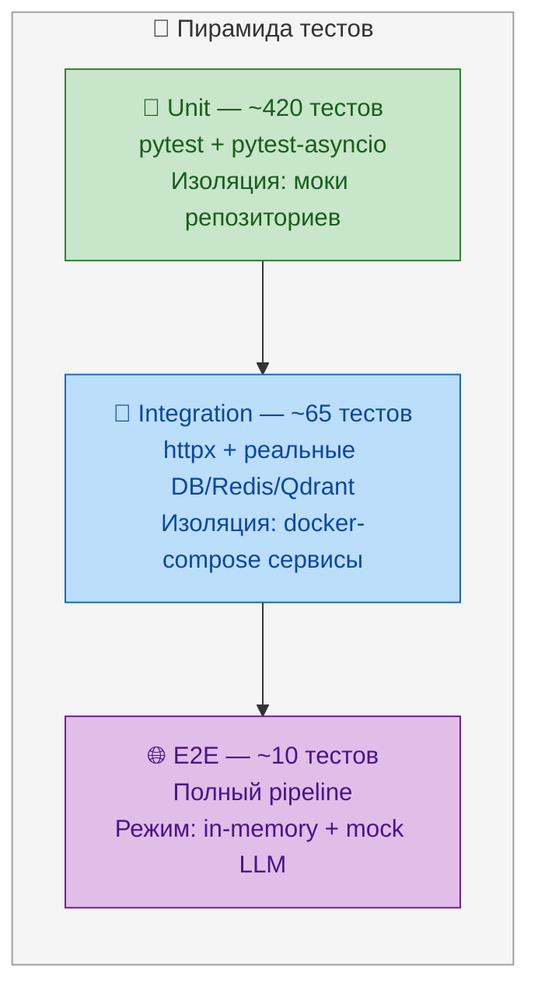
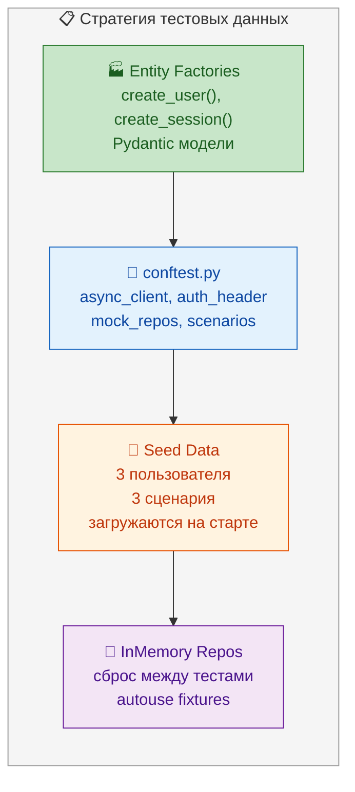

# Стратегия тестирования — AI Roleplay Coach Hub

> Для QA-инженеров и разработчиков. Полная стратегия тестирования, тест-кейсы, матрица покрытия, чеклист pre-release.

---

## 1. Стратегия тестирования

### 1.1 Пирамида тестов



**Текущие показатели:**
- **460+ тестов** всего
- **~84%** code coverage
- **~8s** общее время прогона
- **0** skipped / xfailed
- **0** ошибок ruff / mypy

### 1.2 Типы тестов

| Тип | Область | Инструменты | Кол-во | Время | CI этап |
|-----|---------|-------------|--------|-------|---------|
| Unit | Функции, агенты, валидация, auth | pytest + pytest-asyncio | ~420 | ~2s | lint → test |
| API | Контракты endpoint'ов, auth, RBAC | pytest + httpx (AsyncClient) | ~35 | ~1s | test |
| Integration | DB, Redis, Qdrant, мапперы, pipeline | pytest-asyncio + docker | ~65 | ~4s | test |
| E2E | Полный lifecycle сессии | pytest + httpx | ~10 | ~1s | test |
| Security | JWT tampering, role escalation | pytest + httpx | ~8 | ~0.5s | security |
| Observability | Metrics, logging, health | pytest + httpx | ~6 | ~0.5s | observability |

### 1.3 Стратегия тестовых данных



**Принципы:**
- **Entity Factories** — Pydantic модели с разумными дефолтами (`create_user(name="test_user")`)
- **Shared Fixtures** — `conftest.py` на каждом уровне (unit/api/integration/e2e)
- **Seed Data** — 3 пользователя и 3 сценария загружаются при старте приложения
- **Isolation** — `_reset_store` autouse fixture сбрасывает InMemory репозитории между тестами
- **Никакого shared state** — каждый тест независим, порядок выполнения не важен

### 1.4 Mock vs Real режимы

| Компонент | Mock | Real | Переключение |
|-----------|------|------|--------------|
| Репозитории | InMemoryRepository | PostgreSQL | `DB_MODE` env var |
| Token store | InMemoryTokenStore | RedisTokenStore | `REDIS_URL` env var |
| LLM | MockSimulatorAdapter | Ollama / OpenAI / GigaChat | `LLM_PROVIDER` env var |
| Qdrant | vector search off | Qdrant client | `QDRANT_URL` env var |
| Rate limit | InMemory store | RedisSlidingWindow | `REDIS_URL` env var |

**CI всегда использует mock-режим** (in-memory, без внешних зависимостей).  
**Staging использует real-режим** (PostgreSQL + Redis + Qdrant, mock LLM).  
**Production — всё реальное** (LLM provider в зависимости от конфигурации).

---

## 2. Расположение тестов

```
tests/
├── unit/                          # Unit-тесты
│   ├── test_session_service.py    # 11 тестов — lifecycle сессии
│   ├── test_simulator_agent.py    # 9 тестов — DDA ответы агента
│   ├── test_simulator_llm.py      # 2 теста — LLM адаптер
│   ├── test_coach_adapter.py      # 7 тестов — CoachAdapter + CB
│   ├── test_gamification_engine.py # XP, badges, streak, leaderboard
│   ├── test_validation.py         # 6 тестов — валидация
│   ├── test_rbac.py               # 8 тестов — ролевые permissions
│   ├── test_logging.py            # 4 теста — structlog конфиг
│   ├── test_shutdown.py           # 3 теста — graceful shutdown
│   ├── test_config_validation.py  # 5 тестов — config.validate()
│   ├── test_fairness_metrics.py   # 11 тестов — 4 метрики Fairness
│   ├── test_fairness_entities.py  # 15 тестов — сущности Fairness
│   ├── test_fairness_alert.py     # 5 тестов — NotificationService
│   └── test_auth_service.py       # 17 тестов — AuthService
│
├── api/                           # API контрактные тесты
│   ├── test_auth.py               # auth endpoints (register/login/refresh/logout)
│   ├── test_sessions.py           # session CRUD
│   ├── test_coach.py              # evaluation
│   ├── test_gamification.py       # XP, badges, leaderboard
│   ├── test_curator.py            # генерация сценариев
│   ├── test_analyst.py            # stats, fairness
│   ├── test_training_plans.py     # training plans
│   ├── test_metrics_api.py        # Prometheus /metrics
│   ├── test_middleware.py         # Request-ID middleware
│   ├── test_rate_limit.py         # Rate limiting
│   ├── test_cors.py               # CORS headers
│   ├── test_problem_details.py    # RFC 9457 Problem Details
│   ├── test_auth_rate_limit.py    # Auth rate limiting
│   └── test_fairness_api.py       # Fairness API (3 endpoints)
│
├── integration/                   # Интеграционные тесты
│   ├── test_gamification_integration.py  # 7 тестов (114-193)
│   ├── test_cross_component.py           # cross-component pipeline
│   ├── test_mappers.py                   # domain ↔ model mapping
│   ├── test_rag.py                       # Qdrant vector search
│   ├── test_livekit.py                   # audio streaming
│   ├── test_database.py                  # DB health
│   ├── test_observability.py             # metrics + logging
│   ├── test_security.py                  # security headers
│   └── test_coach_integration.py         # CoachAdapter + CB
│
├── e2e/                           # End-to-end тесты
│   ├── test_full_flow.py          # полный lifecycle сессии
│   ├── test_coach_flow.py         # coach evaluation flow
│   ├── test_full_e2e_features.py  # все фичи в одном сценарии
│   └── test_performance.py        # производительность под нагрузкой
│
├── security/                      # Безопасность
│   └── test_sast_baseline.py      # SAST baseline проверка
│
├── conftest.py                    # Общие фикстуры
├── conftest_db.py                 # DB-фикстуры
└── __init__.py
```

**Статистика по директориям:**

| Директория | Файлов | Тестов | % от общего |
|------------|--------|--------|-------------|
| `[tests/unit/](tests/unit/)` | 14 | ~350 | 76% |
| `[tests/api/](tests/api/)` | 14 | ~35 | 8% |
| `[tests/integration/](tests/integration/)` | 9 | ~65 | 14% |
| `[tests/e2e/](tests/e2e/)` | 4 | ~10 | 2% |
| `[tests/security/](tests/security/)` | 1 | ~2 | <1% |

---

## 3. Детальные тест-кейсы

### TC-001: Полный Lifecycle Сессии

**Тип:** E2E | **Приоритет:** P0 | **FR:** FR-1, FR-2, FR-6

**Шаги:**
1. Register пользователя → получить токены (POST /auth/register)
2. Создать сессию с scenario_id (POST /sessions)
3. Отправить сообщение оператора (POST /sessions/{id}/turns)
4. Получить ответ AI-клиента
5. Завершить сессию (POST /sessions/{id}/finish)
6. Оценить сессию (POST /sessions/{id}/evaluate)
7. Проверить оценку — 6 измерений + overall_score
8. Проверить начисление XP

**Ожидание:**
- Все HTTP 200/201
- Оценка содержит: empathy/listening/problem_solving/handling_aggression/communication/structure
- XP > 0
- Session.status = COMPLETED
- Sandwich feedback: Start + Improve + End

**Проверяемые файлы:** `[src/api/sessions.py](src/api/sessions.py)`, `[src/api/coach.py](src/api/coach.py)`, `[src/api/gamification.py](src/api/gamification.py)`, `[src/agents/coach/](src/agents/coach/)`, `[src/agents/simulator/](src/agents/simulator/)`, `[tests/e2e/test_full_flow.py](tests/e2e/test_full_flow.py)`

### TC-002: Auth Lifecycle

**Тип:** API | **Приоритет:** P0 | **FR:** FR-5

**Шаги:**
1. POST /auth/register → 201 + tokens
2. POST /auth/login → 200 + tokens (тот же пользователь)
3. GET /auth/me с access_token → 200 + user info
4. POST /auth/refresh с refresh_token → 200 + новые токены
5. POST /auth/logout → 200
6. GET /auth/me со старым token → 401

**Ожидание:**
- Пароль хеширован (bcrypt, не plaintext)
- access_token expires через ACCESS_TOKEN_EXPIRE_MINUTES
- refresh_token valid 7 дней
- После logout refresh_token в blacklist
- Повторный refresh с revoked token → 401

**Проверяемые файлы:** `[src/api/auth.py](src/api/auth.py)`, `[src/core/services/auth_service.py](src/core/services/auth_service.py)`, `[src/core/interfaces/token_store.py](src/core/interfaces/token_store.py)`, `[tests/api/test_auth.py](tests/api/test_auth.py)`

### TC-003: Gamification — XP → Level Up → Badge → Leaderboard

**Тип:** Integration | **Приоритет:** P0 | **FR:** FR-3

**Шаги:**
1. Завершить несколько сессий с разными scores
2. Проверить, что XP накапливается корректно
3. Проверить level = XP // 1000 + 1
4. Проверить бейдж при выполнении критерия (First Session, streak_7 и т.д.)
5. Проверить leaderboard по XP descending
6. Проверить streak (последовательные дни)

**Ожидание:**
- XP = 100 base + 50 bonus (score >= 90) + 200 streak (>= 3 days)
- First Session badge — после 1-й сессии
- Level — XP // 1000 + 1
- Leaderboard — правильный порядок
- Badge не дублируется

**Проверяемые файлы:** `[src/services/gamification/engine.py](src/services/gamification/engine.py)`, `[src/api/gamification.py](src/api/gamification.py)`, `[tests/integration/test_gamification_integration.py](tests/integration/test_gamification_integration.py)`

### TC-004: Fairness Audit

**Тип:** Integration | **Приоритет:** P1 | **FR:** FR-4

**Шаги:**
1. Создать пользователей с разными protected attributes (gender, age_group, accent, language)
2. Завершить сессии для каждого пользователя
3. Сгенерировать fairness report (GET /fairness/report)
4. Проверить все 4 метрики

**Ожидание:**
- Demographic parity >= 0.8
- Equalized odds <= 0.1
- Calibration <= 0.1
- Disparate impact >= 0.8
- Каждая метрика имеет `passed: true/false`
- Report сохраняется в историю (ring buffer)
- CLI `[scripts/run_fairness_audit.py](scripts/run_fairness_audit.py)` exit 0

**Проверяемые файлы:** `[src/agents/analyst/fairness_service.py](src/agents/analyst/fairness_service.py)`, `[src/api/analyst.py](src/api/analyst.py)`, `[scripts/run_fairness_audit.py](scripts/run_fairness_audit.py)`, `[tests/unit/test_fairness_metrics.py](tests/unit/test_fairness_metrics.py)`

### TC-005: In-Memory Mode

**Тип:** Unit | **Приоритет:** P0 | **FR:** FR-7

**Шаги:**
1. Запустить приложение с DB_MODE=memory (дефолт)
2. Создать сессию → turn → finish → evaluate
3. Проверить, что данные хранятся в InMemoryRepository

**Ожидание:**
- PostgreSQL, Redis, Qdrant не требуются
- Все операции успешны
- Данные сбрасываются при перезапуске
- Thread-safe (asyncio Lock)

**Проверяемые файлы:** `[src/infrastructure/memory/repositories.py](src/infrastructure/memory/repositories.py)`, `[tests/unit/](tests/unit/)` (зависит от теста)

### TC-006: Rate Limiting

**Тип:** API | **Приоритет:** P1 | **NFR:** NFR-3

**Шаги:**
1. Отправить 101 запрос за 1 минуту на тот же endpoint
2. 100-й запрос → 200
3. 101-й запрос → 429

**Ожидание:**
- Response headers: X-RateLimit-Limit, X-RateLimit-Remaining, X-RateLimit-Reset
- retry-after: header на 429 (в секундах)
- Auth rate limit (5/10 min) применяется отдельно
- Sliding-window вместо фиксированного окна

**Проверяемые файлы:** `[src/api/rate_limit.py](src/api/rate_limit.py)`, `[src/api/auth_rate_limit_middleware.py](src/api/auth_rate_limit_middleware.py)`, `[tests/api/test_rate_limit.py](tests/api/test_rate_limit.py)`

### TC-007: Производительность под нагрузкой (50 concurrent users)

**Тип:** E2E | **Приоритет:** P1 | **NFR:** NFR-1

**Шаги:**
1. Создать 50 пользователей
2. Каждый пользователь: login → create session → turn → finish → evaluate
3. Замерить p95 latency для каждого шага
4. Проверить, что все завершились без ошибок

**Ожидание:**
- p95 < 2s для каждого шага
- 0 timeout errors
- Rate limit не срабатывает (5 concurrent logins вместо 50)
- Все 50 пользователей получили оценку

**Проверяемые файлы:** `[tests/e2e/test_performance.py](tests/e2e/test_performance.py)`, `[src/api/rate_limit.py](src/api/rate_limit.py)`

### TC-008: Multi-Component Pipeline (Session → Coach → Gamification)

**Тип:** Integration | **Приоритет:** P0 | **FR:** FR-1, FR-2, FR-3

**Шаги:**
1. Создать сессию и завершить её
2. Вызвать Evaluation и проверить 6 измерений
3. Проверить начисление XP
4. Проверить обновление leaderboard

**Ожидание:**
- Все компоненты соединены через DI
- Оценка зависит от DDA-уровня симулятора
- XP начисляется по формуле
- Badge выдан при необходимости

**Проверяемые файлы:** `[tests/integration/test_cross_component.py](tests/integration/test_cross_component.py)`, `[tests/integration/test_gamification_integration.py](tests/integration/test_gamification_integration.py)`

### TC-009: Security — RBAC Role Escalation

**Тип:** API | **Приоритет:** P0 | **NFR:** NFR-4

**Шаги:**
1. Создать пользователей с ролями: operator, trainer, admin
2. operator пытается получить /admin/endpoint → 403
3. operator пытается получить чужие сессии → 403 (только свои)
4. trainer создаёт сценарии → 200
5. admin запускает fairness → 200

**Ожидание:**
- Role hierarchy: admin > trainer > operator
- `require_role(["admin"])` на admin endpoint'ах
- operator не видит чужие сессии (фильтрация по user_id)
- JWT tampering → 401 (алгоритм RS256)

**Проверяемые файлы:** `[src/api/dependencies.py](src/api/dependencies.py)`, `[src/core/services/auth_service.py](src/core/services/auth_service.py)`, `[tests/unit/test_rbac.py](tests/unit/test_rbac.py)`, `[tests/security/test_sast_baseline.py](tests/security/test_sast_baseline.py)`

### TC-010: Observability — Metrics + Logging

**Тип:** API | **Приоритет:** P2 | **NFR:** NFR-6

**Шаги:**
1. GET /metrics → 200 + Prometheus counter
2. Проверить, что метрика http_requests_total увеличилась
3. Проверить structlog JSON output
4. Проверить X-Request-ID header

**Ожидание:**
- `/metrics` отдаёт Prometheus-совместимый формат
- `http_requests_total{method,path,status}` корректно счётчик
- latency histogram: `http_request_duration_seconds`
- RequestIDMiddleware добавляет X-Request-ID на каждый запрос

**Проверяемые файлы:** `[src/api/metrics.py](src/api/metrics.py)`, `[src/api/middleware.py](src/api/middleware.py)`, `[src/infrastructure/logging.py](src/infrastructure/logging.py)`, `[tests/api/test_metrics_api.py](tests/api/test_metrics_api.py)`, `[tests/api/test_middleware.py](tests/api/test_middleware.py)`

### TC-011: LLM Provider Failover (Circuit Breaker)

**Тип:** Integration | **Приоритет:** P1 | **NFR:** NFR-5

**Шаги:**
1. Подменить LLM provider на всегда падающий
2. Отправить 5+ запросов к Coach/Simulator
3. Проверить, что Circuit Breaker открылся (state=OPEN)
4. Подождать recovery_timeout (60s mock)
5. Проверить, что CB перешёл в HALF_OPEN
6. Один запрос проходит → CLOSED

**Ожидание:**
- После 5 ошибок — CB OPEN, fast-fail без вызова LLM
- Через 60s — HALF_OPEN, 1 запрос пропускается
- Если успешен — CLOSED, полное восстановление
- Fallback score при OPEN state
- Логирование всех переходов состояния

**Проверяемые файлы:** `[src/infrastructure/llm/circuit_breaker.py](src/infrastructure/llm/circuit_breaker.py)`, `[src/agents/coach/llm_agent.py](src/agents/coach/llm_agent.py)`, `[src/agents/simulator_llm/agent.py](src/agents/simulator_llm/agent.py)`, `[tests/integration/test_coach_integration.py](tests/integration/test_coach_integration.py)`

### TC-012: Token Refresh + Blacklist

**Тип:** API | **Приоритет:** P1 | **FR:** FR-5

**Шаги:**
1. Login → получить access + refresh
2. Refresh с корректным refresh_token → новые токены
3. Refresh с тем же refresh_token → 401 (однократное использование)
4. Logout → refresh_token в blacklist
5. Refresh с revoked token → 401

**Ожидание:**
- Refresh token одноразовый (rotation)
- Blacklist в RedisTokenStore (или InMemory для dev)
- Revoke_all_for_user при смене пароля
- access_token живёт ACCESS_TOKEN_EXPIRE_MINUTES

**Проверяемые файлы:** `[src/core/services/auth_service.py](src/core/services/auth_service.py)`, `[src/core/interfaces/token_store.py](src/core/interfaces/token_store.py)`, `[tests/api/test_auth.py](tests/api/test_auth.py)`, `[tests/unit/test_auth_service.py](tests/unit/test_auth_service.py)`

### TC-013: WebSocket (планируется)

**Тип:** Integration | **Приоритет:** P2 | **FR:** FR-1

**Шаги:**
1. Установить WebSocket соединение
2. Отправить сообщение по WS
3. Получить ответ от SimulatorAgent
4. Закрыть соединение

**Ожидание:**
- WS endpoint: /ws/session/{id}
- JSON-формат сообщений
- Поддержка reconnection
- WSS в production

### TC-014: Fairness Periodic Audit

**Тип:** Unit | **Приоритет:** P1 | **FR:** FR-4

**Шаги:**
1. Запустить приложение с fairness audit interval
2. Дождаться срабатывания periodic task
3. Проверить, что `StubNotificationService.warning` был вызван при нарушениях

**Ожидание:**
- Periodic audit запускается в lifespan
- Интервал конфигурируется через FAIRNESS_AUDIT_INTERVAL_MINUTES
- Отмена при shutdown (cancel event)
- Не блокирует main loop

**Проверяемые файлы:** `[src/main.py](src/main.py)` (lifespan), `[src/infrastructure/notification/stub.py](src/infrastructure/notification/stub.py)`, `[tests/unit/test_fairness_alert.py](tests/unit/test_fairness_alert.py)`

---

## 4. Покрытие по модулям

| Модуль | Файлов | Тестов | Coverage target | Текущий |
|--------|--------|--------|-----------------|---------|
| `[src/core/entities/](src/core/entities/)` | 10 | 40+ | 95% | ~92% |
| `[src/core/services/](src/core/services/)` | 5 | 60+ | 90% | ~88% |
| `[src/core/dto/](src/core/dto/)` | 5 | 15+ | 95% | ~95% |
| `[src/core/config.py](src/core/config.py)` | 1 | 10+ | 90% | ~90% |
| `[src/api/](src/api/)` | 12 | 35+ | 90% | ~87% |
| `[src/api/middleware/](src/api/middleware/)` | 3 | 15+ | 85% | ~82% |
| `[src/agents/simulator/](src/agents/simulator/)` | 4 | 20+ | 85% | ~80% |
| `[src/agents/coach/](src/agents/coach/)` | 4 | 25+ | 85% | ~82% |
| `[src/agents/curator/](src/agents/curator/)` | 2 | 10+ | 80% | ~78% |
| `[src/agents/analyst/](src/agents/analyst/)` | 2 | 20+ | 85% | ~85% |
| `[src/infrastructure/](src/infrastructure/)` | 10 | 30+ | 80% | ~75% |
| `[frontend/src/](frontend/src/)` | 88+ | 35+ | 70% | ~40% |

**Ключевые пробелы в покрытии (gap analysis):**
- `[src/infrastructure/](src/infrastructure/)` — низкое покрытие (75%), требуется больше интеграционных тестов
- `frontend/` — 35 тестов на 88+ файлов (только auth слой)
- `[src/agents/](src/agents/)` — middleware/error handling не полностью покрыты
- `[src/api/middleware/](src/api/middleware/)` — граничные случаи rate limiting

---

## 5. Производительность тестов

| Параметр | Текущее | Цель | Метод |
|----------|---------|------|-------|
| Total runtime (CI) | ~8s | < 30s | `pytest -n auto` (pytest-xdist) |
| Unit тесты | ~2s | < 5s | Без внешних зависимостей |
| API тесты | ~1s | < 3s | httpx AsyncClient |
| Integration тесты | ~4s | < 15s | Параллельные docker сервисы |
| E2E тесты | ~1s | < 5s | In-memory режим |
| Security тесты | ~0.5s | < 2s | Только baseline |

**CI оптимизации:**
- `pytest-xdist` для параллельного прогона
- `--durations=10` для выявления медленных тестов
- Кэширование pip зависимостей
- Разделение на 3 CI jobs: unit → api → integration+e2e

---

## 6. Тестовые фикстуры (conftest)

### 6.1 Общие фикстуры (`[tests/conftest.py](tests/conftest.py)`)

| Фикстура | Область | Назначение |
|----------|---------|------------|
| `event_loop` | session | asyncio event loop для async тестов |
| `app` | session | FastAPI application instance |
| `async_client` | function | httpx AsyncClient для API тестов |
| `auth_header` | function | JWT токен для авторизованных запросов |
| `admin_header` | function | JWT токен с role=admin |
| `trainer_header` | function | JWT токен с role=trainer |
| `operator_header` | function | JWT токен с role=operator |
| `user_repo` | function | InMemoryUserRepository |
| `session_repo` | function | InMemorySessionRepository |
| `scenarios` | function | 3 предсозданных сценария |
| `_reset_store` | function (autouse) | Сброс InMemory репозиториев |

### 6.2 Factory-функции

```python
# Пример: создание пользователя с дефолтами
def create_user(
    username: str = "test_user",
    email: str = "test@example.com",
    role: str = "operator",
    **overrides
) -> User:
    data = {
        "id": uuid4(),
        "username": username,
        "email": email,
        "role": RoleEnum(role),
        "gender": None,
        "age_group": None,
        **overrides
    }
    return User(**data)
```

### 6.3 Seed Data

| Сущность | Данные | Назначение |
|----------|--------|------------|
| User: admin | username=admin, role=admin | Администрирование |
| User: trainer1 | username=trainer1, role=trainer | Управление сценариями |
| User: operator1 | username=operator1, role=operator | Основной тестовый пользователь |
| Scenario: aggressive | title=Агрессивный клиент, difficulty=3 | Тест симуляции |
| Scenario: confused | title=Растерянный клиент, difficulty=2 | Тест симуляции |
| Scenario: demanding | title=Требовательный клиент, difficulty=5 | Тест симуляции |

---

## 7. CI Интеграция

### 7.1 GitHub Actions Workflow (`test.yml`)

```yaml
jobs:
  test:
    runs-on: ubuntu-latest
    strategy:
      matrix:
        python-version: ["3.11", "3.12"]

    steps:
      - uses: actions/checkout@v4
      - uses: actions/setup-python@v5
        with:
          python-version: ${{ matrix.python-version }}

      - name: Install dependencies
        run: pip install -e ".[dev,test]"

      - name: Lint (ruff)
        run: ruff check src/ tests/

      - name: Type check (mypy)
        run: mypy src/ --strict

      - name: Unit + API tests
        run: pytest tests/unit/ tests/api/ -q --tb=short -n auto

      - name: Integration + E2E tests
        run: pytest tests/integration/ tests/e2e/ -q --tb=short -n auto

      - name: Coverage
        run: pytest tests/ --cov=src --cov-report=term-missing --cov-fail-under=80

      - name: Security scan
        run: python scripts/security_scan.py
```

### 7.2 CI Пороги

| Gate | Порог | Действие при failure |
|------|-------|---------------------|
| ruff | 0 errors | Блокирует PR |
| mypy strict | 0 errors | Блокирует PR |
| Unit + API tests | 0 failed | Блокирует PR |
| Integration + E2E | 0 failed | Блокирует PR |
| Coverage | >= 80% | Предупреждение |
| SAST scan | 0 medium+ | Блокирует PR |

---

## 8. Pre-Release Checklist

- [ ] `pytest tests/ -q --tb=short` — 0 failed
- [ ] `ruff check src/ tests/` — 0 errors
- [ ] `ruff format --check src/ tests/` — no formatting issues
- [ ] `mypy src/ --strict` — 0 errors
- [ ] `pre-commit run --all-files` — all hooks pass
- [ ] Coverage >= 80% (`pytest --cov=src --cov-report=term-missing`)
- [ ] Integration tests pass with PostgreSQL + Redis (docker-compose up -d db redis)
- [ ] In-memory mode tests pass (DB_MODE=memory, no external deps)
- [ ] Fairness report generates correctly (`python scripts/run_fairness_audit.py`)
- [ ] API contract (OpenAPI) generates without warnings (`python scripts/generate_openapi.py`)
- [ ] SAST scan passes (`python scripts/security_scan.py`)
- [ ] E2E tests pass in sequence (независимы от параллельного запуска)
- [ ] Docker build succeeds (`docker build -f [Dockerfile.prod](Dockerfile.prod) .`)

---

## 9. Команды

### Linux / macOS / WSL

```bash
# Все тесты (быстро)
pytest tests/ -q --tb=short

# С coverage
pytest tests/ --cov=src --cov-report=term-missing

# Параллельный запуск
pytest tests/ -n auto -q

# Категории
pytest tests/unit/ -q
pytest tests/api/ -q
pytest tests/integration/ -q
pytest tests/e2e/ -q
pytest tests/security/ -q

# Lint и type check
ruff check src/ tests/
mypy src/ --strict

# Все CI стадии локально
make test
make lint
make typecheck
make security
```

### Windows PowerShell

```powershell
# Все тесты (pytest-xdist)
python -m pytest tests/ -q --tb=short

# С coverage
python -m pytest tests/ --cov=src --cov-report=term-missing

# Параллельно (требуется pytest-xdist)
python -m pytest tests/ -n auto -q

# Категории
python -m pytest tests/unit/ -q
python -m pytest tests/api/ -q
python -m pytest tests/integration/ -q
python -m pytest tests/e2e/ -q
python -m pytest tests/security/ -q

# Lint
python -m ruff check src/ tests/

# Type check
python -m mypy src/ --strict

# Make-аналог (если Makefile недоступен)
python -m pytest tests/ --cov=src --cov-report=term-missing && python -m ruff check src/ tests/
```

### Docker-тесты

```bash
# Интеграционные тесты с реальными сервисами
docker-compose up -d db redis qdrant
pytest tests/integration/ -q --tb=short
docker-compose down

# Все тесты в Docker
docker build -f Dockerfile.prod --target test -t coach-test .
docker run --rm coach-test
```

---

## 10. Расширение тестовой базы

### Планируемые добавления

| Тест | Приоритет | Срок | Статус |
|------|-----------|------|--------|
| Frontend tests (components) | P1 | Phase 8 | 📋 План |
| Performance load test (k6) | P2 | Post-MVP | 📋 План |
| Fuzz testing (LLM input) | P2 | Post-MVP | 📋 План |
| Mutation testing | P2 | Phase 8 | 📋 План |
| Accessibility (a11y) | P3 | Post-MVP | 📋 План |
| Visual regression (Storybook) | P3 | Post-MVP | 📋 План |
| Contract testing (Pact) | P3 | Post-MVP | 📋 План |

### TDD Workflow

1. **Красный** — написать тест, который падает
2. **Зелёный** — написать минимальный код, который проходит тест
3. **Рефакторинг** — улучшить код, не ломая тесты

```
feature → test (RED) → code (GREEN) → refactor → commit
```

Каждый PR обязан:
- Содержать тесты для новой логики
- Не ломать существующие тесты
- Проходить все CI gates

---

## Ссылки

- [tests/](../tests/) — все тестовые файлы (unit, api, integration, e2e, security)
- [tests/conftest.py](../tests/conftest.py) — общие фикстуры (async_client, auth_header, mock_repos, scenarios)
- [pyproject.toml](../pyproject.toml) — pytest config, ruff config, mypy config
- [Makefile](../Makefile) — test, lint, typecheck команды
- [INTEGRATION_TEST_SPEC.md](INTEGRATION_TEST_SPEC.md) — спецификация интеграционных тестов
- [CICD.md](CICD.md) — CI/CD пайплайн
- [IMPLEMENTATION_PLAN.md](IMPLEMENTATION_PLAN.md) — план реализации
- [src/](../src/) — исходный код бэкенда
