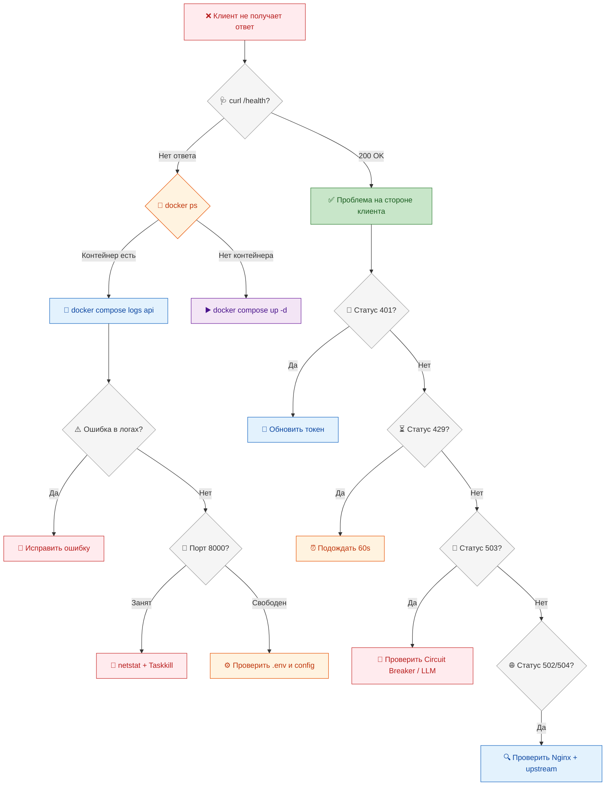
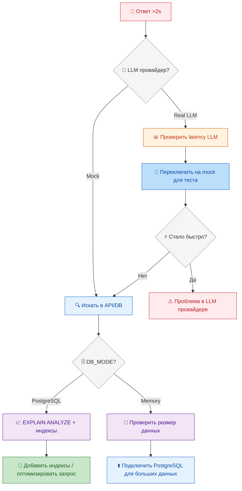
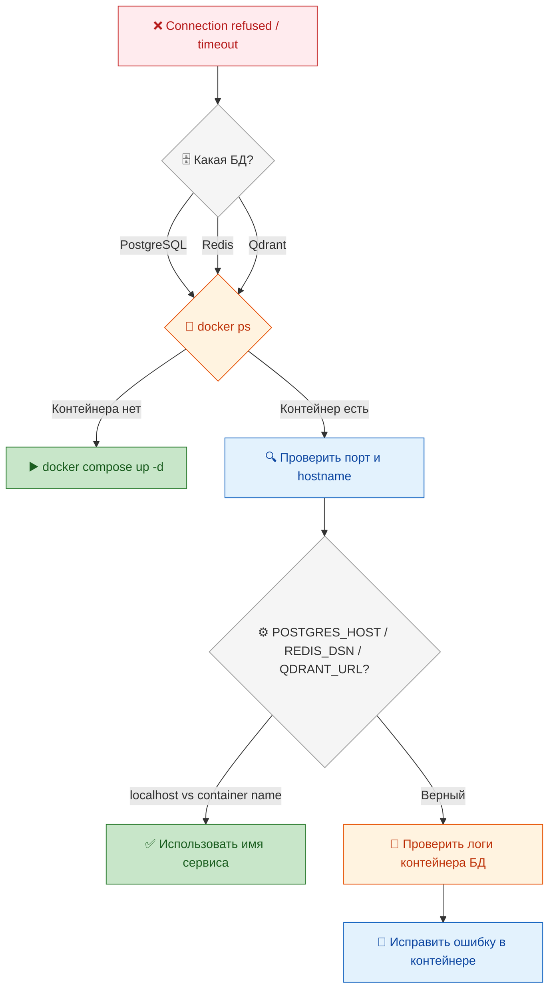

# Troubleshooting Guide — AI Roleplay Coach Hub

> Решение проблем, советы по диагностике и рецепты для разработчиков, администраторов и пользователей.

---

## Содержание

- [Индекс симптомов](#0-индекс-симптомов)
- [Decision Tree](#01-decision-tree)
- [Escalation Matrix](#02-escalation-matrix)
- [Проблемы разработчика](#1-проблемы-разработчика)
- [Проблемы администратора](#2-проблемы-администратора)
- [Проблемы пользователя](#3-проблемы-пользователя)
- [Проблемы CI/CD](#4-проблемы-cicd)
- [Проблемы с производительностью](#5-проблемы-с-производительностью)
- [Проблемы с безопасностью](#6-проблемы-с-безопасностью)
- [Проблемы с UI/фронтендом](#7-проблемы-с-uiфронтендом)
- [Справочник кодов ошибок](#8-справочник-кодов-ошибок)
- [Инструменты диагностики](#9-инструменты-диагностики)
- [Известные проблемы](#10-известные-проблемы)
- [Потоки диагностики](#11-потоки-диагностики)

---

## 0. Индекс симптомов

### По алфавиту

| Симптом | Раздел | Компонент |
|---------|--------|-----------|
| 301 Redirect loop | [2.10](#210-nginx-проблемы) | Nginx |
| 400 Bad Request (сессия) | [3.2](#32-не-создаётся-сессия) | API |
| 401 Unauthorized | [3.8](#38-token-expired-401) | API/Auth |
| 403 Forbidden | [8.1](#81-http-статусы) | API/RBAC |
| 429 Too Many Requests | [2.3](#23-api-возвращает-429-too-many-requests) | API/Rate Limit |
| 502 Bad Gateway | [2.10](#210-nginx-проблемы) | Nginx/API |
| 503 Service Unavailable | [2.2](#22-api-возвращает-503-service-unavailable) | LLM/Circuit Breaker |
| 504 Gateway Timeout | [2.10](#210-nginx-проблемы) | Nginx/LLM |
| Act (локальный CI) не работает | [4.6](#46-act-локальный-ci-не-работает) | CI/CD |
| API возвращает пустые метрики | [2.5](#25-prometheus-метрики-пустые) | Monitoring |
| AOF rewrite fails | [2.8](#28-redis-production-проблемы) | Redis |
| CORS ошибки | [6.3](#63-cors-ошибки) | API/Frontend |
| CPU высокая загрузка | [5.1](#51-высокая-загрузка-cpu) | Performance |
| DDA не сбрасывается | [10](#10-известные-проблемы) | Coach |
| docker build падает | [4.3](#43-docker-build-падает) | CI/CD |
| Docker Compose контейнер вылетает | [2.1](#21-docker-compose--контейнер-вылетает-сразу) | Docker |
| Docker в разработке | [1.4](#14-проблемы-с-docker-в-разработке) | Docker |
| Editable install проблемы | [1.12](#112-проблемы-с-editable-install) | Python |
| Event loop is closed | [1.3](#13-тесты-падают-pytest) | Tests |
| favicon.ico 404 | [7.7](#77-faviconico-404) | Nginx |
| Fork failure (Redis) | [2.8](#28-redis-production-проблемы) | Redis |
| Фронтенд не собирается | [7.1](#71-фронтенд-не-собирается) | Frontend |
| Фронтенд 404 | [7.2](#72-фронтенд-показывает-404) | Frontend |
| Фронтенд пустой экран | [3.7](#37-страница-не-загружается-пустой-экран) | Frontend |
| Hydration error (React) | [7.6](#76-ошибка-hydration-react-ssr) | Frontend |
| ImportError в тестах | [1.8](#18-importerror-в-тестах--неверный-syspath) | Tests |
| JWT проблемы | [6.4](#64-jwt-проблемы) | Auth |
| Leaderboard пустой | [3.6](#36-leaderboard-пустой) | API |
| LLM провайдер не работает | [2.4](#24-llm-провайдер-не-работает) | LLM |
| Медленные ответы API | [2.6](#26-медленные-ответы-api-2-секунды) | Performance |
| Медленный запуск контейнера | [5.3](#53-медленный-запуск-контейнера) | Docker |
| ModuleNotFoundError | [1.1](#11-modulenotfounderror-при-pip-install) | Python |
| Не приходят XP | [10](#10-известные-проблемы) | Gamification |
| Не создаётся сессия | [3.2](#32-не-создаётся-сессия) | API |
| Не удаётся войти | [3.1](#31-не-удаётся-войти) | Auth |
| Нет бейджей | [3.11](#311-не-вижу-бейджи) | Gamification |
| Оценка пустая / score = 0 | [3.4](#34-оценка-пустая-или-равна-0) | Coach |
| PostgreSQL connection refused | [1.5](#15-postgresql-connection-refused-разработка) | DB |
| Pre-commit hook не срабатывает | [4.7](#47-pre-commit-hook-не-срабатывает) | Git |
| Prometheus данные не приходят | [5.5](#55-prometheusgrafana--данные-не-приходят) | Monitoring |
| Пустая оценка | [3.4](#34-оценка-пустая-или-равна-0) | Coach |
| Qdrant connection refused | [1.7](#17-qdrant-connection-refused-разработка) | DB |
| Rate limiting не работает | [6.5](#65-rate-limiting-не-работает) | API |
| Redis connection refused | [1.6](#16-redis-connection-refused-разработка) | DB |
| SAST сканер находит уязвимости | [6.2](#62-sast-сканер-находит-уязвимости) | Security |
| SSL/TLS проблемы | [2.11](#211-ssltls-проблемы) | Nginx |
| Тесты падают | [1.3](#13-тесты-падают-pytest) | Tests |
| Token expired | [3.8](#38-token-expired-401) | Auth |
| Утечка credentials | [6.1](#61-утечка-credentials) | Security |
| Утечка памяти | [5.2](#52-утечка-памяти) | Performance |
| WebSocket не подключается | [7.5](#75-websocket-не-подключается) | Frontend |

### По компонентам

| Компонент | Симптомы |
|-----------|----------|
| **API** | 400, 401, 403, 429, 503, пустая оценка, не создаётся сессия, rate limiting, медленные ответы |
| **Auth/JWT** | 401, token expired, не удаётся войти, JWT проблемы, CORS |
| **CI/CD** | Act не работает, docker build падает, pre-commit hook, secrets не найдены, зависимости не обновляются |
| **Coach** | DDA не сбрасывается, пустая оценка, score = 0 |
| **DB (PostgreSQL)** | connection refused, too many connections, медленные запросы, high CPU |
| **Docker** | контейнер вылетает, порт занят, exit code 137/139, медленный запуск, volume permission |
| **Frontend** | не собирается, 404, пустой экран, CORS, hydration error, favicon 404, WebSocket, login loop |
| **Gamification** | XP не начисляются, нет бейджей, leaderboard пустой |
| **LLM** | 503, провайдер не работает, модель не найдена, GPU OOM, медленный ответ |
| **Monitoring** | Prometheus метрики пустые, Grafana datasource error, данные не приходят |
| **Nginx** | 502, 504, 301 redirect loop, SSL/TLS, favicon.ico |
| **Performance** | высокий CPU, утечка памяти, медленный запуск, медленные запросы, GIL |
| **Python** | ModuleNotFoundError, editable install, pip conflicts, version mismatch |
| **Redis** | connection refused, OOM, latency spikes, AOF corruption, fork failure |
| **Qdrant** | connection refused, collection not found, vector size mismatch |
| **Security** | утечка credentials, SAST уязвимости, CORS, JWT, rate limiting |
| **Tests** | pytest падает, event loop, ImportError, async failures, fixture not found |

---

## 0.1 Decision Tree

### Поток: «API не отвечает»



### Поток: «Медленный API»



### Поток: «Разрыв соединения с БД»



---

## 0.2 Escalation Matrix

| Уровень | Ответственный | Примеры | Время реакции |
|---------|---------------|---------|---------------|
| **L1 — Разработчик** | DevOps / Разработчик | ModuleNotFoundError, pytest fails, pre-commit, editable install | < 1 час |
| **L2 — Администратор** | DevOps / SRE | Docker контейнер падает, 503, 429, Redis OOM, Disk full | < 30 мин |
| **L3 — Пользователь** | Support / Trainer | Не могу войти, сессия не создаётся, XP не начисляются | < 4 часа |
| **L4 — Security** | Security Engineer | Утечка credentials, SAST findings, JWT compromise | < 15 мин (emergency) |
| **L5 — Архитектор** | Tech Lead | LangGraph не работает, voice не реализован, архитектурные изменения | < 1 день |

### Когда звать кого

| Ситуация | Кого звать |
|----------|------------|
| API не отвечает, контейнер не стартует | DevOps (L2) |
| LLM провайдер не работает, 503 ошибки | Разработчик (L1) → DevOps (L2) |
| Утечка данных, compromise | Security (L4) — emergency |
| Медленный API, высокий CPU | Разработчик (L1) + DBA (L2) |
| Фронтенд не грузится, CORS | Frontend-разработчик (L1) |
| CI/CD падает | DevOps (L2) |
| Пользователь не может войти | Support (L3) |
| Нужна новая фича / архитектура | Tech Lead (L5) |
| БД не отвечает, данные потеряны | DBA (L2) → SRE (L2) |
| Prometheus/Grafana не работают | DevOps (L2) |
| SSL сертификат истёк | DevOps (L2) — срочно |

###1.1 ModuleNotFoundError при pip install

**Симптом:**
Импорт модуля coach или src падает после установки зависимостей.

**Решение:**
```
pip install -e .
pip list | grep coach
python -c "import coach; print(coach.__version__)"
```

**Root cause:**
Пакет не установлен в editable mode — pip install -r requirements.txt не создаёт symlink в site-packages.

**Проверка:**
- pip list — должен показывать coach X.Y.Z с путём к проекту
- Если нет — pip install -e . из корня проекта (там где [pyproject.toml](pyproject.toml))
- Если ошибка persists — проверь наличие [pyproject.toml](pyproject.toml) в корне

###1.2 ruff или mypy падает в pre-commit

**Симптом:**
Pre-commit hook отклоняет коммит.

**Диагностика:**
```
ruff check . --fix
mypy src/ --strict
ruff format .
```

**Типичные причины:**
|Ошибка|Причина|Исправление|
|---|---|---|
|F401|Неиспользуемый импорт|Удали импорт|
|F841|Неиспользуемая переменная|Удали или используй _|
|E501|Строка длиннее 88 символов|Разбей на несколько строк|
|ANN|Нет type annotation|Добавь -> ReturnType или : type|
|S607|Hardcoded absolute path|Используй pathlib|
|BLE001|Голый except:|Укажи конкретный Exception|
|T201|print() в production|Замени на logger.info()|
|ARG002|Неиспользуемый аргумент|Удали или замени на _|
|UP037|Устаревший typing|Замени на list[X] вместо List[X]|
|TC003|Лишний TYPE_CHECKING import|Оставь только нужные|

###1.3 Тесты падают (pytest)

**Симптом:**
pytest возвращает ошибки или падает.

**Диагностика:**
```
pytest -v --tb=long           # Вербозный вывод
pytest tests/ -k "test_name" --pdb  # PDB при ошибке
pytest tests/ -x               # Остановка после первой ошибки
pytest --coverage              # Проверка покрытия
```

**Проверка окружения:**
- DB_MODE — должен быть memory или postgres
- Если DB_MODE=postgres — PostgreSQL должен быть запущен
- .env файл должен существовать с корректными значениями
- Redis должен быть запущен для rate-limit тестов

**Типичные проблемы:**
|Симптом|Причина|Решение|
|---|---|---|
|Event loop is closed|asyncio_mode не настроен|asyncio_mode = auto в [pyproject.toml](pyproject.toml)|
|Coroutine was never awaited|Асинхронный тест не async|Используй async def|
|sqlalchemy.exc.OperationalError|PostgreSQL не запущен|docker compose up -d postgres|
|RuntimeError: Task was destroyed|Завершение event loop|scope = session для fixture|
|DeprecationWarning: ...|Устаревшая версия pytest-asyncio|pip install -U pytest-asyncio|

###1.4 Проблемы с Docker в разработке

**Симптом:**
docker compose up не запускается или контейнер вылетает.

**Диагностика:**
```
docker compose -f [docker-compose.dev.yml](docker-compose.dev.yml) logs api
docker compose -f [docker-compose.dev.yml](docker-compose.dev.yml) logs postgres
docker compose -f [docker-compose.dev.yml](docker-compose.dev.yml) ps
```

|Симптом|Причина|Решение|
|---|---|---|
|Error: driver failed programming|Порт занят|netstat -ano findstr :8000|
|Cannot start postgres: port allocated|PostgreSQL локально|Останови локальный PG|
|api-1 exited with code 1|Python ошибка|docker compose logs api|
|WARNING: no LOG_LEVEL set|Не настроен .env|Скопируй [.env.example](.env.example) в .env|
|Error: Cannot find module|Фронтенд не собран|docker compose build --no-cache frontend|

###1.5 PostgreSQL connection refused (разработка)

**Чеклист:**
1. docker ps — запущен ли PostgreSQL контейнер?
2. docker compose -f [docker-compose.dev.yml](docker-compose.dev.yml) up -d postgres — запусти
3. Проверь POSTGRES_HOST=localhost, POSTGRES_PORT=5432
4. docker exec -it coach-postgres-1 psql -U coach -d coach_dev

###1.6 Redis connection refused (разработка)

**Чеклист:**
1. docker ps — запущен ли Redis?
2. docker compose -f [docker-compose.dev.yml](docker-compose.dev.yml) up -d redis
3. Проверь REDIS_DSN переменную: redis://localhost:6379/0
4. docker exec -it coach-redis-1 redis-cli ping -> PONG

###1.7 Qdrant connection refused (разработка)

**Чеклист:**
1. docker ps — запущен ли Qdrant?
2. docker compose -f [docker-compose.dev.yml](docker-compose.dev.yml) up -d qdrant
3. curl http://localhost:6333/healthz -> HTTP 200
4. curl http://localhost:6333/collections -> должна быть коллекция scenarios

###1.8 ImportError в тестах — неверный sys.path

```
pytest tests/ -x --rootdir=.
```

Проверь pyproject.toml:

```
[tool.pytest.ini_options]
testpaths = ["tests"]
asyncio_mode = "auto"
norecursedirs = ["node_modules"]
```

###1.9 Проблемы с асинхронными тестами

**Симптом:**
RuntimeWarning: coroutine ... was never awaited.

**Решение в pyproject.toml:**
```
asyncio_mode = "auto"
```

**Дополнительно:**
- pip install pytest-asyncio
- async fixture должна быть async def
- Для event-loop fixtures используй scope=session

###1.10 Проблемы с виртуальным окружением

**Чеклист:**
```
python --version  # 3.11+
pip --version     # из того же окружения
pip list | grep coach
```

**Создание нового venv:**
```
python -m venv venv
venv\Scripts\activate
pip install -e .
pip install -r requirements-dev.txt
```

###1.11 Ruff проходит локально, но падает в CI

**Причины:**
- Разные версии ruff
- Ruff cache — попробуй --no-cache
- Не закоммичен [pyproject.toml](pyproject.toml)

```
pip install ruff==0.11.0
ruff check . --no-cache
```

###1.12 Проблемы с editable install

**Симптом:**
Пакет не виден в Python после pip install -e .

**Решение:**
- pip uninstall coach -y
- pip install -e . --no-build-isolation
- python -c "import coach; print(coach.__file__)"

###1.13 Проблемы с pre-commit hook

**Симптом:**
git commit падает с ошибкой pre-commit hook.

**Решение:**
- pre-commit run --all-files — проверить все файлы
- pre-commit clean — очистить кэш
- pre-commit install — переустановить hook
- Если срочно: git commit --no-verify (не рекомендуется)

---

##2. Проблемы администратора

###2.1 Docker Compose — контейнер вылетает сразу

**Симптом:**
Контейнер запускается и сразу падает.

**Диагностика:**
```
docker compose -f [docker-compose.prod.yml](docker-compose.prod.yml) logs api
docker compose -f [docker-compose.prod.yml](docker-compose.prod.yml) ps -a
```

|Симптом|Причина|Решение|
|---|---|---|
|exit code 1|Python ошибка|Смотри логи, ищи traceback|
|exit code 137 (SIGKILL)|Out of memory|Увеличь memory_reservation|
|exit code 139 (SIGSEGV)|Segmentation fault|Проверь библиотеки|
|Restarting (1) 5s ago|Цикл перезапуска|Исправь ошибку в коде|
|Error: Cannot find module|Фронтенд не собран|docker compose build|

**Production чеклист:**
- .env файл существует и заполнен
- POSTGRES_HOST = postgres (имя сервиса), а не localhost
- Порты не конфликтуют: netstat -ano findstr :8000 / :5432
- docker compose config — валидация YAML

###2.2 API возвращает 503 Service Unavailable

**Симптом:**
Все эндпоинты возвращают 503.

**Причина:**
Circuit Breaker разомкнулся из-за ошибок LLM провайдера.

**Диагностика:**
```
curl http://localhost:8000/health
curl http://localhost:8000/metrics
docker compose logs api | grep circuit_breaker
```

**Митация:**
|Шаг|Действие|Команда|
|---|---|---|
|1|Проверь LLM провайдер|ollama ps или проверь API ключ|
|2|Переключи на mock|LLM_PROVIDER=mock в .env|
|3|Сбрось Circuit Breaker|docker compose restart api|
|4|Подожди recovery|default: 60 секунд|

**Config Circuit Breaker:**
```
CIRCUIT_BREAKER_FAILURE_THRESHOLD: 5
CIRCUIT_BREAKER_RECOVERY_TIMEOUT: 60
CIRCUIT_BREAKER_HALF_OPEN_MAX_CALLS: 3
```

###2.3 API возвращает 429 Too Many Requests

**Симптом:**
Rate limit exceeded.

**Детали:**
- Общий лимит: 100 запросов в минуту на IP
- Auth endpoints: 5 запросов в 10 минут (login)
- LLM вызовы: 10 запросов в минуту

**Митация:**
- Увеличь лимиты в src/core/config.py (RATE_LIMIT_DEFAULT, RATE_LIMIT_AUTH)
- Подожди 60 секунд для сброса счётчика
- Проверь, работает ли Redis (счётчики хранятся в Redis)
- Для dev: RATE_LIMIT_ENABLED=false

###2.4 LLM провайдер не работает

**Симптом:**
ProviderError: LLM request failed в логах.

**Диагностика:**
```
docker compose logs api | grep -i "llm\|provider\|openai\|ollama"
```

|Провайдер|Проверка|Проблема|Решение|
|---|---|---|---|
|Ollama|ollama ps|Модель не загружена|ollama pull llama3.2:3b|
|Ollama|curl :11434/api/tags|Ollama не запущен|ollama serve|
|OpenAI|Проверь ключ|Неверный ключ|Проверь env var|
|OpenAI|—|Лимит токенов|Уменьши LLM_MAX_TOKENS|
|GigaChat|Проверь credentials|Неверные данные|Проверь env vars|
|GigaChat|—|SSL ошибка|REQUESTS_CA_BUNDLE|
|Mock|—|—|Always works; LLM_PROVIDER=mock|

**Универсальное решение:**
LLM_PROVIDER=mock — ноль внешних зависимостей, работает всегда.

###2.5 Prometheus метрики пустые

**Симптом:**
GET /metrics возвращает пустой ответ или 404.

**Чеклист:**
- ENABLE_METRICS=true в .env
- prometheus_client установлен
- Модуль импортируется: from src.api.metrics import metrics_app

**Если Grafana не видит метрики:**
- targets: ['api:8000'] — имя сервиса, не localhost
- Оба контейнера в одной сети Docker
- docker compose exec prometheus wget http://api:8000/metrics

###2.6 Медленные ответы API (>2 секунды)

**Симптом:**
NFR-1 нарушен — ответы дольше 2 секунд.

|Шаг|Действие|Метод|
|---|---|---|
|1|Определи медленный endpoint|LOG_LEVEL=DEBUG|
|2|Проверь LLM latency|Mock — мгновенно, real LLM 1-5s|
|3|EXPLAIN ANALYZE|Медленные запросы PG|
|4|Проверь индексы|sessions.user_id, xp_transactions.user_id|
|5|Проверь Redis pool|Не исчерпан ли пул|
|6|UVICORN_WORKERS|Для production 4-8 workers|

```
CREATE INDEX idx_sessions_user_id ON sessions(user_id);
CREATE INDEX idx_xp_transactions_user_id ON xp_transactions(user_id);
```

###2.7 PostgreSQL production проблемы

|Проблема|Причина|Решение|
|---|---|---|
|Too many connections|Пул исчерпан|PgBouncer|
|High CPU|Нет индексов|EXPLAIN ANALYZE + индексы|
|Disk full|Логи или WAL|log_rotation, clean WAL|
|Connection refused|PG упал|Проверь логи, диск, память|
|Replication lag|Async replication|Sync или мониторинг lag|

**Production postgresql.conf (4GB RAM):**
```
shared_buffers = '1GB'       # 25% RAM
work_mem = '64MB'
maintenance_work_mem = '256MB'
effective_cache_size = '3GB'
wal_buffers = '16MB'
max_connections = 200
random_page_cost = 1.1   # SSD
```

###2.8 Redis production проблемы

|Проблема|Причина|Решение|
|---|---|---|
|OOM (Out of Memory)|Данные не влезают в RAM|maxmemory-policy allkeys-lru|
|Latency spikes|KEYS *|Используй SCAN|
|Fork failure|BGSAVE не может fork|vm.overcommit_memory=1|
|Connection refused|maxclients|Увеличь maxclients + ulimit|
|AOF rewrite fails|Диск полон|Освободи место|

```
redis-cli INFO memory
redis-cli SLOWLOG GET 10
redis-cli INFO stats
```

###2.9 Qdrant production проблемы

|Проблема|Причина|Решение|
|---|---|---|
|Пустые результаты|Коллекция пуста|curl /collections|
|Медленный поиск|Много векторов|hnsw_config ef_construct=200|
|Ошибка 413|Payload велик|Уменьши payload|
|Диск полон|Snapshots или WAL|wal_capacity_mb=1024|
|Memory error|Все векторы в RAM|default_segment_number=5|

```
# Создать snapshot
curl -X POST http://localhost:6333/collections/scenarios/snapshots

# Список snapshot-ов
curl http://localhost:6333/collections/scenarios/snapshots
```

###2.10 Nginx проблемы

|Проблема|Причина|Решение|
|---|---|---|
|502 Bad Gateway|API не отвечает|docker compose ps api|
|504 Gateway Timeout|API дольше 60s|proxy_read_timeout 3600s|
|301 Redirect loop|Неверный upstream|proxy_pass http://api:8000|
|SSL error|Сертификат истёк|certbot renew|
|HSTS error|HSTS без HTTPS|Отключи для dev|

###2.11 SSL/TLS проблемы

**Let's Encrypt:**
```
docker compose run --rm certbot certonly --webroot -w /var/www/certbot -d domain.com
echo "0 3 * * * docker compose run --rm certbot renew" | crontab -
# Проверка даты
openssl x509 -in /etc/letsencrypt/live/domain.com/fullchain.pem -text -noout | grep "Not After"
```

###2.12 Проблемы с бекапами

**Проверка:**
```
ls -lh /backups/postgres/          # Должны быть .sql.gz
gzip -dc /backups/postgres/latest.sql.gz | head -50
curl http://localhost:6333/collections/scenarios/snapshots
```

**Типичные проблемы:**
- Диск переполнен — бекапы не создаются, настрой ротацию
- Данные неполные — проверь pg_dump опции
- Snapshot Qdrant не создаётся — проверь место

###2.13 Проблемы с масштабированием

**Диагностика:**
```
wmic cpu get loadpercentage
systeminfo | find "Available Physical Memory"
docker stats --no-stream
```

**Когда добавлять workers:**
- 2 CPU -> UVICORN_WORKERS=2
- 4 CPU -> UVICORN_WORKERS=4
- 8+ CPU -> UVICORN_WORKERS=8 (GIL — 4 хватает)

**Когда нужен PgBouncer:**
- >50 соединений к PG
- Connection pooling не настроен
- Ошибки too many connections

**Когда нужен Redis Sentinel:**
- Redis — единая точка отказа
- Требуется HA для rate limiting

###2.14 Docker Compose production — ошибки развёртывания

**Диагностика:**
```
docker compose -f [docker-compose.prod.yml](docker-compose.prod.yml) config
docker compose -f [docker-compose.prod.yml](docker-compose.prod.yml) pull
```

|Ошибка|Причина|Решение|
|---|---|---|
|no matching manifest for windows/amd64|Linux image on Windows|WSL2 или Linux|
|service api depends on postgres undefined|Нет сервиса|Добавь в compose|
|network prod-network not found|Нет сети|docker network create|
|Volume pgdata not found|Нет тома|Добавь volumes:|
|Error: conflict|Контейнер уже есть|docker compose down|

###2.15 Проблемы с healthcheck

**Симптом:**
Контейнер считается нездоровым, хотя приложение работает.

**Диагностика:**
```
docker inspect --format='{{json .State.Health}}' coach_api_1
docker compose logs api | grep health
```

**Решение:**
```
# Увеличь timeout healthcheck
healthcheck:
  test: curl -f http://localhost:8000/health
  interval: 30s
  timeout: 10s
  retries: 5
```

---

##3. Проблемы пользователя

###3.1 Не удаётся войти

**Симптом:**
Неверные учётные данные при входе.

**Причины:**
- Неправильный username или пароль
- Rate limit — подожди 10 минут
- Пользователь не существует — зарегистрируйся
- Несовпадение режимов БД (in-memory vs PostgreSQL)

**Что делать:**
1. Проверь username (регистрозависим!)
2. Проверь пароль (8+ символов, заглавная + цифра)
3. Обратись к администратору для сброса пароля

###3.2 Не создаётся сессия

**Симптом:**
400 Bad Request при создании сессии.

**Проверка:**
- scenario_id — должен существовать
- trainer_id — опционально (только для тренерских)
- Формат: {"scenario_id": "uuid"}

**Что делать:**
- Проверь список сценариев: GET /api/v1/scenarios
- Скопируй UUID существующего сценария
- Если 401 — токен истёк, POST /api/v1/auth/refresh

###3.3 Сессия зависла или AI-клиент не отвечает

**Симптом:**
После отправки сообщения нет ответа >10 секунд.

**Причины:**
- LLM провайдер медленный (Ollama на CPU — до 30 секунд)
- Circuit Breaker разомкнут
- Проблемы с сетью

**Что делать:**
1. Подожди до 30 секунд
2. Обнови страницу — если сессия активна, продолжай
3. Нет ответа 60+ секунд — начни новую сессию
4. Сообщи администратору (время + сценарий)

###3.4 Оценка пустая или равна 0

**Симптом:**
Сессия завершена, но оценка не появилась.

**Причины:**
- Сессия прервана — нужно нажать Finish
- Нет сообщений — оценка пропускается
- LLM провайдер вернул ошибку
- Статус сессии не completed

**Что делать:**
1. Нажми Finish перед выходом из сессии
2. POST /sessions/{id}/evaluate вручную
3. Проверь логи CoachAgent если score = 0
4. Начни новую сессию

###3.5 XP не начисляются

**Симптом:**
После сессии XP не появились.

**Проверка:**
- Статус сессии — должен быть completed
- У сессии должна быть оценка
- XP начисляются при создании оценки

**Что делать:**
- Заверши сессию через Finish
- Убедись, что оценка появилась
- Обнови /profile (возможно, кэш)
- Подожди несколько секунд (асинхронно)

###3.6 Leaderboard пустой

**Симптом:**
Таблица лидеров пуста.

**Причины:**
- Нет пользователей с XP
- Leaderboard показывает только XP > 0
- Тренеры и админы исключены

###3.7 Страница не загружается (пустой экран)

**Что делать:**
1. Открой консоль (F12 -> Console)
2. Посмотри ошибки JavaScript
3. Если CORS — сообщи администратору
4. Обнови страницу (F5)
5. Очисти кэш (Ctrl+Shift+Del)
6. Попробуй другой браузер

###3.8 Token expired (401)

**Симптом:**
Внезапно 401 Unauthorized.

**Решение:**
Access token живёт 30 минут. Система автоматически обновляет через refresh token. Если нет — система перенаправит на /login. Войди заново.

###3.9 Сценарии не загружаются

**Симптом:**
При создании сессии список пуст.

**Причины:**
- Нет созданных сценариев — попроси тренера
- Ошибка API — проверь консоль (F12)
- Фильтрация по роли

**Что делать:**
- Обнови страницу
- Обратись к тренеру
- Тренер создаёт на /trainer/scenarios

###3.10 Проблемы с отправкой сообщения

**Симптом:**
Сообщение не отправляется, кнопка Send не активна.

**Причины:**
- Сообщение пустое
- Слишком длинное (>2000 символов)
- Сессия завершена
- Токен истёк

###3.11 Не вижу бейджи

**Симптом:**
В профиле нет бейджей.

**Причины:**
- Ещё не выполнил условия (см. USER_GUIDE.md раздел 3.4)
- Бейдж начисляется асинхронно — обнови страницу
- Нет XP — бейджи привязаны к XP и достижениям

---

##4. Проблемы CI/CD

###4.1 CI падает: ruff ошибки

**Локальное воспроизведение:**
```
pip install ruff==0.11.0
ruff check . --no-cache
```

**Причины:**
- Разные версии ruff локально и в CI
- Не закоммичен [pyproject.toml](pyproject.toml)
- Ruff cache устарел

###4.2 CI падает: тесты не проходят

**Локальное воспроизведение:**
```
docker compose -f docker-compose.ci.yml up -d postgres redis
pytest tests/ -v --tb=short --junitxml=results.xml
```

**Детали CI окружения:**
- PostgreSQL как service container
- Redis как service container
- DB_MODE=postgres, LLM_PROVIDER=mock

**Типичные причины:**
- Тест использует localhost — в CI используй postgres
- Rate limit тесты пересекаются
- async тесты без asyncio_mode=auto

###4.3 Docker build падает

**Диагностика:**
```
docker build -f [Dockerfile.prod](Dockerfile.prod) -t coach-api:test . --no-cache
```

**Причины:**
- Нет места на GitHub Actions runner (14 GB)
- Слишком большой контекст — проверь [.dockerignore](.dockerignore)
- Network timeout — GitHub Actions ограничения

###4.4 Deploy падает

**Причины:**
- SSH ключ не настроен в GitHub Secrets
- Docker registry недоступен
- Production сервер недоступен
- docker compose pull не может скачать образ

**Чеклист:**
- SSH_PRIVATE_KEY добавлен в GitHub Secrets
- DOCKER_REGISTRY credentials настроены
- ssh user@host работает
- docker compose pull && docker compose up -d

###4.5 Secrets не найдены в CI

1. Проверь GitHub Secrets: Settings -> Secrets -> Actions
2. Проверь имена секретов (регистрозависимы!)
3. Убедись, что secrets доступны для ветки main

###4.6 Act (локальный CI) не работает

```
choco install act-cli
act -P ubuntu-latest=catthehacker/ubuntu:act-latest
act -j lint -P ubuntu-latest=catthehacker/ubuntu:act-latest
```

###4.7 Pre-commit hook не срабатывает

**Решение:**
- pre-commit install — переустановить hook
- pre-commit run --all-files — проверить все файлы
- [.pre-commit-config.yaml](.pre-commit-config.yaml) должен существовать
- Если git clone — сначала pre-commit install

###4.8 Зависимости не обновляются в CI

**Проблема:**
CI использует устаревшие зависимости из кэша.

**Решение:**
```
# Отключить кэш для dependency-review
pip install --no-cache-dir -r requirements.txt

# Или очистить кэш GitHub Actions
# Settings -> Actions -> Cache -> Clear
```

---

##5. Проблемы с производительностью

###5.1 Высокая загрузка CPU

**Диагностика:**
```
wmic process where "name='python.exe'" get processid,percentprocessorusage
docker stats --no-stream
docker exec -it coach-postgres-1 psql -U coach -c "SELECT pid, now() - query_start AS duration, query FROM pg_stat_activity WHERE state != 'idle' ORDER BY duration DESC;"
```

**Что делать:**
- LLM — самый тяжёлый. Переключи на mock
- PostgreSQL — добавь индексы
- Увеличь UVICORN_WORKERS = 4 (для 4+ ядер)
- Проверь бесконечные циклы

###5.2 Утечка памяти

**Диагностика:**
```
docker stats coach_api_1 --no-stream
python -m memory_profiler src/main.py  # если установлен
```

**Что делать:**
- In-memory растёт без ограничений — подключи PostgreSQL
- Redis для rate limiting — лучше управляет памятью
- Проверь pool соединений PostgreSQL
- Production: PostgreSQL + Redis, не in-memory

###5.3 Медленный запуск контейнера

**Симптом:**
docker compose up -d занимает >30 секунд.

**Причины:**
- Много импортов (ленивый импорт помогает)
- PostgreSQL инициализация (первый запуск)
- Qdrant загружает векторы в память

**Что делать:**
- docker compose start вместо up
- Настрой healthcheck
- Readiness probes в K8s для production

###5.4 Медленные запросы к PostgreSQL

**Диагностика:**
```
# Включи slow query log
log_min_duration_statement = 1000  # ms

# EXPLAIN ANALYZE
EXPLAIN ANALYZE SELECT * FROM sessions WHERE user_id = 'xxx';
```

**Решение:**
```
CREATE INDEX idx_sessions_user_id ON sessions(user_id);
CREATE INDEX idx_xp_transactions_user_id ON xp_transactions(user_id);
CREATE INDEX idx_evaluations_session_id ON evaluations(session_id);
CREATE INDEX idx_sessions_status ON sessions(status);
```

###5.5 Prometheus/Grafana — данные не приходят

**Проверка:**
- docker compose exec prometheus wget http://api:8000/metrics
- Проверь prometheus.yml: targets должен быть api:8000
- Grafana datasource — http://prometheus:9090

---

##6. Проблемы с безопасностью

###6.1 Утечка credentials

**Emergency план:**
|Шаг|Действие|Команда|
|---|---|---|
|1|Удали из Git|git rm --cached .env|
|2|Очисти историю|git filter-branch ... (см. ниже)|
|3|Смени все ключи|Пароли, API keys, JWT secret|
|4|Обнови [.gitignore](.gitignore)|.env, *.key, credentials*.json|
|5|Push с force|git push origin --force --all|

```
git filter-branch --force --index-filter 'git rm --cached --ignore-unmatch .env' --prune-empty --tag-name-filter cat -- --all
```

###6.2 SAST сканер находит уязвимости

**Типичные находки Bandit:**
|ID|Уязвимость|Уровень|Решение|
|---|---|---|---|
|B101|assert в production|Medium|if not cond: raise ...|
|B105|Hardcoded password|High|Перемести в env/secrets|
|B106|Hardcoded API key|High|os.getenv()|
|B301|Pickle|Medium|Не используй pickle|
|B307|eval()|High|Никогда не используй|
|B311|Random not secure|Low|Используй secrets|
|B605|SQL injection|High|Параметризованные запросы|

###6.3 CORS ошибки

**Симптом:**
Браузер блокирует запросы к API.

**Решение:**
- Разработка: CORS_ORIGINS=["http://localhost:5173"]
- Production: CORS_ORIGINS=["https://domain.com"]
- Не ставь ["*"] в production

###6.4 JWT проблемы

**Чеклист:**
- JWT_SECRET_KEY должен быть установлен
- Production: JWT_ALGORITHM=RS256 (асимметричный)
- JWT_ACCESS_TOKEN_EXPIRE_MINUTES=30
- Refresh token живёт 7 дней

###6.5 Rate limiting не работает

**Симптом:**
Rate limit не применяется.

**Проверка:**
- RATE_LIMIT_ENABLED=true в .env
- Redis работает? (docker exec redis-cli ping)
- RateLimitMiddleware подключён в main.py

###6.6 Проверка безопасности CI/CD

**Чеклист:**
- GitHub Secrets не видны в логах CI
- SAST сканер запускается в CI (security.yml)
- dependabot настроен для npm/pip
- dependency-review-action проверяет лицензии

---

##7. Проблемы с UI/фронтендом

###7.1 Фронтенд не собирается

**Диагностика:**
```
cd frontend
bun install
bun run build --verbose
```

|Ошибка|Причина|Решение|
|---|---|---|
|Module not found|Пакет не установлен|bun add missing-package|
|Cannot read properties of undefined|Импорт не найден|Проверь путь|
|Unexpected token 'export'|ESM/CJS конфликт|Проверь tsconfig.json|
|PostCSS requires PostCSS 8|Несовместимость|Обнови PostCSS|

###7.2 Фронтенд показывает 404

**Причина:**
SPA routing — сервер не знает про клиентские маршруты.

**Решение (Nginx):**
```
location / {
    try_files $uri $uri/ /index.html;
}
```

**Решение (Vite):**
historyApiFallback: true в vite.config.ts

###7.3 CORS ошибки в разработке

**Решение:**
- CORS_ORIGINS=["http://localhost:5173"] в config.py
- Перезапусти API
- Проверь Access-Control-Allow-Origin

###7.4 Медленный фронтенд

**Диагностика:**
```
bun run build
bunx vite-bundle-visualizer
```

**Что делать:**
- Убедись, что сборка production (не dev)
- Проверь размер bundle
- Lazy loading для страниц
- Проверь сетевые запросы

###7.5 WebSocket не подключается

**Проверка:**
- URL: ws://localhost:8000/ws/session/{id}
- Nginx: proxy_set_header Upgrade $http_upgrade
- proxy_read_timeout 3600s для долгих WS

###7.6 Ошибка Hydration (React SSR)

**Симптом:**
React hydration error в консоли.

**Причина:**
Несоответствие HTML на сервере и клиенте (даты, случайные значения).

**Решение:**
Используй useEffect для клиент-специфичного контента, suppressHydrationWarning для статических частей.

###7.7 favicon.ico 404

**Симптом:**
В логах Nginx 404 для favicon.ico.

**Решение:**
```
location = /favicon.ico {
    log_not_found off;
    access_log off;
}
```

---

##8. Справочник кодов ошибок

###8.1 HTTP статусы

|Код|Описание|Причина|Решение|
|---|---|---|---|
|200|OK|Всё хорошо|—|
|201|Created|Ресурс создан|—|
|400|Bad Request|Неверный payload|Проверь JSON схему|
|401|Unauthorized|Токен истёк|POST /auth/refresh|
|403|Forbidden|Недостаточно прав|Проверь роль|
|404|Not Found|Ресурс не найден|Проверь UUID|
|409|Conflict|Дубликат|Другие данные|
|422|Unprocessable|Валидация не прошла|Проверь типы полей|
|429|Too Many Requests|Rate limit|Подожди 60 секунд|
|500|Server Error|Ошибка на сервере|Проверь логи|
|502|Bad Gateway|Nginx не видит API|Проверь API контейнер|
|503|Unavailable|Circuit Breaker|Проверь LLM|
|504|Gateway Timeout|LLM/БД долго|Увеличь timeout|

###8.2 Коды ошибок CoachAgent

|Код|Описание|Причина|
|---|---|---|
|E001|LLM provider error|Провайдер не отвечает|
|E002|Empty transcript|Нет сообщений|
|E003|Score calculation error|Ошибка весов|
|E004|Evaluation timeout|Превышен лимит времени|

###8.3 Коды ошибок Gamification

|Код|Описание|Причина|
|---|---|---|
|G001|XP calculation error|Неверная формула|
|G002|Badge award error|Ошибка начисления бейджа|
|G003|Leaderboard update error|Ошибка рейтинга|

###8.4 Коды ошибок Fairness

|Код|Описание|Причина|
|---|---|---|
|F001|Insufficient data|Мало данных|
|F002|Demographic parity violation|Перекос > 0.1|
|F003|Equalized odds violation|Перекос > 0.1|
|F004|Disparate impact violation|Перекос < 0.8|

---

##9. Инструменты диагностики

###9.1 Health check

```
curl http://localhost:8000/health
```

|Поле|Описание|Норма|
|---|---|---|
|status|Статус системы|ok|
|version|Версия|Текущая|
|db_mode|Режим БД|memory или postgres|
|llm_provider|LLM провайдер|mock/ollama/openai|
|uptime_seconds|Время работы|> 0|

###9.2 API метрики

```
curl http://localhost:8000/metrics
```

**Ключевые метрики:**
- http_requests_total — счётчик запросов
- http_request_duration_seconds — гистограмма
- coach_evaluation_score — оценки Coach
- circuit_breaker_open_total — срабатывания CB

###9.3 OpenAPI схема

```
curl http://localhost:8000/openapi.json | python -m json.tool | head -100
```

###9.4 Docker логи

```
docker compose -f [docker-compose.dev.yml](docker-compose.dev.yml) logs -f api
docker compose -f [docker-compose.dev.yml](docker-compose.dev.yml) logs -f postgres
docker compose logs api | grep -i "error\|exception\|traceback"
docker compose -f [docker-compose.prod.yml](docker-compose.prod.yml) logs -f nginx
```

###9.5 Трассировка запроса

```
LOG_LEVEL=DEBUG
docker compose restart api
# Каждый запрос покажет request_id, method, path, duration
```

###9.6 Диагностика БД

```
# PostgreSQL — все активные соединения
docker exec -it coach-postgres-1 psql -U coach -c "SELECT * FROM pg_stat_activity;"

# PostgreSQL — медленные запросы
docker exec -it coach-postgres-1 psql -U coach -c "SELECT query, now()-query_start AS duration FROM pg_stat_activity WHERE state != 'idle' AND now()-query_start > '1 second'::interval ORDER BY duration DESC;"

# PostgreSQL — размер таблиц
docker exec -it coach-postgres-1 psql -U coach -c "SELECT relname, n_live_tup, n_dead_tup, pg_size_pretty(pg_total_relation_size(relid)) FROM pg_stat_user_tables ORDER BY n_live_tup DESC;"

# Redis — информация о памяти
docker exec -it coach-redis-1 redis-cli INFO memory

# Redis — медленные команды
docker exec -it coach-redis-1 redis-cli SLOWLOG GET 10
```

###9.7 Диагностика сети

```
docker compose exec api nslookup postgres
docker compose exec api curl -s http://postgres:5432
docker compose exec api traceroute postgres
```

###9.8 Проверка токена

```
# Декодировать JWT (без проверки подписи — только отладка!)
python -c "import jwt; token='...'; print(jwt.decode(token, options={'verify_signature': False}))"
```

###9.9 Postman / Bruno коллекция

Импортируй OpenAPI схему: curl http://localhost:8000/openapi.json -> Postman -> Import

---

##10. Известные проблемы

|Проблема|Статус|Workaround|
|---|---|---|
|JWT examples blocked by secrets scanner|Known|edit маленькими частями, не write|
|Voice (LiveKit) не реализован|Planned|Текстовый чат|
|LangGraph не реализован|Planned|Rule-based агенты работают|
|PostgreSQL mode требует контейнер|By design|DB_MODE=memory для dev|
|Нет openapi.json в production|Planned|SPECIFICATION.md таблица|
|CORS ошибки в разработке|Known|CORS_ORIGINS в .env|
|DDA не сбрасывается для нового|Low|Начни сессию|
|XP за прерванные сессии|By design|Нажми Finish|
|Fairness требует 10+ пользователей|By design|Seed data|
|Redis — единая точка отказа|Planned|Redis Sentinel|
|PG connection pool не настроен|Low|PgBouncer|
|Circuit Breaker не персистентен|Planned|Redis-backed|
|Нет rate limiting для WebSocket|Low|WS не используется|
|In-memory не ограничен|By design|PostgreSQL|
|TC003 ложные TYPE_CHECKING|Known|ignore в [pyproject.toml](pyproject.toml)|
|__future__ ломает FastAPI Depends|Known|Не используй Annotated+Depends|
|Pydantic v2 underscore поля|Known|Не используй _ префикс|

---

##11. Потоки диагностики

###Не запускается API

```
1. docker compose up -d
   -> Падает?
      Да -> docker compose logs -> ищи ошибку
      Нет -> curl localhost:8000/health
         200? -> OK
         Нет ответа? -> docker ps
            Контейнер есть?
               Да -> docker compose logs api
               Нет -> docker compose up -d
   -> Порт 8000 занят?
      netstat -ano | findstr :8000 -> Taskkill /PID X /F
```

###429 Too Many Requests

```
1. curl /api/v1/sessions -> 429?
   -> Жди 60 секунд -> повтор
   -> Снова 429? -> увеличь RATE_LIMIT_DEFAULT
   -> Redis работает?
      Нет -> docker compose up -d redis
      Да -> redis-cli dbsize -> flushall? (dev only)
```

###Пустая оценка (score = 0)

```
1. session.status == completed?
   Нет -> заверши сессию
   Да -> session.turns.length > 0?
      Нет -> оценки не будет
      Да -> curl /sessions/{id}/evaluate
         200 + score > 0? -> OK
         404? -> POST /sessions/{id}/evaluate
         score = 0? -> CoachAgent ошибка
            -> logs api | grep coach
            -> LLM провайдер работает?
               Нет -> LLM_PROVIDER=mock
               Да -> логи CoachAgent
```

###Не приходят XP

```
1. session.status == completed?
   Нет -> заверши сессию
   Да -> evaluation.score > 0?
      Нет -> см. Пустая оценка
      Да -> curl /xp/{user_id}/history
         Есть транзакции?
            Да -> OK, проверь /profile
            Нет -> GamificationEngine
               -> logs api | grep gamification
```

###Не создаётся сессия (400)

```
1. curl /sessions -> есть сценарии?
   Нет -> попроси тренера
   Да -> curl -X POST /sessions -d '{"scenario_id": "uuid"}'
      201? -> OK
      400? -> проверь payload
         scenario_id UUID?
         trainer_id UUID?
      401? -> токен истёк -> POST /auth/refresh
```

---

##Ссылки

- [ADMIN_GUIDE.md](ADMIN_GUIDE.md) — установка и конфигурация
- [DEPLOYMENT_PLAN.md](DEPLOYMENT_PLAN.md) — production развёртывание
- [CICD.md](CICD.md) — CI/CD пайплайн
- [USER_GUIDE.md](USER_GUIDE.md) — инструкции для пользователя
- [API.md](API.md) — справочник API
- [src/core/config.py](../src/core/config.py) — все опции конфигурации
- [docker-compose.dev.yml](../docker-compose.dev.yml) — dev контейнеры
- [docker-compose.prod.yml](../docker-compose.prod.yml) — production контейнеры
